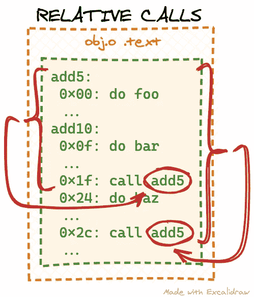
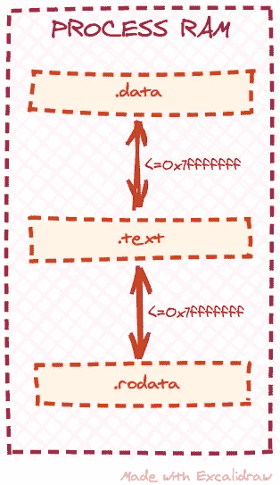

# 如何执行目标文件:第 2 部分

> 原文：<https://levelup.gitconnected.com/how-to-execute-an-object-file-part-2-655eb8b9a811>

## 处理重新定位

在[之前的文章](/how-to-execute-an-object-file-part-1-2c92d962f276)中，我们学习了如何解析一个目标文件并从中导入和执行一些函数。然而，我们的玩具对象文件中的函数是简单和自包含的:它们完全基于输入计算输出，没有任何外部代码或数据依赖。在本帖中，我们将基于第 1 部分中的[代码，探索处理带有一些依赖关系的代码所需的额外步骤。](https://github.com/cloudflare/cloudflare-blog/tree/master/2021-03-obj-file/1)

例如，我们可能会注意到，我们实际上可以使用我们的`add5`函数重写我们的`add10`函数:

*对象 c* :

```
int add5(int num)
{
    return num + 5;
}

int add10(int num)
{
    num = add5(num);
    return add5(num);
}
```

让我们重新编译目标文件，并尝试用我们的`loader`程序将它作为一个库:

```
$ gcc -c obj.c
$ ./loader
Executing add5...
add5(42) = 47
Executing add10...
add10(42) = 42
```

哇哦。这里有些不对劲。`add5`仍然产生正确的结果，但是`add10`没有。根据您的环境和代码组成，您甚至可能会看到`loader`程序崩溃，而不是输出不正确的结果。为了理解发生了什么，让我们研究一下编译器生成的机器码。我们可以通过要求 [objdump 工具](https://man7.org/linux/man-pages/man1/objdump.1.html)从我们的`obj.o`上拆卸`.text`部分来做到这一点:

```
$ objdump --disassemble --section=.text obj.o

obj.o:     file format elf64-x86-64

Disassembly of section .text:

0000000000000000 <add5>:
   0:	55                   	push   %rbp
   1:	48 89 e5             	mov    %rsp,%rbp
   4:	89 7d fc             	mov    %edi,-0x4(%rbp)
   7:	8b 45 fc             	mov    -0x4(%rbp),%eax
   a:	83 c0 05             	add    $0x5,%eax
   d:	5d                   	pop    %rbp
   e:	c3                   	retq

000000000000000f <add10>:
   f:	55                   	push   %rbp
  10:	48 89 e5             	mov    %rsp,%rbp
  13:	48 83 ec 08          	sub    $0x8,%rsp
  17:	89 7d fc             	mov    %edi,-0x4(%rbp)
  1a:	8b 45 fc             	mov    -0x4(%rbp),%eax
  1d:	89 c7                	mov    %eax,%edi
  1f:	e8 00 00 00 00       	callq  24 <add10+0x15>
  24:	89 45 fc             	mov    %eax,-0x4(%rbp)
  27:	8b 45 fc             	mov    -0x4(%rbp),%eax
  2a:	89 c7                	mov    %eax,%edi
  2c:	e8 00 00 00 00       	callq  31 <add10+0x22>
  31:	c9                   	leaveq
  32:	c3                   	retq
```

你不必理解上面的全部输出。这里只有两条相关的线:`1f: e8 00 00 00 00`和`2c: e8 00 00 00 00`。这些对应于我们在源代码中的两个`add5`函数调用，并且 [objdump](https://man7.org/linux/man-pages/man1/objdump.1.html) 甚至方便地将指令解码为`callq`。通过在线查看`callq`指令的描述(就像[这个](https://www.felixcloutier.com/x86/call))，我们可以进一步看到我们正在处理一个“近的、相对的调用”，因为有了`0xe8`前缀:

> 调用 near，relative，相对于下一条指令的位移。

根据[描述](https://www.felixcloutier.com/x86/call)，这个`callq`指令的变体由 5 个字节组成:前缀`0xe8`和一个 4 字节(32 位)参数。这就是“相对”的来源:参数应该包含我们想要调用的函数和当前位置之间的“距离”——因为 x86 的工作方式是从下一条指令而不是我们当前的`callq`指令开始计算这个距离。 [objdump](https://man7.org/linux/man-pages/man1/objdump.1.html) 在上面的输出中方便地输出了每条机器指令的偏移量，所以我们可以很容易地计算出需要的参数。例如，对于第一条`callq`指令(`1f: e8 00 00 00 00`)，下一条指令位于偏移量`0x24`。我们知道我们应该调用`add5`函数，它从偏移量`0x0`(我们的`.text`部分的开始)开始。所以相对偏移量是`0x0 - 0x24 = -0x24`。注意，我们有一个负参数，因为`add5`函数位于调用指令之前，所以我们将指示 CPU 从当前位置“向后跳”。最后，我们必须记住，负数——至少在 x86 系统上——是由它们的[二进制补码](https://en.wikipedia.org/wiki/Two's_complement)表示的，因此`-0x24`的 4 字节(32 位)表示就是`0xffffffdc`。同样，我们可以计算第二个`add5`调用的`callq`参数:`0x0 - 0x31 = -0x31`，二进制补码- `0xffffffcf`:



似乎编译器没有为我们生成正确的`callq`参数。我们已经计算出预期的参数是`0xffffffdc`和`0xffffffcf`，但是编译器在这两个地方都留下了`0x00000000`。让我们先检查一下我们的预期是否正确，在尝试执行它之前，通过修补我们加载的`.text`副本:

*loader.c* :

```
...

static void parse_obj(void)
{
...
    /* copy the contents of `.text` section from the ELF file */
    memcpy(text_runtime_base, obj.base + text_hdr->sh_offset, text_hdr->sh_size);

    /* the first add5 callq argument is located at offset 0x20 and should be 0xffffffdc:
     * 0x1f is the instruction offset + 1 byte instruction prefix
     */
    *((uint32_t *)(text_runtime_base + 0x1f + 1)) = 0xffffffdc;

    /* the second add5 callq argument is located at offset 0x2d and should be 0xffffffcf */
    *((uint32_t *)(text_runtime_base + 0x2c + 1)) = 0xffffffcf;

    /* make the `.text` copy readonly and executable */
    if (mprotect(text_runtime_base, page_align(text_hdr->sh_size), PROT_READ | PROT_EXEC)) {
...
```

现在让我们来测试一下:

```
$ gcc -o loader loader.c 
$ ./loader 
Executing add5...
add5(42) = 47
Executing add10...
add10(42) = 52
```

显然，我们的猴子补丁起了作用:`add10`现在执行得很好，并产生了正确的输出。这意味着我们计算的预期的`callq`参数是正确的。那么为什么编译器会发出错误的`callq`参数呢？

## 迁移

我们的 toy 对象文件的问题是，两个函数都用外部链接声明——这是 c 中所有函数和全局变量的默认设置。尽管两个函数都在同一个文件中声明，但编译器不确定`add5`代码将在目标二进制文件中的何处结束。所以编译器避免做任何假设，也不计算`callq`指令的相对偏移量。让我们通过移除我们的猴子补丁并将`add5`函数声明为`static`来验证这一点:

*loader.c* :

```
...

    /* the first add5 callq argument is located at offset 0x20 and should be 0xffffffdc:
     * 0x1f is the instruction offset + 1 byte instruction prefix
     */
    /* *((uint32_t *)(text_runtime_base + 0x1f + 1)) = 0xffffffdc; */

    /* the second add5 callq argument is located at offset 0x2d and should be 0xffffffcf */
    /* *((uint32_t *)(text_runtime_base + 0x2c + 1)) = 0xffffffcf; */

...
```

T21:

```
/* int add5(int num) */
static int add5(int num)
...
```

重新编译和分解`obj.o`给了我们以下内容:

```
$ gcc -c obj.c
$ objdump --disassemble --section=.text obj.o

obj.o:     file format elf64-x86-64

Disassembly of section .text:

0000000000000000 <add5>:
   0:	55                   	push   %rbp
   1:	48 89 e5             	mov    %rsp,%rbp
   4:	89 7d fc             	mov    %edi,-0x4(%rbp)
   7:	8b 45 fc             	mov    -0x4(%rbp),%eax
   a:	83 c0 05             	add    $0x5,%eax
   d:	5d                   	pop    %rbp
   e:	c3                   	retq

000000000000000f <add10>:
   f:	55                   	push   %rbp
  10:	48 89 e5             	mov    %rsp,%rbp
  13:	48 83 ec 08          	sub    $0x8,%rsp
  17:	89 7d fc             	mov    %edi,-0x4(%rbp)
  1a:	8b 45 fc             	mov    -0x4(%rbp),%eax
  1d:	89 c7                	mov    %eax,%edi
  1f:	e8 dc ff ff ff       	callq  0 <add5>
  24:	89 45 fc             	mov    %eax,-0x4(%rbp)
  27:	8b 45 fc             	mov    -0x4(%rbp),%eax
  2a:	89 c7                	mov    %eax,%edi
  2c:	e8 cf ff ff ff       	callq  0 <add5>
  31:	c9                   	leaveq
  32:	c3                   	retq
```

因为我们重新声明了具有内部链接的`add5`函数，编译器现在更有信心并且正确地计算了`callq`参数(注意 x86 系统是[小端](https://en.wikipedia.org/wiki/Endianness)，所以像`0xffffffdc`这样的多字节数将首先用最低有效字节表示)。我们可以通过重新编译并运行我们的`loader`测试工具来仔细检查这一点:

```
$ gcc -o loader loader.c
$ ./loader
Executing add5...
add5(42) = 47
Executing add10...
add10(42) = 52
```

即使`add5`函数被声明为`static`，我们仍然可以从`loader`工具中调用它，基本上忽略了它现在是一个“内部”函数的事实。正因为如此，`static`关键字不应该被用作一种安全特性来对潜在的恶意用户隐藏 API。

但是让我们后退一步，将`obj.c`中的`add5`功能恢复为具有外部链接的功能:

目标，对象:

```
int add5(int num)
...$ gcc -c obj.c
$ ./loader
Executing add5...
add5(42) = 47
Executing add10...
add10(42) = 42
```

如上所述，编译器没有为我们计算正确的`callq`参数，因为它没有足够的信息。但是后面的阶段(即链接器)会有这些信息，所以编译器会留下一些关于如何修复这些参数的线索。这些线索——或对后期阶段的指示——被称为**再定位**。我们可以和我们的朋友 readelf 实用程序一起检查它们。让我们再次检查`obj.o`部分表:

```
$ readelf --sections obj.o
There are 12 section headers, starting at offset 0x2b0:

Section Headers:
  [Nr] Name              Type             Address           Offset
       Size              EntSize          Flags  Link  Info  Align
  [ 0]                   NULL             0000000000000000  00000000
       0000000000000000  0000000000000000           0     0     0
  [ 1] .text             PROGBITS         0000000000000000  00000040
       0000000000000033  0000000000000000  AX       0     0     1
  [ 2] .rela.text        RELA             0000000000000000  000001f0
       0000000000000030  0000000000000018   I       9     1     8
  [ 3] .data             PROGBITS         0000000000000000  00000073
       0000000000000000  0000000000000000  WA       0     0     1
  [ 4] .bss              NOBITS           0000000000000000  00000073
       0000000000000000  0000000000000000  WA       0     0     1
  [ 5] .comment          PROGBITS         0000000000000000  00000073
       000000000000001d  0000000000000001  MS       0     0     1
  [ 6] .note.GNU-stack   PROGBITS         0000000000000000  00000090
       0000000000000000  0000000000000000           0     0     1
  [ 7] .eh_frame         PROGBITS         0000000000000000  00000090
       0000000000000058  0000000000000000   A       0     0     8
  [ 8] .rela.eh_frame    RELA             0000000000000000  00000220
       0000000000000030  0000000000000018   I       9     7     8
  [ 9] .symtab           SYMTAB           0000000000000000  000000e8
       00000000000000f0  0000000000000018          10     8     8
  [10] .strtab           STRTAB           0000000000000000  000001d8
       0000000000000012  0000000000000000           0     0     1
  [11] .shstrtab         STRTAB           0000000000000000  00000250
       0000000000000059  0000000000000000           0     0     1
Key to Flags:
  W (write), A (alloc), X (execute), M (merge), S (strings), I (info),
  L (link order), O (extra OS processing required), G (group), T (TLS),
  C (compressed), x (unknown), o (OS specific), E (exclude),
  l (large), p (processor specific)
```

我们看到编译器创建了一个名为`.rela.text`的新部分。按照惯例，对名为`.foo`的部分进行重定位的部分将被称为`.rela.foo`，因此我们可以看到编译器为`.text`部分创建了一个重定位的部分。我们可以进一步检查重新定位:

```
$ readelf --relocs obj.o

Relocation section '.rela.text' at offset 0x1f0 contains 2 entries:
  Offset          Info           Type           Sym. Value    Sym. Name + Addend
000000000020  000800000004 R_X86_64_PLT32    0000000000000000 add5 - 4
00000000002d  000800000004 R_X86_64_PLT32    0000000000000000 add5 - 4

Relocation section '.rela.eh_frame' at offset 0x220 contains 2 entries:
  Offset          Info           Type           Sym. Value    Sym. Name + Addend
000000000020  000200000002 R_X86_64_PC32     0000000000000000 .text + 0
000000000040  000200000002 R_X86_64_PC32     0000000000000000 .text + f
```

让我们忽略`.rela.eh_frame`部分的重定位，因为它们超出了本文的范围。相反，让我们试着理解来自`.rela.text`的重定位:

*   `Offset`栏告诉我们目标截面(在本例中为`.text`)中需要固定/调整的确切位置。请注意，这些偏移量与上面我们自己计算的猴子补丁完全相同。
*   `Info`是一个组合值:高 32 位(上面的输出中只显示了 16 位)表示符号表中符号的索引，相对于该索引执行重定位。在我们的例子中，它是`8`，如果我们运行`readelf --symbols obj.o`，我们将看到它指向一个对应于`add5`函数的条目。低 32 位(本例中为`4`)是一种重定位类型(见下文`Type`)。
*   `Type`描述搬迁类型。这是一个伪列:`readelf`实际上是从`Info`字段的低 32 位生成的。不同的位置调整类型有不同的公式，我们需要应用这些公式来执行位置调整。
*   `Sym. Value`根据重定位类型的不同，可能有不同的含义，但大多数情况下，它是我们执行重定位所依据的符号偏移量。偏移量是从该符号部分的开头开始计算的。
*   `Addend`是我们可能需要在重定位公式中使用的常数。根据重定位类型， [readelf](https://man7.org/linux/man-pages/man1/readelf.1.html) 实际上将解码后的符号名添加到输出中，因此列名在上面的`Sym. Name + Addend`中，但是实际的字段只存储加数。

简而言之，这些条目告诉我们需要在偏移量`0x20`和`0x2d`处修补`.text`部分。为了计算在那里放置什么，我们需要应用`R_X86_64_PLT32`重定位类型的公式。在网上搜索，我们可以找到不同的 ELF 规范——像[这个](https://refspecs.linuxfoundation.org/elf/x86_64-abi-0.95.pdf)——它会告诉我们如何实现`R_X86_64_PLT32`重定位。规范提到这种重定位的结果是`word32`——这是我们所期望的，因为在我们的例子中`callq`参数是 32 位——我们需要应用的公式是`L + A - P`，其中:

*   `L`是符号的地址，相对于它执行重定位(在我们的例子中是`add5`)
*   `A`是常量加数(在我们的例子中是`4`)
*   `P`是我们存储重定位结果的地址/偏移量

当重定位公式引用一些符号地址或偏移量时，我们应该在计算中使用实际的——在我们的例子中是运行时——地址。例如，我们将使用`text_runtime_base + 0x2d`作为第二次重新定位的`P`，而不仅仅是`0x2d`。因此，让我们试着在我们的对象加载器中实现这个重定位逻辑:

*loader.c* :

```
...

/* from https://elixir.bootlin.com/linux/v5.11.6/source/arch/x86/include/asm/elf.h#L51 */
#define R_X86_64_PLT32 4

...

static uint8_t *section_runtime_base(const Elf64_Shdr *section)
{
    const char *section_name = shstrtab + section->sh_name;
    size_t section_name_len = strlen(section_name);

    /* we only mmap .text section so far */
    if (strlen(".text") == section_name_len && !strcmp(".text", section_name))
        return text_runtime_base;

    fprintf(stderr, "No runtime base address for section %s\n", section_name);
    exit(ENOENT);
}

static void do_text_relocations(void)
{
    /* we actually cheat here - the name .rela.text is a convention, but not a
     * rule: to figure out which section should be patched by these relocations
     * we would need to examine the rela_text_hdr, but we skip it for simplicity
     */
    const Elf64_Shdr *rela_text_hdr = lookup_section(".rela.text");
    if (!rela_text_hdr) {
        fputs("Failed to find .rela.text\n", stderr);
        exit(ENOEXEC);
    }

    int num_relocations = rela_text_hdr->sh_size / rela_text_hdr->sh_entsize;
    const Elf64_Rela *relocations = (Elf64_Rela *)(obj.base + rela_text_hdr->sh_offset);

    for (int i = 0; i < num_relocations; i++) {
        int symbol_idx = ELF64_R_SYM(relocations[i].r_info);
        int type = ELF64_R_TYPE(relocations[i].r_info);

        /* where to patch .text */
        uint8_t *patch_offset = text_runtime_base + relocations[i].r_offset;
        /* symbol, with respect to which the relocation is performed */
        uint8_t *symbol_address = section_runtime_base(&sections[symbols[symbol_idx].st_shndx]) + symbols[symbol_idx].st_value;

        switch (type)
        {
        case R_X86_64_PLT32:
            /* L + A - P, 32 bit output */
            *((uint32_t *)patch_offset) = symbol_address + relocations[i].r_addend - patch_offset;
            printf("Calculated relocation: 0x%08x\n", *((uint32_t *)patch_offset));
            break;
        }
    }
}

static void parse_obj(void)
{
...

    /* copy the contents of `.text` section from the ELF file */
    memcpy(text_runtime_base, obj.base + text_hdr->sh_offset, text_hdr->sh_size);

    do_text_relocations();

    /* make the `.text` copy readonly and executable */
    if (mprotect(text_runtime_base, page_align(text_hdr->sh_size), PROT_READ | PROT_EXEC)) {

...
}

...
```

我们现在在标记我们的`.text`副本可执行文件之前调用`do_text_relocations`函数。我们还添加了一些调试输出来检查重新定位计算的结果。让我们试一试:

```
$ gcc -o loader loader.c 
$ ./loader 
Calculated relocation: 0xffffffdc
Calculated relocation: 0xffffffcf
Executing add5...
add5(42) = 47
Executing add10...
add10(42) = 52
```

太好了！我们导入的代码现在可以正常工作了。通过遵循编译器留给我们的重定位提示，我们已经得到了与本文开头的猴子修补计算相同的结果。我们的重定位计算还涉及到`text_runtime_base`地址，这在编译时是不可用的。这就是为什么编译器不能首先计算`callq`参数，而必须发出重定位的原因。

## 处理常量数据和全局变量

到目前为止，我们一直在处理只包含没有状态的可执行代码的目标文件。也就是说，导入的函数可以仅基于输入来计算它们的输出。让我们看看，如果我们向导入的代码中添加一些常量数据和全局变量依赖项，会发生什么。首先，我们给我们的`obj.o`增加了一些功能:

*对象 c* :

```
...

const char *get_hello(void)
{
    return "Hello, world!";
}

static int var = 5;

int get_var(void)
{
    return var;
}

void set_var(int num)
{
    var = num;
}
```

`get_hello`返回一个常量字符串，`get_var` / `set_var`分别获取和设置一个全局变量。接下来，让我们重新编译`obj.o`并运行我们的加载程序:

```
$ gcc -c obj.c
$ ./loader 
Calculated relocation: 0xffffffdc
Calculated relocation: 0xffffffcf
No runtime base address for section .rodata
```

看起来我们的加载器试图处理更多的重定位，但是找不到`.rodata`部分的运行时地址。以前，我们甚至没有一个`.rodata`部分，但是现在添加了它，因为我们的`obj.o`需要某个地方来存储常量字符串`Hello, world!`:

```
$ readelf --sections obj.o
There are 13 section headers, starting at offset 0x478:

Section Headers:
  [Nr] Name              Type             Address           Offset
       Size              EntSize          Flags  Link  Info  Align
  [ 0]                   NULL             0000000000000000  00000000
       0000000000000000  0000000000000000           0     0     0
  [ 1] .text             PROGBITS         0000000000000000  00000040
       000000000000005f  0000000000000000  AX       0     0     1
  [ 2] .rela.text        RELA             0000000000000000  00000320
       0000000000000078  0000000000000018   I      10     1     8
  [ 3] .data             PROGBITS         0000000000000000  000000a0
       0000000000000004  0000000000000000  WA       0     0     4
  [ 4] .bss              NOBITS           0000000000000000  000000a4
       0000000000000000  0000000000000000  WA       0     0     1
  [ 5] .rodata           PROGBITS         0000000000000000  000000a4
       000000000000000d  0000000000000000   A       0     0     1
  [ 6] .comment          PROGBITS         0000000000000000  000000b1
       000000000000001d  0000000000000001  MS       0     0     1
  [ 7] .note.GNU-stack   PROGBITS         0000000000000000  000000ce
       0000000000000000  0000000000000000           0     0     1
  [ 8] .eh_frame         PROGBITS         0000000000000000  000000d0
       00000000000000b8  0000000000000000   A       0     0     8
  [ 9] .rela.eh_frame    RELA             0000000000000000  00000398
       0000000000000078  0000000000000018   I      10     8     8
  [10] .symtab           SYMTAB           0000000000000000  00000188
       0000000000000168  0000000000000018          11    10     8
  [11] .strtab           STRTAB           0000000000000000  000002f0
       000000000000002c  0000000000000000           0     0     1
  [12] .shstrtab         STRTAB           0000000000000000  00000410
       0000000000000061  0000000000000000           0     0     1
Key to Flags:
  W (write), A (alloc), X (execute), M (merge), S (strings), I (info),
  L (link order), O (extra OS processing required), G (group), T (TLS),
  C (compressed), x (unknown), o (OS specific), E (exclude),
  l (large), p (processor specific)
```

我们还有更多`.text`重新定位:

```
$ readelf --relocs obj.o

Relocation section '.rela.text' at offset 0x320 contains 5 entries:
  Offset          Info           Type           Sym. Value    Sym. Name + Addend
000000000020  000a00000004 R_X86_64_PLT32    0000000000000000 add5 - 4
00000000002d  000a00000004 R_X86_64_PLT32    0000000000000000 add5 - 4
00000000003a  000500000002 R_X86_64_PC32     0000000000000000 .rodata - 4
000000000046  000300000002 R_X86_64_PC32     0000000000000000 .data - 4
000000000058  000300000002 R_X86_64_PC32     0000000000000000 .data - 4
...
```

编译器这次又发出了三次`R_X86_64_PC32`重定位。它们引用带有索引`3`和`5`的符号，所以让我们看看它们是什么:

```
$ readelf --symbols obj.o

Symbol table '.symtab' contains 15 entries:
   Num:    Value          Size Type    Bind   Vis      Ndx Name
     0: 0000000000000000     0 NOTYPE  LOCAL  DEFAULT  UND
     1: 0000000000000000     0 FILE    LOCAL  DEFAULT  ABS obj.c
     2: 0000000000000000     0 SECTION LOCAL  DEFAULT    1
     3: 0000000000000000     0 SECTION LOCAL  DEFAULT    3
     4: 0000000000000000     0 SECTION LOCAL  DEFAULT    4
     5: 0000000000000000     0 SECTION LOCAL  DEFAULT    5
     6: 0000000000000000     4 OBJECT  LOCAL  DEFAULT    3 var
     7: 0000000000000000     0 SECTION LOCAL  DEFAULT    7
     8: 0000000000000000     0 SECTION LOCAL  DEFAULT    8
     9: 0000000000000000     0 SECTION LOCAL  DEFAULT    6
    10: 0000000000000000    15 FUNC    GLOBAL DEFAULT    1 add5
    11: 000000000000000f    36 FUNC    GLOBAL DEFAULT    1 add10
    12: 0000000000000033    13 FUNC    GLOBAL DEFAULT    1 get_hello
    13: 0000000000000040    12 FUNC    GLOBAL DEFAULT    1 get_var
    14: 000000000000004c    19 FUNC    GLOBAL DEFAULT    1 set_var
```

条目`3`和`5`没有附加任何名称，但是它们分别引用索引为`3`和`5`的部分中的内容。在上面的 section 表的输出中，我们可以看到索引为`3`的 section 是`.data`，索引为`5`的 section 是`.rodata`。要复习 ELF 文件中最常见的部分，请查看我们之前的[帖子](https://pqsec.org/2021/03/02/execute-an-object-file-part-1.html)。为了导入我们新添加的代码并使其工作，除了`.text`部分之外，我们还需要映射`.data`和`.rodata`部分，并处理这些`R_X86_64_PC32`重定位。

不过有一点需要注意。如果我们检查[规范](https://refspecs.linuxfoundation.org/elf/x86_64-abi-0.95.pdf)，我们会看到`R_X86_64_PC32`重定位产生一个类似于`R_X86_64_PLT32`重定位的 32 位输出。这意味着内存中`.text`中修补位置和引用符号之间的“距离”必须足够小，以适合 32 位值(1 位用于正负符号，31 位用于实际数据，因此小于 2147483647 字节)。我们的`loader`程序使用 [mmap 系统调用](https://man7.org/linux/man-pages/man2/mmap.2.html)为对象段副本分配内存，但是 [mmap](https://man7.org/linux/man-pages/man2/mmap.2.html) 几乎可以在进程地址空间的任何地方分配映射。如果我们修改`loader`程序来分别为每个部分调用 [mmap](https://man7.org/linux/man-pages/man2/mmap.2.html) ，我们可能会导致`.rodata`或`.data`部分被映射到离`.text`部分太远的地方，并且不能处理`R_X86_64_PC32`重定位。换句话说，我们需要确保`.data`和`.rodata`部分在运行时相对靠近`.text`部分:



实现这一点的一个方法是通过一个 [mmap 调用](https://man7.org/linux/man-pages/man2/mmap.2.html)来分配所有部分所需的内存。然后，我们将它分成块，并为每个块分配适当的访问权限。让我们修改我们的`loader`程序来做到这一点:

*loader.c* :

```
...

/* runtime base address of the imported code */
static uint8_t *text_runtime_base;
/* runtime base of the .data section */
static uint8_t *data_runtime_base;
/* runtime base of the .rodata section */
static uint8_t *rodata_runtime_base;

...

static void parse_obj(void)
{
...

    /* find the `.text` entry in the sections table */
    const Elf64_Shdr *text_hdr = lookup_section(".text");
    if (!text_hdr) {
        fputs("Failed to find .text\n", stderr);
        exit(ENOEXEC);
    }

    /* find the `.data` entry in the sections table */
    const Elf64_Shdr *data_hdr = lookup_section(".data");
    if (!data_hdr) {
        fputs("Failed to find .data\n", stderr);
        exit(ENOEXEC);
    }

    /* find the `.rodata` entry in the sections table */
    const Elf64_Shdr *rodata_hdr = lookup_section(".rodata");
    if (!rodata_hdr) {
        fputs("Failed to find .rodata\n", stderr);
        exit(ENOEXEC);
    }

    /* allocate memory for `.text`, `.data` and `.rodata` copies rounding up each section to whole pages */
    text_runtime_base = mmap(NULL, page_align(text_hdr->sh_size) + page_align(data_hdr->sh_size) + page_align(rodata_hdr->sh_size), PROT_READ | PROT_WRITE, MAP_PRIVATE | MAP_ANONYMOUS, -1, 0);
    if (text_runtime_base == MAP_FAILED) {
        perror("Failed to allocate memory");
        exit(errno);
    }

    /* .data will come right after .text */
    data_runtime_base = text_runtime_base + page_align(text_hdr->sh_size);
    /* .rodata will come after .data */
    rodata_runtime_base = data_runtime_base + page_align(data_hdr->sh_size);

    /* copy the contents of `.text` section from the ELF file */
    memcpy(text_runtime_base, obj.base + text_hdr->sh_offset, text_hdr->sh_size);
    /* copy .data */
    memcpy(data_runtime_base, obj.base + data_hdr->sh_offset, data_hdr->sh_size);
    /* copy .rodata */
    memcpy(rodata_runtime_base, obj.base + rodata_hdr->sh_offset, rodata_hdr->sh_size);

    do_text_relocations();

    /* make the `.text` copy readonly and executable */
    if (mprotect(text_runtime_base, page_align(text_hdr->sh_size), PROT_READ | PROT_EXEC)) {
        perror("Failed to make .text executable");
        exit(errno);
    }

    /* we don't need to do anything with .data - it should remain read/write */

    /* make the `.rodata` copy readonly */
    if (mprotect(rodata_runtime_base, page_align(rodata_hdr->sh_size), PROT_READ)) {
        perror("Failed to make .rodata readonly");
        exit(errno);
    }
}

...
```

现在我们有了运行时地址`.data`和`.rodata`，我们可以更新重定位运行时地址查找函数:

*loader.c* :

```
...

static uint8_t *section_runtime_base(const Elf64_Shdr *section)
{
    const char *section_name = shstrtab + section->sh_name;
    size_t section_name_len = strlen(section_name);

    if (strlen(".text") == section_name_len && !strcmp(".text", section_name))
        return text_runtime_base;

    if (strlen(".data") == section_name_len && !strcmp(".data", section_name))
        return data_runtime_base;

    if (strlen(".rodata") == section_name_len && !strcmp(".rodata", section_name))
        return rodata_runtime_base;

    fprintf(stderr, "No runtime base address for section %s\n", section_name);
    exit(ENOENT);
}
```

最后，我们可以导入并执行我们的新功能:

*loader.c* :

```
...

static void execute_funcs(void)
{
    /* pointers to imported functions */
    int (*add5)(int);
    int (*add10)(int);
    const char *(*get_hello)(void);
    int (*get_var)(void);
    void (*set_var)(int num);

...

    printf("add10(%d) = %d\n", 42, add10(42));

    get_hello = lookup_function("get_hello");
    if (!get_hello) {
        fputs("Failed to find get_hello function\n", stderr);
        exit(ENOENT);
    }

    puts("Executing get_hello...");
    printf("get_hello() = %s\n", get_hello());

    get_var = lookup_function("get_var");
    if (!get_var) {
        fputs("Failed to find get_var function\n", stderr);
        exit(ENOENT);
    }

    puts("Executing get_var...");
    printf("get_var() = %d\n", get_var());

    set_var = lookup_function("set_var");
    if (!set_var) {
        fputs("Failed to find set_var function\n", stderr);
        exit(ENOENT);
    }

    puts("Executing set_var(42)...");
    set_var(42);

    puts("Executing get_var again...");
    printf("get_var() = %d\n", get_var());
}
...
```

让我们试一试:

```
$ gcc -o loader loader.c 
$ ./loader 
Calculated relocation: 0xffffffdc
Calculated relocation: 0xffffffcf
Executing add5...
add5(42) = 47
Executing add10...
add10(42) = 52
Executing get_hello...
get_hello() = ]�UH��
Executing get_var...
get_var() = 1213580125
Executing set_var(42)...
Segmentation fault
```

啊哦！我们忘记实现新的`R_X86_64_PC32`重定位类型。这里的[搬迁公式](https://refspecs.linuxfoundation.org/elf/x86_64-abi-0.95.pdf)就是`S + A - P`。我们已经知道了`A`和`P`。关于`S`(引自[spec](https://refspecs.linuxfoundation.org/elf/x86_64-abi-0.95.pdf)):

> "其索引驻留在重定位条目中的符号的值"

在我们的例子中，它本质上与`R_X86_64_PLT32`的`L`相同。我们可以重用实现，并在过程中删除调试输出:

*loader.c* :

```
...

/* from https://elixir.bootlin.com/linux/v5.11.6/source/arch/x86/include/asm/elf.h#L51 */
#define R_X86_64_PC32 2
#define R_X86_64_PLT32 4

...

static void do_text_relocations(void)
{
    /* we actually cheat here - the name .rela.text is a convention, but not a
     * rule: to figure out which section should be patched by these relocations
     * we would need to examine the rela_text_hdr, but we skip it for simplicity
     */
    const Elf64_Shdr *rela_text_hdr = lookup_section(".rela.text");
    if (!rela_text_hdr) {
        fputs("Failed to find .rela.text\n", stderr);
        exit(ENOEXEC);
    }

    int num_relocations = rela_text_hdr->sh_size / rela_text_hdr->sh_entsize;
    const Elf64_Rela *relocations = (Elf64_Rela *)(obj.base + rela_text_hdr->sh_offset);

    for (int i = 0; i < num_relocations; i++) {
        int symbol_idx = ELF64_R_SYM(relocations[i].r_info);
        int type = ELF64_R_TYPE(relocations[i].r_info);

        /* where to patch .text */
        uint8_t *patch_offset = text_runtime_base + relocations[i].r_offset;
        /* symbol, with respect to which the relocation is performed */
        uint8_t *symbol_address = section_runtime_base(&sections[symbols[symbol_idx].st_shndx]) + symbols[symbol_idx].st_value;

        switch (type)
        {
        case R_X86_64_PC32:
            /* S + A - P, 32 bit output, S == L here */
        case R_X86_64_PLT32:
            /* L + A - P, 32 bit output */
            *((uint32_t *)patch_offset) = symbol_address + relocations[i].r_addend - patch_offset;
            break;
        }
    }
}

...
```

现在我们应该完成了。另一种尝试:

```
$ gcc -o loader loader.c 
$ ./loader 
Executing add5...
add5(42) = 47
Executing add10...
add10(42) = 52
Executing get_hello...
get_hello() = Hello, world!
Executing get_var...
get_var() = 5
Executing set_var(42)...
Executing get_var again...
get_var() = 42
```

这次我们可以成功地导入引用静态常量数据和全局变量的函数。我们甚至可以通过定义的访问器接口来操纵目标文件的内部状态。和以前一样，这篇文章的完整源代码可以在 GitHub 上找到。

在下一篇文章中，我们将研究导入和执行引用外部库的目标代码。敬请期待！

*这是我从* [*Cloudflare 博客*](https://blog.cloudflare.com/how-to-execute-an-object-file-part-2/) 转贴的帖子