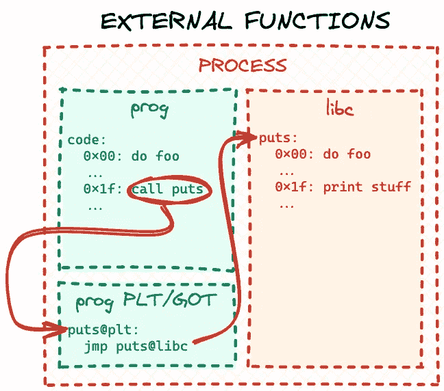

# 如何执行目标文件:第 3 部分

> 原文：<https://levelup.gitconnected.com/how-to-execute-an-object-file-part-3-53574658ad2a>

## 处理外部库

在我们系列的[第 2 部分中，我们学习了如何处理目标文件中的重定位，以便正确地连接代码中的内部依赖关系。在这篇文章中，我们将研究如果代码有外部依赖会发生什么——也就是说，它试图从外部库调用函数。和以前一样，我们将基于第 2 部分](/how-to-execute-an-object-file-part-2-655eb8b9a811)的代码构建[。让我们给我们的玩具对象文件添加另一个函数:](https://github.com/cloudflare/cloudflare-blog/tree/master/2021-03-obj-file/2)

*对象 c* :

```
#include <stdio.h>

...

void say_hello(void)
{
    puts("Hello, world!");
}
```

在上述场景中，我们的`say_hello`函数现在依赖于 C 标准库中的`puts` [函数。为了进行试验，我们还需要修改我们的`loader`来导入新函数并执行它:](https://man7.org/linux/man-pages/man3/puts.3.html)

*loader.c* :

```
...

static void execute_funcs(void)
{
    /* pointers to imported functions */
    int (*add5)(int);
    int (*add10)(int);
    const char *(*get_hello)(void);
    int (*get_var)(void);
    void (*set_var)(int num);
    void (*say_hello)(void);

...

    say_hello = lookup_function("say_hello");
    if (!say_hello) {
        fputs("Failed to find say_hello function\n", stderr);
        exit(ENOENT);
    }

    puts("Executing say_hello...");
    say_hello();
}
...
```

让我们运行它:

```
$ gcc -c obj.c
$ gcc -o loader loader.c
$ ./loader
No runtime base address for section
```

当`loader`试图处理重定位时似乎出错了，所以让我们检查重定位表:

```
$ readelf --relocs obj.o

Relocation section '.rela.text' at offset 0x3c8 contains 7 entries:
  Offset          Info           Type           Sym. Value    Sym. Name + Addend
000000000020  000a00000004 R_X86_64_PLT32    0000000000000000 add5 - 4
00000000002d  000a00000004 R_X86_64_PLT32    0000000000000000 add5 - 4
00000000003a  000500000002 R_X86_64_PC32     0000000000000000 .rodata - 4
000000000046  000300000002 R_X86_64_PC32     0000000000000000 .data - 4
000000000058  000300000002 R_X86_64_PC32     0000000000000000 .data - 4
000000000066  000500000002 R_X86_64_PC32     0000000000000000 .rodata - 4
00000000006b  001100000004 R_X86_64_PLT32    0000000000000000 puts - 4
...
```

编译器为`puts`调用生成了一个重定位。重定位类型是`R_X86_64_PLT32`，我们的`loader`已经知道如何处理这些，所以问题在别处。上面的条目显示重定位引用了符号表中的第 17 个条目(十六进制的`0x11`),所以让我们检查一下:

```
$ readelf --symbols obj.o

Symbol table '.symtab' contains 18 entries:
   Num:    Value          Size Type    Bind   Vis      Ndx Name
     0: 0000000000000000     0 NOTYPE  LOCAL  DEFAULT  UND
     1: 0000000000000000     0 FILE    LOCAL  DEFAULT  ABS obj.c
     2: 0000000000000000     0 SECTION LOCAL  DEFAULT    1
     3: 0000000000000000     0 SECTION LOCAL  DEFAULT    3
     4: 0000000000000000     0 SECTION LOCAL  DEFAULT    4
     5: 0000000000000000     0 SECTION LOCAL  DEFAULT    5
     6: 0000000000000000     4 OBJECT  LOCAL  DEFAULT    3 var
     7: 0000000000000000     0 SECTION LOCAL  DEFAULT    7
     8: 0000000000000000     0 SECTION LOCAL  DEFAULT    8
     9: 0000000000000000     0 SECTION LOCAL  DEFAULT    6
    10: 0000000000000000    15 FUNC    GLOBAL DEFAULT    1 add5
    11: 000000000000000f    36 FUNC    GLOBAL DEFAULT    1 add10
    12: 0000000000000033    13 FUNC    GLOBAL DEFAULT    1 get_hello
    13: 0000000000000040    12 FUNC    GLOBAL DEFAULT    1 get_var
    14: 000000000000004c    19 FUNC    GLOBAL DEFAULT    1 set_var
    15: 000000000000005f    19 FUNC    GLOBAL DEFAULT    1 say_hello
    16: 0000000000000000     0 NOTYPE  GLOBAL DEFAULT  UND _GLOBAL_OFFSET_TABLE_
    17: 0000000000000000     0 NOTYPE  GLOBAL DEFAULT  UND puts
```

哦！`puts`函数的节索引是`UND`(本质上是代码中的`0`)，这完全说得通:与前面的符号不同，`puts`是一个外部依赖项，它没有在我们的`obj.o`文件中实现。因此，它不能是`obj.o`内任何区段的一部分。那么，我们如何解决这种迁移？我们需要以某种方式将代码指向一个`puts`实现。我们的`loader`实际上已经可以访问 C 库`puts`函数(因为它是用 C 编写的，我们已经在`loader`代码本身中使用了`puts`)，但从技术上讲，它不必是 C 库`puts`，只是一些`puts`实现。为了完整起见，让我们在`loader`中实现我们自己的自定义`puts`函数，它只是 C 库`puts`的一个装饰器:

*loader.c* :

```
...

/* external dependencies for obj.o */
static int my_puts(const char *s)
{
    puts("my_puts executed");
    return puts(s);
}
...
```

现在我们有了一个`puts`实现(以及它的运行时地址),我们应该在`loader`中编写逻辑，通过指示代码跳转到正确的函数来解决重定位问题。然而，有一个复杂的问题:在我们系列的第 2 部分[中，当我们处理常量和全局变量的重定位时，我们了解到我们主要处理的是 32 位相对重定位，并且我们引用的代码或数据与重定位本身的距离需要不超过 2147483647 ( `0x7fffffff`十六进制)字节。`R_X86_64_PLT32`也是一个 32 位相对重定位，所以它有相同的要求，但不幸的是我们不能重用来自](/how-to-execute-an-object-file-part-2-655eb8b9a811)[第 2 部分](/how-to-execute-an-object-file-part-2-655eb8b9a811)的技巧，因为我们的`my_puts`函数是`loader`本身的一部分，我们不能控制操作系统将`loader`代码放在地址空间的什么地方。

幸运的是，我们不必想出任何新的解决方案，只需借用共享库中使用的方法。

## 探索 PLT/GOT

现实世界中的 ELF 可执行文件和共享库有相同的问题:通常可执行文件依赖于共享库，而共享库依赖于其他共享库。并且完整运行时程序的所有不同部分可以被映射到进程地址空间中的随机范围。当一个共享库或一个 ELF 可执行文件被链接在一起时，链接器会枚举所有的外部引用，并在 ELF 文件中创建两个或更多的附加部分(关于 ELF 部分的复习，请查看我们系列的[第 1 部分)。两个强制的是](/how-to-execute-an-object-file-part-1-2c92d962f276)[过程链接表(PLT)和全局偏移量表(GOT)](https://refspecs.linuxfoundation.org/ELF/zSeries/lzsabi0_zSeries/x2251.html) 。

我们不会深入研究标准 PLT/GOT 实现的细节，因为网上有许多其他很好的资源，但简单地说，PLT/GOT 只是一个外部代码的跳转表。在链接阶段，链接器解析关于本地生成的 PLT/GOT 表的所有外部 32 位相对重定位。它可以做到这一点，因为这个表将成为最终 ELF 文件本身的一部分，所以当文件在运行时被映射到内存中时，它将“接近”主代码。稍后，在运行时[，动态加载器](https://man7.org/linux/man-pages/man8/ld.so.8.html)用所有依赖项的运行时地址填充每个加载的 ELF 文件(可执行文件和共享库)的 PLT/GOT 表。最终，当程序代码调用某个外部库函数时，CPU 通过本地 PLT/GOT 表“跳转”到最终代码:



你可能会问，为什么我们需要两个 ELF 部分来实现一个 jumptable？因为真实世界的 PLT/GOT 比上面描述的要复杂一些。事实证明，在运行时解析所有外部引用可能会显著降低程序启动时间，所以符号解析是通过“懒惰方法”实现的:只有当代码实际尝试调用特定函数时，引用才由动态加载器[解析。如果主应用程序代码从不调用库函数，那么这个引用就永远不会被解析。](https://man7.org/linux/man-pages/man8/ld.so.8.html)

## 实施简化的 PLT/GOT

出于学习和演示的目的，我们不会重新实现一个完整的具有惰性解析的 PLT/GOT，而是一个简单的 jumptable，它在加载和解析目标文件时解析外部引用。首先，我们需要知道表的大小:对于 ELF 可执行文件和共享库，链接器将在链接阶段计算外部引用，并创建适当大小的 PLT 和 GOT 部分。因为我们处理的是原始目标文件，所以我们必须再次遍历`.rela.text`段，并对所有的重定位进行计数，这些重定位指向符号表中具有未定义段索引的条目(或代码中的`0`)。让我们为此添加一个函数，并将外部引用的数量存储在一个全局变量中:

*loader.c* :

```
...

/* number of external symbols in the symbol table */
static int num_ext_symbols = 0;
...
static void count_external_symbols(void)
{
    const Elf64_Shdr *rela_text_hdr = lookup_section(".rela.text");
    if (!rela_text_hdr) {
        fputs("Failed to find .rela.text\n", stderr);
        exit(ENOEXEC);
    }

    int num_relocations = rela_text_hdr->sh_size / rela_text_hdr->sh_entsize;
    const Elf64_Rela *relocations = (Elf64_Rela *)(obj.base + rela_text_hdr->sh_offset);

    for (int i = 0; i < num_relocations; i++) {
        int symbol_idx = ELF64_R_SYM(relocations[i].r_info);

        /* if there is no section associated with a symbol, it is probably
         * an external reference */
        if (symbols[symbol_idx].st_shndx == SHN_UNDEF)
            num_ext_symbols++;
    }
}
...
```

这个函数非常类似于我们的`do_text_relocations`函数。只是它没有真正执行重定位，只是计算了外部符号引用的数量。

接下来，我们需要决定跳转表的实际字节大小。`num_ext_symbols`在目标文件中有外部符号引用的数目，但是每个符号要分配多少字节呢？为了解决这个问题，我们需要设计 jumptable 格式。如上所述，简单来说，我们的跳转表应该是一个无条件 CPU 跳转指令的集合——每个外部符号一个。然而，不幸的是，现代 x64 CPU 架构[不提供跳转指令](https://www.felixcloutier.com/x86/jmp)，其中地址指针可以是直接操作数。相反，跳转地址需要存储在内存中某个“接近”的位置，即在 32 位偏移量内，偏移量是实际的操作数。因此，对于每个外部符号，我们需要存储跳转地址(在 64 位 CPU 系统上为 64 位或 8 字节)和带有偏移操作数的实际跳转指令(x64 架构为 [6 字节](https://www.felixcloutier.com/x86/jmp))。我们可以用下面的 C 结构来表示跳转表中的条目:

*loader.c* :

```
...

struct ext_jump {
    /* address to jump to */
    uint8_t *addr;
    /* unconditional x64 JMP instruction */
    /* should always be {0xff, 0x25, 0xf2, 0xff, 0xff, 0xff} */
    /* so it would jump to an address stored at addr above */
    uint8_t instr[6];
};

struct ext_jump *jumptable;
...
```

我们还添加了一个全局变量来存储 jumptable 的基址，这将在以后分配。注意，使用上面的方法，实际的跳转指令对于每个外部符号总是不变的。因为我们用这种结构为每个外部符号分配了一个专用的入口，所以对于 32 位操作数来说，`addr`成员将总是在从`instr` : `-14`字节或者十六进制的`0xfffffff2`中的跳转指令的末端的相同偏移处。所以`instr`将总是`{0xff, 0x25, 0xf2, 0xff, 0xff, 0xff}` : `0xff`，`0x25`是 x64 跳转指令及其修饰符的编码，`0xfffffff2`是小端格式的操作数偏移量。

现在我们已经为 jumptable 定义了条目格式，我们可以在解析目标文件时分配和填充它。首先，我们不要忘记从`parse_obj`调用我们的新`count_external_symbols`函数来填充`num_ext_symbols`(这必须在我们分配 jumptable 之前完成):

*loader.c* :

```
...

static void parse_obj(void)
{
...

    count_external_symbols();

    /* allocate memory for `.text`, `.data` and `.rodata` copies rounding up each section to whole pages */
    text_runtime_base = mmap(NULL, page_align(text_hdr->sh_size)...
...
}
```

接下来，我们需要为跳转表分配内存，并将指针存储在`jumptable`全局变量中以备后用。只是提醒一下，为了解决从`.text`部分到这个表的 32 位重定位，它必须在内存中“靠近”主代码。所以我们需要在同一个`mmap`调用中分配它，就像其余的对象部分一样。因为我们在`struct ext_jump`中定义了表格的条目格式，并且有`num_ext_symbols`，所以表格的大小将简单地为`sizeof(struct ext_jump) * num_ext_symbols`:

*loader.c* :

```
...

static void parse_obj(void)
{
...

    count_external_symbols();

    /* allocate memory for `.text`, `.data` and `.rodata` copies and the jumptable for external symbols, rounding up each section to whole pages */
    text_runtime_base = mmap(NULL, page_align(text_hdr->sh_size) + \
                                   page_align(data_hdr->sh_size) + \
                                   page_align(rodata_hdr->sh_size) + \
                                   page_align(sizeof(struct ext_jump) * num_ext_symbols),
                                   PROT_READ | PROT_WRITE, MAP_PRIVATE | MAP_ANONYMOUS, -1, 0);
    if (text_runtime_base == MAP_FAILED) {
        perror("Failed to allocate memory");
        exit(errno);
    }

...
    rodata_runtime_base = data_runtime_base + page_align(data_hdr->sh_size);
    /* jumptable will come after .rodata */
    jumptable = (struct ext_jump *)(rodata_runtime_base + page_align(rodata_hdr->sh_size));

...
}
...
```

最后，因为 CPU 将实际执行来自 jumptable 的`instr`字段的跳转指令，我们需要将该内存标记为只读和可执行(在该函数前面的`do_text_relocations`完成之后):

*loader.c* :

```
...

static void parse_obj(void)
{
...

    do_text_relocations();

...

    /* make the jumptable readonly and executable */
    if (mprotect(jumptable, page_align(sizeof(struct ext_jump) * num_ext_symbols), PROT_READ | PROT_EXEC)) {
        perror("Failed to make the jumptable executable");
        exit(errno);
    }
}
...
```

在这个阶段，我们已经分配了跳转表，并且可以使用了——剩下要做的就是正确地填充它。我们将通过改进`do_text_relocations`实现来处理外部符号的情况。本帖开头的`No runtime base address for section`错误，其实是由`do_text_relocations`中的这一行引起的:

*loader.c* :

```
...

static void do_text_relocations(void)
{
...
    for (int i = 0; i < num_relocations; i++) {
...
        /* symbol, with respect to which the relocation is performed */
        uint8_t *symbol_address = = section_runtime_base(&sections[symbols[symbol_idx].st_shndx]) + symbols[symbol_idx].st_value;
...
}
...
```

目前，我们试图通过查找符号的段运行时地址并加上符号的偏移量来确定重定位的运行时符号地址。但是我们已经在上面建立了外部符号没有相关的部分，所以它们的处理需要是一个特例。让我们更新实现来反映这一点:

*loader.c* :

```
...

static void do_text_relocations(void)
{
...
    for (int i = 0; i < num_relocations; i++) {
...
        /* symbol, with respect to which the relocation is performed */
        uint8_t *symbol_address;

        /* if this is an external symbol */
        if (symbols[symbol_idx].st_shndx == SHN_UNDEF) {
            static int curr_jmp_idx = 0;

            /* get external symbol/function address by name */
            jumptable[curr_jmp_idx].addr = lookup_ext_function(strtab +  symbols[symbol_idx].st_name);

            /* x64 unconditional JMP with address stored at -14 bytes offset */
            /* will use the address stored in addr above */
            jumptable[curr_jmp_idx].instr[0] = 0xff;
            jumptable[curr_jmp_idx].instr[1] = 0x25;
            jumptable[curr_jmp_idx].instr[2] = 0xf2;
            jumptable[curr_jmp_idx].instr[3] = 0xff;
            jumptable[curr_jmp_idx].instr[4] = 0xff;
            jumptable[curr_jmp_idx].instr[5] = 0xff;

            /* resolve the relocation with respect to this unconditional JMP */
            symbol_address = (uint8_t *)(&jumptable[curr_jmp_idx].instr);

            curr_jmp_idx++;
        } else {
            symbol_address = section_runtime_base(&sections[symbols[symbol_idx].st_shndx]) + symbols[symbol_idx].st_value;
        }
...
}
...
```

如果一个重定位符号没有一个相关的部分，我们认为它是外部的，并调用一个帮助器函数通过它的名字查找符号的运行时地址。我们将该地址存储在下一个可用的跳转表条目中，用我们的固定操作数填充 x64 跳转指令，并将该指令的地址存储在`symbol_address`变量中。稍后，`do_text_relocations`中的现有代码将解决`.text`相对于`symbol_address`中地址的重定位，其方式与我们系列第 2 部分[中的局部符号相同。](/how-to-execute-an-object-file-part-2-655eb8b9a811)

现在这里唯一缺少的是新引入的`lookup_ext_function`助手的实现。真实世界的加载器可能有复杂的逻辑，如何在运行时找到并解析内存中的符号。但是出于本文的目的，我们将提供一个简单的实现，它只能解析`puts`函数:

*loader.c* :

```
...

static void *lookup_ext_function(const char *name)
{
    size_t name_len = strlen(name);

    if (name_len == strlen("puts") && !strcmp(name, "puts"))
        return my_puts;

    fprintf(stderr, "No address for function %s\n", name);
    exit(ENOENT);
}
...
```

请注意，因为我们控制了`loader`逻辑，所以我们可以随心所欲地实现 resolution。在上面的例子中，我们实际上“转移”了目标文件来使用我们自己的“自定义”`my_puts`函数，而不是 C 库函数。让我们重新编译`loader`，看看它是否能工作:

```
$ gcc -o loader loader.c
$ ./loader
Executing add5...
add5(42) = 47
Executing add10...
add10(42) = 52
Executing get_hello...
get_hello() = Hello, world!
Executing get_var...
get_var() = 5
Executing set_var(42)...
Executing get_var again...
get_var() = 42
Executing say_hello...
my_puts executed
Hello, world!
```

万岁！我们不仅修复了我们的`loader`来处理目标文件中的外部引用——我们还学会了如何“挂钩”任何这样的外部函数调用并将代码转移到自定义实现，这在某些情况下可能是有用的，比如恶意软件研究。

和之前的帖子一样，这篇帖子的完整源代码可以在 GitHub 上找到。

*这是我转贴自* [*Cloudflare 博客*](https://blog.cloudflare.com/how-to-execute-an-object-file-part-3/) 的帖子