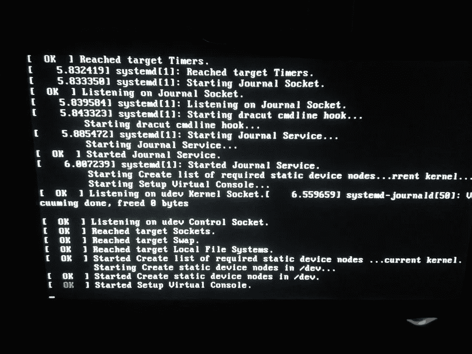

# 如何在 Python 中正确执行 shell 命令

> 原文：<https://levelup.gitconnected.com/how-to-execute-shell-commands-properly-in-python-5b90c1a9213f>

## 了解在 Python 中运行 shell 命令的不同方式

作为一种脚本语言，Python 是自动化的一个很好的选择。您可以编写简单的 Python 代码来链接和自动化不同程序的执行。当作业完成时，您可以编写一些 Python 脚本来提取和分析结果。有些程序，比如 [Scrapy](https://lynn-kwong.medium.com/how-to-run-scrapy-spiders-in-your-program-7db56792c1f7) ，现在已经有了 Python 可以直接调用的 API，也就是说你可以直接用原生 Python 代码运行这些程序。然而，许多人仍然没有合适的 Python and，您仍然需要直接运行 shell 命令。

图片来自 [Pixabay](https://pixabay.com/photos/operating-system-command-shell-os-246242/) 。

我想大部分 Python 开发者之前已经使用过`os.system()`来执行 shell 命令了。是的，`os`模块的`system()`函数是 Python 中执行 shell 命令的最简单方式。然而，它有两个主要缺点。

首先，您只能获得 shell 命令的退出代码，而不能从`os.system()`获得标准输出或错误。如果您不关心 shell 命令的输出或错误消息，而只想运行它，这可能不是问题。在这种情况下，多注意一点第二个缺点，这个缺点更重要。

其次，`os.system()`容易受到 shell 注入的影响，也称为 OS 命令注入。如果您的程序接受将在`os.system()`函数中使用的用户输入，这将是一个严重的安全问题。我们现在用一个简单的例子来说明这个问题。假设我们有一些脚本接受用户输入的主机名或 IP 地址，它们将被用作`ping`命令的输入来测试网络连接。用户输入可以来自前端或简单地使用`input`功能:

您可以看到`ping`命令的结果:

假设一个邪恶的用户输入如下命令:

你会看到一些有趣但也相当危险的东西:

使用`os.system()`函数，传入的字符串被解析为 Linux shell 命令。特别是分号`;`用于分隔命令。因此，在上面的例子中，如果用户输入`google.com; cat /etc/passwd`，将会执行两个命令。第一个是`ping -c 3 google.com`，第二个是`cat /etc/passwd`。

如果`/etc/passwd`的内容暴露给外部用户，这将是一个严重的安全问题。此外，用户可以在分号后输入任何 Linux shell 命令。假设用户输入一个破坏性的命令，比如`rm -rf /`，这个命令会对你的系统造成严重的损害。

因此，最佳实践是避免使用`os.system()`，而是使用*子流程*模块，这将很快介绍。如果不可避免，不要接受用户输入或在用户输入传递到`os.system()`之前清除用户输入，这样就不会执行危险的命令`.`

**用** `[**subprocess.run()**](https://docs.python.org/3/library/subprocess.html#subprocess.run)` **。**

我想你已经意识到了`os.system()`功能的危险。或者，建议尽可能使用*子进程*模块来执行 shell 命令。它可以做与`os.system()`相同的工作，甚至更多。更重要的是，我们可以避免外壳注入，这样使用起来更安全。

当你阅读一些旧的教程或帖子时，你会看到很多来自*子流程*模块的函数被使用，包括`call()`、`run()`、`check_output`等。然而，对于现代 Python 版本(> 3.5)，建议对所有用例使用`run()`函数。

> 调用子流程的推荐方法是对它可以处理的所有用例使用`run()`函数。对于更高级的用例，可以直接使用底层的`Popen`接口。

很多时候我们只需要使用`run()`函数，这个函数使用了引擎盖下的`Popen`类。对于想要异步运行 shell 命令的特殊情况，您可以直接使用`Popen`类，它不像`run()`，不会等待 shell 命令完成。

稍后我们将介绍`Popen()`类。现在，让我们看看如何使用`run()`函数来避免 shell 注入。

`r[un()](https://docs.python.org/3/library/subprocess.html#subprocess.run)`功能有一个`shell`标志。如果这个标志是`True`，那么它的工作方式类似于`os.system()`函数，并接受一个字符串作为输入。因此，它具有与`os.sytem()`相同的安全问题:

我们可以看到它具有与上面所示的`os.system()`相同的结果和问题。

另一方面，如果`shell`标志是`False`，这意味着 shell 命令将以列表而不是字符串的形式传入。让我们看看在这种情况下是否还会发生 shell 注入:

请注意，数字 3 也应该作为字符串传入，否则将引发异常。错误信息将是:
`TypeError: expected str, bytes or os.PathLike object, not int`。

有趣的是，`subprocess.run()`功能这次失败了。如果仔细检查，可以看到`google.com; cat /etc/passwd`是作为一个整体传递的，并没有拆分成两个 shell 命令。这意味着`google.com; cat /etc/passwd`作为一个整体作为`ping`命令的输入被传递，因为`google.com; cat /etc/passwd` 不是一个有效的主机名或 IP 地址，所以`ping`命令将失败，如注释中所示。

因此，通过将`shell`标志设置为`False`，我们可以安全地接受用户输入，并避免为`subprocess.run()`函数注入 shell。由于`False`是`shell`标志的默认值，我们不需要显式地将其设置为`False`。然而，你应该避免将它设置为`True`，除非你有非常好的理由这样做。

**得到标准输出和误差。**

除了克服 shell 注入问题之外，`subprocess.run()`函数还有其他有用的属性。让我们来探索一下。

与`os.system()`在屏幕上打印突出输出(STDOUT)和标准错误(STDERR)不同，`subprocess.run()`可以捕获输出和错误，并在代码中提供它们:

重要的是，使用`stdout=subprocess.PIPE`和`stderr=subprocess.PIPE`选项，标准输出和误差被保存到结果的`stdout`和`stderr`属性中，结果的类型为`[subprocess.CompletedProcess](https://docs.python.org/3/library/subprocess.html#subprocess.CompletedProcess)`。此外，`text=True`指定 stdout 和 stderr 应该有原始的字符串数据，而不是字节。

**用** `[**subprocess.Popen()**](https://docs.python.org/3/library/subprocess.html#subprocess.Popen)` **。**

正如我们已经注意到的，`subprocess.run()`功能会一直阻塞，直到 shell 命令完成。如果 shell 命令需要很长时间才能完成，这可能并不可取。您可能希望在后台运行 shell 命令，同时做一些其他事情。为此，您可以直接使用`[subprocess.Popen()](https://docs.python.org/3/library/subprocess.html#subprocess.Popen)`类，该类由底层的`subprocess.run()`函数使用。

上述代码的要点:

*   `subprocess.Popen()`具有与`subprocess.run()`相同的选项。
*   `subprocess.Popen()`无阻塞，立即返回。shell 命令在后台运行。
*   由`subprocess.Popen()`返回的结果属于`subprocess.Popen`类型。我们可以使用`poll()`方法来检查 shell 命令是否已经完成。如果 shell 命令没有完成，那么返回`None`。否则，将返回 shell 命令的退出代码。特别是退出代码 **0** 表示 shell 命令成功完成。
*   shell 命令的标准输出和错误由`communicate()`方法返回，而不是像`subprocess.run()`一样由`stdout`和`stderr`属性返回。

`subprocess.Popen()`的设定更多。例如，您可以等待运行 shell 命令的子进程使用`[wait()](https://docs.python.org/3/library/subprocess.html#subprocess.Popen.wait)`方法完成，或者您可以将超时传递给`[communicate()](https://docs.python.org/3/library/subprocess.html#subprocess.Popen.communicate)`方法。一旦你掌握了`subprocess.Popen()`的基础知识，处理这些情况应该是相当简单的。

在这篇文章中，我们介绍了在 Python 中执行 shell 命令的不同方法。一般来说，我们应该避免使用`os.system()`，而是使用`subprocess.run()`(默认情况下，将`shell`设置为`False`)。如果你需要在后台异步运行 shell 命令，你可以使用`subprocess.Popen()`来代替。使用`subprocess.run()`和`subprocess.Popen()`，可以获得标准输出和错误，并直接在 Python 代码中使用。

相关文章:

*   [如何在你的 Python 程序中运行 Scrapy spider](https://lynn-kwong.medium.com/how-to-run-scrapy-spiders-in-your-program-7db56792c1f7?source=your_stories_page----------------------------------------)