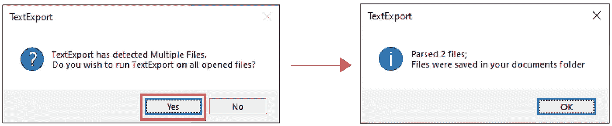

# 如何将文字从 Adobe Illustrator 和 Photoshop 导出到记事本？

> 原文：<https://levelup.gitconnected.com/how-to-export-text-from-adobe-illustrator-and-photoshop-to-notepad-95da5d2bea15>

从 Adobe Illustrator 中提取文本的简短教程& Photoshop 到记事本。


**描绘从 Adobe Illustrator & Photoshop 提取到记事本中的文本。**

# 问题是

作为一名平面设计师，在大量的打字工作中，有时您会想要从图层或画板中复制粘贴一大堆文本。手动一层一层地复制每个单词或句子确实是一项庞大、耗时的工作。因此，您可能想知道如何:

1.  打字时保持放松。
2.  只需点击几下鼠标就能提取出所有文本。
3.  自动将提取的文本保存在记事本文件中。

# 这项研究

程序员克里斯·派恩曾经说过，

> *“编程不在于你知道什么；而是你能想出什么。”——*[克里斯·派恩](https://twitter.com/codewisdom/status/927959286017294336?lang=en)

我也面临着同样的问题，所以我在谷歌上搜索任何脚本代码。幸运的是，我找到了一个现成的 21 年前的脚本，作者是来自比利时的自由网络开发者 Bramus。我遵循了他在博客 [*PS_BRAMUS 中定义的步骤。TextConvert:面向大众的 PSD2TXT 和 txt 2 PSD*](https://www.bram.us/2008/10/30/ps_bramustextconvert-psd2txt-and-txt2psd-for-the-masses/)，脚本完美适用于 **Adobe Photoshop** 。

不幸的是，我认为它会给我与 Adobe Illustrator 相同的结果，但是它产生了一个错误，如下面的快照所示。


**Adobe Illustrator 中错误对话框的快照。**

我还不打算放弃；分析错误后，很明显 Illustrator & Photoshop 的图层类型彼此不同。如下图所示，图形设计师很少使用 Adobe Illustrator**中的任何图层，因为他可以使用画板执行所有的文本编辑操作。**


**在 Adobe Illustrator 中使用画板编辑文本。**

另一方面， **Adobe Photoshop** 支持多个图层在更干净的环境中工作。更容易处理复杂的数据，并在一个层中单独编辑每个对象；参考下图。


**在 Adobe Photoshop 中使用图层编辑文本。**

**Adobe Photoshop** 的一个缺点是不产生矢量图形；这就是为什么平面设计师更喜欢使用 Adobe Illustrator。

做程序员是有收获的。我调整了脚本中的代码，它在几秒钟内就完美地将文本从 **Adobe Illustrator** 导出到**记事本**中。

# 解决方案

现在，您可以通过将 GitHub Repo***"***[***文本提取从 Adobe Illustrator & Photoshop 下载到记事本****作为 ZIP 文件，将您的书面文本从 **Adobe Illustrator** 和 **Photoshop** 导出到**记事本**中。*](https://github.com/Zujaj/Text-Extraction-From-Adobe-Illustrator---Photoshop-To-Notepad.git)

**

***导航至“下载 Zip”选项。***

## *在 Adobe Illustrator 中导出文本*

1.  *关闭`**Illustrator**` ，提取`**Scripts**`文件夹中的`**IllustratorTextExtractor.jsx**`文件。*

```
***C:\Program Files\Adobe\Adobe Illustrator 2021\Presets\en_US\Scripts***
```

*2.打开`**Test.ai**`文件并导航到`**File/Scripts**`来执行脚本。*

**

***Adobe Illustrator 中的脚本导航。***

## *在 Adobe Photoshop 中导出文本*

1.  *关闭`**Photoshop**`并解压`**Scripts**`文件夹中的`**PS_Bramus.TextExportWithUTF-1.3.jsx**`文件。*

```
***C:\Program Files\Adobe\Adobe Photoshop 2021\Presets\Scripts***
```

*2.打开`**Test.psd**`文件并导航到`**File/Scripts**`来执行脚本。*

**

***Adobe Photoshop 中的脚本导航。***

# *结果*

*成功导出后，您的文本会在**记事本**中弹出。将文本对齐方式从左向右更改，以正确查看乌尔都语文本。*

**

***在记事本中更改文本对齐方式。***

# *有趣的事实*

*下面是一些有趣的事实，你可以尝试一下。*

1.  *要更改文本的顺序，请切换图层顺序。*

**

***Adobe Illustrator&Photoshop 中的图层切换。***

*2.打开多个文件，点击一下就可以导出，如下图所示。*

**

***支持多文件导出。***

*3.通过更改文件编码来运行其他语言的脚本；参考下面的片段。*

```
*fileOut.encoding = “UTF-16”; // Change it to UTF-8 or UTF-32*
```

*如果你觉得这篇文章有帮助，请鼓掌五十次！*

# *确认*

*感谢 Bramus 在[github](https://github.com/bramus/PS_BRAMUS.TextConvert)⁴上分享脚本代码。*

# *参考*

*【https://twitter.com/codewisdom/status/927959286017294336?】【1】:编程智慧推特
[lang=en](https://twitter.com/codewisdom/status/927959286017294336?lang=en)*

***【2】:PS _ bra mus。TextConvert:面向大众的 PSD2TXT 和 TXT2PSD！—Bram . us** [https://www . Bram . us/2008/10/30/PS _ bramustextconvert-PSD 2d txt-and-txt 2 PSD-for-the-mass/](https://www.bram.us/2008/10/30/ps_bramustextconvert-psd2txt-and-txt2psd-for-the-masses/)*

***【3】:从 Adobe Illustrator 中提取文本&Photoshop To Notepad | GitHub Repo** [https://GitHub . com/Zujaj/Text-Extraction-From-Adobe-Illustrator-Photoshop-To-Notepad . git](https://github.com/Zujaj/Text-Extraction-From-Adobe-Illustrator---Photoshop-To-Notepad.git)*

***【4】:面向大众的 PSD2TXT 和 txt 2 PSD | GitHub Repo** https://github.com/bramus/PS_BRAMUS.TextConvert.git*