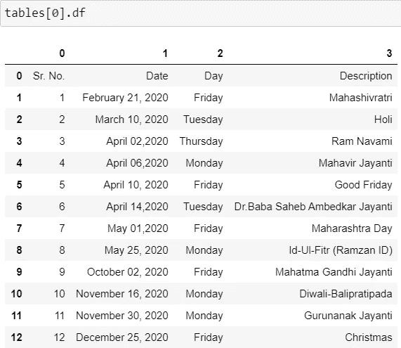
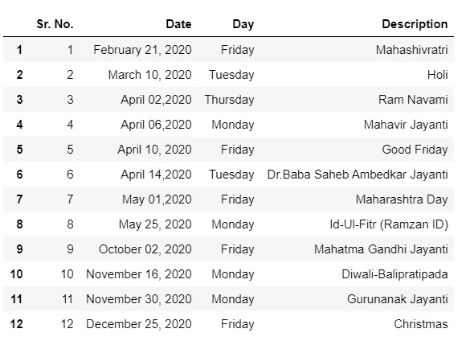

# 如何用 Camelot 从 pdf 中提取表格

> 原文：<https://levelup.gitconnected.com/how-to-extract-tables-from-pdf-files-with-camelot-12ca6afd28dd>

## 数据科学

## 使用 Camelot 库从 Python 中的 PDF 文件提取表格的快速指南


由 [Recardo Cruz](https://unsplash.com/@mavrick) 在 [Unsplash](https://unsplash.com/photos/P8LZaU52NME) 上拍摄的照片

# 装置

如果您使用的是 Windows，请确保从这里的[安装`Ghostscrip`。在没有预先安装`Ghostscript`的情况下，您仍然可以安装`camelot` 。但是我们在尝试使用`camelot`时会遇到错误。](https://www.ghostscript.com/download/gsdnld.html)

```
conda install -c conda-forge camelot-py
```

或者

```
pip install "camelot-py[cv]"
```

或者

```
git clone [https://www.github.com/camelot-dev/camelot](https://www.github.com/camelot-dev/camelot)
cd camelot
pip install ".[cv]"
```

# 使用

我们将首先导入`camelot` ，然后提供 pdf 文件的文件路径。`read_pdf`带有许多我们可以探索的参数。用于以下示例的示例 pdf 位于[这里](https://trade.indiabulls.com/pdf/NSE_Holidays_Equity.pdf)。

```
import camelot
tables = camelot.read_pdf('[https://trade.indiabulls.com/pdf/NSE_Holidays_Equity.pdf'](https://trade.indiabulls.com/pdf/NSE_Holidays_Equity.pdf'))
```

**表格数量:**打印提取的表格数量。以上文章有 2 个表。

```
tables.n
>>> 2
```

**解析报告:**运行下面的代码，获取每个表的解析报告。如果我们想查看每个表的报告，那么我们必须遍历所有的表。

```
print(tables[0].parsing_report)
>>> {'accuracy': 100.0, 'whitespace': 0.0, 'order': 1, 'page': 1}for i in range(tables.n):
    print(tables[i].parsing_report)
>>> {'accuracy': 100.0, 'whitespace': 0.0, 'order': 1, 'page': 1}
>>> {'accuracy': 100.0, 'whitespace': 0.0, 'order': 2, 'page': 1}
```

**表格形状:**以下代码给出了提取的所有表格的形状。这里的形状指的是行数&列数。

```
print(tables[0])
>>> <Table shape=(13, 4)>for i in range(tables.n):
    print(tables[i])
>>> <Table shape=(13, 4)>
>>> <Table shape=(8, 4)>
```

**导出表格:**我们可以将所有表格导出为 CSV、Excel、JSON、HTML 和 SQLite 格式。有关将表格导出为 CSV 格式的信息，请参见下面的示例。

同样，我们可以用`to_excel`、`to_json`、`to_html`、`to_sqlite`。

```
tables[0].to_csv(‘nse_holiday_list_table1.csv’)
tables[1].to_csv(‘nse_holiday_list_table2.csv’)
```

**转换成 pandas DataFrame:** 我们可以将所有的表格导出到 pandas DataFrame。代码`**tables[0].df**`将把表格转换成 DataFrame，但是从下面的截图中我们可以看到，标题显示不正确。我们需要纠正这一点，以便用正确的数据帧标题显示表格。



在做了下面的修改后，现在它看起来很完美，有了正确的 DataFrame 头。

```
temp_df = tables[0].df 
temp_df.rename(columns=temp_df.iloc[0]).drop(temp_df.index[0])
```



你可以在下面找到完整的代码-

## 命令行界面

`Camelot`还提供 CLI。可以通过[这个](https://camelot-py.readthedocs.io/en/master/user/cli.html)链接获得 CLI 命令。

## 网络界面

这个神奇的库也有一个网络界面，叫做`[**Excalibur**](https://github.com/camelot-dev/excalibur)`。

> 听过`**Camelot**` `**&**` `**Excalibur**`这几个名字后我现在明白它为什么叫 PDF 表提取为 ***人类***’:)希望你也能猜到！！

关于卡梅洛特的高级用法，请参考本。

# 卡梅洛特的优势

*   当通过参数的数量提取表时，Camelot 提供了很大的灵活性。
*   没有正确提取的表可以根据准确性和空白等指标被丢弃。这一点我们可以从解析报告方法中得到。
*   每个表格都可以转换成 pandas 数据框架，用于进一步的分析和处理。
*   Camelot 可以灵活地将表格导出为多种格式，如 CSV、Excel、JSON、HTML 和 Sqlite。

**注意** : `Camelot`仅适用于基于文本的 pdf，不适用于扫描文档。

# 结论

我们知道`camelot`库可以从 PDF 文件中提取表格，您可以在下一个项目中使用这些表格。

*阅读更多关于 Python 和数据科学的此类有趣文章，* [***订阅***](https://pythonsimplified.com/home/) *到我的博客*[***www.pythonsimplified.com***](http://www.pythonsimplified.com/)***。*** 你也可以在[**LinkedIn**](https://www.linkedin.com/in/chetanambi/)**上联系我。**

# 参考

[](https://github.com/camelot-dev/camelot) [## 卡米洛特-德夫/卡米洛特

### Camelot 是一个 Python 库，任何人都可以轻松地从 PDF 文件中提取表格！注意:您也可以检查…

github.com](https://github.com/camelot-dev/camelot)