# 如何用 Python 将表格从 PDF 提取到 Excel

> 原文：<https://levelup.gitconnected.com/how-to-extract-tables-from-pdf-to-excel-in-python-538109b1bc0c>

## Python 教程从 NAR 的月度住房数据 PDF 文档中提取表格

在 [Unsplash](https://unsplash.com/photos/nApaSgkzaxg) 上由[Towfiqu barb huya](https://unsplash.com/photos/nApaSgkzaxg)拍摄的照片

***pdf 文件读起来很美，分析起来却很痛苦。***

这是因为 PDF 文档中的数据是 ***非结构化*** 。

非结构化数据是定性数据。它可以由图像、音频和视频文件组成。

***我们要的是结构化数据。***

结构化数据是定量数据。它有明确定义的数据类型，易于搜索。例如，excel 表中的数据。

***有没有一种简单的方法可以将 PDF 文档中的非结构化数据转换成结构化数据？我们能提取表格并导出到 excel 吗？***

是的，是的！

***这个帖子将从 PDF 文档中提取 NAR 的现有房屋平均销售价格表，并将其导出到 excel。***

## 什么是 NAR，为什么要使用他们的数据？

> 全国房地产经纪人协会(NAR)是一个由房地产经纪人组成的全国性组织，被称为房地产经纪人，旨在促进房地产行业的发展，并培养其成员的职业行为。该协会有自己的道德准则，要求其成员遵守。— [投资媒体](https://www.investopedia.com/terms/n/national-association-of-realtors.asp)

NAR 在有数据的地方编制国家、地区和大都市市场一级的住房统计数据。

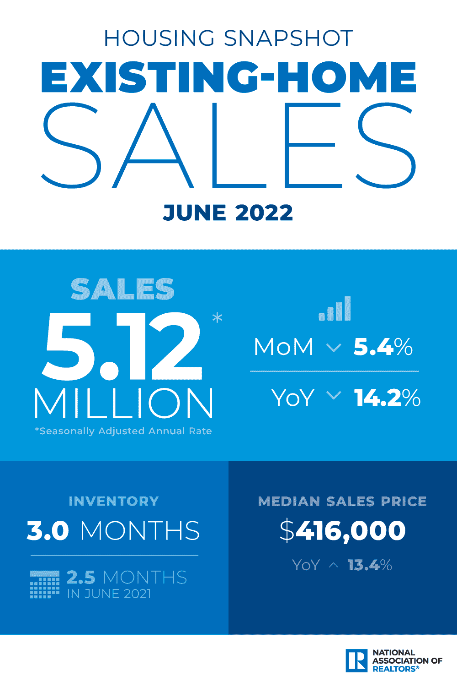

[NAR 现房销售](https://www.nar.realtor/sites/default/files/downloadable/2022-06-ehs-housing-snapshot-infographic-07-20-2022-1000w-1500h.png)作者截图

# 问题陈述

我们是房地产投资者和/或房地产经纪人。我们希望在市场趋势上为自己和客户做出明智的决定。

我们关心的房屋统计是 ***现房平均销售价格*** 。该数据由 NAR 每月发布一次。

数据存储在 PDF 文档的表格中。这使得我们很难分析一段时间的趋势。

***我们需要一个快速简单的解决方案来从 PDF 文档中读取数据并将其转换为 excel 文件。***

我们将使用 Python 来做到这一点。

# 数据源

NAR 住房统计作者在[织机](https://www.loom.com/share/dcc28637ec7b4f66b34397a040a7bf2c)上的记录

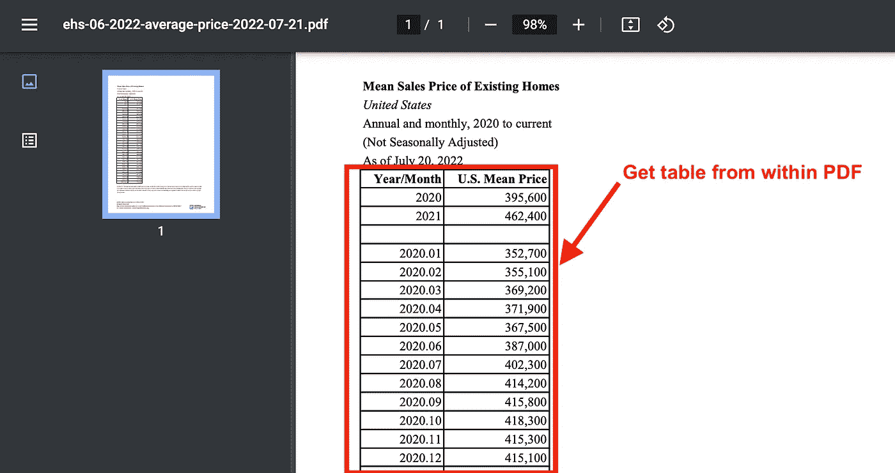

[NAR 数据截图](https://cdn.nar.realtor/sites/default/files/documents/ehs-06-2022-average-price-2022-07-21.pdf)

# 支持视频

作者在 YouTube[上制作的视频](https://youtu.be/o8Dfa3hUHtc)

# Python 教程

如果您没有现有的 Python 环境，那么我强烈建议首先**克隆笔记本**(在文章的底部)。

这将允许您在 Google Colab 中运行 Python 代码(免费！).它是一个基于云的环境，让您无需在本地安装 Python 就可以运行代码。

# 一.安装包

第一步是安装必要的软件包。

> Tabula 是一个离线软件，在麻省理工学院开源许可下可用，它允许你上传一个 PDF 文件，并从它可能包含的任何表格中提取行和列。— [数据学院](https://schoolofdata.org/extracting-data-from-pdfs/#:~:text=Tabula%20is%20an%20offline%20software,any%20table%20it%20may%20contain.)

安装包的代码片段(作者使用 snappify.io 创建的图片)

# I .导入库

接下来，导入所需的库。

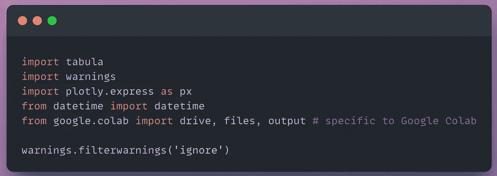

导入的代码片段(作者使用 snappify.io 创建的图片)

# 二。数据

导航到您想要阅读的数据源(PDF)。复制链接地址并存储在`url1`变量中。

在我们的例子中，我们从现房销售中复制链接地址:[平均价格](https://cdn.nar.realtor/sites/default/files/documents/ehs-06-2022-average-price-2022-07-21.pdf)。

阅读我们的 PDF 文档只需要一行代码。

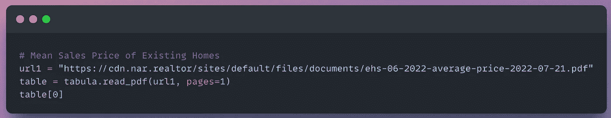

代码片段(作者使用 snappify.io 创建的图片)

输出中的单个表格与 PDF 文档中的表格相同。

有两列:(1)年/月和(2)美国平均价格。

我们需要执行数据清理来使我们的表可读。

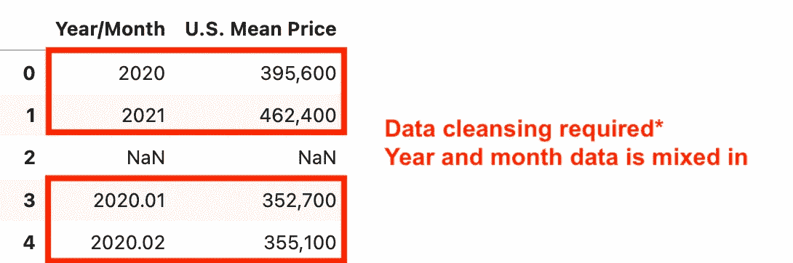

代码输出(作者创建的截图)

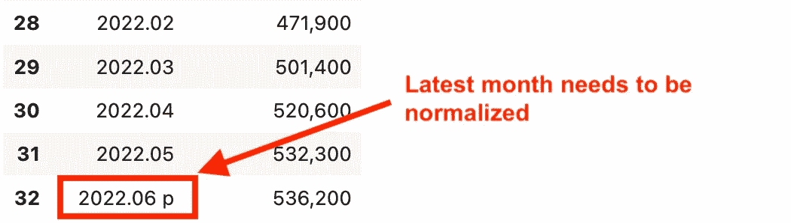

代码输出(作者创建的截图)

接下来，我们采取以下步骤来清理和规范化我们的表:

*   **索引**:从第 4 行开始我们的数据框架(表格)，只包含月数据(不是年数据)
*   `U.S. Mean Price`:将平均价格<字符串>对象转换为<整数>
*   `Year/Month`:将列索引为仅包含前 7 个字符，从<字符串>对象转换为<日期时间>对象

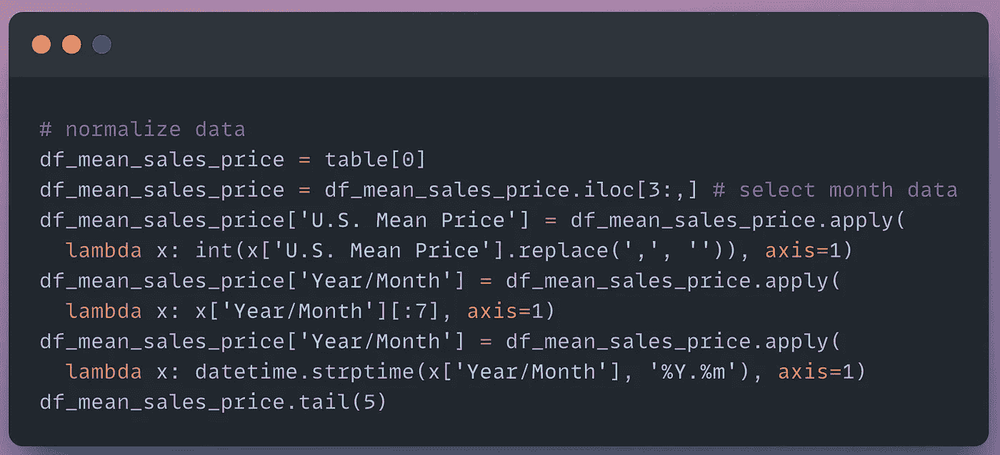

代码片段(作者使用 snappify.io 创建的图片)

我们现在有了一个干净的数据集，可以下载或创建可视化效果。

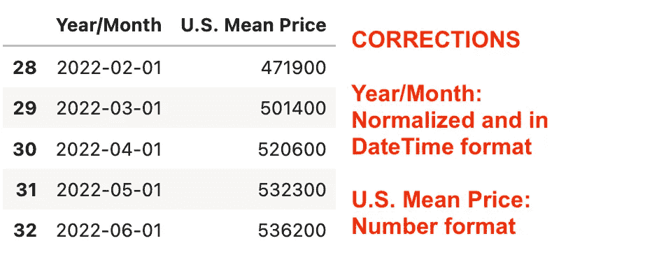

代码输出(作者创建的截图)

# 三。形象化

有了 [Plotly Express](https://plotly.com/python/line-charts/) 库，我们可以可视化月环比(MoM)中值销售价格。

我们传入 DataFrame 并指定在任一轴上绘制哪些列。

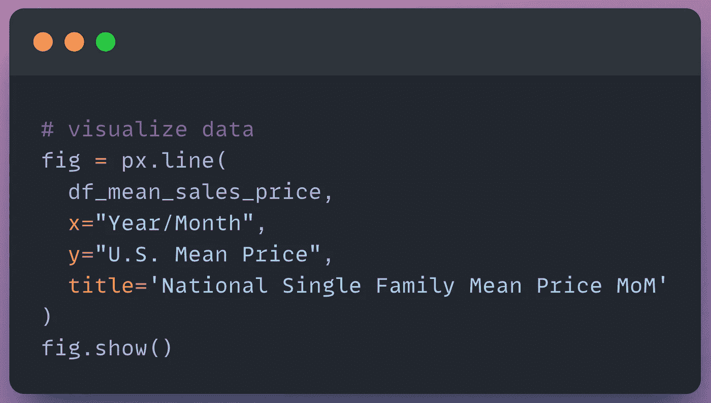

代码片段(作者使用 snappify.io 创建的图片)

在这里，我们可以看到在 2.5 年的时间框架内，全国单户住宅的平均价格上涨了约 66%！

这条增长之路主要是由 ***历史低利率、低库存和刺激资金*** 推动的。

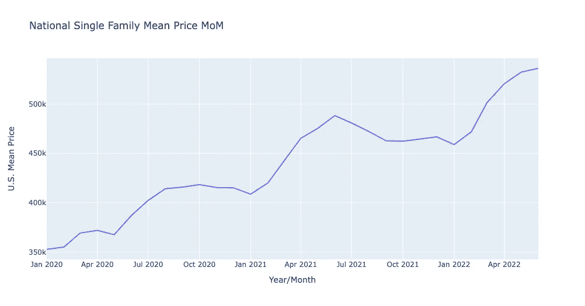

代码输出(作者创建的截图)

我们应该继续分析月度数据，看看增长何时开始放缓——这标志着从卖方市场向买方市场的转变。

# 四。输出

在 Google Colab notebook 中，我们可以将表格下载到 CSV 文件中。

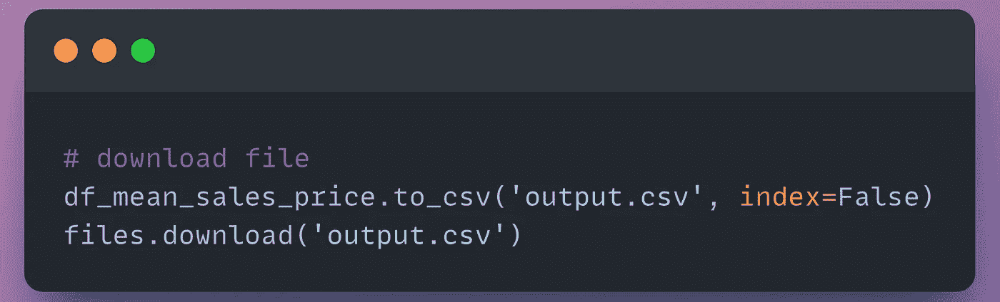

代码输出(作者创建的截图)

我们现在能够在 excel 中轻松处理数据。

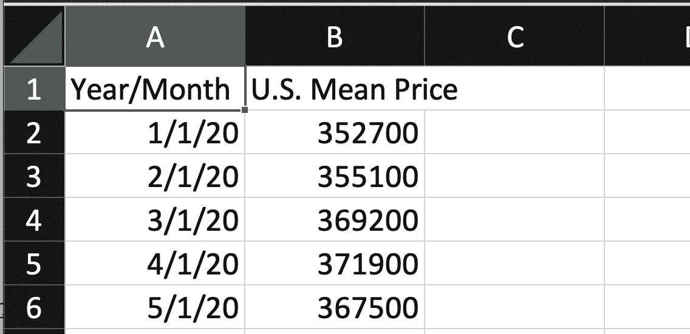

Excel 输出(作者创建的截图)

# 结论

通过利用 Python，我们只需几行代码就可以将非结构化数据转换成结构化数据集。

这使我们能够处理住房统计数据，如现有住房的平均销售价格。我们可以观察整个市场的表现，并推断未来的趋势。

查看我的 [YouTube 频道——AnalyticsAriel](https://youtube.com/c/analyticsariel),获得更多关于房地产数据源和数据分析的见解！

# 克隆笔记本

 [## 主 analyticsariel/projects 上的 projects/read _ tables _ from _ pdf _ files . ipynb

### https://analyticsariel.com/.通过在 GitHub 上创建帐户，为 analyticsariel/projects 开发做出贡献。

github.com](https://github.com/analyticsariel/projects/blob/master/machine_learning/read_tables_from_pdf_files.ipynb) 

# 来源

 [## 现房销售

### 2022 年 6 月，成屋销售下降，美国四个主要地区中有三个出现环比下降和下降…

www.nar.realtor](https://www.nar.realtor/research-and-statistics/housing-statistics/existing-home-sales)