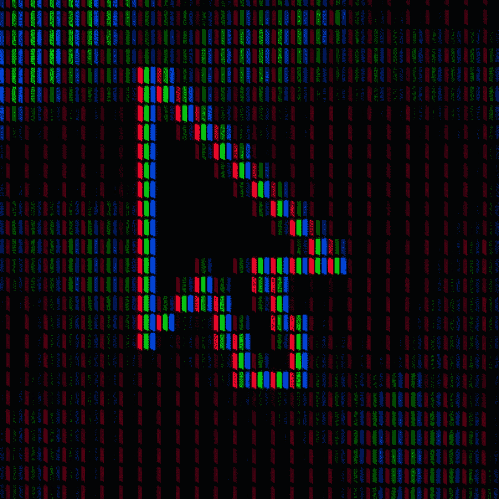
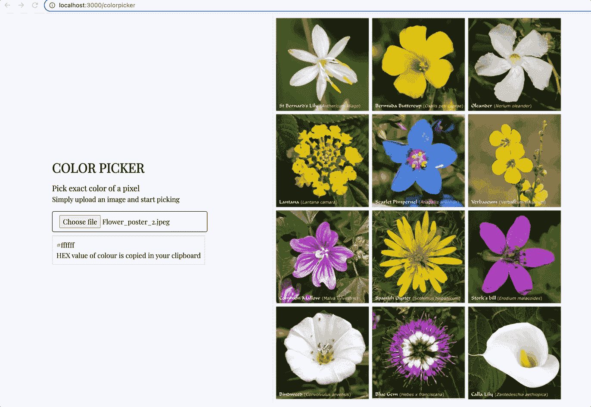
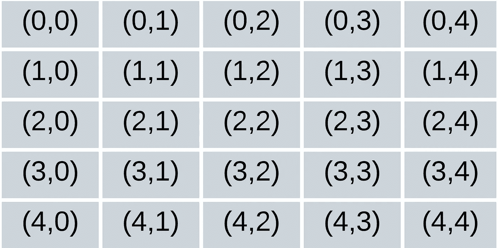

# 如何使用 Javascript 和 HTML 5 提取像素的颜色

> 原文：<https://levelup.gitconnected.com/how-to-extract-the-colour-of-a-pixel-using-javascript-and-html-5-f3661f54473>



图为[翁贝托](https://unsplash.com/@umby?utm_source=unsplash&utm_medium=referral&utm_content=creditCopyText)在 [Unsplash](https://unsplash.com/s/photos/pixel?utm_source=unsplash&utm_medium=referral&utm_content=creditCopyText)

在这篇文章中，我将介绍如何提取给定图像中像素的颜色代码。



鼠标移动时颜色选择器的作用

我们将使用 HTML 5 的 [Canvas 元素的 API](https://developer.mozilla.org/en-US/docs/Web/API/Canvas_API)和一些普通的 javascript 代码。

完成大部分繁重工作的代码如下

正如您所看到的，我们首先创建一个空的画布元素，然后像这样绘制图像。请注意，我们是如何将画布上的 x & y 坐标保持为 0，0，并且我们还保持画布的尺寸与图像的尺寸相同。

```
canvas.width = img.width;
canvas.height = img.height;let ctx: CanvasRenderingContext2D = canvas.getContext("2d") as CanvasRenderingContext2D;ctx.drawImage(img, 0, 0);
```

然后我们利用 canvas 的 API 并调用`getImageData`函数，该函数将返回一个[对象，该对象代表 canvas](https://developer.mozilla.org/en-US/docs/Web/API/CanvasRenderingContext2D/getImageData) 的指定部分的底层像素数据，在我们的例子中是整个 Canvas。

```
const imgData = ctx.getImageData(0, 0, canvas.width, canvas.height);
```

现在，我们有一个非常大的像素数据数组，所以我们现在要做的就是捕获鼠标移动事件，并从图像数据数组中找到像素数据

```
canvas.addEventListener("mousemove", (ev) => {
  //as the mouse moves around the image
  let cols = canvas.width;
  let { offsetX, offsetY } = ev;

   //call the method to get the r,g,b,a values for current pixel
   let c = extractPixelColor(cols, offsetY, offsetX);

   //build a colour string for 
   let colour = `rgb(${c.red}, ${c.green}, ${c.blue})`} ;
   let hexCode = `#${[c.red, c.green, c.blue].map((x) =>
    x.toString(16).padStart(2, "0")).join("")}`;

});
```

最后，有趣的是从图像数据中获取像素值。

为此，我们必须了解像素是如何排列的。例如，如果我们有一个 5x5 像素的图像，那么该数组将如下图所示。



5x5 像素图像表示

上图中的每个元素代表一个像素，每个像素有 4 个 RGBA 值(红、绿、蓝和阿尔法)。因此，包含这些像素的数组将有`5*5*4 = 100`个元素。你可以想象一旦我们加载一个更大的图像，这个数组会变得非常大。

现在，如果您希望提取元素(2，2)的值，那么该像素索引的数学公式将是

```
PixelIndex = (Total number of columns * Row Number) + Column Number
// PixelIndex value for (2,2) will be (5*2)+3 = 28
```

一旦有了像素指数，获取 RGBA 的值就相当简单了。

```
red = imgData[PixelIndex * 4]
green = imgData[(PixelIndex * 4) + 1]
blue = imgData[(PixelIndex * 4) + 2]
alpha = imgData[(PixelIndex * 4) + 3]
```

最后，`extractPixelColour`函数将如下所示

获得图像数据中的 RGB 值后，您可以将它们转换为十六进制色码值，如下所示

```
hexcolorcode = `#${[red, green, blue].map((x) => x.toString(16).padStart(2, "0")).join("")}`
```

*   **演示现场**:[https://tools.meta-collective.co.uk/](https://tools.meta-collective.co.uk/)
*   **GitHub**:【https://github.com/metacollective9/canvasfun 
*   【参考文献】https://developer.mozilla.org/en-US/docs/Web/API/Canvas_API
    –

感谢您的阅读，如果您想支持我，请关注我，成为会员，让我们所有人都留在这个平台上。

[](https://medium.com/@metacollective/membership) [## 通过我的推荐链接加入媒体 Meta Collective

### 作为一个媒体会员，你的会员费的一部分会给你阅读的作家，你可以完全接触到每一个故事…

medium.com](https://medium.com/@metacollective/membership) 

# 分级编码

感谢您成为我们社区的一员！在你离开之前:

*   👏为故事鼓掌，跟着作者走👉
*   📰查看[升级编码出版物](https://levelup.gitconnected.com/?utm_source=pub&utm_medium=post)中的更多内容
*   🔔关注我们:[Twitter](https://twitter.com/gitconnected)|[LinkedIn](https://www.linkedin.com/company/gitconnected)|[时事通讯](https://newsletter.levelup.dev)

🚀👉 [**加入升级人才集体，找到一份神奇的工作**](https://jobs.levelup.dev/talent/welcome?referral=true)