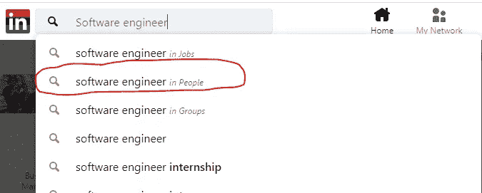
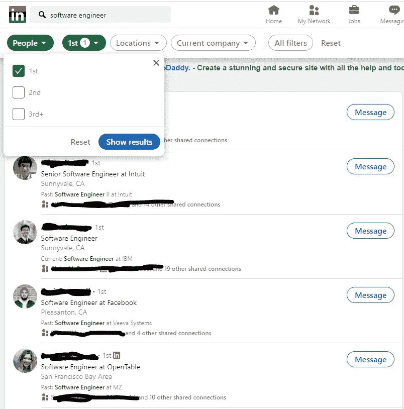
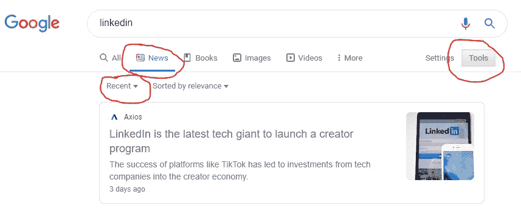

# 如何使用 LinkedIn 找到编码导师

> 原文：<https://levelup.gitconnected.com/how-to-find-a-coding-mentor-using-linkedin-3618f68909bd>

## 找一个编码导师应该不难。

很有可能，你正在努力学习如何编码。这段旅程并不容易。学习如何编码的最大困难之一是找到你需要的帮助。你希望有人能告诉你，你的方向是否正确。没有什么比陷入编码问题并试图找出下一步该做什么更痛苦的了。你希望有人帮助你走向成功。

这就是有一个编码导师有帮助的地方。一个伟大的编码导师会帮助你解决棘手的问题。他们还会给你一些课程或班级不会给你的编码技巧。

但是找到一个编码导师并不容易。你问谁？你怎么问他们？如果他们从不回复你呢？

我花了好几年才明白如何找到一个编码导师。但是当我弄清楚事情的时候，我不仅找到了一个编码导师，我还找到了五个。

我不希望你像我一样挣扎。在本文的剩余部分，我将向您展示我是如何利用 LinkedIn 寻找编码导师的。我将介绍如何在你的网络中找到软件工程师。我还会告诉你在你的推广信息中应该包括什么。

# 第一步:盘点你在 LinkedIn 上联系的软件工程师

我做的第一件事是使用 LinkedIn 的搜索功能查看我网络中的软件工程师。我使用了像“软件工程师”、“开发人员”和“软件开发人员”这样的短语。开始搜索时，请确保您搜索的是人，而不是职务或组:

确保你从“第一联系”开始。这些人与你直接相关:

花些时间看看你的第一次联系。你觉得向谁伸出手比较舒服？你们可能没有保持联系。没关系。重要的是问你自己，“这个人愿意帮助我吗？”

注意你的第一个关系中谁最有可能指导你。先别发东西。当你完成了所有的第一次联系，你还有另一个选择。开始寻找你的第二人脉。第二个联系是你与之有共同联系的人。

如果你仍然没有找到任何人，这意味着是时候和你的“第三人脉”建立关系网了。这些人你还没见过，而且没有任何共同之处。现在，我们将关注第一个和第二个连接。

# 第二步:起草一份黑仔推广信息

寻找潜在的编码导师只是这个过程的一半。另一半涉及到写一个简单而有思想的外展信息。这里有一个简单的框架，供您在撰写自己的推广信息时使用:

1.  问候
2.  增值观察
3.  语境
4.  要求
5.  结论

## *问候*

这应该很简单。从这样的内容开始:

*“嗨(在此插入姓名)，希望你过得好！”*

## *增值观察*

这是正确的关键部分。你需要给对方一个继续阅读你信息的理由。这种观察可能涉及最近的一轮融资或新产品功能。

假设我正在给在 LinkedIn 工作的第一个联系人写信。增值观察可能看起来有点像:

“我刚刚读到 LinkedIn 正在投入更多资源来增强创作者的能力。恭喜你！我很高兴在我的新闻订阅源上看到更多内容！”

有用的提示:我依靠谷歌搜索来创造增值观察。我喜欢使用新闻> >工具功能。我会确保过滤掉上个月或上一年的任何新闻:

## *语境*

在你提供了价值之后，你想知道你为什么要向他们传达信息。告诉他们你有多喜欢学习编程。提及你是如何挣扎的，但你仍然对提高很感兴趣。这个“上下文”听起来可能是这样的:

“我注意到你是 LinkedIn 的程序员。我最近对编程产生了兴趣，目前正在学习如何编写 Python。这是一场斗争，但非常值得。”

## *问*

在你提供了背景之后，提出你的问题。但是不要要求他们成为你的导师。我重复一遍，不要让他们成为你的导师。你的目标是要求一次信息性面试。我们是在建立关系，不是交换服务。提问可能看起来像这样:

“在这场斗争中，我发现我是多么喜欢写代码。你已经走了这么远，我可以从你身上学到很多东西。在接下来的几周里，你有时间和我聊聊吗？”

## *结论*

这是上面的樱桃。一定要提前感谢对方，告诉他们你有多感激他们的时间。结论可能类似于:

“我知道您很忙，非常感谢您的宝贵时间！希望你有一个伟大的休息一天！

-丹尼尔"

# 第三步:让我们把外展信息拼凑起来

“[问候]嗨(在此插入在 LinkedIn 工作的人)！

【增值观察】我刚刚看到 LinkedIn 正在投入更多资源为创作者赋能。恭喜你！我很高兴在我的新闻订阅上看到更多内容！

[上下文]我注意到你是 LinkedIn 的程序员。我最近对编程产生了兴趣，目前正在学习如何编写 Python。这是一场斗争，但非常值得。

[提问]在这场斗争中，我发现我是多么喜欢写代码。你已经走了这么远，我可以从你身上学到很多东西。在接下来的几周里，你有时间和我聊聊吗？

[结论]我知道您很忙，非常感谢您的宝贵时间！希望你有一个伟大的休息一天！

-丹尼尔"

# 第四步:保持联系并跟进

把接触十个你的一级和二级关系作为你的目标。不是每个人都会回复，但我保证你至少会收到一些。如果有人在三天内没有回复，请随时联系他们，并发送一个温和的提醒。该提醒可能是这样的:

"我知道你是个大忙人，所以我想把它放在你收件箱的顶部！"

当你得到回复时，你的目标是要求一个 20 分钟的信息面试。你可能听说过这被称为咖啡聊天。不要担心时机。人们通常会给你超过二十分钟的时间。

这些信息访谈的目的是建立关系。你想更好地了解他们的背景。以下是你的信息性面试要求:

“嘿(人)，

非常感谢你的回复和愿意聊天。这星期或下星期你有时间聊天吗？我每天下午 1-4 点有空，每周一、三、五上午 9-11 点有空。这些时间对你合适吗？这是我的电话号码，仅供参考(在此插入电话号码)。"

# 第五步:进行一次信息面试(或咖啡聊天)

1.  准备 3-5 个关于对方编码背景的开放式问题。这些问题应该都是关于其他人以及他们已经做了什么或者正在做什么。询问他们关于他们建筑的平台或者他们工作的行业。不要多管闲事，但要好奇。让你真实的学习欲望和对编码的热情在对话中闪耀。
2.  问完问题后，听听他们的回答。记下他们的回答可能会引发的任何其他问题。
3.  记笔记！
4.  记录时间。在 20 分钟的时候，停下来看看面试官在哪里。如果他们必须走，他们会说的。如果他们能留下来，他们也会告诉你的。
5.  在谈话结束时，感谢他们的时间，并告诉他们你非常感谢他们的指导。他们需要知道他们所说的是有帮助的。

在这段对话中，要注意两件事。应该有乐于助人的意愿。还应该对未来的对话持开放态度。

提供帮助或他们提到未来，深入交谈是很好的指标。除了 20 分钟的咖啡聊天之外，愿意提供帮助的人的数量可能会让你吃惊。

如果这些指标不存在，那也没关系。不过，你不会遇到太多没用的人。大多数对最初的咖啡聊天说“是”的人想在 20 分钟的谈话后提供帮助。

# 第六步:跟进并保持联系

信息面试结束后，在 LinkedIn 上给他们发一条跟进信息。你要感谢他们的时间，并为将来的对话打开话题。该跟进消息可能如下所示:

“嘿(在此插入姓名)，

非常感谢你抽出时间和我聊天。我对编程有了前所未有的热情，对此我感激不尽。如果你不介意的话，我很乐意在下个月左右保持联系并再次聊天。"

# 结束语

你可能已经注意到了，我并没有提示你向他人提出“大的要求”。那是因为我不认为一定要有。通过传达你对编码的热情，与这些潜在的编码导师保持联系。预定下一次咖啡聊天，然后开始研究编码。要有纪念意义，但不要让人讨厌。提出深思熟虑的问题，但不要压倒它们。随着你做这些事情，他们对你的指导将会增加。他们会注意到你对学习的渴望。当这很明显时，很难不帮忙。

如果你觉得这很有帮助，可以考虑在这里订阅我的时事通讯。我正在建立一个平台，帮助像你这样的人学习如何编程，并在技术领域找到一份工作。如果你有任何问题或者只是想打个招呼，请随时联系我们。我看了每一条留言，尽我所能去回复。

在 LinkedIn 上寻找编码导师快乐！