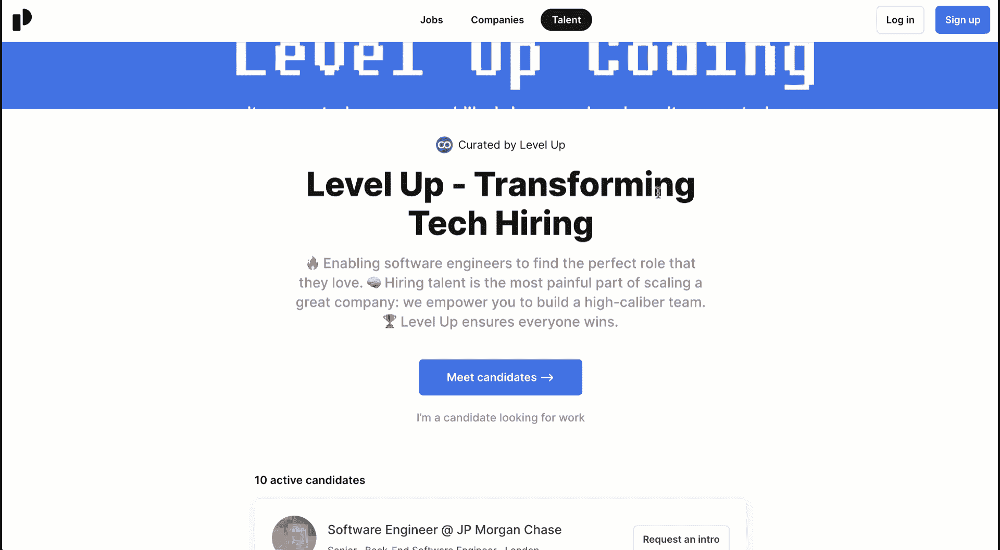

# 如何使用升级找到一份令人难以置信的工作

> 原文：<https://levelup.gitconnected.com/how-to-find-an-incredible-job-using-level-up-d4f8f5f66f3d>

关于如何使用[升级招聘平台](https://jobs.levelup.dev/talent/welcome?referral=true)的指南，以及我们将招聘转变为一个人人共赢的系统的愿景概述🏆

> 从[级编码出版](https://levelup.gitconnected.com/)和[级连接](https://gitconnected.com/)


照片由 [Fauzan Saari](https://unsplash.com/@fznsr_?utm_source=medium&utm_medium=referral) 在 [Unsplash](https://unsplash.com?utm_source=medium&utm_medium=referral) 上拍摄

对于公司来说，招聘是扩展一个伟大的软件创业公司最困难的部分。对于软件工程师(或任何人才)来说，找到一份自己热爱的新工作是痛苦而耗时的。我们生活中的很大一部分时间都在工作，但旨在让我们进入一个可以茁壮成长的角色的系统被打破了。 **Level Up 肩负着修复这一问题的使命。**

我们在 Level Up 的愿景是将招聘转变为专注于让合适的候选人担任理想的角色，创造一个各方共赢的框架。通过持续的数据、反馈和频繁的对话找到最佳的候选人-角色匹配，我们可以确保在任何给定的时间将开发人员置于最佳位置，同时还能够随着公司规模和候选人的成长提供进一步的支持。

**今天是让招聘变得更好的第一步。**随着时间的推移，我们将继续发展，直到愿景成为现实。

```
Ready to find your dream role or hire high caliber talent from the 3M+ monthly Level Up community? **Start now 👉** [**https://jobs.levelup.dev/talent/welcome**](https://jobs.levelup.dev/talent/welcome?referral=true)
```

# 升级后找工作的步骤

通过升级找工作就像 3 个步骤和 10 分钟的时间一样简单。一旦你加入了我们的人才网络，公司会在我们每月的人才选拔中联系你。只是坐下来享受这个过程😎

## 步骤 1:导航到我们的人才集合

从参观我们在[https://jobs.levelup.dev/talent](https://jobs.levelup.dev/talent/welcome?referral=true)的人才聚集地开始


## 步骤 2:创建您的个人资料

这只是你职业信息的两个屏幕，需要 5-10 分钟。



## 第三步:认识优秀的公司

我们每个月都会进行一次人才投放，让公司能够联系到你。只是坐下来，和公司聊天，找到你梦想的工作。

## **就这样！🚀**

这是我们破坏招募过程的任务的第一阶段，许多令人兴奋的更新还在后面。系好安全带，享受旅程！

# 我们对未来招聘的愿景

我们有一个工程师团队，他们申请了许多工作，也是无数开发人员招聘过程的一部分。从每个人的角度来看，我们从上到下都知道它是如何工作的。

我们有一个非常简单但非常强大的理论——我们希望成为开发人员生活的一部分，从他们编写的第一行代码一直到他们的最后一份工作，提供有价值的工具和资源，让您的生活一直更好。这让我们能够了解你，你的技能，以及你的热情所在。

这从根本上改变了整个过程。而不是支持一个通过创造高流动率和尽快将工程师安置到公司来赚钱的系统(即。当前系统)，我们将能够了解你在职业生涯和角色中的价值。通过与候选人和公司建立密切的关系，我们可以让工程师在他们能够茁壮成长的岗位上工作。

简单地说，我们考虑的是你的最大利益，而不是我们自己的底线。

通过让软件开发人员从事他们理想的工作，我们为所有相关人员创造了一个更美好的世界。

*   开发者会更开心
*   开发人员将会更有效率
*   开发人员将减少跳槽的频率

这是每个人都赢的方式🏆

## 如何才能实现这一点？

[Level Up Coding](https://levelup.gitconnected.com/) 已经成为最大的编程社区之一，每月有超过 300 万热情的开发人员阅读该出版物，我们很荣幸能与您一起成为其中的一员。除此之外，我们还有一个庞大的软件工具和 API 工具箱来消除找工作的痛点:

*   gitconnected.com[的 17k 名开发者](https://gitconnected.com/)自动生成他们的[简历](https://gitconnected.com/resume-builder)并使用[组合 API](https://gitconnected.com/portfolio-api) 建立他们的个人网站
*   指导开发人员在 [Skilled.dev](https://skilled.dev/) 上通过编码面试

我们将继续构建工具和培养关系，以创造真正独特的体验，并为您的整个职业生涯提供大量价值。

## 最后一个 CTA…

我们正在努力迭代，继续为您提供最佳体验。如果你现在准备好找工作，你可以 [**加入高级人才集体**](https://jobs.levelup.dev/talent/welcome?referral=true) ，从第一天起你就可以完全接触到我和我们的团队，帮你找到理想的工作。

[](https://jobs.levelup.dev/talent/welcome?referral=true) [## 升级-改变技术招聘

### 升级-改变技术招聘🔥使软件工程师能够找到完美的角色…

作业. levelup.dev](https://jobs.levelup.dev/talent/welcome?referral=true)