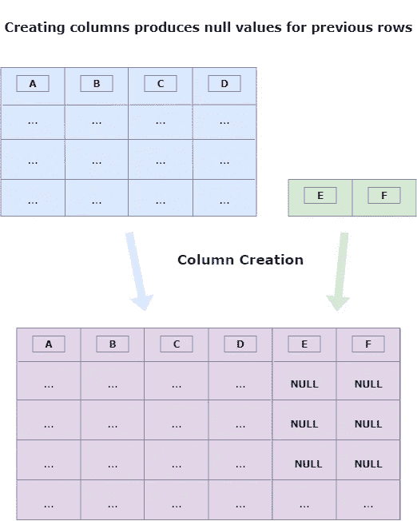
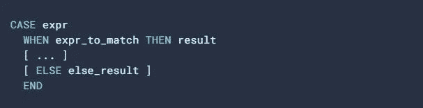

# 如何用 SQL 查找和估算空值

> 原文：<https://levelup.gitconnected.com/how-to-find-and-deal-with-null-values-in-sql-8404a32d3b37>

## 有一张照片🐈，因为为什么不呢？

十年前，当我开始作为一名软件工程师工作时，Null 是我不得不习惯的最奇怪的概念之一。

我们不考虑“零”，因为我们处理的是大量的数据。 *Null* 概念的发明者——[Edgar Codd](https://en.wikipedia.org/wiki/Edgar_F._Codd)——引入它来表示**缺失的信息**。

如果有人问你有几个孩子，你可以说 0、1、2 或更多。但是如果没人问你，我们关于你孩子的信息就是 *null* 。

**如何使用 SQL** 查找和估算空值，照片由 [Kim Davies](https://unsplash.com/@flowerchildkimmi?utm_source=medium&utm_medium=referral) 拍摄

> 空值表示没有收集到数据或数据不适用的信息。

当新列被添加到表中时，前面的行没有这些新闻列的值:它们的值将为 null，除非我们用其他值显式填充它们。

作者制作的模式

**当您想要聚合和分组数据时，空值是个问题。**

如果你有一个学生的 10 分，但其中一分的值为“空”，你会除以 10 得到平均值，还是除以 9？

缺失的标记是否等同于 0？

此外，如果一个值作为函数的输出为 NULL，大多数数据库将返回 NULL。

**这就是为什么在探索数据以获得业务洞察力之前，您必须在数据中寻找空值。**

# 如何查找和计算空值

> 本文中的例子可以在 Google BigQuery 上复制，并且应该可以在 PostgreSQL 和 MySQL 8 上运行。

有几种方法可以查找和计算空值。最简单的方法可能是在我们要查找空值的列上使用一个条件进行筛选:

然后使用 **COUNT()** 函数获得该列的空值总数:

这里不用等式的条件，但是关键字**是，**为“Null”表示值的不存在。

以下查询将在 BigQuery 和大多数数据库上产生错误:

相反，您可以选择另一种方法，允许使用 **SUM()** 函数对一列的空值进行计数:

这将起作用，因为在 CASE 语句中不存在“ELSE”。任何不符合标准的行都被视为空。

> 由于 COUNT(和其他聚合函数)将忽略空值，我们使用 CASE 将空值转换为值，将值转换为空值。

快速提醒一下，下面是**案例**陈述的定义:

*截图来自* [*BigQuery 文档*](https://cloud.google.com/bigquery/docs/reference/standard-sql/conditional_expressions#case_expr)

您可能还对空值的百分比(完成率)感兴趣。一旦你知道了关于“*SUM(CASE[…])*”的窍门，得到这些数字就相当简单了:

## 如何管理空字符串

从数据库/数据分析的角度来看，对缺失值使用空值是我们所期望的。但是这个世界可以变得更好！

大多数软件开发人员会使用空字符串而不是 NULL。

使用空字符串的一个(好的)原因是表明信息没有丢失，但是用户*拒绝或者不能回答*这个问题。

一个很好的例子是当我们询问性别时:要求允许一个用户不回答(“我不想回答”)。

然后把拒绝回答的人和我们以前从未问过这个问题的人区分开来就有意义了(*而且如果我们问了*那可能会接受回答)。

要查找和计算空字符串，需要指定一个“双引号”条件:

# 处理空值的 SQL 函数

用替代值替换空值有三种方法:

*   [**案例**](https://cloud.google.com/bigquery/docs/reference/standard-sql/conditional_expressions#case_expr) 报表；
*   [**COALESCE()**](https://cloud.google.com/bigquery/docs/reference/standard-sql/conditional_expressions#coalesce) 功能；
*   [**IFNULL()**](https://cloud.google.com/bigquery/docs/reference/standard-sql/conditional_expressions#ifnull) 函数；

## 使用 CASE 语句替换空值

您可以使用 **CASE** 语句类似地管理 Null 和空值。这里有一个实际的例子:

它简单而有效，大多数时候，数据分析师已经在他们的查询中使用 CASE 语句。

但是像 **COALESCE()** 和 **IFNULL()** 这样的函数是实现相同结果的更方便、更简洁的方法。

## 使用 COALESCE()和 IFNULL()替换空值

首先，为了提供 CASE 和 functions 选项之间的完整比较，下面是前面用于替换空值的查询的“COALESCE”和“IFNULL”版本:

从这个例子中我们能学到什么？

1.  功能更紧凑，更易于阅读(和维护)；
2.  但是他们不能管理其他用例，比如空值；
3.  IFNULL 比 COALESCE 更“人”；

此时，您可能会问，如果 **COALESCE()** 函数与 **IFNULL()** 具有相同的行为，您为什么要注意这个函数。

> 但事实并非如此，或者更准确地说，如果我们考虑两个表达式，那么 IFNULL()和 COALESCE()就是同义词。

让我们看一个业务用例:一个订单有一个状态，根据这个状态，与我们的客户交互的最后日期没有存储在同一个列中:

*   首先，客户创建订单(“处理”)；
*   但他们可以取消订单(“取消”)；
*   如果他们没有，我们就运送他们的订单(“已运送”)；
*   并且在某个时候，他们会收到它(“完成”)；
*   如果订单有问题，客户可以退回订单(“退回”)；

当信息可以存储在*创建 _ 在*、*返回 _ 在*、*发货 _ 在、*或*交付 _ 在*列时，如何获取与客户的最早交互日期？

此外，由于这些列中的大部分可能是空的，所以不能如此容易地应用日期比较😕。当值为空时，您需要依赖最接近的日期。

我们首先需要用有效的日期替换空值！下面是如何使用 **COALESCE()** 函数实现这一点:

该函数将返回选项列表中的第一个非空值。当顺序很重要时，这很有帮助。

现在让我们来看看 **IFNULL()** 版本:

嗯……你必须尝试的选项越多，阅读和维护这个查询就越困难。

从这个例子中我们能学到什么？

1.  保留 **IFNULL()** 用于简单替换；
2.  使用 **COALESCE()** 替换多个条件；

这几个 SQL 查询将帮助你控制数据库的质量，并在评论中分享你的建议！

另外，如果您喜欢这篇文章，您可能希望了解如何在数据库中查找和删除重复项:

 [## 如何使用 SQL 查找和删除重复项

### 数据清理简介

medium.com](https://medium.com/learning-sql/how-to-find-and-remove-duplicates-with-sql-4ff6078c5e4f)  [## 加入我的推荐链接媒体-数据 4 每个人！

### 作为一个媒体会员，你的会员费的一部分会给你阅读的作家，你可以完全接触到每一个故事…

dataforeveryone.medium.com](https://dataforeveryone.medium.com/membership) 

如果你[关注我](https://medium.com/@mickael-andrieu/)，我会在以后发布文章的时候通知你！

# 分级编码

感谢您成为我们社区的一员！在你离开之前:

*   👏为故事鼓掌，跟着作者走👉
*   📰查看[升级编码出版物](https://levelup.gitconnected.com/?utm_source=pub&utm_medium=post)中的更多内容
*   🔔关注我们:[Twitter](https://twitter.com/gitconnected)|[LinkedIn](https://www.linkedin.com/company/gitconnected)|[时事通讯](https://newsletter.levelup.dev)

🚀👉 [**将像你这样的开发人员安置在顶级创业公司和科技公司**](https://jobs.levelup.dev/talent/welcome?referral=true)