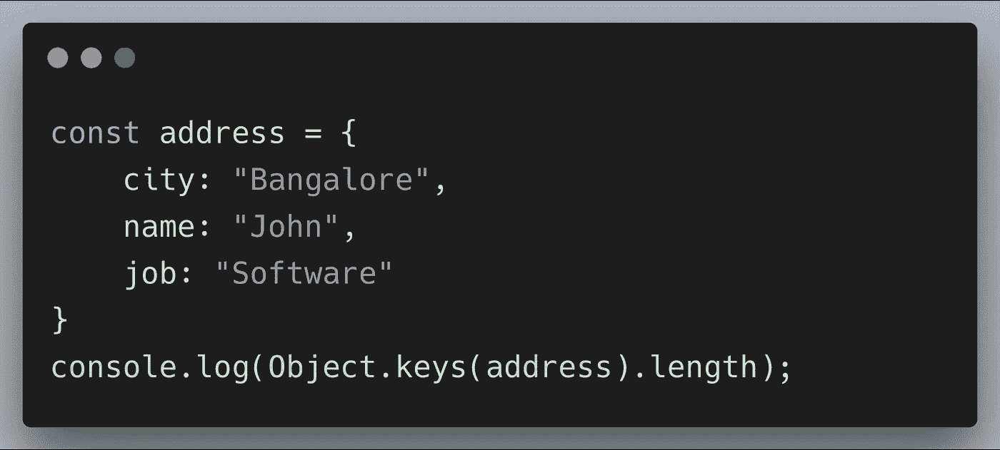
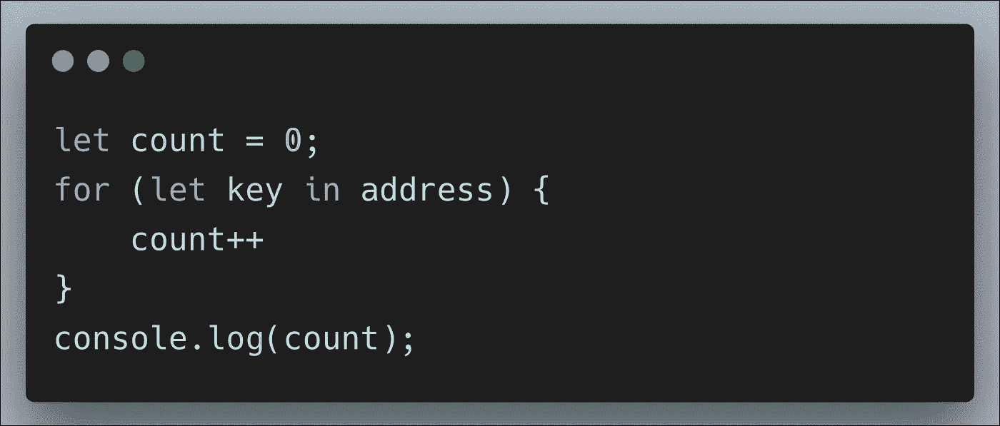
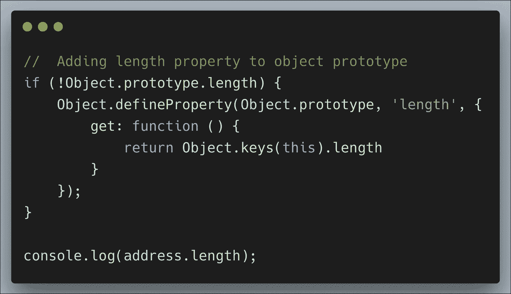

# 如何在 JavaScript 中获得对象的长度

> 原文：<https://levelup.gitconnected.com/how-to-find-object-length-in-javascript-c034b0fd35d8>

照片由[马库斯·斯皮斯克](https://unsplash.com/@markusspiske?utm_source=medium&utm_medium=referral)在 [Unsplash](https://unsplash.com?utm_source=medium&utm_medium=referral) 拍摄

在 JavaScript 中，几乎所有东西都是对象。`Objects`用于存储`key-value`对中的信息，其中`value`可以是任何其他数据类型或函数。与数组和字符串不同，对象没有预定义的长度属性来获取对象的长度。

所以当我们在一个对象上调用 length 属性时，它将返回 undefined。在 Javascript 中获取一个对象的长度有点棘手。

这里有三种方法可以得到物体的长度。

## Object.keys()

`Object.keys`方法返回键值数组。

## 通过在循环中使用 for…

我们也可以通过遍历对象的所有属性来获得长度。

## 向对象原型添加长度属性

通过向对象原型添加长度属性，我们可以在整个应用程序中重用它。

我希望这篇文章可以帮助获得一个对象的长度。[源代码](https://github.com/jayanthbabu123/Finding-Object-length/blob/master/object.js)此处。

感谢阅读:)