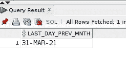

# 如何使用 Oracle SQL 日期函数查找每月的第一天和最后一天

> 原文：<https://levelup.gitconnected.com/how-to-find-the-first-and-last-day-of-a-month-with-oracle-sql-date-functions-706572c751a8>

我不断寻求提高与 SQL 相关的技能和知识。对 MySQL 有一个基本的了解，中度到重度使用(有些使用 PostgreSQL)，我对 Oracle 数据库有一段时间了。

Oracle SQL 过去对我来说不太容易接近。我是一名 Linux 用户，我发现安装 Oracle SQL——XE 版——可能很简单，也可能很简单...(至少那是我的经历。)

然而，最近 OCI 上有一个一直免费的 Oracle 自治数据库，我最近注册了一个账户。

有了两个免费的 20 GB Oracle 自治数据库，我开始了学习 Oracle SQL 数据库的旅程，最终目标是成为一名认证的 Oracle SQL 开发人员，这是我一段时间以来的目标。

图像由 [200 度](https://pixabay.com/users/200degrees-2051452/?utm_source=link-attribution&utm_medium=referral&utm_campaign=image&utm_content=1763587)从[像素点开始](https://pixabay.com/?utm_source=link-attribution&utm_medium=referral&utm_campaign=image&utm_content=1763587)

我最近写了一篇博文，名为[MySQL Count Weekday Occurrences](https://link.medium.com/39tBDpdDKfb)，在这篇博文中，我*将一些 Oracle SQL 和日期功能概念(受 YouTube 视频的启发[移植到类似的 MySQL 查询中。在本文中，我将介绍 Oracle SQL 中日期功能的一小部分，据我所知，其目的是确定给定月份的第一天和最后一天。(本文中的例子针对的是撰写本文时的当月:2021 年 4 月)。](https://youtu.be/wgg_zYD6Z3k?list=PLb1qVSx1k1VpEqAXgoFn5p7kFVzgsvUgM)*

## Oracle SQL 日期函数

下面是我将在以下示例查询中使用的 4 个日期函数:

*   `SYSDATE` —提供运行/安装 Oracle 数据库的操作系统的当前日期和时间。(注意:`SYSDATE`不接受任何参数。)
*   `LAST_DAY()` —为所提供的日期参数返回该月的最后一天。
*   `TRUNC()` — **将日期值向下舍入**为可选的指定格式模型(如月、年等)
*   `ADD_MONTHS()` —接受两个参数:一个日期值和一个表示月份的数字。`ADD_MONTHS()`返回给定日期参数加上指定月数的日期值结果。

## 当月的第一天和最后一天

由于`SYSDATE`提供了当前的日期和时间，使用它作为`TRUNC()`函数的日期参数和一个`MM`(月)格式模型返回月的第一天，因为`TRUNC()`向下舍入。

当月的第一天。

将`SYSDATE`作为参数传入`LAST_DAY()`返回当月的最后一天:

当月的最后一天。

下面显示的是`SYSDATE`提供的当月(2021 年 4 月)的第一天和最后一天。如果需要，这些值可以用于进一步的数据处理(正如我在上面提到的链接文章中针对 MySQL *端口 over* 所做的那样)。

撰写本文时当月的第一天和最后一天。

## 下个月的第一天和最后一天

使用我们现在返回的查询结果，再做一点工作，使用另一个 Oracle SQL 日期函数— `ADD_MONTHS()` —确定下个月的第一天和最后一天的值是非常容易的。简单地将数字 1 作为月数传递给`ADD_MONTHS()`，将`TRUNC(SYSDATE, ‘MM’)`调用作为`DATE`值参数，返回下个(或下一个)月的第一天，`01-MAY-21`:

下个月的第一天。

使用`ADD_MONTHS(TRUNC(SYSDATE, ‘MM), 1)`作为`LAST_DAY()`函数的`DATE`值参数也返回下个月的最后一天:

下个月的最后一天

## 上个月的第一天和最后一天

正如我在一本正在阅读的 Oracle SQL 书籍/指南中所了解到的，*Oracle SQL 中没有 SUBTRACT_MONTHS()* `DATE`函数。但是，您可以使用一个负数作为第二个参数`ADD_MONTHS()`，那么许多月份将从第一个参数`DATE`值中减去。

例如，使用 a -1，您完全可以根据`SYSDATE`的返回值`DATE`确定前几个月的第一天和最后一天的值:

上个月的第一天。

为了计算上个月的最后一天，在调用`LAST_DAY()`函数时，将整个表达式`ADD_MONTHS(TRUNC(SYSDATE, ‘MM’), -1)`包装为`DATE`参数:

上个月的最后一天。

我希望通过本文中的示例查询，您能更好地理解使用 Oracle SQL 日期函数检索第一天和最后一天的值是多么容易。

如果您看到代码中有任何错误或有任何问题，请随时发表评论。

感谢您的阅读。👍👏🤘

喜欢的内容，你在这个帖子里看过？那么你肯定会喜欢我博客上的博文，数字猫头鹰的散文。

在那里，您可以找到关于 SQL 数据库开发/编程和 LAMP web-stack 开发的博客文章。

# 分级编码

感谢您成为我们社区的一员！升级正在改变技术招聘。 [**在最好的公司**找到你最完美的工作](https://jobs.levelup.dev/talent) **。**

 [## 提升——改变招聘流程

### 🔥让软件工程师找到他们热爱的完美角色🧠寻找人才是最痛苦的部分…

作业. levelup.dev](https://jobs.levelup.dev/talent)