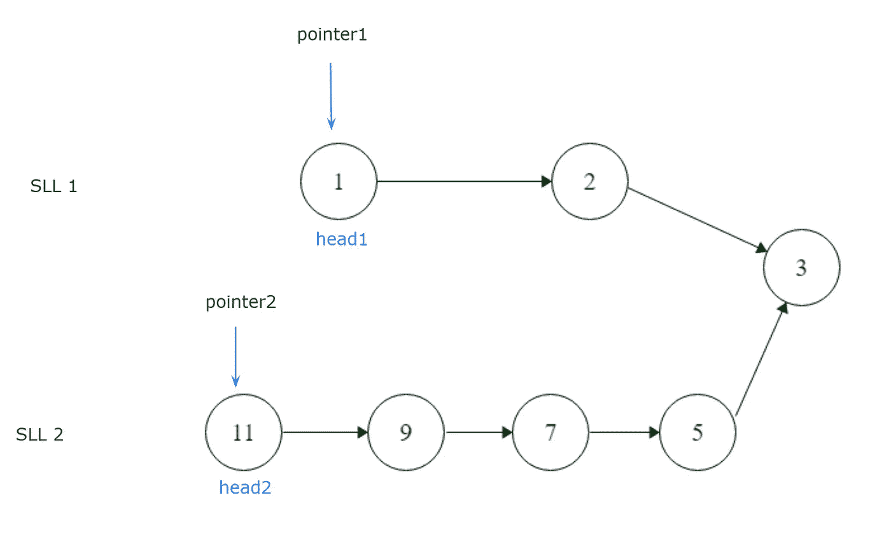
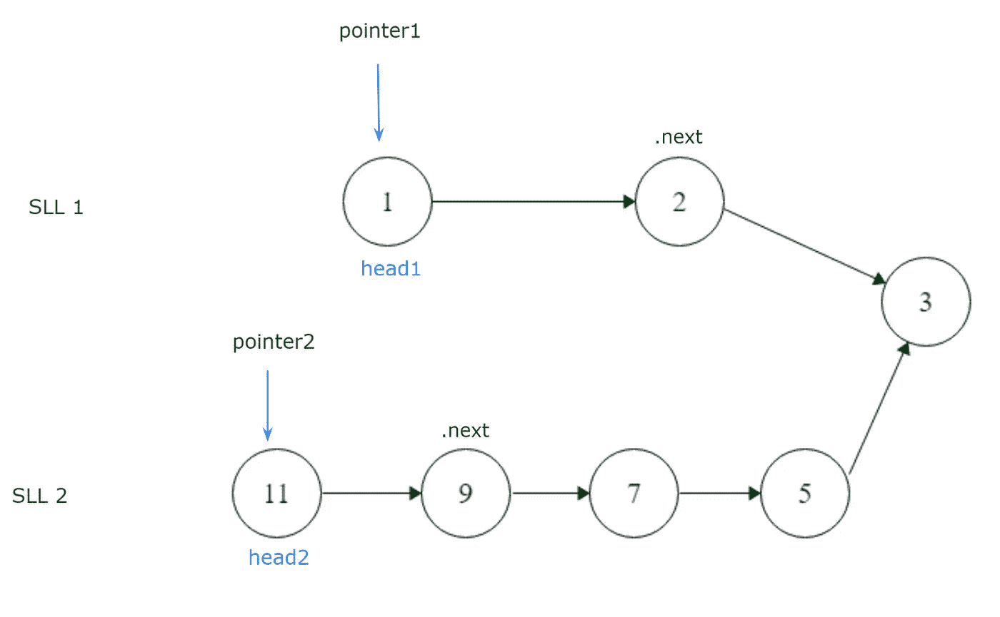

# 如何找到两个链表的合并点

> 原文：<https://levelup.gitconnected.com/how-to-find-the-merge-point-of-two-linked-lists-ba55a129caa2>


## 理解问题

我们得到了两个单链表，我们必须找到它们合并的点。

```
[SLL 1] **1**--->**3**--->**5**
                     \
                      **9**--->**12**--->**17**--->**None**
                     /
     [SLL 2] **7**--->**8**
```

上图说明合并发生在节点 9。

我们可以放心，给定的参数 head1 和 head2(两个列表的头)永远不会相等，也永远不会为零。这两个列表肯定会在某个时候合并。

我们需要一个计划来找到并返回两个列表合并的节点的整数数据值。

## 计划

为了遍历列表找到它们合并的点，我们需要设置两个不同的指针。一个用于第一个单链表，另一个用于第二个。请记住，我们将两者的头作为参数给出，因此我们将设置指向它们的指针，以便从每一个的开头开始。



```
pointer1 = head1
pointer2 = head2
```

要开始遍历列表，我们需要创建一个 while 循环，以便在列表不是 None 时遍历列表。

```
while not None:
```

如果在任何一点上，指针 1 和指针 2 相等，我们必须跳出 while 循环，因为我们已经找到了两个列表合并的节点。

```
if pointer1 == pointer2:
    break
```

但是，如果不相等，我们将通过利用. next 向前移动。



```
pointer1 = pointer1.next
pointer2 = pointer2.next
```

正如我们从示例图中看到的，我们的第一个单链表，SLL 1，比 SLL 2 短。所以让我们假设在 SLL 2 找到合并节点之前，SLL 1 没有命中。在这种情况下，我们将简单地重新开始，为 SLL 2 设置相同的 if 语句，以防我们的程序中有一个测试用例，其中第二个 SLL 较短。

```
if pointer1 == None:
    pointer1 == head1
if pointer2 == None:
    pointer2 == head1
```

这种重新开始的逻辑将在 while 循环中重复，直到两个指针同时找到合并节点，或者换句话说，直到指针 1 和指针 2 相等。当发生这种情况时，我们必须记住做要求我们做的事情，并返回该节点的整数数据值。

```
return pointer1.data
```

因为这也将是指针 2 的数据，所以我们可以返回它来代替指针 1。它具有相同的值。

```
return pointer2.data 
```

## 执行

```
# For our reference:
#
# SinglyLinkedListNode:
#     int data
#     SinglyLinkedListNode next
#
#def findMergeNode(head1, head2): # Set the pointers
    pointer1 = head1
    pointer2 = head2 while not None: # if we found the merging node, then break out of the loop
        if pointer1 == pointer2:
            break #traverse through lists
        pointer1 = pointer1.next
        pointer2= pointer2.next # Begin again if one was shorter than the other
        if pointer1 == None:
            pointer1 = head1
        if pointer2 == None:
            pointer2 = head2 return pointer1.data
```

# 分级编码

感谢您成为我们社区的一员！ [**订阅我们的 YouTube 频道**](https://www.youtube.com/channel/UC3v9kBR_ab4UHXXdknz8Fbg?sub_confirmation=1) 或者加入 [**Skilled.dev 编码面试课程**](https://skilled.dev/) 。

[](https://skilled.dev) [## 编写面试问题

### 掌握编码面试的过程

技术开发](https://skilled.dev)