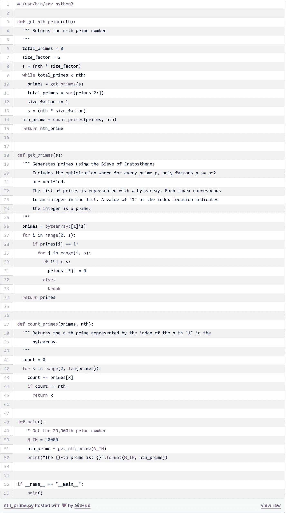

# 如何求第 n 个质数

> 原文：<https://levelup.gitconnected.com/how-to-find-the-nth-prime-number-c16dac27963>

厄拉多塞在亚历山大教学。Bernardo Strozzi /公共领域

当我第一次想到它时，我觉得它似乎更容易。但是，快速找到一个随机的质数并不简单。例如，第五个质数是 11，第二十个是 71。但是，第 50 个、第 600 个或第 20000 个质数呢？我想给你展示一个找到第 N 个质数的有效方法。我们将从一个被称为厄拉多塞[筛的旧算法中得到帮助。](https://en.wikipedia.org/wiki/Sieve_of_Eratosthenes)

质数是大于 1 的整数，能被 1 和它本身整除。所有非素数的整数都叫做合数。[算术基本定理](https://en.wikipedia.org/wiki/Fundamental_theorem_of_arithmetic)说，每个大于 1 的整数要么是素数，要么可以表示为素数的乘积。

确定一个数是否是质数的一个简单方法是通过*试除法:*将数 *n* 除以所有小于 *n 的整数，*如果找不到除 1 以外的整除因子，那么 *n* 就是质数。您可以看到随着 *n* 的值增加，这是如何变得耗时的。50275 是质数吗？

有更好的方法来产生质数。这些方法产生一系列给定极限的素数。对*试分工*的一个改进是以**为例进行车轮因式分解。还有一套叫做[筛](https://en.wikipedia.org/wiki/Sieve_theory)的技术，包括阿特金筛和孙达拉姆筛。但是，其中最著名的是厄拉多塞的筛子。可能是因为它已经存在了很长时间——一位叫做[昔兰尼的厄拉多塞](https://en.wikipedia.org/wiki/Eratosthenes)的希腊数学家在公元前 200 年左右创造了这个算法。**

# **什么是厄拉多塞的筛子，它是如何工作的？**

**厄拉多塞筛是一种有效的算法来产生素数直到一个给定的限制。为了了解它的工作原理，我们来看一个例子。我们想找出所有小于 13 的质数。**

**最初，我们有一个包含从 2 到 13 的所有整数的列表——根据定义，1 不是质数，所以我们丢弃它。然后从 2 开始，我们开始划掉(筛选)所有小于 13 的 2 的倍数。一个质数的任何倍数都不可能是质数——它会有两个以上的除数，使它失去质数的资格。我们从列表中删除了所有这些。然后我们检查列表，找到下一个可用的数字，也就是 3——这是下一个质数。我们重复这个过程，消除所有 3 的倍数。这一直持续到列表中不再有可用的号码。最终，我们将消除所有的合数，只剩下质数。**

**让我们来说明这个过程，我们从 2 到 13 的整数列表开始:**

****

****步骤 1)** 取第一个素数 *p* = 2，划掉列表中它的所有倍数，2×2 = 4，2×3，= 6，2×4 = 8，等等:**

****

****步骤 2)** 找出下一个可用的数字，划掉它的所有倍数。下一个是 *p* = 3，所以我们划掉它的倍数 3×2 = 6，3×3 = 9，3×4 = 12(注意 6 和 12 已经划掉了):**

****

****步骤 3)** 用下一个可用的数字继续这个过程， *p* = 5。唯一小于 13 的 5 的倍数是 5×2 = 10，这在前面的步骤中被划掉了。所以，我们继续。**

**列表中的下一个数字是 7，但是 7 的第一个倍数(7×2 = 14)大于我们的限制 13。任何大于 7 的数都会产生大于 13 的倍数，所以我们完成了。列表中剩余的数字都是 13:**

****

# **优化流程**

**在上一个练习中，我们重复了一些工作。例如，我们不止一次划掉了几个因素。我们可以通过认识到对于每个质数 *p* ，我们只需要检查大于或等于 *p* 的 *p* 的因子来优化算法。这是因为小于 *p* 的 *p* 的所有因子都被前面的更小的素数划掉了。这将让我们一找到素数 *p* 就终止算法，其中 *p* 大于我们列表的大小。**

**为了说明这一点，让我们按照与前面相同的例子。但是，这次我们将列表增加到 23 个。在步骤 1 之后，我们有:**

****

**注意 2 的所有因子都被划掉了。使用我们的启发式方法，我们应该只检查大于或等于 3 = 9 的因子 3。所以，我们划掉 9，12，15，18 和 21:**

****

**列表中的下一个素数是 5，但是由于 5 = 25 大于 23，我们结束这个过程:**

****

**剩下的列表包含了 23 以内的所有素数。**

**请注意，我们仍然不止一次划掉了一些因素。然而，我们在 *p* = 5 时停止了这个过程。因此，即使我们将列表增加了 10 个——从 13 个增加到 23 个——我们还是做了和上一个例子一样多的工作。这是一个很小的改进，但是随着我们增加列表的大小，它变得很重要。**

# **用厄拉多塞筛求第 n 个质数**

**回到我们的问题，我们现在利用厄拉多塞的筛子来寻找第 N 个*素数。正如我上面所描述的，算法找到了所有的素数，直到一个给定的极限。然而，在这种情况下，我们没有预定义的限制。这是因为我们不知道我们需要多大的列表来包含我们的第 N 个素数*。[素数定理](https://en.wikipedia.org/wiki/Prime_number_theorem)说有大约 *n / log(n)* 个素数小于 *n* 。但是，[一个素数和下一个素数之间的差距](https://primes.utm.edu/notes/gaps.html)变得任意大。****

由于这个限制，我们将遵循一个迭代过程。首先，我们为列表选择一个初始大小。我们知道它必须至少大于我们的目标质数 *n* 。例如，我们选择大小 *s = 2n* 。然后我们生成小于 *s* 的所有素数(使用厄拉多塞的筛子)。最后，我们计算列表中有多少个素数。如果素数的数量小于 *n* ，我们进行下一次迭代，将列表的大小增加 n。当我们找到 *n* 或更多素数*时，迭代停止。*第 *N* 个质数将是移除所有组合后列表中第 *N* 个位置的数字。

# 用 Python 实现算法

下面的 python 代码实现了这种策略来寻找第 *N* 个素数。它包括厄拉多塞筛的优化版本。为了方便起见，我使用一个字节数组来表示我们的整数列表。每个元素的索引对应于列表中的整数值。字节数组中的所有元素都被初始化为 1。

我们通过在相应的索引处将元素从 1 切换到 0 来“划掉”因子。例如，如果我们想要删除因子 4，我们切换索引 4 处的元素。划掉所有因素后，由于我们没有从列表中删除它们，我们需要计数所有的 1，直到找到第 *N* 个 1。我们返回这个元素的索引，它是我们的第 N 个质数。

# 计算的复杂性

我们上面的代码反复执行`get_primes()`函数(厄拉多塞筛),直到我们找到 *n* (或更多)个质数。在每次迭代中，我们增加字节数组的大小。迭代的总次数由变量`size_factor`决定，该变量随着 *n* 的值而增长。最后，我们遍历*字节数组*计数 1，直到我们找到第 *N* 个 1。让我们分别分析这三个函数的运行时。

再看函数`get_nth_prime()`，迭代次数由变量`size_factor - 1`决定(姑且称这个值为 *s* )。那么工作量——使用渐近符号——是 *O(s)* 。

接下来，`count_primes()`函数遍历*字节数组*计数 1，它以线性时间运行，由 *n*s 决定*运行时间为 *O(n*s)* ，其中*n = n，*我们的目标素数。

`get_primes()`函数实现厄拉多塞的筛选。这个算法的运行时间是 *O(N log log N)，*其中 *N* 是链表的大小。为了得出这个结果，考虑一下在划掉每个素数的因子后，列表的大小会发生什么变化。一个好的近似值如下。我们从尺寸 *N* 开始。划掉第一个素数 2 的所有因子后，大小就变成了 *N/2* 。划掉 3 的因子后，大小将为 *N/3* 。这一直持续到尺寸减小到 *N/N = 1* 。我们可以这样表达: *N*(1 + 1/2 + 1/3 + 1/5 +...+ 1/N)* 。注意括号内的表达式是一个[调和质数级数](https://mathworld.wolfram.com/HarmonicSeriesofPrimes.html) *，*表示为 *:*

其中 *p* 是质数 *N* 是我们列表的大小。它有一个渐近下界 *log log N* 。因此，运行时间——包括圆括号外的因子*N*——为 *O(N log log N)* 。

综合三个函数的运行时间，记住我们的 *bytearray* 的大小是 *n*s* ，我们得到总运行时间，*O(s)* O(n * s log log(n * s))+O(n * s)*。这变成了:

*O(s *n log log(n*s))*

在测试程序时，我注意到 *s* 与 *n.* 相比增长缓慢， *s* 的值从 12(用 *n = 20，000)* 增加到 16(用 *n = 1，000，000)。*

最后，内存开销来自于*字节数组*的大小，所以空间复杂度为:

*O(n*s)*

# 这到底有什么用？

现在你可能会想，这些怎么会有用呢？让我给你举几个例子。质数在散列法中很重要——这是计算机科学中的一个基本概念。从数据结构和算法到加密，哈希在许多领域都很有用。

另一个例子是密码学——这是一项每天都在使用的安全数据通信的关键技术。网上银行和购物交易是安全数据通信的例子。

就像我一开始觉得找一个随机的质数是非常容易的，乍一看我们可能看不出来，但是仔细看，数学无处不在。

*原载于 2020 年 5 月 24 日 https://stemhash.com***。**