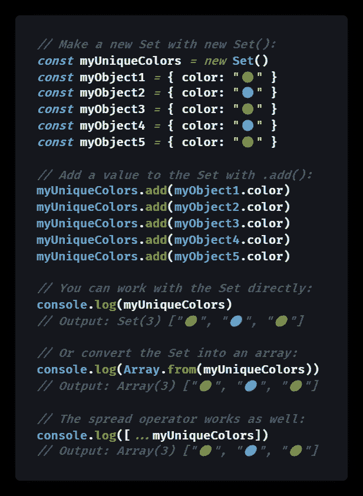
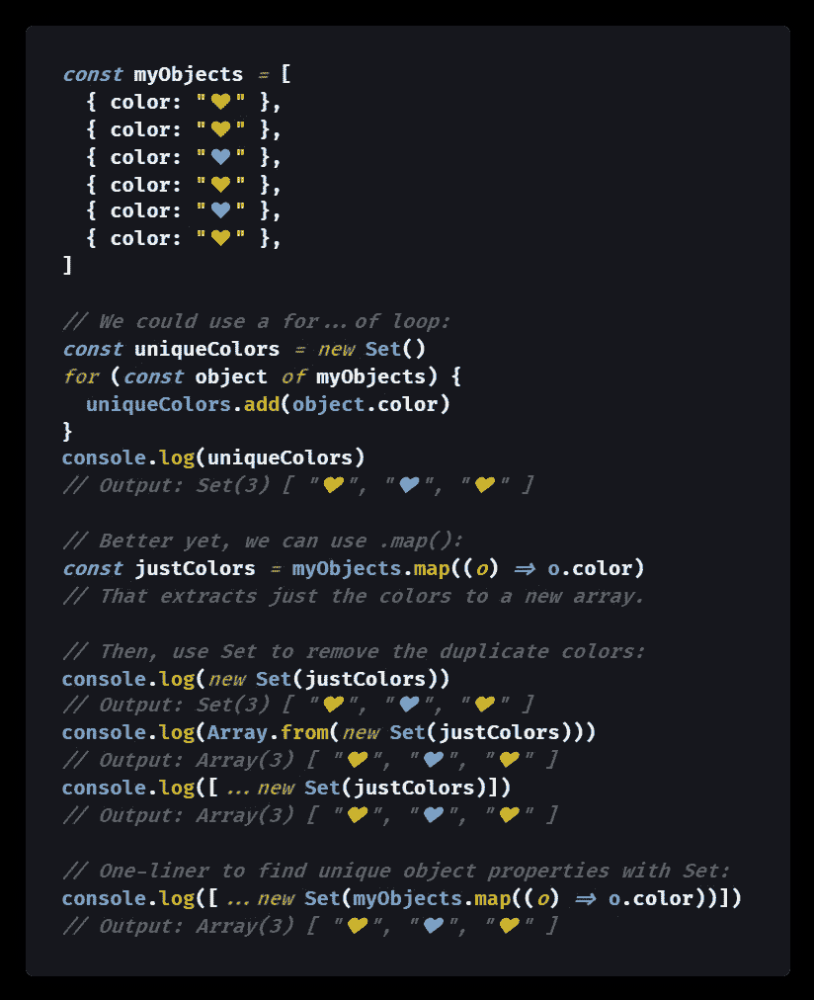
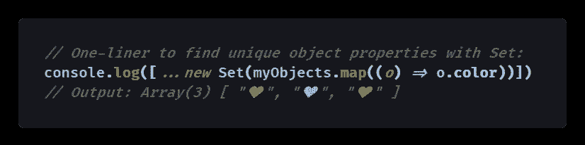

# 如何在 JavaScript 中通过属性在对象数组中找到唯一值

> 原文：<https://levelup.gitconnected.com/how-to-find-unique-values-by-property-in-an-array-of-objects-in-javascript-50ca23db8ccc>

## 在这个简短的教程中，让我们在一个数组中的所有 JavaScript 对象中找出给定属性的不同值。

Pierre Bamin 在 [Unsplash](https://unsplash.com?utm_source=medium&utm_medium=referral) 上拍摄的照片

# 数组中属性的 JavaScript 唯一值

ES6 对象类型`[Set](https://medium.com/coding-at-dawn/how-to-use-set-to-filter-unique-items-in-javascript-es6-196c55ce924b)`只接受添加到其中的每个[原始值](https://developer.mozilla.org/en-US/docs/Glossary/Primitive)的一个副本，因此它用于在 JavaScript 中查找唯一值。

然而，如何使用`Set`在 JavaScript 数组包含的所有对象中找到给定属性的唯一值并不明显。

例如，您可能有一个`orders`数组，您希望从中检索下订单的人的唯一电子邮件地址。

因此，对于每个`order`，您需要保存`email`属性，但是您不希望任何重复的电子邮件出现在您保存的列表中。

幸运的是，`Set`可以很容易地处理这种情况，正如我们将在本教程中看到的在一个对象数组中查找唯一的属性值。

# 将`Set`用于独特的对象属性

当你使用一个`Set`时，你可以给它输入任意值，而`Set`会自动删除任何重复的值。

假设您想在几个 JavaScript 对象中找到某个属性的所有可能值。您可以使用`Set`通过使用`.add()` ( `[Set.prototype.add()](https://developer.mozilla.org/en-US/docs/Web/JavaScript/Reference/Global_Objects/Set/add)`)方法将每个值添加到`Set`中来过滤掉重复的值。

下面是一个代码示例:

[查看原始代码](https://gist.github.com/DoctorDerek/a6e03ee640ddf8808eed13f74a511a5b)作为 GitHub 要点

一旦你有了一个`Set`，你可以用`[Array.from()](/how-to-copy-an-array-in-javascript-with-array-from-298c7e66eebc)`或者等价地通过使用带方括号`[]`的`...` [扩展操作符](https://medium.com/coding-at-dawn/how-to-use-the-spread-operator-in-javascript-b9e4a8b06fab)把它变回一个数组。

正如我们接下来将看到的，您可以在整个对象数组的循环中以编程方式实现这一点，一次删除所有重复的属性值。

# 对象中给定特性的唯一值

基于上面的例子，您可以使用带有`.add()`的`[for...of](https://developer.mozilla.org/en-US/docs/Web/JavaScript/Reference/Statements/for...of)`循环，以便在一个数组中的所有对象中找到唯一的属性值。

更好的是，您可以使用`.map()` ( `[Array.prototype.map()](https://developer.mozilla.org/en-US/docs/Web/JavaScript/Reference/Global_Objects/Array/map)`)创建一个新的数组，只包含 objects 数组中所需的属性。然后，您可以将`[Set()](https://developer.mozilla.org/en-US/docs/Web/JavaScript/Reference/Global_Objects/Set/Set)`[构造函数](https://developer.mozilla.org/en-US/docs/Web/JavaScript/Reference/Global_Objects/Set/Set)直接应用于提取的属性数组。

这里有一个代码示例显示了`for...of`和`.map()`:

[查看原始代码](https://gist.github.com/DoctorDerek/a29e3ddd3fad6838959e18c18f118c3f)作为 GitHub 要点

你喜欢用`Set`查找独特对象属性的**一行程序**吗？

[查看原始代码](https://gist.github.com/DoctorDerek/6bfb4abe5f9fe53315ad0bae0a38bea4)作为 GitHub 要点

为了有效地使用`.map()`来查找对象属性的唯一值，您将每个对象映射到一个新的数组中，该数组只包含该目标属性。然后，`Set`负责查找为该属性提取的唯一值。

# 结论

综上所述，使用`Set`是解决在数组中寻找给定对象属性的不同值的正确方法。

有两种方法可以使用`Set`找到对象属性的唯一值:

1.  使用`.add()` ( `Set.prototype.push()`)方法，其工作方式类似于数组的`.push()` ( `Array.prototype.push()`)方法。
2.  使用`Set`构造函数(`new Set()`)，可以直接接受数组，包括`.map()` ( `Array.prototype.map()`)生成的数组。

关于`Set`的复杂性的细节，包括它如何处理像`[NaN](https://medium.com/coding-in-simple-english/how-to-check-for-nan-in-javascript-4294e555b447)`和`[-0](https://medium.com/coding-at-dawn/is-negative-zero-0-a-number-in-javascript-c62739f80114)`这样的边缘情况，其方式更类似于`[Object.is()](https://medium.com/coding-at-dawn/es6-object-is-vs-in-javascript-7ce873064719)`而不是[严格相等运算符](https://medium.com/better-programming/making-sense-of-vs-in-javascript-f9dbbc6352e3) `[===](https://medium.com/better-programming/making-sense-of-vs-in-javascript-f9dbbc6352e3)`，请务必参考我的完整的[使用](https://medium.com/coding-at-dawn/how-to-use-set-to-filter-unique-items-in-javascript-es6-196c55ce924b) `[Set](https://medium.com/coding-at-dawn/how-to-use-set-to-filter-unique-items-in-javascript-es6-196c55ce924b)`指南:

 [## 如何使用 Set 来过滤 JavaScript ES6 中的唯一项

### JavaScript 中需要唯一值？这就是 Set 对象出现的原因。以下是如何使用 Set 来过滤一个列表…

medium.com](https://medium.com/coding-at-dawn/how-to-use-set-to-filter-unique-items-in-javascript-es6-196c55ce924b) 

**快乐编码！**🤝💸🎧💙🎓

德里克·奥斯汀博士是《职业编程:如何在 6 个月内成为一名成功的 6 位数程序员 》一书的作者，该书现已在亚马逊上架。