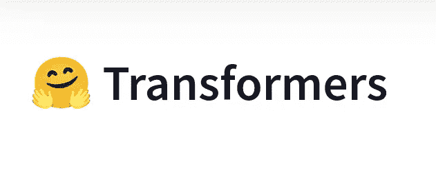
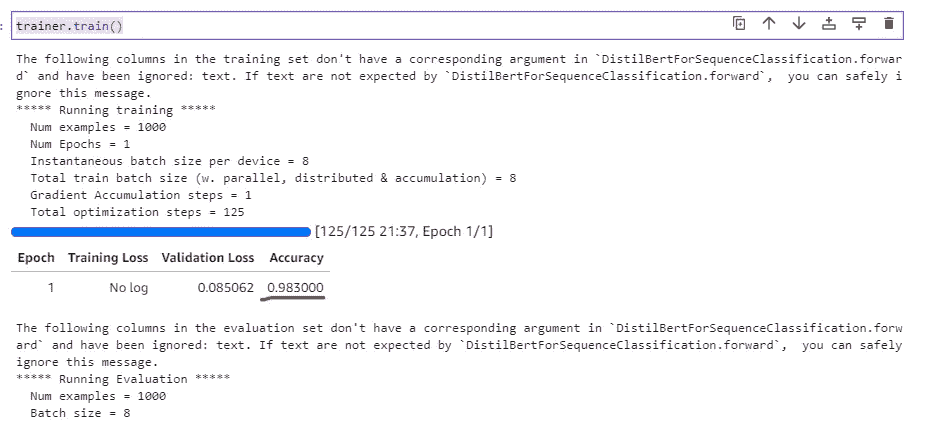

# 如何使用 Transformers 和 HuggingFace 微调 NLP 分类模型

> 原文：<https://levelup.gitconnected.com/how-to-fine-tune-an-nlp-classification-model-with-transformers-and-huggingface-1a2c0ea79c2>

## 如何使用转换器构建自定义 NLP 分类模型的终极指南



本教程是关于如何使用 transformers 训练您的自定义 NLP 分类模型的终极指南，从预训练的模型开始，然后使用迁移学习对其进行微调。我们将与名为“变形金刚”的 HuggingFace 库合作。

# 分类模型

出于展示的目的，我们将建立一个分类模型，试图预测一封电子邮件是“火腿”还是“垃圾邮件”。在另一个教程中，我们使用 Scikit-Learn 和 TF-IDF 构建了一个[垃圾邮件检测器](https://predictivehacks.com/example-of-a-machine-learning-algorithm-to-predict-spam-emails-in-pyth)。为了获得数据并比较这两种不同的方法，请随意查看教程。

对于本教程，我们将与免费的**亚马逊 SageMaker 工作室实验室**合作。或者，你可以和 **Colab** 或者当地合作。本教程是可重复的，因此您可以跟着编写代码。

## 安装所需的库

对于本教程，您可以下载以下库:

```
!pip install transformers
!pip install datasets
!pip install numpy
!pip install pandas
```

## 加载数据

假设您将训练和测试数据集存储为 CSV 文件。让我们看看如何将它们作为数据集加载。请注意，HuggingFace 要求数据作为数据集字典

```
import datasets
from datasets import load_dataset, load_from_diskdataset = load_dataset('csv', data_files={'train': 'train_spam.csv', 'test': 'test_spam.csv'})dataset
```

输出:

```
DatasetDict({
    train: Dataset({
        features: ['text', 'label'],
        num_rows: 3900
    })
    test: Dataset({
        features: ['text', 'label'],
        num_rows: 1672
    })
})
```

## 微调模型

请记住"**目标**"变量应该称为"**标签**"并且应该是数字。在这个数据集中，我们处理的是一个二元问题，0 (Ham)或者 1 (Spam)。因此，我们将从“**基于蒸馏的**”开始，然后对其进行微调。首先，我们将加载分词器。

```
from transformers import AutoTokenizertokenizer = AutoTokenizer.from_pretrained("distilbert-base-cased")def tokenize_function(examples):
    return tokenizer(examples["text"], padding="max_length", truncation=True)tokenized_datasets = dataset.map(tokenize_function, batched=True)
```

输出:

```
Loading cached processed dataset at ham_spam_dataset/train/cache-3a436b86c79a53fe.arrow
Loading cached processed dataset at ham_spam_dataset/test/cache-9524e6b19881902e.arrow
```

然后，我们将加载序列分类的模型。

```
from transformers import AutoModelForSequenceClassification
checkpoint = "distilbert-base-cased"
model = AutoModelForSequenceClassification.from_pretrained(checkpoint, num_labels=2)
```

注意，我们设置了 **"num_labels=2"** 。如果你正在处理更多的类，你必须相应地调整数量。

由于我们想要报告模型的准确性，我们可以添加以下函数。

```
import numpy as np
from datasets import load_metricmetric = load_metric("accuracy")def compute_metrics(eval_pred):
    logits, labels = eval_pred
    predictions = np.argmax(logits, axis=-1)
    return metric.compute(predictions=predictions, references=labels)
```

## 训练模型

现在，我们准备训练模型。我们将只训练一个纪元，但可以随意添加更多。我建议三到五个。在培训师那里，你有很多争论的选择。我们保留默认值，但是我鼓励你看一下文档，因为很多时候实验像批量大小、学习速率等参数是很重要的。

```
from transformers import TrainingArguments, Trainertraining_args = TrainingArguments(output_dir="test_trainer", evaluation_strategy="epoch", num_train_epochs=1) trainer = Trainer(
    model=model,
    args=training_args,
    train_dataset=tokenized_datasets["train"],
    eval_dataset=tokenized_datasets["test"],
    compute_metrics=compute_metrics,
)trainer.train()
```



我们可以看到，模型运行了一个历元，准确率为 **98.3%！**

# 保存模型

我建议将模型和标记器保存在同一个路径下，以便同时加载它们。请记住，在我们的例子中，我们没有微调标记器。

```
model.save_pretrained("CustomModels/CustomHamSpam")# alternatively save the trainer
# trainer.save_model("CustomModels/CustomHamSpam")tokenizer.save_pretrained("CustomModels/CustomHamSpam")
```

这是我们的模型:


# 加载模型

我们可以如下加载模型和标记器。

```
# load the model
from transformers import AutoModelForSequenceClassificationload_model = AutoModelForSequenceClassification.from_pretrained("CustomModels/CustomHamSpam")load_tokenizer = AutoTokenizer.from_pretrained("CustomModels/CustomHamSpam")
```

# 做预测

我们可以使用`TextClassificationPipeline`进行预测。让我们看看这封电子邮件是一个火腿或垃圾邮件:

> XXXMobileMovieClub:要使用您的点数，请单击下一条 txt 消息中的 WAP 链接或单击此处> > [http://wap。【xxxmobilemovieclub.com】T2？n=QJKGIGHJJGCBL](http://wap.)

```
model = load_model
tokenizer = load_tokenizer
pipe = TextClassificationPipeline(model=model, tokenizer=tokenizer, return_all_scores=True)
# outputs a list of dicts 
pipe("XXXMobileMovieClub: To use your credit, click the WAP link in the next txt message or click here>> [http://wap.](http://wap.) xxxmobilemovieclub.com?n=QJKGIGHJJGCBL")
```

输出:

```
[[{'label': 'LABEL_0', 'score': 0.009705818258225918},
  {'label': 'LABEL_1', 'score': 0.9902942180633545}]]
```

我们也可以使用管道，如下所示:

```
from transformers import pipelinemy_pipeline  = pipeline("text-classification", model=load_model, tokenizer=load_tokenizer)data = ["I love you", "XXXMobileMovieClub: To use your credit, click the WAP link in the next txt message or click here>> [http://wap.](http://wap.) xxxmobilemovieclub.com?n=QJKGIGHJJGCBL"]my_pipeline(data)
```

输出:

```
[{'label': 'LABEL_0', 'score': 0.9980890154838562},
 {'label': 'LABEL_1', 'score': 0.9902942180633545}]
```

我们可以看到，电子邮件“我爱你”被标记为 0(即火腿)，我们之前看到的第二封被标记为 1(即垃圾邮件)。

[](https://jorgepit-14189.medium.com/membership) [## 用我的推荐链接加入媒体-乔治皮皮斯

### 阅读乔治·皮皮斯(以及媒体上成千上万的其他作家)的每一个故事。您的会员费直接支持…

jorgepit-14189.medium.com](https://jorgepit-14189.medium.com/membership) 

最初由[预测黑客](https://predictivehacks.com/how-to-fine-tuned-an-nlp-classification-model-with-transformers-and-huggingface/)发布