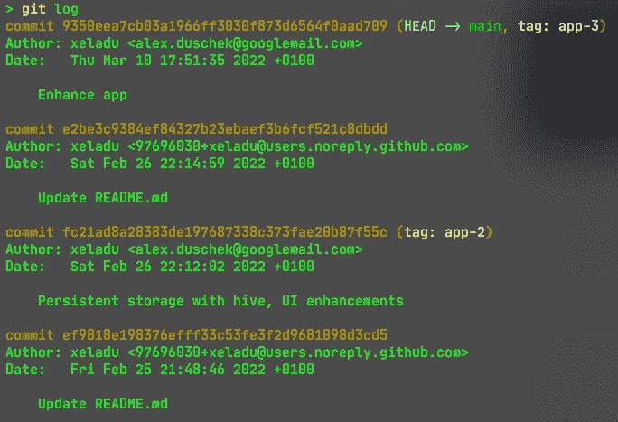

# 如何在 git 合并或 git 重置后修复一个损坏的分支

> 原文：<https://levelup.gitconnected.com/how-to-fix-a-broken-branch-after-a-git-merge-or-git-rebase-4ca61c0cb6fd>

## 解决常见的 git 问题

## 本指南向您展示了如何使用断开分支的原始更改来创建新分支。

[扬西·敏](https://unsplash.com/@yancymin?utm_source=medium&utm_medium=referral)在 [Unsplash](https://unsplash.com?utm_source=medium&utm_medium=referral) 上的照片

在 git 这样的版本控制系统中，合并或重定分支的问题可能会发生在任何人身上。我想向您展示一种非常有效的解决问题的方法。当然，也有其他方法，如恢复 rebase 并重新进行，但我更喜欢这种方法。

## 相关 git 命令

git 精选
[git 日志](https://git-scm.com/docs/git-log)
[git 结帐](https://git-scm.com/docs/git-checkout)
[git 分支](https://git-scm.com/docs/git-branch)

## 1 从合并/重定基础目标创建一个新分支

让我们假设您想要将 ***main*** 分支重置到您的 ***dev*** 分支上，并且由于应用程序不再启动而出现了问题。

所以你从 ***主*** 分支中创建一个新分支 ***dev2*** 作为第一步。这意味着您已经在您的分支中拥有了来自 ***main*** 的所有最新变更，并且您不再需要重设基础。

## 2 将中断分支的更改应用到新分支

下一步是应用你从 ***dev*** 到 ***dev2*** 的所有更改。切换到您的 ***dev2*** 分支，用`git cherry-pick <id>`命令获得所有提交。

要找到提交 id，可以使用 ***dev*** 分支上的`git log`命令(见下图)。按时间顺序应用更改。最后，您拥有了一个包含所有变更以及 rebase 源代码变更的分支。

带有提交 id 的 Git 日志

## 3 推新枝

最后推 ***dev2*** 分支。您可能需要设置上游，但是 git 会帮助您完成这项工作。

## 4 删除断裂的分支

原来的 ***dev*** 分支现在已经没用了。您可以在本地存储库中以及远程存储库中删除它。

## 结论

我向您展示了一个策略，通过用一个正常工作的分支替换一个断裂的分支来解决问题。这是一个简单明了的方法，将来可能会对你有所帮助。

如果你喜欢这篇文章，我会很高兴得到掌声👏(你知道可以拍几次吗？😎)另外，如果你还没有跟上我，我也很感激。

🌲|☕ [咖啡](https://www.buymeacoffee.com/xeladu)🎁[捐赠](https://www.paypal.com/donate/?hosted_button_id=JPWK39GGPAAFQ) |💻 [GitHub](https://github.com/xeladu) 🔔[订阅](https://xeladu.medium.com/subscribe)

顺便说一句:如果你还没有 Medium 会员，我推荐你使用[│我的推荐链接◀](https://medium.com/@xeladu/membership) ，因为它会让你访问 Medium 上的所有内容，并以一小部分费用支持我，而不会为你带来任何额外的费用。谢谢大家！✨

## 相关故事

 [## 让你对人性失去信心的代码示例

### 在本文中，我想展示一些我多年来收集的代码“瑰宝”。所有的例子都来自生命…

levelup.gitconnected.com](/code-examples-that-will-make-you-lose-faith-in-humanity-a2a36ea9d331)  [## 如何在终端中自定义命令提示符和图标

### 你使用终端吗？你厌倦了枯燥的命令提示符吗？看完这个教程你就不会了！

levelup.gitconnected.com](/how-to-customize-your-command-prompt-and-icons-in-your-terminal-f88ea15a5d58)  [## 如何使用 winget 安装、更新和删除您的 Windows 应用程序

### 如何用 Windows 包管理器(winget)安装应用程序，如何保持应用程序更新，以及如何使用…

xeladu.medium.com](https://xeladu.medium.com/app-management-with-winget-on-windows-e668086a03f7)