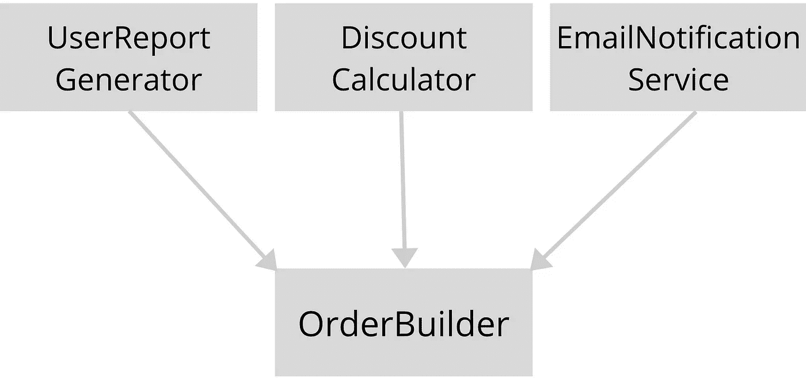

# 如何在不破坏应用程序的情况下修复 Bug

> 原文：<https://levelup.gitconnected.com/how-to-fix-bugs-and-not-introduce-new-ones-9f35e625673a>

## 更改源代码时更自信的步骤。


塞巴斯蒂安·赫尔曼在 [Unsplash](https://unsplash.com?utm_source=medium&utm_medium=referral) 上的照片

修复一个 bug 并在十个不同的地方破坏大型应用程序是相当容易的。每个人都明白，由于软件的高度复杂性，不可能避免这种情况。然而，您可以通过使用我在日常开发活动中通常遵循的步骤来最小化回归问题的机会。

# 在修复 Bug 之前

在我看来，软件开发人员在“前”阶段投入的时间越多，他或她就越有经验。通常，初级开发人员在阅读完错误描述后就开始编码，而高级开发人员则遵循以下步骤:

## 传出依赖性分析

几乎所有的对象，除了简单的或低级的对象，都有外发的依赖关系——通过构造函数、属性、方法或静态类注入的其他对象。

```
public class OrderBuilder
{
    public OrderBuilder(IPriceCalculator priceCalculator)
    {
       ...
    }
}
```

*IPriceCalculator 接口是 OrderBuilder 类的传出依赖项。*

在对任何类进行更改之前，您应该检查它的输出依赖项。我所说的“检查”是指至少理解每个输出依赖项的接口，而不涉及实现细节。

传出依赖关系会影响包含它们的类的行为。因此，检查输出依赖对于清楚地理解该类的行为是很重要的。仅仅通过分析类本身，而忽略它的外部依赖关系，你不会清楚地理解类的行为。

**显式依赖与隐式依赖**

传出依赖关系可以是显式的，也可以是隐式的。显式依赖项被注入到类构造函数中，因此只需查看构造函数定义就可以在几秒钟内找到它们。然而，一个类可以有隐式的输出依赖——静态类。

```
public class OrderBuilder
{
    public OrderBuilder()
    { } public void BuildOrder()
    {
        // 100 lines of some logic, then:        decimal price = **PriceCalculator**.CalculatePrice();

        //next 100 lines of code
    }
}
```

*PriceCalculator 是 OrderBuilder 类的输出隐式依赖项。*

传出隐式依赖的问题是，您无法快速找到它们，因为它们不存在于类构造函数中。隐式依赖可以出现在类的任何一行，这使得当类很大时很难找到它们。

应该找到并检查所有隐式依赖，因为它们像显式依赖一样影响类的行为。这个练习可能需要你仔细检查这个类的所有行，或者运行一个静态代码分析工具。要检查的度量被称为**输出依赖关系**或**输出依赖关系**，这取决于所使用的工具。

## 探索可用的单元测试

单元测试的目的不仅仅是检查功能是否按预期运行。单元测试是作为文档的，所以探索它们将帮助你更好地理解代码是如何工作的。

如果单元测试有这样的自描述性命名:

```
UserRepository_NotExistingUserId_UserNotFoundExceptionThrownOROrderWithThePastDateShouldBeConsideredInvalid
```

仅仅浏览它们的名字就足够了，而不必深入单元测试实现的细节。

理想情况下，您应该首先检查单元测试，然后像 TDD 方法一样继续检查代码本身。

## 传入依赖项分析

传入依赖项的数量告诉开发人员该类被应用程序中的其他类使用了多少。



OrderBuilder 类有 3 个传入依赖项

传入依赖性分析有助于您确定影响范围。换句话说，即将到来的变化可能会破坏系统中的多少其他功能。

每个 IDE 都有类似于*“Find All References”*的命令，可以帮助快速找到应用程序中某个类或方法的使用位置。

一旦收集了引入依赖项的列表，尝试找出它们与什么功能相关。例如，从上图中，我们可以看到，更改 OrderBuilder 类会影响与用户报告生成、折扣计算和电子邮件相关的功能。

一旦您知道哪些功能面临风险，请执行以下操作:

*   确保项目中有适当的集成测试。
*   如果不存在集成测试，考虑编写集成测试。
*   与 QA 团队共享回归列表，这样他们就知道在部署修复后要检查什么(将列表放在 bug 的吉拉标签中)。

这些行动将帮助团队快速找到可能的回归问题，并且不让它们进入生产。

# **修复 Bug**

在前一阶段花费的时间越多，在当前阶段投入的精力就越少。

## 编写单元测试

即使项目的业务逻辑有 100%的单元测试覆盖率，仍然会有错误。这是可以的，因为编写单元测试是一个持续的过程。总有改进的余地。

作为一名软件开发人员，你应该**在每次发现新的 bug 时修改单元测试**。也许在测试用例实现中有一个问题或者测试用例丢失了。或者甚至对于功能的某些部分根本没有单元测试。

尝试找出为什么所有的单元测试都是绿色的，即使业务逻辑中有一个 bug。那么遗漏的单元测试就应该写出来，这样同样的 bug 就不会再出现了。

**特性测试**

当使用旧的遗留系统时，并不总是能够为需要改变的代码编写单元测试。只有当代码的行为在需求方面是清晰的，软件开发人员才能编写单元测试。

遗留系统可能包含神秘的业务逻辑:没有人知道它为什么以这种方式编写。这可能是因为逻辑是很多年前由另一个团队编写的，文档丢失了，没有一个涉众足够了解系统，等等。这使得不可能编写单元测试，因为开发人员需要知道系统的正确行为。但是没有需求，只知道实际行为，不一定正确。

在这种情况下，软件开发人员可以编写特性测试来代替单元测试。表征测试类似于单元测试，但是它们的目的是捕获代码的实际行为，而不是预期的行为。

在《与遗留代码有效工作》一书中描述了特性测试。我强烈推荐您阅读它，即使您根本没有在处理遗留系统。

## 处理

如果你已经仔细完成了上面的所有步骤，你就已经非常清楚如何修复这个 bug 了。我能给出的唯一建议是关于大的改变。如果您有大量代码需要修改，可以考虑将工作分成更小的逻辑块。在应用每个块之后，运行您的单元测试。仅当单元测试为绿色时，才应用新的更改块。

这种渐进的方法可以让你在出错时后退一小步，而不是从头开始。

# 修复错误后

一旦改变完成，你应该确保至少快乐的道路不会被打破。您肯定不能也不应该用边缘案例重新测试所有场景，但是至少要确保:

*   在本地运行单元、集成和其他测试，以确保它们仍然是绿色的。
*   如果项目中没有集成测试，则对与您的变更相关的所有功能执行手动快乐路径冒烟测试。

冒烟测试后，创建一个拉动请求，并尝试找到最佳人选来审查您的更改。

一旦变更被批准，您就可以将修复合并到主分支中，并将票证移动到 QA。

# 结论

尽管做了我描述的所有事情，我仍然有回归问题。但我知道他们的数量没有想象中的多。我知道在合并我的改变后，我可以平静地睡觉，因为我已经尽力了。

# 更多关于可维护性的故事

[](https://medium.com/codex/technical-debt-management-best-practices-for-software-engineers-871a315ac812) [## 软件工程师的技术债务管理最佳实践

### 技术债务率=应该返工的代码行数/现有源代码行数* 100%

medium.com](https://medium.com/codex/technical-debt-management-best-practices-for-software-engineers-871a315ac812) [](https://medium.com/codex/when-code-quality-metrics-can-be-of-real-value-to-software-engineers-7fc2de96afc4) [## 充分利用代码质量度量

### 在软件工程中充分利用圈复杂度、可维护性指数、单元测试覆盖率和其他度量

medium.com](https://medium.com/codex/when-code-quality-metrics-can-be-of-real-value-to-software-engineers-7fc2de96afc4)