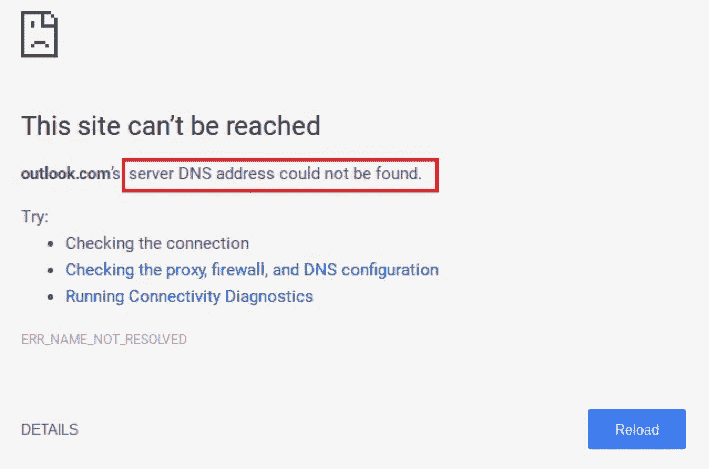
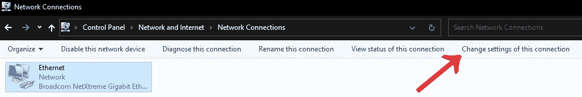
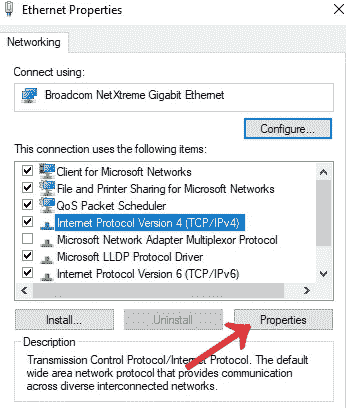
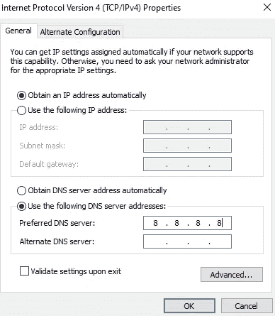

# 如何修复 DNS 服务器没有响应

> 原文：<https://levelup.gitconnected.com/how-to-fix-dns-server-not-responding-636a01352c9a>

我很确定我们大多数人在使用互联网的时候至少遇到过一次这个错误。发生这种情况有多种原因，有时路由器可能需要重启。但是，让我们看看如果问题继续存在，您可以如何尝试修复它。

DNS 是一种服务器，它可以找到网站的 IP 地址，并对其进行转换，以便您的浏览器可以读取。如果地址过期或服务器有问题，您将会遇到 DNS 错误，即使可以访问互联网，也无法连接到特定的站点或站点组。

1.  ***排查互联网问题*** 。确保您的路由器或互联网提供商没有出现问题。你需要弄清楚是不是这样；用你的手机加入你的网络，如果你不能上网，你发现问题出在 ISP，你应该打电话给他们。您也可以尝试使用不同的浏览器进行连接。
2.  ***重启你的网络调制解调器*** 。这将清除路由器的缓存并刷新 DNS 错误。这很简单，只要把插头从插座中拔出，等待至少 30 秒，然后再插回去。
3.  ***通过以太网*** 连接。实际情况是，如果您在插入以太网电缆后可以连接到网页，则问题可能出在您的路由器上，您可能需要重置它。
4.  ***刷新 DNS*** 。这是一个你可以在电脑上完成的过程。
    打开开始按钮。
    CMD 类型。
    输入 ipconfig /flushdns
    回车，重启浏览器。

## 编辑 DNS 服务器。

这更像是孤注一掷，但以下是如何做到这一点。

1.  在“设置”的“连接”页面中，单击您当前的连接名称。
2.  选择后，单击出现在左上角的“更改此连接的设置”按钮。

选择后，单击出现在左上角的“更改此连接的设置”按钮。

3.单击“互联网协议版本 4 (TCP/IPv4)”结果。(如下图所示)

单击属性。

4.单击属性。
5。选中“使用下列 DNS 服务器地址”圆圈。
6。输入首选 DNS 地址。OpenDNS:208.67.222.222 还是谷歌:8.8.8.8

输入首选 DNS 地址。

# 结束语

实际上，几天前我的互联网出现了问题，这激发了我写这篇文章的灵感。在打开每个网站之前，我都会得到这个错误，然后它会自动重新加载并正常打开。我很好奇，决定深入调查。在尝试了几个不同的东西之后，我最终决定改变我的 DNS 设置，通过谷歌路由，现在它工作得很完美。我希望这篇文章能帮助你解决你的问题，因为对我来说，最后一步把我从这个奇怪的问题中拯救了出来。