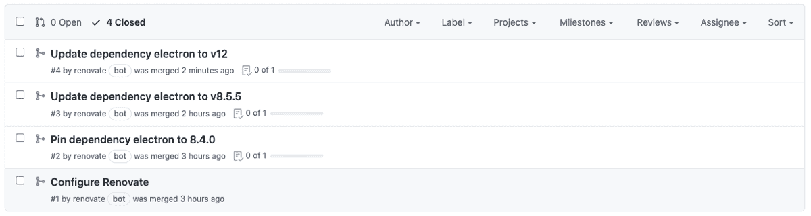

# 如何修复易受攻击的 NPM 依赖

> 原文：<https://levelup.gitconnected.com/how-to-fix-vulnerable-npm-dependencies-6882ae9a82fd>

## 使用自动化工具修复易受攻击的依赖关系


*图片由*[费德里科·贝卡里 ](https://unsplash.com/photos/ahi73ZN5P0Y)

像几乎所有的编程语言一样，Javascript 并不是没有易受攻击的包，这些包可能作为依赖项包含在使用 npm 的开发团队的项目中。针对 JavaScript 中易受攻击的依赖项的最佳防御是跟踪它们并实施适当的控制以减少暴露。

每一个团队都面临着保持所有依赖关系最新且没有漏洞的挑战。随着单个存储库中的依赖项数量或存储库数量的增长，这一挑战变得更大、更难管理。如果一个团队需要手动管理所有的包依赖关系，它将花费大量的精力和时间来不断地确保依赖关系是最新的，并且不会使项目变得脆弱。

为了避免将开发人员的注意力和时间转移到不需要手动完成的任务上，您可以采用自动化工具来扫描所有的依赖项并提出修复建议，无论您的团队使用什么平台或语言。

在本文中，我们将研究一些 JavaScript 漏洞，以及如何使用扫描依赖关系的自动化工具来修复它们。

# JavaScript 漏洞

所有软件在某个时间点都会有漏洞，JavaScript 也不例外。让我们看看一些类型的漏洞，并浏览一些在以前版本的电子库中发现的实际漏洞的例子。

> 电子框架让你可以使用 JavaScript、HTML 和 CSS 编写跨平台的桌面应用。它基于 Node.js 和 Chromium，由 Atom 编辑器和许多其他应用程序使用。
> 
> 资料来源:npmjs.com

📝*以下漏洞目前已修复，仅用作示例，无意以任何方式促进漏洞利用。*

# 越界写入

越界写入允许将数据写入已分配缓冲区的边界之外。如果出现此漏洞，可能会导致正在处理的数据损坏、系统崩溃或执行恶意代码。

在这个[拉请求](https://github.com/electron/electron/pull/28132)中已经报告了这种漏洞的一个例子，它与音频组件中的数据竞争有关。通过此漏洞，远程攻击者可能已经使用精心编制的 HTML 页面创建了堆溢出。

该漏洞已在 Electron 的版本 [v11.4.1](https://github.com/electron/electron/releases/tag/v11.4.1) 中修复。

# 输入验证不正确

不正确的输入验证允许接收输入，但不验证或不正确地验证它。如果出现此漏洞，系统可能会处理不正确/不安全的数据。

这种漏洞的一个例子是在这个 [pull request](https://github.com/electron/electron/pull/28247) 中报告的，攻击者使用专门准备的 HTML 页面来暴露跨来源的数据。

电子版 [v11.4.1](https://github.com/electron/electron/releases/tag/v11.4.1) 修复了该漏洞。

# 不适当的访问控制

不适当的访问控制使得未经授权的参与者能够以不受限制或不正确的权限访问系统。

在这个[拉请求](https://github.com/electron/electron/pull/26860)中已经报告了这种漏洞的一个例子。该漏洞基于 Chromium 网络组件中发现的策略执行不充分的缺陷。

该漏洞已在 Electron 的版本 [v9.4.0](https://github.com/electron/electron/releases/tag/v9.4.0) 中修复。

现在我们已经了解了一些漏洞，让我们创建一个简单的依赖于 8.4.0 版本的电子仓库，其中包含前面提到的漏洞。

# 项目和存储库设置

让我们从初始化项目开始，从命令行终端运行下面的命令。

```
npm init
```

命令行终端将提示几个问题，最后，您应该有一个名为 package.json 的文件。

项目准备就绪后，我们需要做的第一件事是添加一个易受攻击的依赖项。为此，我们将使用 8.4.0 版本的 Electron。

```
npm install electron@8.4.0
```

现在，package.json 文件应该如下所示:

```
{
  “name”: “npm-vulnerable-dependencies”,
  “version”: “1.0.0”,
  “description”: “Update npm vulnerable dependencies with renovate”,
  “scripts”: {},
  “dependencies”: {
    “electron”: “8.4.0”
  }
}
```

只需将这些文件放入存储库，就大功告成了。

有了存储库，让我们用 WhiteSource 的免费工具[来扫描依赖关系。它将自动更新项目依赖关系，这样我们可以检测旧的依赖关系版本，并将它们更新到最新版本。](https://www.whitesourcesoftware.com/free-developer-tools/renovate)

随着我们不断开发和发展我们的项目，keep 将为我们提供一些有用的功能:

*   持续运行并检测最新的可用版本。
*   每次更新时，我们都会提取并包含变更日志和提交历史，这样我们就不会忘记发生了什么变化以及原因。
*   如果我们有一个测试套件，它将在每次更新时运行测试，以避免回归错误。

现在我们对这个工具有了更好的了解，让我们继续安装它。

# 安装和配置翻新

下一步是在版本控制平台中安装 Renovate 的 bot。这种情况下，我用过 GitHub。安装过程非常简单。只需按照 GitHub [网站](https://github.com/apps/renovate)上的说明操作即可。

安装之后，将自动创建一个标题为“配置更新”的请求，这将帮助您配置它到存储库中的集成。


*配置拉取请求*

这个 pull 请求将包含一个“配置概要”,描述 Renovate 的默认行为，以及一个“预期”部分，显示将要创建的分支的计划。


*“预期”部分显示了未来的拉动式需求*

要启用 renew，只需浏览初始的 pull 请求并将其合并。

我们来看看启用后是如何工作的。

# 翻新是如何工作的？

在您合并初始的 pull 请求之后，renewal 被启用，并准备好扫描项目依赖项。当需要更新依赖项时，renew 将执行以下操作:

*   创建一个单独的分支(为每个需要更新的依赖项创建一个不同的分支)
*   为新创建的分支创建一个拉请求

此时，它会通知您有一个新的“拉”请求打开。您可以决定是通过合并拉请求来处理依赖项更新，还是将更新推迟到以后的阶段。独立于您的决定，依赖性更新的意识已经以拉请求的形式被注册。



*将拉请求与建议的更新合并*

在合并建议的拉请求之后，依赖关系将被更新，存储库将在“拉请求”部分记录应用的修复。


更新作业日志

在 renew app[仪表盘](https://app.renovatebot.com/dashboard)上，您将找到已经运行并产生我们之前看到的分支/PRs 的相应作业。

## 包扎

依赖性管理是确保避免或减少易受攻击的依赖性的重要部分。

第一步是建立对漏洞的认识，并提供解决它们的计划。一旦计划就绪，就只需要根据漏洞的严重性进行修复了。

如果您目前没有关注您正在处理的项目的相关性，请花一些时间浏览它们，以获得项目状态的概览。

编码快乐！