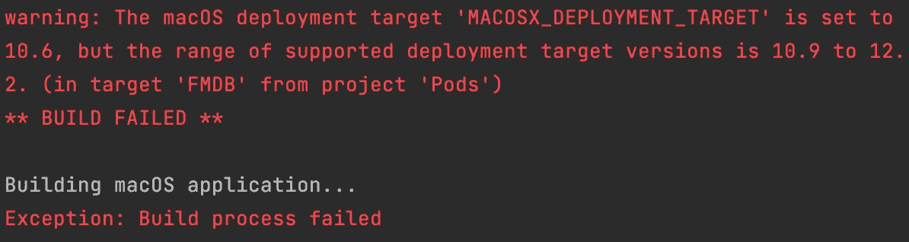

# 如何修复你的颤振 macOS 目标不匹配

> 原文：<https://levelup.gitconnected.com/how-to-fix-your-flutter-macos-target-mismatch-bc55424b7c77>

## 一个一直没有修复的抖动错误。但是有一个解决方法。


照片由 [Elisa Ventur](https://unsplash.com/@elisa_ventur?utm_source=medium&utm_medium=referral) 在 [Unsplash](https://unsplash.com?utm_source=medium&utm_medium=referral) 上拍摄

lutter 正在认真对待桌面，但是到底有多认真…好吧，我决定做个评判！我已经写了很多关于这个新的跨平台框架的文章，众所周知，我已经不止一次地相信它在移动开发方面有着美好的未来。然而，从我的角度来看，评审团仍然在网络和桌面上。上周末，我决定带着我的一个测试版应用去苹果电脑上玩玩。

[](https://attilavago.medium.com/will-flutter-and-dart-be-the-next-big-thing-in-application-development-e8e218599c89) [## Flutter 和 Dart 会是应用程序开发的下一个大事件吗？

### Dart 和 Flutter 是作为 JavaScript 生态系统的一个可行替代方案呈现给应用程序开发人员社区的。不是…

attilavago.medium.com](https://attilavago.medium.com/will-flutter-and-dart-be-the-next-big-thing-in-application-development-e8e218599c89) 

简单来说，这个应用既不小，也不大。它有一些锦囊妙计，足以证明我在跨平台兼容性方面的一些重要方面。我用的是:

*   状态管理的 Flutter 提供者
*   用于将字符串转换为音频的 Flutter TextToSpeech
*   路径和路径提供者，因为我需要它来定位应用程序的内部 SQFLite 数据库，并从中读取或写入。

诚然，这不是很多，但一个体面的小应用程序来测试一堆东西，我希望这将很快帮助许多人！

我不能说我在过去两年的开发过程中有任何重大问题。除了那种每次发生都会让我抓狂的。首先，它发生在 iOS 上，即由于`IPHONEOS_DEPLOYMENT_TARGET`不匹配，它一直抛出一个`failed build`错误。最终，我找到了一个解决方案，然后这个错误就消失了。直到今天…

## 了解 macOS 版本…

就在我想*“快乐的日子，宇宙一切都好”*的时候，普京袭击了乌克兰。等等！不，那是另一篇文章。但是宇宙中的一切都不太好，因为我的桌面构建失败了。

运行神奇的`flutter run -d macos`命令，而不是一个运行的应用程序，得到这个烦人的垃圾:



我的第一反应是修改`macos/Podfile`的第一行，并将其设置为合适的 macOS 版本。此轭:`platform :osx, '10.15'`。你猜怎么着？*这不做 sh*t！*

此时，我想起我之前为 iOS 解决了这个问题。那时候，我在 newbedev.com 上[找到了答案。然后我想，嗯，Flutter 是一个框架，这是一个很好的改变，许多特定于操作系统的东西都有一个模式。所以，我这么做了。进入我的`macos/Podfile`并替换看起来像这样的`post_install`方法…](https://newbedev.com/the-ios-deployment-target-iphoneos-deployment-target-is-set-to-8-0-in-flutter-how-can-i-change-the-minimum-ios-deploying-target)

```
post_install do |installer|
  installer.pods_project.targets.each do |target|
    flutter_additional_macos_build_settings(target)
  end
end
```

反而看起来如此。

```
post_install do |installer|
  installer.pods_project.targets.each do |target|
    flutter_additional_macos_build_settings(target)
    target.build_configurations.each do |config|
      config.build_settings['MACOSX_DEPLOYMENT_TARGET'] = '10.15'
    end
  end
end
```

## Et，瞧！有用！

我仍然坚信 Flutter 有一个美好的未来。现在，我已经在三个主要操作系统上运行了与内置应用完全相同的代码库:iOS、Android 和 macOS。当然，添加这些小的变通解决方案很烦人，但与我以前使用 Ionic、React Native 或 electronic 的经验相比，Flutter 提供的一切都要优越得多。我编译的 macOS 应用程序运行完美，我再高兴不过了！

## 如果你喜欢扑…

这里还有一些你可能会喜欢的文章！

[](/how-to-transfer-data-between-two-flutter-apps-without-any-type-of-connection-ae808e78a00a) [## 如何在没有任何连接的情况下在两个 Flutter 应用程序之间传输数据

### 没有网络。没有任何形式的连接，但仍然有一种方法来传输数据…

levelup.gitconnected.com](/how-to-transfer-data-between-two-flutter-apps-without-any-type-of-connection-ae808e78a00a) [](/flutters-skia-engine-takes-cross-platform-app-development-to-a-new-level-85cc5f92ca9b) [## Flutter 的 Skia 引擎将跨平台应用开发提升到了一个新的高度

### 好处远远超过一些人在考虑“绘制”应用程序而不是“构建”它们时可能感到的“怪异”

levelup.gitconnected.com](/flutters-skia-engine-takes-cross-platform-app-development-to-a-new-level-85cc5f92ca9b) [](/building-flutter-apps-on-the-16-m1-pro-952d2325bbbe) [## 在 16 英寸 M1 专业版上构建颤振应用

### “从我的英特尔 i7 15”完全转移到 M1 Pro 16，并开始开发我的 Flutter 应用程序。我同样担心…

levelup.gitconnected.com](/building-flutter-apps-on-the-16-m1-pro-952d2325bbbe) [](https://attilavago.medium.com/membership) [## 通过我的推荐链接加入 Medium-Attila vágó

### 作为一个媒体会员，你的会员费的一部分会给你阅读的作家，你可以完全接触到每一个故事…

attilavago.medium.com](https://attilavago.medium.com/membership) 

**阿提拉·瓦戈**——*软件工程师一次改进一行代码。永远的酷呆子，代码和博客的作者。网络无障碍倡导者，乐高迷，黑胶唱片收藏家。喜欢精酿啤酒！*