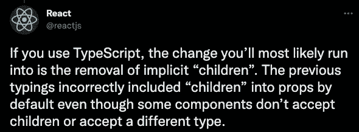

# 如何在升级到 18 版后修复 React 应用

> 原文：<https://levelup.gitconnected.com/how-to-fix-your-react-app-after-upgrading-to-version-18-a309d9db5707>

## 为什么 React 团队决定改变输入方式，在这个过程中破坏了数千个应用程序？

React v18 版本包含许多重大变化(如[并发](https://reactjs.org/blog/2022/03/29/react-v18.html#what-is-concurrent-react))，但有时正是这些小变化困扰着我们。说到 [**typescript**](https://www.typescriptlang.org/docs/handbook/react.html) ，React 为我们提供了`FC`接口，用于创建一个功能组件。在版本 18 之前，我们不必定义在功能组件上使用的`children`属性:

FC 接口隐式定义的子属性

但是从 v18 开始，上面的代码会导致下面的错误:

```
Property 'children' does not exist on type 'Props'
```

由于这个接口是常用的，升级到 v18 很可能会坏了你的 app，的确[很多 app 升级](https://stackoverflow.com/questions/71788254/react-18-typescript-children-fc/)后就坏了。

# 反应和失踪的孩子

突破性的变化是在`FC`界面中删除了`children`道具的默认定义。

## 怎么修

有很多[帖子](https://bobbyhadz.com/blog/react-property-children-does-not-exist-on-type)是关于如何解决这个 typescript 错误的，所有的解决方案都是[不同的方式显式添加“children”道具](https://stackoverflow.com/questions/71788254/react-18-typescript-children-fc/71800185#71800185)。最常见的一种方法是将其添加到您的 props 界面中:

然而大多数关于解决这个问题的文章都忽略了一个重要的问题——为什么 React 一开始就从`FC`界面中移除了隐式的“孩子”?


# 生孩子应该是一个有意识的决定

做出此类[重大变更](https://en.wiktionary.org/wiki/breaking_change#:~:text=breaking%20change%20(plural%20breaking%20changes,to%20new%20in%20import%20lib.)的原因是，之前的假设——所有组件都可能有`ReactNode`类型的“子”道具——并不成立，因为:

*   有些孩子应该有不同于`ReactNode`的类型
*   有些组件根本不需要子组件

## 其他类型的孩子

考虑以下(简化的)按钮组件。

对于某些组件，我们可能更喜欢带有字符串类型的子组件

注意**子**的类型是`string`。当我们希望对组件的内容有更多的控制时，这是很有用的。我以前写过[降低组件灵活性如何帮助保持应用程序的一致性](https://medium.com/@yuval.bar.levi/react-spread-attributes-dont-overuse-them-3f322a0ace22)，这里也是一样:当我们为`children`设置字符串类型时，我们可以防止滥用它的`children`属性。

怎么虐？像这样:

当使用 ReactNode 类型的子节点时，它允许向内容中注入样式

上面的代码是一个常见的场景，错误的样式可以被注入到按钮的内容中，并在无意中修改它。在 React v17 中，我们不必定义**子**的类型——默认情况下，它曾经是`ReactNode`类型。因此，除非我们定义不同的子类型，否则这段代码不会触发任何错误。这让我们的组件有太多的开箱即用的灵活性。在 v18 中，我们必须有意识地决定孩子的类型。

## 没有子组件的组件

在很多情况下，一个组件从一个源而不是一个道具获得它的内容，例如，一个连接到一个存储库的[内部钩子。](https://medium.com/@suraj.kc/mobx-strategies-with-react-hooks-3de23932cb8c)

因为我们的`ErrorMessage`组件从商店而不是道具中获取内容——它对**子**道具没有用处。在这种情况下，我们希望 typescript 编译器阻止向`ErrorMessage`添加子元素。这是 v18 的默认行为——当我们使用`FC`接口时，除非我们明确设置**孩子**的道具类型。

## 摘要

有些事情不应该被隐含地定义，因为它可能会鼓励错误的假设，从而导致错误。React 的隐式 **children** 的定义就是这样一个例子。正如 React 团队所说:



[见推特上的帖子](https://twitter.com/reactjs/status/1512453969490108418)

关于确定类型回购的相关[问题对此做了进一步解释:](https://github.com/DefinitelyTyped/DefinitelyTyped/issues/46691)

> 从`React.FC`(以及`React.memo` )
> **中移除隐式类型`children`在 TypeScript 中，添加类型通常比移除类型更容易。**

最后，正如我们在上面的第一个例子中看到的，太多的灵活性并不总是一件好事。你可以在这里观看我关于过度弹性的演讲[。](https://www.youtube.com/watch?v=gvneSW-ICqc&t=670s)

## 资源

*   [去除隐性子女](https://solverfox.dev/writing/no-implicit-children/)
*   [反应 18 种类型(拉式请求)](https://github.com/DefinitelyTyped/DefinitelyTyped/pull/56210)
*   [反应 18 和仅类型的突变](https://github.com/DefinitelyTyped/DefinitelyTyped/issues/46691)
*   [React 18 打字稿打字出来了！(推特)](https://twitter.com/reactjs/status/1512453230504124420)