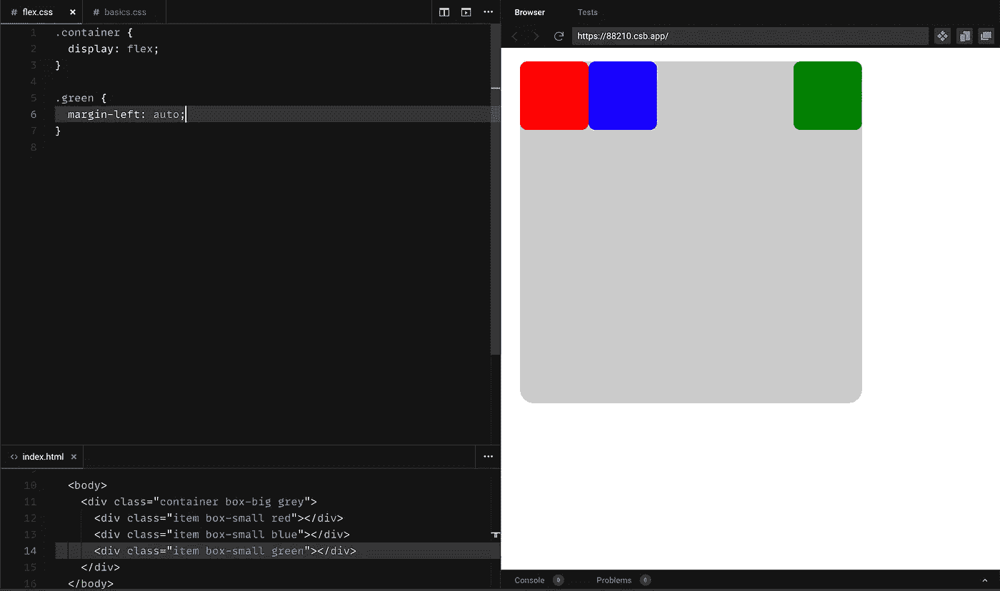

# CSS Flexbox 的终极指南

> 原文：<https://levelup.gitconnected.com/how-to-flex-a-beginners-guide-904c3edc2fdc>

## 技术

Flexbox 是在你的应用中设置任何布局的必要工具。它可以是一个事物列表，一组缩略图，甚至是一个基本的导航栏。 **Flexbox** 可以帮助放置物品，并使它们的响应更加容易，因为它定义了元素如何通过利用自由空间来增长或收缩。

来源— [壁纸光斑](https://www.wallpaperflare.com)

**Flex-box** 是一个完整的生态系统——但是不要惊慌，我们会实现的。我将把它分解成几个部分，并随着我们的进展不断整合新的部分。

## 柔性盒模型

我们构建的任何组件都有一个包含一个或多个子组件的包装器结构，而这些子组件又可以作为包装器来包含自己的一个或多个子组件，以此类推。每个 HTML DOM 元素都遵循这种树模式。

作为一个例子，我们将使用下面的树形图

一个装有三个孩子的集装箱

灰色盒子(`500px`的一个方块)是一个容器，里面有三个孩子(`100px`的红蓝绿方块)。我们已经在`basics.css`文件中应用了一些基本的样式。**在本文的整个过程中，这些风格将保持不变。**

在 **flex-box 模型**中，包装器(称为 **flex-container** )和子(称为 **flex-item** )扮演不同的角色。一个 **flex-container** 的属性决定了它的子容器(以及未使用的空间)将如何在其中定位，而 **flex-item** 的属性决定了该项是否必须伸展或收缩(或者甚至占据一个兄弟的位置)。

理论到此为止，让我们开始吧。

## Flex 容器属性

# 显示

*语法* — `display: flex` *它做什么* —它本质上是把一个元素变成一个 **flex-container** ，本节中所有其他属性都有这个(`display: flex`)作为前提。

显示器:flex

刚刚发生了什么？
最明显的变化是子元素被并排放置，而不是堆叠在一起(就像[块元素](https://developer.mozilla.org/en-US/docs/Web/HTML/Block-level_elements)应该做的那样)。

*但是，为什么呢？* 我们该退房了`flex-direction`。

# 弯曲方向

*语法* — `flex-direction: row | row-reverse | column | column-reverse`
*默认* — `row`
*作用* — **Flex-items** 沿着 its `flex-direction.`中定义的轴在 **flex-container** 中布局

*   `row` —从左到右
*   `column` —从上到下
*   `row-reverse` —从右到左
*   `column-reverse` —从下到上

弯曲方向

如果没有将`flex-direction`显式分配给 **flex-container** (即任何带有`display: flex`的元素)，则采用默认值`row`。

但是，如果内容溢出怎么办？
该是`flex-wrap`来救援了。

# 柔性包装

*语法* — `flex-wrap: nowrap | wrap | wrap-reverse`
*默认* — `nowrap`
*它做什么* — `flex-wrap`规定当 **flex-container** 中的内容溢出时会发生什么。

*   `nowrap` —内容尽量放入一行，如果有限制就会溢出。
*   `wrap` —内容被包装成多行(根据`flex-direction`)。
*   `wrap-reverse` —内容被分成多行(与`flex-direction`方向相反)。

> ***亲提示—***
> 你可以用`*flex-flow*`作为`*flex-direction*`和`*flex-wrap*`的简写。
> 举个例子——
> `*flex-flow: row wrap;*`本质上就是`*flex-direction: row; flex-wrap: wrap;*`

让我们将小盒子的大小增加到`200px`来创建内容溢出的用例——

柔性包装—默认行为

刚刚发生了什么？
默认的`flex-wrap: nowrap`是让那些盒子缩小宽度以挤进容器。我们的盒子不再是正方形，而是一些怪异的长方形。

但是，它不能压倒`min-width`(或`min-height`对于`flex-direction: column`)，内容溢出到右边(或底部)。
但是，`flex-wrap: wrap`将它们分成多行，同时考虑元素的指定宽度——

柔性包装

> ***先睹为快—*** 当内容换行时，你有没有注意到行间的空隙？看一看下面的`align-content`部分就知道为什么了。

# 调整内容

*语法* — `justify-content: flex-start | center | flex-end | space-between | space-around | space-evenly`
*默认* — `flex-start` *功能—* `justify-content`指示 **flex-items** 如何沿着 **flex-container** 中提供的`flex-direction`定位。

*   `flex-start` —物品被放置在容器的开始处。
*   `center` —物品放置在容器的中央。
*   `flex-end` —物品放置在容器的末端。
*   `space-between` —项目以相等的间距放置，第一个和最后一个子项目分别位于容器的开头和结尾。
*   `space-around` —物品周围的空间相等，任何两个相邻物品之间的空间正好是第一个物品(以及最后一个)与其最近的容器边界之间的空间的两倍。这是因为——第一个和第二个项目之间的间隙包含它们的两个间距，而当涉及到第一个项目和墙壁之间的间距时，它只取第一个项目的间距。
*   `space-evenly` —以任意两个相邻项目之间的空间(以及边界)相等的方式放置项目。

调整内容

> ***专业提示—***
> 当我们使用`justify-content`放置项目时，我们可能会意外地将项目推出容器(当内容溢出时)—以一种无法滚动到它们的方式(查看下面的示例)。在这种情况下，添加一个`safe`关键字可能是救命稻草。

调整-满足但安全

# 对齐-项目

*语法* — `align-items: stretch | flex-start | flex-end | center | baseline`
*默认* — `stretch` *作用—* `align-items`指示**伸缩项**如何沿着**伸缩容器**中提供的`flex-direction`的**垂线**定位。

为了正确理解这一点，让我们取消小盒子的高度—

对齐项目-默认行为

刚刚发生了什么？
如果我们不为项目提供任何**高度**(或**宽度**，对于`flex-direction: column`，它们会伸展以填满容器。幸运的是，我们可以通过调整`align-items`来控制这种默认行为

*   `stretch` —物品拉伸至装满容器。
*   `flex-start` —项目放置在垂直于给定`flex-direction`的轴的起点。
*   `center` —项目被放置在垂直于给定`flex-direction`的轴的中心。
*   `flex-end` —项目放置在垂直于给定`flex-direction`的轴的末端。
*   `baseline` —项目根据其基线对齐。

对齐-项目

> ***PRO 提示—***
> 类似于`*justify-content*`，`safe`关键字与`align-items`也有作用。

# 对齐内容

*语法* — `align-content: stretch | flex-start | center | flex-end | space-between | space-around | space-evenly`
*默认* — `stretch` *它的作用—* `align-content`规定当内容换行时，如何用尽行间的空间。
*先决条件—* **flex-container** 必须有`flex-wrap: wrap | wrap-reverse`，因为`nowrap`会阻止内容移动到下一行。

为了更好地理解这一点，让我们先添加`flex-wrap: wrap`,让盒子变大，这样内容就会溢出来——

对齐内容—默认行为

刚刚发生了什么？
线条被拉伸以填满容器(默认情况下从`align-content: stretch`开始)，而项目被`height`属性限制。如果我们取消`height` —

对齐内容-默认高度行为:未设置

当 **flex-container** 被换行并且内容被移动到下一行时，行与行之间的间距可以由该属性控制。

*   `stretch` —项目拉伸以填充行与行之间的空间。
*   `flex-start` —行位于容器的开头，中间没有空格。
*   `center` —线条位于容器的中心，中间没有空格。
*   `flex-end` —行位于容器的末尾，中间没有空格。
*   `space-between` —项目以行间距相等的方式放置，第一行和最后一行分别位于容器的开头和结尾。
*   `space-around` —项目以这样的方式放置，即各行之间的间距相等，任意两个相邻行之间的间距正好是第一行(以及最后一行)与其最近的容器边界之间的间距的两倍。
*   `space-evenly` —项目以线(以及边界)之间具有相等间距的方式放置。

对齐内容

> ***亲小贴士—***
> **#1** →类似于`*justify-content*` 和`align-items`，`*safe*`关键字与`*align-content*` 太过*。* **#2** →你可以用`*place-content*`作为`align-content`和`justify-content`的简写。
> 举个例子——
> `*place-content: flex-start center;*`本质上就是`*align-content: flex-start; justify-content: center;*`

## 弹性项目属性

# 灵活增长

*语法* — `flex-grow: any positive integer`
*默认* — `0` *它做什么—* `flex-grow`规定如果有可用空间(在给定的`flex-direction`中)，一个 **flex-item** 如何增长。

带有`flex-grow: 2`的**柔性项目**试图占据两倍于带有`flex-grow: 1`的**柔性项目**的未使用空间。这可以通过例子得到最好的解释——

灵活增长

# 弯曲收缩

*语法* — `flex-shrink: any positive integer`
*默认* — `1` *它做什么—* `flex-shrink`规定如果没有可用空间(在给定的`flex-direction`中)，一个**伸缩项**如何收缩。

当没有可用空间时， **flex-items** 收缩到容器内。`flex-shrink`控制**伸缩项**收缩的系数。带有`flex-shrink: 2`的**伸缩项**试图向下挤压的系数是带有`flex-shrink: 1`的**伸缩项**的两倍。

我们给**蓝色盒子**分配了`400px`的宽度，这样其他的盒子就可以缩小来容纳—

弯曲收缩

> ***PRO 提示—***
> 如果您想让 **flex-item** 在任何情况下都不会缩小，请设置`flex-shrink: 0`。

# 弹性基础

*语法* — `flex-basis: auto | 0 | any size value`
*默认* — `auto` *作用—* `flex-basis`定义 **flex-item** 的默认大小。所有的`flex-grow` / `flex-shrink`值与`flex-basis`一起被考虑在内，以达到**弹性项目**的最终大小。

那是什么意思？
`flex-basis`是理解如何计算**伸缩项**大小的最后一步。让我们通过查看一些用例来深入了解它—

## 案例 1-相等尺寸|相等拉伸

我们正在`unset-`调整宽度，分配`flex-grow: 1`并将`flex-basis: 100px`应用到所有的小盒子上。我们实际上是用`flex-basis`取代了这里的`width`房产，并要求他们占用剩余的未使用空间

相等尺寸|相等拉伸

刚刚发生了什么？
容器大小= `500px`
伸缩前的盒子大小——即`flex-basis` = `100px`
未使用空间= `500px — (3 * 100px)` = `200px` 总伸缩增长——每个**伸缩项**都有`flex-grow: 1` = `3`
盒子增加= `200px * (1 / 3)` = `66.67px`
最终盒子大小= `100px + 66.67px` = `166.67px`

## 案例 2——双倍尺寸|同等拉伸

我们将红框的`flex-basis`增加到`200px`。让我们看看这是如何改变布局的—

双倍尺寸|均等拉伸

刚刚发生了什么？
容器大小= `500px`
**红色**伸缩前的盒子大小——即`flex-basis` = `200px`
**(蓝色/绿色)**伸缩前的盒子大小——即`flex-basis` = `100px` 未使用空间= `500px — (2 * 100px) — 200px` = `100px` 总伸缩增长——每**伸缩-项目**有`flex-grow: 1` = `3`
盒子增加=`100px * (1 / 3)`=`100px * (1 / 3)`

## 案例 3——双倍尺寸|双倍拉伸

我们将红框的`flex-basis`保持在`200px`，但也增加了`flex-grow: 2`。让我们看看这是如何改变布局的—

双倍尺寸|双倍弹力

刚刚发生了什么？
容器大小= `500px`
**红色**伸缩前的盒子大小—即`flex-basis` = `200px`
**(蓝/绿)**伸缩前的盒子大小—即`flex-basis` = `100px` 未使用空间= `500px — (2 * 100px) — 200px` = `100px` 总伸缩增长— **【蓝/绿】**盒子有`flex-grow: 1`， **红色**框有`flex-grow: 2` = `4`
**红色**框增加= `100px * (2 / 4)` = `50px`
**(蓝/绿)**框增加= `100px * (1 / 4)` = `25px` 最终**红色**框大小= `200px + 50px` = `250px`
最终**(蓝/绿)**框大小= `100px + 25px` = `125px`

**简单来说——** `flex-basis`控制一个 **flex-item** (分别为`flex-direction: row|column``width|height`)的默认大小。它也可以接受一些其他的值——

*   `auto` — `flex-basis`取伸缩项的宽度(或`flex-direction: column`的高度)值。
*   `0` — `flex-basis`取其内容的大小。
*   `any size value`——`flex-basis`随遇而安。

# 弯曲

*语法* — `flex: initial | auto | none | one-two-three-value`
*默认* — `auto` *它的作用—*`flex-grow`、`flex-shrink`和`flex-basis`的组合就是你需要调整一个 **flex-item** 的全部。幸运的是，我们有一种综合了所有这些特性的速记方法—

*   `initial`—
    `**flex: initial**`→`flex-grow: 0; flex-shrink: 1; flex-basis: auto;`
    **flex-item**收缩以适应其内容，但从不增长以占据未使用的空间，其默认大小基于其分配的`width / height`。
*   `auto`—
    `**flex: auto**`→`flex-grow: 1; flex-shrink: 1; flex-basis: auto;`
    **flex-item**收缩以适应其内容，增长以占据未使用的空间，其默认大小基于其分配的`width / height`。
*   `none`—
    `**flex: none**`→`flex-grow: 0; flex-shrink: 0; flex-basis: auto;`
    **flex-item**不再灵活。它不收缩也不增长，它的大小是基于它所分配的`width / height`。
*   *一值语法—*
    `**flex: 1**` → `flex-grow: 1; flex-shrink: 1; flex-basis: 0;`
*   *二值语法—*
    `**flex: 1 2**` → `flex-grow: 1; flex-shrink: 2; flex-basis: 0;`
*   *二值语法—*
    `**flex: 1 100px**` → `flex-grow: 1; flex-shrink: 1; flex-basis: 100px;`
*   *三值语法—*
    `**flex: 1 2 100px**` → `flex-grow: 1; flex-shrink: 2; flex-basis: 100px;`

# 自我对齐

*语法* — `align-self: auto | stretch | flex-start | flex-end | center | baseline`
*默认*—`auto` —*它做什么—* 它覆盖 **flex-container** 给它的`align-items`值，对于那个特定的 **flex-item** 。

自我对齐

# 命令

*语法* — `order: any number`
*默认* — `0` *它的作用—* 它决定了 **flex-item** 将占据的位置。默认情况下，它遵循它们被写入的顺序，但是具有**高阶** **值**的**柔性项目**被放置在其他项目之后。

命令

这基本上结束了所有你需要知道的使用 **flex-box** 的关键属性。然而，我在下一节讨论了一些用例，它们可以帮助您解决一些日常的 flex 问题。

## 常见问题

**#1 —为什么没有**`**justify-items**`**`**justify-self**`**？****

**Flex-box 模型没有`justify-items`和`justify-self`，因为那些结果可以通过`margin`属性来实现(你将在下面的例子中发现)。**

*   **`justify-content` —将项目放置在`flex-direction`给出的轴上。**
*   **`align-content` —将物品放置在与`flex-direction`中给出的垂直的**轴上。****
*   **`align-items` —控制垂直于的轴**中的线与`flex-direction`中给出的线之间的间距。****
*   **`margin` -控制在伸缩方向给定的轴上的线间距(对于每个**伸缩项目**)。**

****# 2——如何使用 flex-box 将元素(水平和垂直)居中？****

**瞧啊。**

****

**将元素居中**

****# 3——如何使用 flex-box 对元素进行拐角处理？****

**给绿框添加一个`margin-left: auto`会将它移动到容器的右边——**

****

**向右上方转弯**

**然而，我们可以使用`align-self: flex-end`将其移动到底部——**

****

**向右下方转弯**

## **参考**

*   **[由](https://css-tricks.com/snippets/css/a-guide-to-flexbox)[克里斯·科伊尔](https://css-tricks.com/author/chriscoyier/)撰写的 Flexbox【CSS 技巧】完全指南。**
*   **[Flexbox 的基本概念](https://developer.mozilla.org/en-US/docs/Web/CSS/CSS_Flexible_Box_Layout/Basic_Concepts_of_Flexbox)【MDN 网络文档】**

> *****奖金提示—***
> **#1** →做结账 [Flexbox Froggy](https://flexboxfroggy.com) 。这是一种通过互动游戏学习和提高 flex-box 技能的有趣方式。相信我，你会喜欢的！
> **#2** →您还可以查看 Wes Bos 在 flex-box 上的这一广泛的[课程](https://flexbox.io)。**

## **鳍状物**

**感谢并祝贺你到达文章的结尾。希望你觉得有用。**

**当你在这里的时候，你也可以看看我的其他几篇文章**

*   **[10 种现代 JavaScript 语法帮助你更快编码](/10-modern-javascript-syntax-to-help-you-code-faster-82cc0a5a3960)**
*   **[我希望自己在初学时就知道的 10 件 CSS 事情](/10-css-things-i-wish-i-knew-when-i-was-a-beginner-68ba4b5b3da8)**

**干杯！**