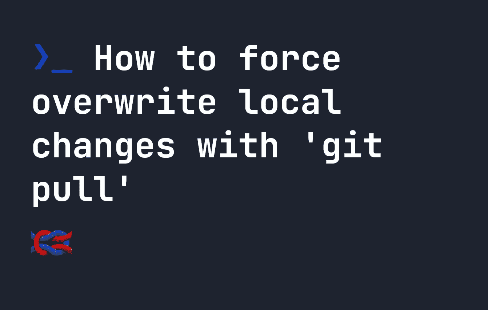

# 如何使用“git pull”强制覆盖本地更改

> 原文：<https://levelup.gitconnected.com/how-to-force-overwrite-local-changes-with-git-pull-1a450fc0336f>



你有没有在 **git** 中处理一个项目时，遇到一个错误，告诉你不能使用`git pull`，因为你有本地更改？

```
error: Untracked working tree file 'App.vue' would be overwritten by merge
```

这通常是因为一些更改已经提交到了您正在从中提取的回购协议，但是您在本地有一个类似的文件。例如，如果一个文件被意外添加到名为`README.md`的回购协议中，而您的本地版本中已经有了`README.md`。

不过，有时您希望用回购中找到的文件强制覆盖您的文件。在这种情况下，您的本地更改将被远程存储库中的更改所取代。

# 强制 git 拉

要逼一只`git pull`，你要做三件事:

*   首先同步并获取所有远程存储库更改。
*   备份您当前的分支—因为当我们强制执行“拉”时，所有更改都将被覆盖。
*   力`git pull`。

这里要做的重要事情是备份，将所有本地更改提交到备份分支。如果你担心文件被覆盖，你也可以把它们拷贝到其他地方。如果您不将您的本地更改提交/备份到另一个分支，它们将被覆盖，因此请**小心。:)**

为了强制执行`git pull`，我们运行以下命令来创建一个备份分支，然后在主分支上强制执行`git pull`:

```
git fetch --all
# Creates a new branch
git branch my-backup-branch
# Switch to the new branch.. we'll use it to backup our local changes
git switch my-backup-branch
# Add all files to a commit
git add .
# Commit the new branch, so that it is saved
git commit -m "Backup of branch"
# Switch back to our main branch, `master`
git switch master
# Force git pull using `git reset --hard`
git reset --hard origin/master
```

首先，`git fetch --all`将我们的遥控器与本地同步。然后，`git branch my-backup-branch`创建一个新的分支，我们切换到这个分支进行备份。之后，我添加了一个`commit`，这样我们就可以提交备份分支`my-backup-branch`上的任何更改，因此内容仍然保存。**如果你不提交你的更改到备份分支，你将会丢失它们。**

然后我们切换回我们的主分支，`master`分支，假设您的主分支叫做`master`。如果它被称为别的东西，你将不得不使用那个命令。通过运行`git branch --list`，您可以看到所有其他可切换到的分支。

最后，我们使用`git reset --hard origin/master`来强制 git 拉取。这将强制覆盖您所做的任何本地更改。

你就完了。现在您的本地更改将被备份到分支`my-backup-branch`上，所有远程更改将被强制到您的`master`分支中。

# 强制 Git Pull —键盘命令

强制从远程存储库获取 git 的关键命令是`git reset --hard origin/master`。其他命令是通过备份来确保你不会丢失任何数据！

# 找不到原点/主控形状

如果你找不到`origin/master`，你现在可能在你的原点上有那个分支。相反，试着运行`git branch -r`来查看任何远程分支，这样你就可以选择你想要的`git reset`了。