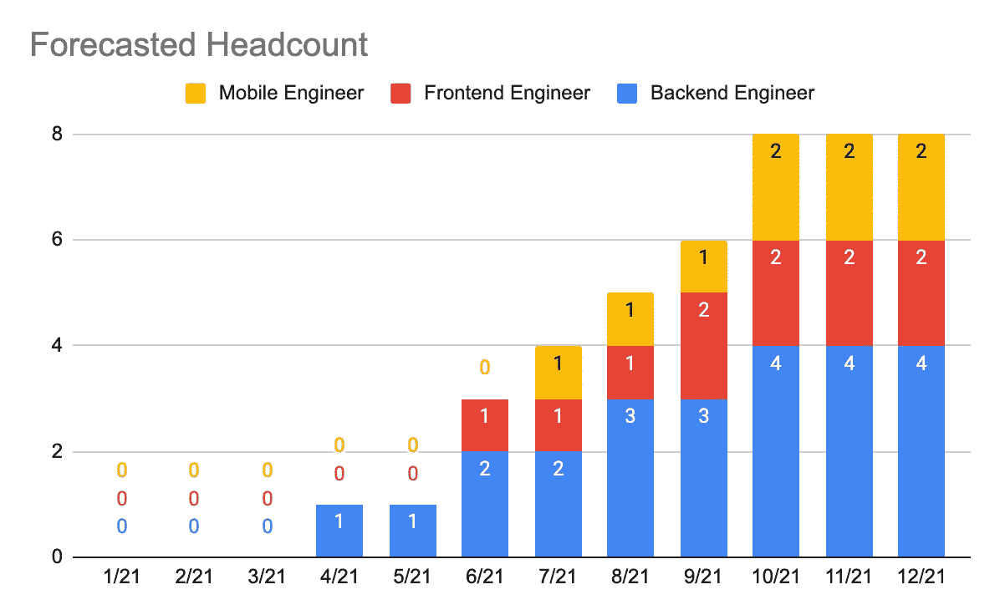
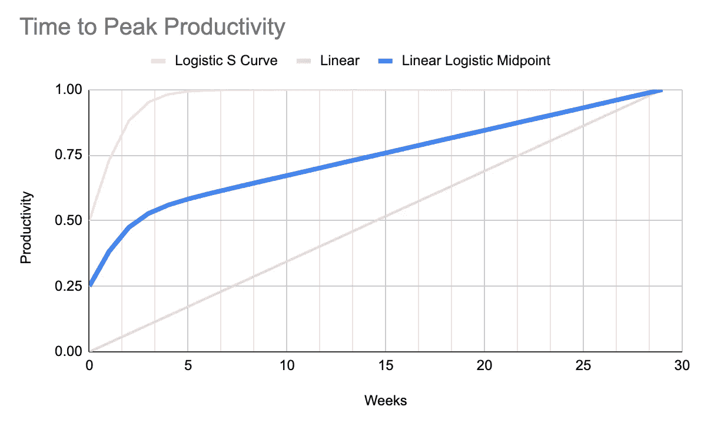
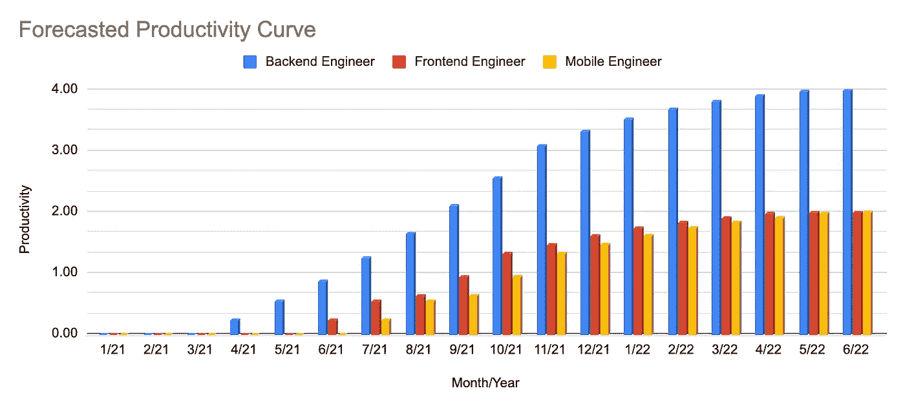

# 如何预测软件工程资源:CTO、VPE 和工程主管指南

> 原文：<https://levelup.gitconnected.com/how-to-forecast-software-engineering-resources-a-guide-to-ctos-vpes-and-engineering-directors-b031559e2d2>

如果时间旅行是真的，我会赢得每一张彩票！

拥有足够的软件工程资源来完成工作是每个 CTO 的梦想。然而，预测招聘渠道和入职流程的有效性是一件复杂的事情，这使得对未来的规划总是高度不确定。由于人们必须整理大量模糊不清的参数网络，无论首席技术官提出什么样的预测，最多只能归因于信心程度低于预期。作为工程师，我们不习惯宣称，“我认为我的代码有 80%的机会工作。”工程师渴望精确。逻辑必须无懈可击。你能想象 YouTube 只在 80%的时间里显示正确的视频吗？那就太天真了。因此，工程师花费数小时测试代码、清理 lints、监控生产状态等等，因为我们对自己创造的错误感到绝望。

然而，除了对可预测性的渴望之外，还需要 [**拥抱不确定性的确定性**](https://www.amazon.com/Being-Certain-Believing-Right-Youre/dp/031254152X) 。工程经理第一次很快意识到的一件事是，虽然从个人贡献者的角度来看事情是相当可预测的，但当他被提升为工程经理时，世界突然颠倒了。新的工程经理现在必须在一系列不确定性中导航，希望从所有的混乱中建立结构。

在这篇文章中，我将分享人员管理职位的工程师如何建立某些结构来预测即将到来的资源。需要说明的是，这篇博客的目的不是要全面，而是作为一个入门的引子。我们必须记住，正如我们以后会看到的那样，我们在预测中考虑的参数越多，预测就越可靠。也就是说，我们开始。

# 雇用

首先，我们来谈谈招聘。每年，规模足够大的公司都会编制预算，以帮助核算下一年的运营。为了更快地发布产品并弥补流失，健康的招聘渠道至关重要。因此，假设我预测我将需要 **4 名后端工程师、2 名前端工程师和 2 名移动工程师**来负责接下来一年的项目，事实是无论我如何努力，我都无法让他们凭空出现。有一个招聘过程，这需要时间。典型的招聘流程可能是这样的:

*   四周时间去寻找合适的人才。
*   两周面试。
*   一周时间协商补偿方案。
*   一周时间做所有必要的文书工作。
*   四周辞职。

这取决于招聘门槛有多严格(这里运气也起了作用！)，所需时间会有所不同。为了便于讨论，让我们假设公司平均需要**12 周**来培养一个成功的候选人，从被发现到他第一天上班。这意味着如果我在 1 月 1 日开始物色人选，我只能期待成功的候选人在 4 月 1 日加入，如下图所示:

图 1——工程人力预测示例

这告诉我们，为了让工程计划，产品路线图必须遥遥领先。谷歌前首席执行官 Eric Schmidt 指出[路线图应该是五年长的](https://youtu.be/hcRxFRgNpns?t=187)。因此，团队必须认识到这样一个事实，即招聘需要的时间比看起来要长得多。我过去有过这样的经历:我审阅了数百份简历，面试了几十个人，但毫无结果。作为一名面试官，这是一次令人筋疲力尽的经历，面试疲劳开始出现。

# 入职

现在，是 4 月 1 日。成功的候选人跳上船开始他的第一天工作。他能和坐在他旁边的人表现出同样的水平吗？绝对不行。我在我的另一篇[文章](https://medium.com/leading-and-managing/beyond-employee-engagement-understanding-employee-lifetime-value-c306966b9af1)中提到，一家公司雇佣一个新人可能需要长达一年的时间才能实现收支平衡。研究表明，一名软件工程师平均需要 29 周的时间才能达到最高生产率。这告诉我们，无论新雇员有多聪明，都不要指望他能做出和终身雇员一样的贡献。

在下面的图表中，我画出了一个工程师在 29 周内的生产力的粗略估计。

图 2 —生产力达到峰值的时间

这里，可以看到三条直线/曲线。

1.  橙色曲线是一条逻辑 S 曲线。这个想法是，在简单的项目中，很容易让一个人参与进来，因为学习曲线没有那么高。
2.  粉红色的线是线性的。对于非常复杂的项目，学习非常缓慢。这种情况不应该发生，必须被视为最糟糕的入职流程。
3.  蓝色曲线是两条直线/曲线的中点。这是大多数项目的大致位置。

需要明确的是，没有简单的方法来测量准确的曲线。这代表了工程入职流程中的情况。

# 预测生产率

也就是说，这两张图结合在一起:

图 3 —基于招聘预测和入职曲线的预测生产率

这张图表告诉我们的是，在第一个月，我们可以预期工程师的工作效率只达到峰值的 25-56%。在第二个月和第三个月之间，他将在 56-64%之间，以此类推。如果另一名工程师同时加入，那么他们的总生产率应该是一名工程师加权平均能力的 56–89%左右，以此类推。

这也告诉我们，工程师对公司的投资回报率与他的任期成正比。因此，根据经验，公司应该努力留住人才。尽管存在疫情，但如今的市场是一个求职者的市场，这对工程师来说是好事，对公司来说是坏事。对工程师的需求如此之大，以至于他们的薪水直线上升。

# 结论

你有它！在预测资源时，必须将招聘和入职联系起来。此外，只有在短期产品路线图稳固的情况下，良好的招聘渠道才有意义。大多数在软件行业足够老的人都知道弗雷德·布鲁克斯的[神话人月](https://www.amazon.com/Mythical-Man-Month-Software-Engineering-Anniversary/dp/0201835959)，它认为在一个被推迟的项目中投入更多的工程师只会进一步推迟它。因此，必须制定长期计划，然后根据长期计划制定短期计划。

预测快乐！

___

主要原因是路线图应该给你一种感觉，公司是否正在走向混乱，或者是否有一个强大的愿景作为整个组织渴望实现的支柱。

我故意忽略了斐波那契曲线，它解释了极其复杂的项目，这些项目需要花费很多时间才能完成。我从未见过任何类似的项目。如果有什么不同的话，一个看起来像斐波纳契图形的入职过程很可能注定会失败。

更多细节，欢迎你在这里看公式[。](https://docs.google.com/spreadsheets/d/1mt0_r_7oHoIdaxxR6gq0OXH1k9aY-T11fUb4h_9gZYs/edit?usp=sharing)