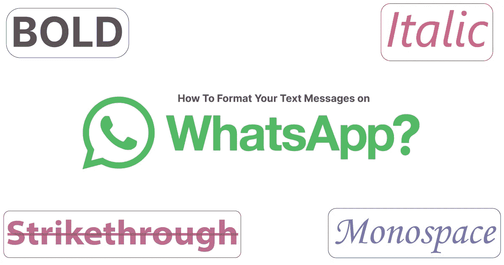
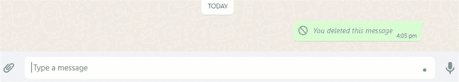
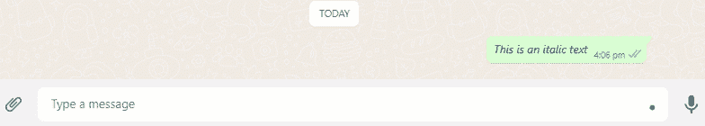
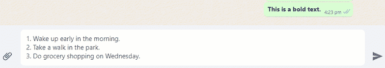
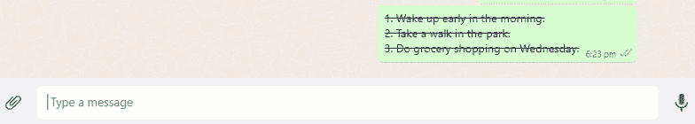
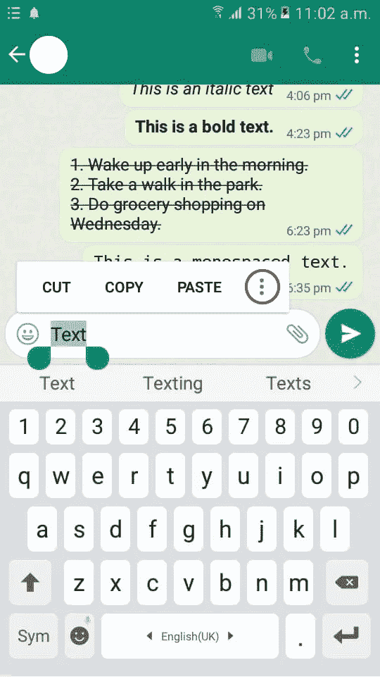
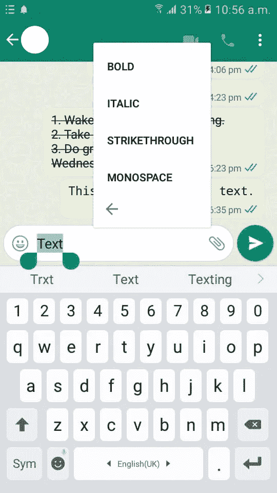

# 如何在 WhatsApp 上格式化你的短信？

> 原文：<https://levelup.gitconnected.com/how-to-format-your-text-messages-on-whatsapp-94fccb762369>

*探索技巧&在 WhatsApp 上格式化纯文本消息的技术。*



**问题的描述**

# 问题

自从 WhatsApp 进入市场以来，人们更喜欢使用它而不是发送短信。每个人都想在一眨眼的时间内聊天，从学校到学院到大型企业公司。

有时纯文本不足以抓住读者的注意力。下面是一些我们在使用纯文本时经常遇到的真实例子:

1.  一个人如何在不加粗的情况下突出品牌名称？
2.  你如何在不划掉课文的情况下回忆起你完成的家务？
3.  如果引文不是斜体的，如何将它与其他内容区分开来？

为了更好的阅读体验，我们希望我们的信息是**粗体**、*斜体*，甚至是等宽。

# 解决办法

根据 WhatsApp 帮助中心的说法，我们可以用四种方式格式化我们的信息。

## *1。斜体文本*

要使文本*变为斜体*，请将其放在两个下划线 **(_)** 之间；参考下面的片段和演示。

```
_This is an italic text_
```



**WhatsApp 中斜体文本的演示。**

## 2.粗体文本

要使文本**加粗**，将其置于两个星号 **(*)** 之间；参考下面的片段和演示。

```
*This is a bold text.*
```



**WhatsApp 中粗体文本的演示。**

## 3.删除线文本

要删除文本，将其置于两个波浪号 **(~)** 之间；参考下面的片段和演示。

```
~1\. Wake up early in the morning.~
~2\. Take a walk in the park.~
~3\. Do grocery shopping on Wednesday.~
```



**WhatsApp 中删除线文本演示。**

## 4.等宽文本

要将文本格式化为等宽格式，请用三个反斜杠**(` ` `)将它括起来；参考下面的片段和演示。**

```
```This is a monospaced text.```
```



**WhatsApp 中等宽文本演示。**

Psst…另一个很酷的功能是，你可以在 Android 或 iOS 设备上应用这些格式，只需点击菜单，如以下步骤所示。

1.  选择您想要格式化的文本并点击三个点。



**安卓三点菜单演示。**

2.点击您希望应用于文本的任何格式。



**Android 中文本格式化选项的演示。**

# 结论

通过使用这些方便的技巧，你的信息会看起来更吸引人，更吸引读者。虽然最初可能会有点沮丧，但经过一些练习，你会发现这是在 WhatsApp 上展示内容的一种很好的方式。

非常感谢你读到这里！

# 参考

**【1】:如何格式化你的信息| WhatsApp 帮助中心** [https://faq.whatsapp.com/539178204879377/?helpref=uf_share](https://faq.whatsapp.com/539178204879377/?helpref=uf_share)