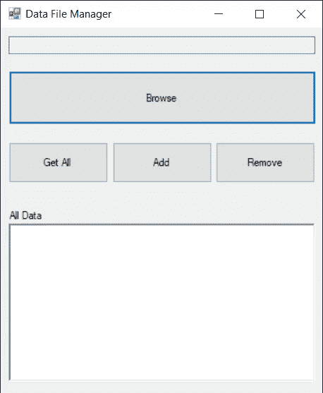
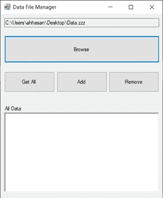
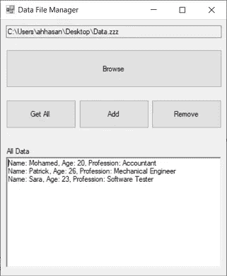
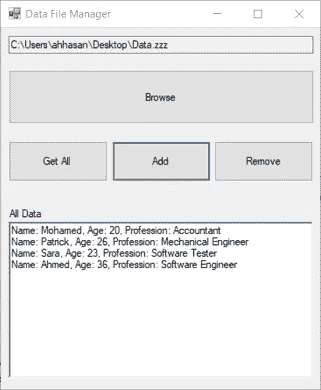
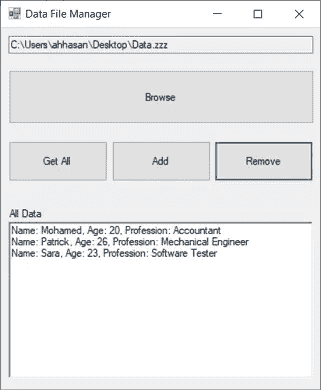
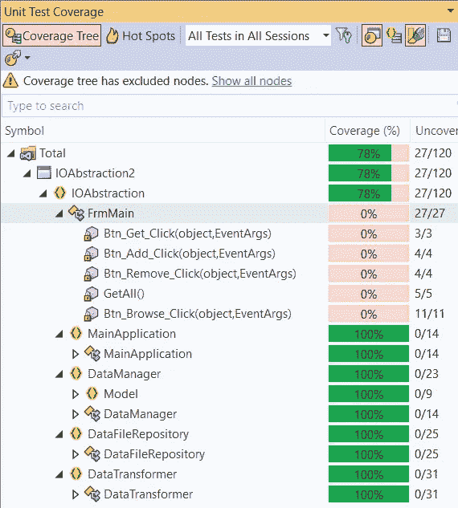

# 如何在中全面介绍基于 I/O 文件的应用程序。带有单元测试的. NET C#

> 原文：<https://levelup.gitconnected.com/how-to-fully-cover-i-o-file-based-applications-in-net-c-with-unit-tests-ca75c07f3b2c>

## 单元测试

## 学习如何将应用程序划分成更小的模块，这样你就可以 100%覆盖这些模块

由[库普先生/杨奇煜·巴勒](https://unsplash.com/@iammrcup?utm_source=unsplash&utm_medium=referral&utm_content=creditCopyText)在 [Unsplash](https://unsplash.com/?utm_source=unsplash&utm_medium=referral&utm_content=creditCopyText) 上拍摄，由[艾哈迈德·塔里克](https://medium.com/@eng_ahmed.tarek)调整

在为不同的软件公司工作时，我不止一次有机会开发主要基于 **I/O 文件**操作的应用程序。

团队在开发这类应用程序时面临的最大挑战是，I/O 文件操作很难被单元测试、自动竹构建和许多其他事情所涵盖。

因此，一劳永逸地，我决定拿出我能想到的最好的设计来克服这些挑战。但是，只是提醒一下，软件中没有什么是绝对的真理。对于每个应用程序，你都必须重新考虑你的设计，看看哪里适合，哪里不适合，最后你需要适应。

现在，像往常一样，我将提供一个简单的例子，并带您完成这个旅程，以提出最佳的解决方案。

 [## 订阅艾哈迈德的时事通讯？

### 订阅艾哈迈德的时事通讯📰直接获得最佳实践、教程、提示、技巧和许多其他很酷的东西…

medium.com](https://medium.com/subscribe/@eng_ahmed.tarek) 

# 示例应用程序

图片由[艾哈迈德·塔里克](https://medium.com/@eng_ahmed.tarek)拍摄

就要求而言，我们的应用程序非常简单:

1.  如你所见，用户界面很简单。为简单起见，它被实现为一个 Windows 窗体项目。
2.  应用程序处理的数据文件是一个扩展名为`.zzz`的文本文件
3.  数据文件中的每个条目都是{姓名}、{年龄}、{职业}的形式，如下:
    `Mohamed,20,Accountant
    Patrick,26,Mechanical Engineer
    Sara,23,Software Tester`
4.  请注意，条目由换行符`\r\n`分隔。
5.  点击**浏览**按钮打开`.zzz`文件。文件的路径将出现在浏览按钮上方的只读文本框中。
6.  点击 **Get All** 按钮，应用程序从所选的`.zzz`文件中读取数据，并将其显示在 UI 底部的 **Reach 文本框**中。
7.  单击 **Add** 按钮，这样应用程序会向文件添加一个硬编码条目，并更新 UI 底部的 Reach 文本框。
8.  单击**删除**按钮，这样应用程序将删除文件中的最后一个条目，并更新 UI 底部的到达文本框。
9.  以下是一些截图，可以帮助你了解整体情况:

点击**后，浏览**并选择一个`.zzz`文件

点击**后获得全部**

点击**后添加**

点击**后，移除**

**所有的代码都可以在** [**这个资源库**](https://github.com/AhmedTarekHasan/HowToAbstractIO) **中找到，这样你就可以很容易地跟随。**

米凯尔·西根在 [Unsplash](https://unsplash.com/?utm_source=unsplash&utm_medium=referral&utm_content=creditCopyText) 上拍摄的照片

# 放弃

1.  一些最佳实践已经被丢弃/忽略，以将主要焦点转移到本文的核心目的和最佳实践上。
2.  可以对解决方案进行一些增强，但是它们将留给您作为练习来实现。
3.  所有的代码都可以在[这个资源库](https://github.com/AhmedTarekHasan/HowToAbstractIO)中找到，这样你就可以很容易地理解了。
4.  同一个存储库中也有一个示例数据文件，您可以在这里找到它。

照片由[迈赫迪](https://unsplash.com/@messrro?utm_source=unsplash&utm_medium=referral&utm_content=creditCopyText)在 [Unsplash](https://unsplash.com/?utm_source=unsplash&utm_medium=referral&utm_content=creditCopyText) 上拍摄，由[艾哈迈德·塔雷克](https://medium.com/@eng_ahmed.tarek)调整

# 错误代码

当试图实现这个应用程序时，这可能是您想到的第一件事。

我们可以注意到，所有代码都在一个地方:

1.  处理(打开、读取内容和写入内容)物理文件的逻辑。
2.  执行 UI 命令的逻辑。
3.  格式化数据和更新用户界面的逻辑。

这带来了许多挑战，比如

1.  一个班级的责任太多了。
2.  依赖于像`System.IO.File`这样的静态类。
3.  如果不使用 **UI 逻辑**，就无法测试 **I/O 操作逻辑**。
4.  如果不使用 **I/O 操作逻辑**，就无法测试 **UI 逻辑**。
5.  将需要总是有物理数据文件，以便能够用单元测试覆盖代码。
6.  即使您成功地创建了这些单元测试及其相关的物理文件，这些文件也总是需要维护、存储，
7.  他们会让计划和实现**持续集成(CI)** 和**持续交付/部署(CD)** 成为一场噩梦。

因此，现在是解决这个问题的时候了。

由 [Carson Masterson](https://unsplash.com/@carsonmasterson?utm_source=unsplash&utm_medium=referral&utm_content=creditCopyText) 在 [Unsplash](https://unsplash.com/?utm_source=unsplash&utm_medium=referral&utm_content=creditCopyText) 上拍摄，由 [Ahmed Tarek](https://medium.com/@eng_ahmed.tarek) 调整

# 好代码

这里的主要思想是将整个解决方案分成更小的部分，我们可以控制这些部分，并且容易用单元测试来覆盖它们。

## ISystemFileOperationsManager

我们可以注意到的是:

1.  这是一个接口，表示我们在整个解决方案中使用的一些 I/O 文件操作。
2.  拥有这个接口的主要目的是抽象出我们对 I/O 文件操作的依赖性。
3.  当试图用单元测试覆盖我们的解决方案时，这种抽象会非常有用，因为现在我们有了一个可以模仿的已定义的依赖关系。

## NtfsOperationsManager

我们可以注意到的是:

1.  这是实现`ISystemFileOperationsManager`接口。
2.  它是`System.IO.File`类的**瘦**包装器。
3.  这就是为什么我们可以轻松安全地从代码覆盖中排除这个类，因为我们实际上没有覆盖。NET 内置类。

## IDataFileRepository

我们可以注意到的是:

1.  这是表示存储库管理器的接口，它知道我们的数据文件的存在，以及如何向它们写入文本和从中读取文本。
2.  当试图用单元测试覆盖我们的解决方案时，这种抽象会非常有用，因为现在我们有了一个可以模仿的已定义的依赖关系。

## 数据文件存储库

我们可以注意到的是:

1.  这是实现`IDataFileRepository`接口。
2.  它在内部依赖于`ISystemFileOperationsManager`并使用它来进行 I/O 文件操作。

## 数据输入

我们可以注意到的是:

1.  这是代表我们的实体的数据对象，它被保存到我们的数据文件中并从中检索。
2.  为了简单起见，这里的`Age`属性被实现为字符串。
3.  此外，这个类应该实现`IEquatable<DataEntry>`以便于对其应用比较操作。我将把这一部分留给您来实现。

## idata 变压器

我们可以注意到的是:

1.  这是表示任何知道如何在文本和我们的`DataEntry`之间转换的转换器的接口。
2.  当试图用单元测试覆盖我们的解决方案时，这种抽象会非常有用，因为现在我们有了一个可以模仿的已定义的依赖关系。

## 数据转换器

我们可以注意到的是:

1.  这是实现`IDataTransformer`接口。
2.  这个类封装了所有关于文本和`DataEntry`之间数据转换的知识。

## IDataManager

我们可以注意到的是:

1.  这是代表任何管理器的接口，该管理器能够管理我们的应用程序数据，而无需了解保存这些数据的介质。
2.  在这个层面上，没有对**文件**的引用。

## 数据管理器

我们可以注意到的是:

1.  这是实现`IDataManager`接口。
2.  它在内部依赖于`IDataFileRepository`，并使用它在数据文件中保存和检索数据。
3.  此外，它在内部依赖于`IDataTransformer`，并使用它来执行所需的转换。

## 主应用程序

我们可以注意到的是:

1.  这是处理通过应用程序 UI 触发的业务逻辑的类。
2.  我没有把这个类抽象成一个接口，但是你肯定可以做到。我将把这个留给你去实现。

## 弗曼

我们可以注意到的是:

1.  这是主窗体类。
2.  它内部依赖于`MainApplication`类，并使用它来执行应用程序的主要业务逻辑。

照片由 [Testalize.me](https://unsplash.com/@testalizeme?utm_source=unsplash&utm_medium=referral&utm_content=creditCopyText) 在 [Unsplash](https://unsplash.com/?utm_source=unsplash&utm_medium=referral&utm_content=creditCopyText) 上拍摄，由 [Ahmed Tarek](https://medium.com/@eng_ahmed.tarek) 调整

# 测试时间

现在，是时候尝试用单元测试覆盖我们的解决方案了。这里你会注意到用单元测试覆盖我们的整个解决方案是多么容易。

现在，每个模块都被设计为尽可能少做一些事情，并且有自己明确定义的依赖关系。

所以，现在让我们创建我们的单元测试项目。我正在使用 NUnit 和 Moq 库进行测试和模拟。

## 数据文件存储测试

## 数据管理器测试

## 数据转换测试

## 主应用测试

当我们运行所有这些单元测试并计算测试覆盖率时，这将是结果。

图片由 [Ahmed Tarek](https://medium.com/@eng_ahmed.tarek) 提供

正如您可以从截图中注意到的，覆盖率中唯一缺少的部分是`Form`代码本身。它能被覆盖吗？

是的，它也可以包括在内，但是，我将把它留给您来实现。

由 [nck_gsl](https://pixabay.com/users/nck_gsl-3554748/) 在 [Pixabay](https://pixabay.com) 拍摄，由 [Ahmed Tarek](https://medium.com/@eng_ahmed.tarek) 调整

# 最后的想法

现在，有了新的设计，我们可以轻松地用单元测试覆盖我们解决方案的每一个方面，完全控制我们的应用程序模块是如此容易。就是这样…

最后，希望你觉得读这个故事和我写它一样有趣。

# 希望这些内容对你有用。如果您想支持:

如果您还不是**媒介**会员，您可以使用 [**我的推荐链接**](https://medium.com/@eng_ahmed.tarek/membership) ，这样我就可以从**媒介**中获得您的一部分费用，您无需支付任何额外费用。订阅 [**我的简讯**](https://medium.com/subscribe/@eng_ahmed.tarek) 将最佳实践、教程、提示、技巧和许多其他有趣的东西直接发送到您的收件箱。

## 想多看作者？

 [## 何时不使用 DI、IoC 和 IoC 容器

### 知道什么时候 DIs 不是正确的解决方案，什么时候应该使用更好的设计

better 编程. pub](https://betterprogramming.pub/when-not-to-use-di-ioc-and-ioc-containers-f95881d0fe0)  [## 如何全面覆盖。带有单元测试的. NET C#控制台应用程序

### 知道什么吗？又是怎么做到的？使用 TDD、DI 和 IoC 完全覆盖您的控制台应用程序。

itnext.io](https://itnext.io/how-to-fully-cover-net-c-console-application-with-unit-tests-446927a4a793)