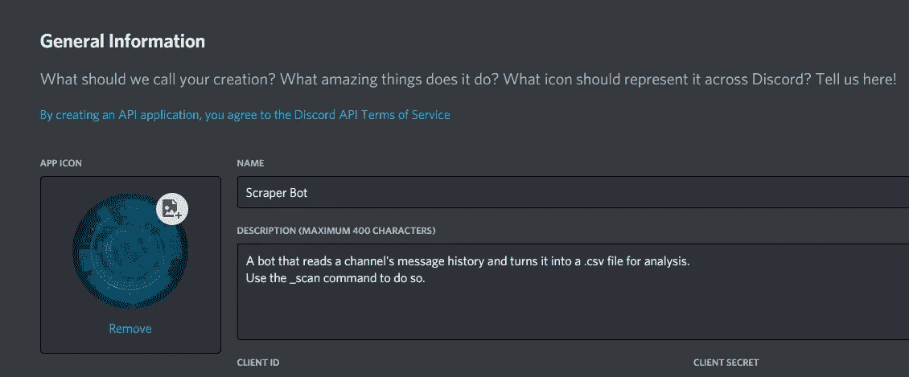
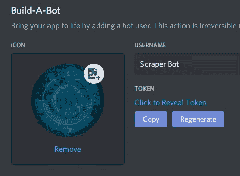

# 如何使用 Python 从头开始使用 Discord Bot 收集消息数据

> 原文：<https://levelup.gitconnected.com/how-to-gather-message-data-using-a-discord-bot-from-scratch-with-python-2fe239da3bcd>

## 如果您想处理来自 discord 服务器的文本数据，一个简单的 bot 是最好的方法。


马修·费雷罗在 [Unsplash](https://unsplash.com?utm_source=medium&utm_medium=referral) 上的照片

# 介绍

在这个时代，利用文本分析的应用无处不在，从典型的垃圾邮件过滤器到能够从邮件中获取足够信息的聊天机器人，它们甚至可以对邮件做出响应。

关于文本处理有很多可能性，但是无论你想做什么，你都需要数据。此外，尽管这些数据可能来自几乎任何地方，但如果你在寻找代表人们日常谈话方式的文本数据，你只需看看社交媒体就够了。

一些社交媒体平台，如 WhatsApp 或 Telegram，允许你直接导出聊天记录，供你随意使用。但是，对于我们这些想要做一些涉及其他平台的事情的人来说，我们必须找到自己的方式来做这件事。这就是为什么在这篇文章中，我将向你展示如何使用一个不和谐机器人来抓取你自己的服务器上的消息历史数据，以供你使用。


[不和谐](https://discord.com/)标志

# 正在设置

首先，您需要在 [Discord 开发者门户](https://discord.com/developers)中创建一个应用程序，为您的机器人提供一个令牌。你所需要做的就是用你的 Discord 账户登录，一旦你登录，点击**新应用**并给它一个名字。如果你愿意，也可以上传一张图，描述一下。



您的应用程序的**一般信息**选项卡是什么样的。

创建好应用程序后，进入设置菜单中的 bot 选项卡，点击**添加 Bot** 。你可以选择你的机器人的用户名不一致，并上传其个人资料图片，这将是与该应用程序的默认相同。但是我们在这个页面上想要的是您的**令牌**，我们将需要它来运行这个机器人。



Discord 将使用**令牌**来识别您的机器人。

随着机器人的创建，在开始编码之前，你需要做的最后一件事是安装 [discord.py](https://discordpy.readthedocs.io/en/latest/intro.html#installing) ，这是一个用于用 Python 编写 discord 机器人的库，以及 [Pandas](https://pandas.pydata.org/docs/getting_started/install.html) ，这是一个数据分析和操作库。使用 *pip* 通过运行下面的一行可以很容易地完成安装:

对于 Windows:

```
py -3 -m pip install -U discord.pypip install pandas
```

对于 Linux:

```
python3 -m pip install -U discord.pypip3 install pandas
```

对于 anaconda 用户来说，Pandas 已经安装好了。

# 启动机器人

我们首先导入我们安装的两个模块，并定义客户端和公会变量，它们分别用于引用机器人本身和服务器，也称为公会。

为了使机器人通用，这样我们就不必一直获取我们想要分析的每个服务器的唯一 ID，我们将使它读取我们调用命令的任何通道。

为此，我们使用 discord.py 库中的***on _ message()****异步函数，该函数在每次发送新消息时运行。然后，我们检查消息作者是否是机器人本身，如果不是，则检查消息是否以我们定义为命令调用的任何字符串开始，在本例中我将该字符串设置为“_”。*

*如果消息是以命令调用开始的，我喜欢将它的内容分开，然后将第一个元素保存到一个“命令”变量中，其余的保存到一个参数列表中。但是因为我们将让机器人读取我们调用命令的通道，这部分是可选的。*

*如果“command”变量等于我们命名的命令(在本例中为“_scan”)，那么我们运行代码。*

# *读取数据*

*我们可能希望从服务器的消息历史记录中跟踪许多变量。但是，为了简单起见，我们将只查看消息是何时发送的，是谁发送的，以及消息本身的内容。为此，我们创建了一个数据框，每个数据框包含一列。*

*为了将数据读入数据帧，我们将使用 discord.py 库中 *TextChannel* 类的***history()****方法，我们通过使用消息的 Channel 属性来访问该方法。该方法允许我们使用 for 循环来遍历信道历史中的 **n** 条消息，其中 **n** 是该方法本身的参数，默认设置为 100。**

**一旦进入循环，我们可以使用 if 语句来避免我们的 bot 发送的消息(在这种情况下，它不会发送任何消息)以及我们用来触发它的命令调用。然后，我们将消息的内容、创建时间和作者(这些都可以通过消息的属性访问)添加到数据帧中，并使用 Pandas 的 ***to_csv()*** 方法在本地将其保存为. csv 文件。**

**最后，使用 ***client.run()*** 函数来设置您的 bot 运行，并粘贴您从开发者门户获得的令牌作为参数。**

# **结论**

**来自社交媒体的文本数据可以让我们了解人们的行为，这也不例外。虽然让一个机器人抓取数据不像简单地导出数据那么容易，但这样做打开了通向另一个有数据要分析的平台的大门。**

**如果您想要一个 bot，它将通道和消息数量作为命令参数读取，并有一个 help 命令。我的 GitHub 中有这个机器人的更好的版本，如果你想复制或检查完整的代码。**

**无论哪种方式，现在你知道如何获得数据，天空是你能做的极限。**