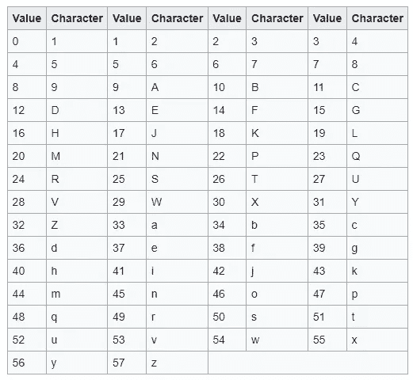
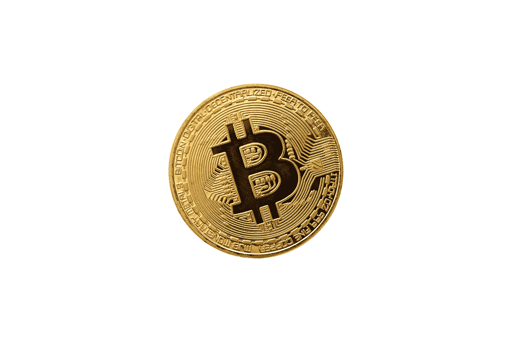

# 如何从纯随机性生成一个比特币地址？

> 原文：<https://levelup.gitconnected.com/how-to-generate-a-bitcoin-address-from-pure-randomness-5fba416c5bad>

我们来看看比特币地址是如何产生的过程。

## 生成私钥

计算机系统可以通过两种方式生成随机数:

*   **伪随机数生成(PRNG)**

计算机使用**算法**从**种子/根值**中生成一个随机数。

这将生成一个伪随机数/非真随机数，因为如果我们知道用于生成随机数的种子和算法，我们就可以预测这个数。

*   **真随机数生成(TRNG)**

计算机系统使用**物理过程**生成随机数。

这些数字确实是随机的，因为控制这些数字生成的方程是未知的/不可计算的。

比特币软件使用底层操作系统的随机数生成器来产生一个 **256 位(32 字节/ 64 个十六进制数字)长的真正随机数**。

这被称为**私钥。**


由 [Robert Stump](https://unsplash.com/@stumpie10?utm_source=medium&utm_medium=referral) 在 [Unsplash](https://unsplash.com?utm_source=medium&utm_medium=referral) 上拍摄的照片

## 从私钥中导出公钥

公钥是由私钥使用一个[椭圆曲线加密函数](https://medium.com/codex/the-mathematics-behind-bitcoin-522f72ed87b7)导出的，我已经在下面提到的帖子中描述了这个函数。

[](https://medium.com/codex/the-mathematics-behind-bitcoin-522f72ed87b7) [## 比特币背后的数学

medium.com](https://medium.com/codex/the-mathematics-behind-bitcoin-522f72ed87b7) 

请注意，这是一个**单向函数**。

这意味着可以从私钥派生出公钥，但永远不能从私钥派生出公钥。

公钥的长度为 **33 字节/ 66 个十六进制数字**。

这可以与其他用途分享，以获得金钱。

但是 66 个十六进制数字是一个很长的数字，不是吗？

让我们缩短它。


[Art Rachen](https://unsplash.com/@artrachen?utm_source=medium&utm_medium=referral) 在 [Unsplash](https://unsplash.com?utm_source=medium&utm_medium=referral) 上拍摄的照片

## 使用 SHA256 散列

使用 [SHA256](https://en.wikipedia.org/wiki/SHA-2) (另一种单向散列函数)缩短并散列公钥。

结果是 **32 字节/ 64 个十六进制数字**长。

## 使用 RIPEMD160 散列

之前的 SHA256 散列被缩短，并使用另一个名为 [RIPEMD160](https://en.wikipedia.org/wiki/RIPEMD) 的单向散列函数进行散列。

结果是 **20 字节/ 40 个十六进制数字**长，被称为**公钥散列(PKH)。**

这可以与其他用户共享，而不是与公钥共享。

同样，由于它是一个随机的字符串，很容易出现**输入错误**。

让我们来解决这个问题！


照片由 [Courtney Corlew](https://unsplash.com/@courtneycorlew?utm_source=medium&utm_medium=referral) 在 [Unsplash](https://unsplash.com?utm_source=medium&utm_medium=referral) 上拍摄

## 创建版本化的 PKH

版本号`00`被添加到 PKH。结果是一个**版本化的 PKH** 。

让我们来一个 PKH。

```
5f2613791b36f667fdb8e95608b55e3df4c5f9eb
```

PKH 的版本将是:

```
**00**5f2613791b36f667fdb8e95608b55e3df4c5f9eb
```

## 创建校验和

版本 PKH 用 SHA256 散列两次，该结果的前四个字节(称为**校验和**)被附加到版本 PKH。

该校验和有助于防止键入错误。

上述操作的结果是 **25 字节(50 个十六进制数字)**长。

```
**00**5f2613791b36f667fdb8e95608b55e3df4c5f9eb**12181e60****00: Version
12181e60: Checksum**
```


照片由[丹·克里斯蒂安·pădureț](https://unsplash.com/@dancristianpaduret?utm_source=medium&utm_medium=referral)在 [Unsplash](https://unsplash.com?utm_source=medium&utm_medium=referral) 拍摄

让我们快速绕道。

十六进制编码由以下字符组成。

```
0123456789ABCDEF
```

请注意，十六进制数字在表示数据字节时效率很低。

> 2 个十六进制数字= 1 个字节= 8 位数据

另一种广泛使用的编码方案称为 **base64** ，它包含以下字符:

```
ABCDEFGHIJKLMNOPQRSTUVWXYZabcdefghijklmnopqrstuvwxyz0123456789+/
```

> 1 base64 字符= 6 位数据

为了防止键入错误，我们可以通过删除以下内容来创建另一种编码方案:

*   **L**T38**I**(小写 L，大写 I)
*   **0** & **O** (零和大写 O)

因为他们看起来很相似。

*   特殊字符( **+** & **/** )，因为在复制和粘贴时，它们会阻止双击选择整个字符串

去掉这 6 个字符后，剩下 58 个字符。

```
123456789ABCDEFGHJKLMNPQRSTUVWXYZabcdefghijkmnopqrstuvwxyz
```

这些构成了 **base58** 编码方案。

## 创建地址的 Base58 编码

让我们对之前的结果进行 base58 编码。

```
**00**5f2613791b36f667fdb8e95608b55e3df4c5f9eb**12181e60****00: Version
12181e60: Checksum**
```

删除版本字节`00`:

```
5f2613791b36f667fdb8e95608b55e3df4c5f9eb**12181e60**
```

将其转换为十进制:

```
2333040184766738101355977925681426545668075806022526574176
```

重复用 58 除这个数，直到商为 0。

储存该过程的剩余部分。

```
12 22 10 24 45 37 11 39 54 21 14 43 19 34 1 16 39 8 18 48 38 42 4 14 23 46 38 7 46 46 5 39 8
```

在下表中查找每个余数的对应字符。



Base58 编码字符查找表(图片来自维基百科)

这会产生以下字符:

```
DPBRneCgwNFkLb2Hg9Kqfj5FQof8oo6g9
```

每个删除的版本字节加 1`00`:

```
DPBRneCgwNFkLb2Hg9Kqfj5FQof8oo6g9**1**
```

反转字符以获得最终结果:

```
19g6oo8foQF5jfqK9gH2bLkFNwgCenRBPD
```

这是最后的**地址**，它很短，可以防止打字错误，并且可以与他人共享以接收资金。

这就是如何从随机性中创建一个比特币地址！



杰瑞米·贝赞格在 [Unsplash](https://unsplash.com?utm_source=medium&utm_medium=referral) 上的照片

*感谢阅读！*

[](https://bamania-ashish.medium.com/membership) [## 通过我的推荐链接加入 Medium-Ashish Bama nia 博士

### 阅读 Ashish Bamania 博士(以及 Medium 上成千上万的其他作家)的每一个故事。您的会员费直接…

bamania-ashish.medium.com](https://bamania-ashish.medium.com/membership) 

# 分级编码

感谢您成为我们社区的一员！在你离开之前:

*   👏为故事鼓掌，跟着作者走👉
*   📰查看[升级编码出版物](https://levelup.gitconnected.com/?utm_source=pub&utm_medium=post)中的更多内容
*   🔔关注我们:[Twitter](https://twitter.com/gitconnected)|[LinkedIn](https://www.linkedin.com/company/gitconnected)|[时事通讯](https://newsletter.levelup.dev)

🚀👉 [**加入升级人才集体，找到一份神奇的工作**](https://jobs.levelup.dev/talent/welcome?referral=true)