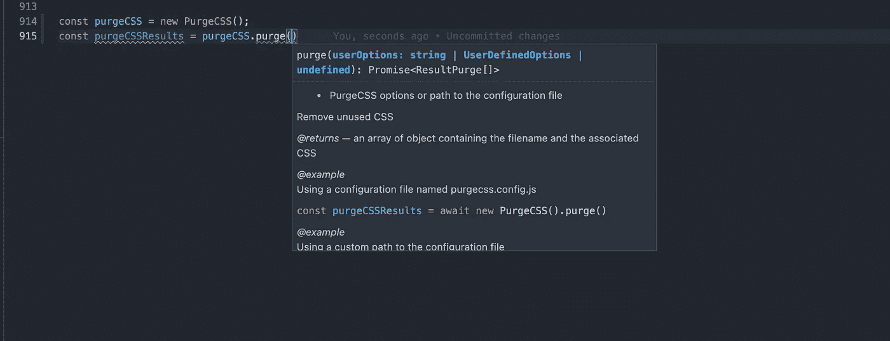
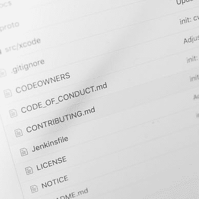

# 如何生成 TypeScript API 参考:使用 TypeScript 构建 NPM 包

> 原文：<https://levelup.gitconnected.com/how-to-generate-a-typescript-api-reference-building-an-npm-package-with-typescript-9b2dc44a3aaa>

## 从 TSDoc 评论到 vuepress 文档网站


约书亚·阿拉贡在 [Unsplash](https://unsplash.com/s/photos/code?utm_source=unsplash&utm_medium=referral&utm_content=creditCopyText) 上拍摄的照片

在[的上一篇文章](https://medium.com/full-human/creating-the-documentation-website-building-an-npm-package-with-typescript-f482ff80f28b)中，我们看了看使用 Diataxis 文档系统框架为文档写些什么。该框架的四个主要文档部分之一是技术参考。技术参考是构建工具可以使用我们的代码来生成 API 参考的地方。

# TSDoc 快速介绍

在 Javascript 中，您可以使用一种叫做 JSDoc 的特殊格式的注释用代码记录您的 API。在 TypeScript 中，有一个等价的东西叫做 TSDoc。TSDoc 是这种类型注释的规范，由微软编写。

这里有一个简单的例子，说明如何将 TSDoc 添加到代码中。

在这里，我们看到了 TSDoc 注释的主要构件。首先，我们有方法的描述，后面是参数，关键字是 *@param* 。您可以添加对该方法返回内容的解释( *@returns* )以及如何使用该方法的示例( *@example* )。

创建此文档将允许我们生成降价文件以添加到我们的文档网站。但是将它添加到您的 IDE 中也会有好处。像 VsCode 这样的编辑器可以理解 TSDoc，并像这样向您显示文档:



# 在我们的包中使用 TSDoc

开始使用 TSDoc 并不需要太多东西。但是您可以添加 eslint-plugin-tsdoc 来确保您没有犯语法错误。要安装 eslint 插件，请运行

```
npm i -D eslint-plugin-tsdoc
```

并将其添加到您的 eslint 配置文件中。

为了生成 API 引用，我们有两个选择:我们可以使用 [typedoc](https://github.com/TypeStrong/typedoc) 或者使用微软提供的一些[包](https://github.com/microsoft/rushstack/tree/master/apps)。我提到 typedoc 是因为它似乎是一个流行的选择。需要注意的一点是，typedoc 不遵循 TSDoc 规范。TSDoc 和 typedoc 有些区别，eslint-plugin-tsdoc 会抱怨 typedoc 语法，从[本期](https://github.com/TypeStrong/typedoc/issues/1480#issuecomment-766272234)可以看出。

在本文的其余部分，我们将使用微软的软件包。微软有一个工具叫 api-extractor。该工具将创建一个文档模型，然后可以被另一个名为 api-documenter 的工具用来生成我们的 markdown 文件。

安装 api 提取器和 api 文档器

```
npm i -D @microsoft/api-extractor @microsoft/api-documenter
```

使用`api-extractor init`生成一个基本的 api-extractor.json。这个文件是位于你的包的根目录下的 api-extractor 的配置。您可以启用或禁用 api-extractor 的一些功能，并设置一些选项。

以上是我正在使用的配置。这里有两个重要的元素: *mainEntryPointFilePath* 和 *apiJsonFilePath* 。 *mainEntryPointFilePath* 应该指向 main .d.ts 文件。为了生成降价文件，api-documenter 需要`docModel.apiJsonFilePath`中的文档模型。由于我们使用的是 vuepress，我们可以将 JSON 文件添加到 vuepress *中。temp* 文件夹也一样。

之后，我们可以运行 api-documenter 来使用 JSON 文件生成 markdown 文档。我们的文档是手动创建的，除了一个文件夹 api-reference。由于它已经生成，我们正在将它添加到. gitignore 中。我们还需要更新我们之前创建的工作流[来部署我们的文档网站，以便在部署它之前创建 API 参考。](https://medium.com/p/f482ff80f28b)

在 package.json 中添加

部署文档工作流

下面是生成的最终页面:

[](https://purgecss.com/api-reference/purgecss.purgecss.purge.html) [## 采购

### 移除未使用的 CSS 签名:user options UserDefinedOptions | string | undefined purge CSS 选项或路径到…

purgecss.com](https://purgecss.com/api-reference/purgecss.purgecss.purge.html) 

# 结论

无论是将 API 引用添加到您的网站，还是仅仅在 ide 中提供一个更好的文档，花点时间为您的包的公共 API 编写好的 TSDoc 对您的用户都是有用的。要生成文档页面，可以结合使用 api-extractor 和 api-documenter。

# 到目前为止的系列


[弗罗里尔](https://floriel.medium.com/?source=post_page-----9b2dc44a3aaa--------------------------------)

## 用 TypeScript 构建 NPM 包

[View list](https://floriel.medium.com/list/building-an-npm-package-with-typescript-85c0de70d37c?source=post_page-----9b2dc44a3aaa--------------------------------)10 stories