# 如何在 Python 中生成 AI Alpha 因子

> 原文：<https://levelup.gitconnected.com/how-to-generate-an-ai-alpha-factor-in-python-6509c5cb5bf6>

## 机器学习结合多个阿尔法因素进行量化交易

由 [NeONBRAND](https://unsplash.com/@neonbrand?utm_source=medium&utm_medium=referral) 在 [Unsplash](https://unsplash.com?utm_source=medium&utm_medium=referral) 上拍摄

我在上一篇文章中描述了 alpha 研究的基础知识——[如何在 Python 中建立 Quant 算法交易模型](https://medium.com/swlh/how-to-build-quant-algorithmic-trading-model-in-python-12abab49abe3?sk=56d5b2b038ce6aefa6c2049cff9e89b6)和回溯测试过程[如何在 Python 中执行回溯测试](https://yuki678.medium.com/how-to-perform-backtesting-in-python-af40a36359c6?sk=660a07d07e36d3934ceb2330328e8ad7)。以下是如何应用机器学习技术从多个阿尔法因子中生成一个更好的阿尔法。有许多不同的方法可以实现这一点，我在这里应用的是监督机器学习的分类，以量化的一周远期收益率作为标签，并计算每个标签的加权概率和。

# 特征

在上一篇文章的[第 3 节中，我使用了以下三个因子(等级的 zscore ),并简单地取平均值来计算最终的 alpha 信号。](https://medium.com/swlh/how-to-build-quant-algorithmic-trading-model-in-python-12abab49abe3?sk=56d5b2b038ce6aefa6c2049cff9e89b6)

*   动量 1 年因子
*   均值回归 5 天扇区中性平滑因子
*   隔夜情绪平滑因子

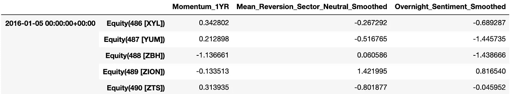

现在，将这些作为机器学习功能的一部分，让我们考虑更多的功能。

## 通用量化特征

添加一些功能来捕捉股票的世界:

*   20 天、120 天的年化波动率
*   20 天、120 天的平均美元成交量
*   部门

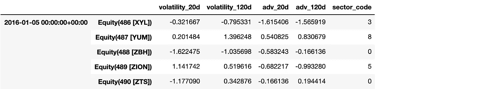

## 政体特征

添加一些功能来捕捉市场范围内的制度:

*   20 天、120 天内的高低波动
*   高分散和低分散 20 天、120 天

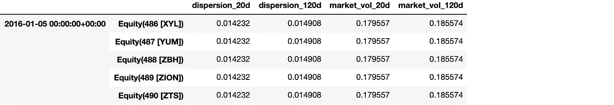

## 日期功能

为树创建分栏，因为日历异常可能会捕捉交易者/投资者的行为。

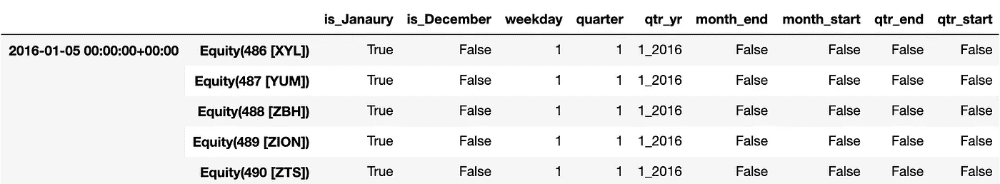

## 一个热编码

扇区值是 0 到 10，这些只是标签，数字本身没有意义。如果我们以此为特征，模型会将该值视为数字输入—例如，3 大于 2 小于 5，1+6=7，这是不正确的。在这种情况下，我们可以应用一个热编码。sklearn 预处理中的 pandas DataFrame 函数`get_dummies`或`OneHotEncoder`很有用，它们基本上是这样做的:

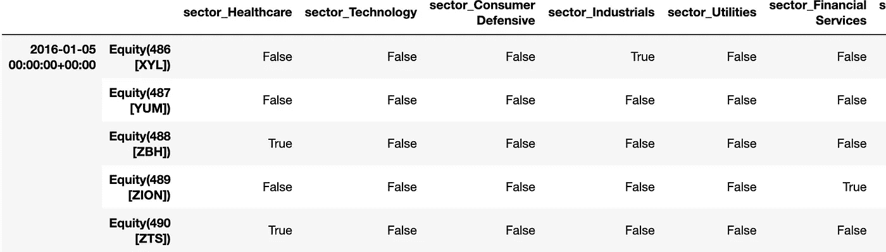

# 目标

让模型根据上述特征预测未来 1 周的回报。虽然可以通过回归或分类来解决这个问题，但是将模型拟合到确切的返回值听起来有点过分。因此，取一个量化的回报，并为每个桶安装一个分类器，然后对每个桶应用一些权重，以合成阿尔法因子。

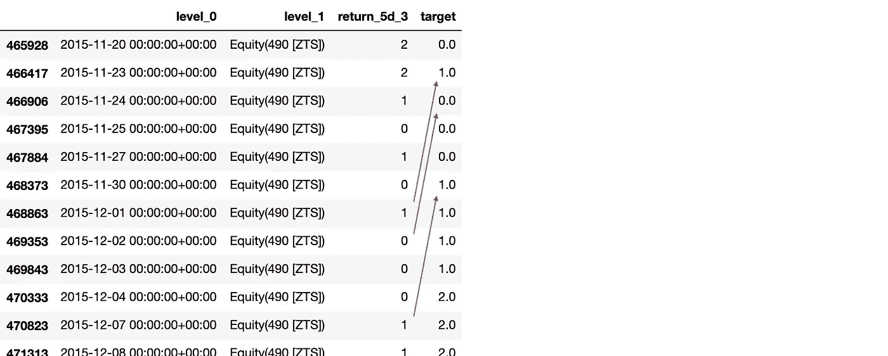

目标标签(由作者创建)

# 模型和训练

现在特征和目标都准备好了，可以应用正常的机器学习模型。

## 拆分数据

数据不应该混洗火车，验证和测试集应该从最老的到新的，因为我们必须使用过去的数据来预测未来。下面这段代码按照与 sklearn 的`train_test_split()`相同的方式，分成 60%的训练、20%的验证和 20%的测试集。

## 培养

使用基于树的分类器，如随机森林，因为它有更好的解释能力。根据最小样本叶≥全域股票数的验证分数调整参数。

虽然精确度相对较低，但仍优于平均或随机加权。您可以可视化决策树和特征重要性，以理解模型背后的逻辑:

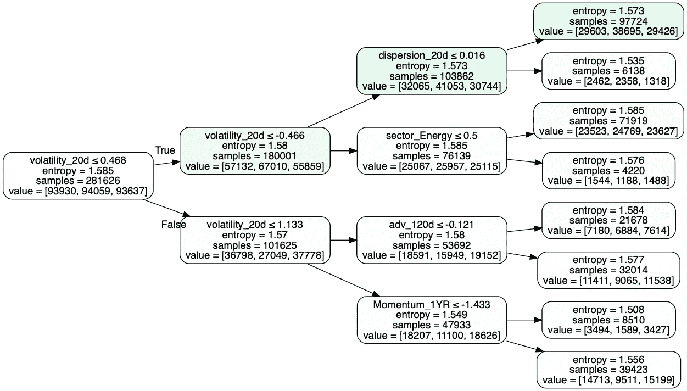

决策树(由作者创建)

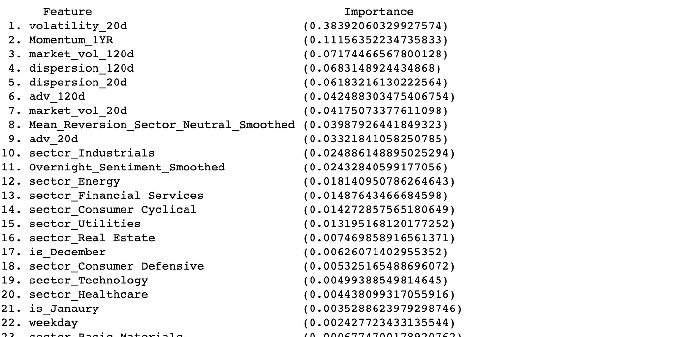

功能重要性(由作者创建)

一旦对量化标签进行了预测，就应用一个权重来生成一个合成的 alpha 向量，在该向量上测量性能。

绩效由`alphalens`以与上一篇文章中解释的相同方式来衡量。

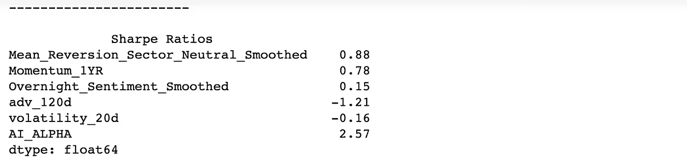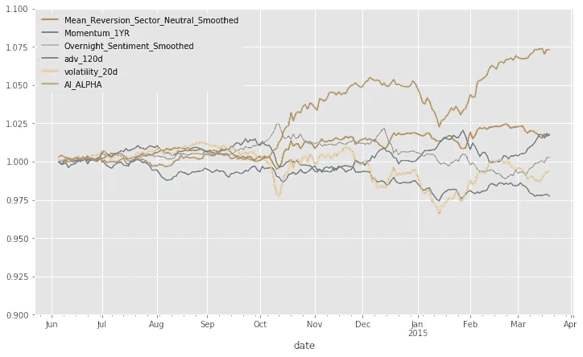

因子回报(由作者创建)

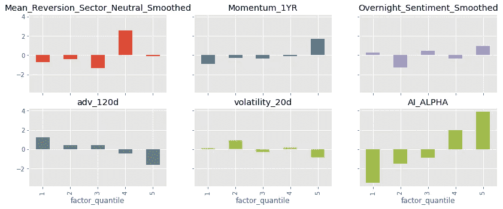

分位数因子回报(由作者创建)

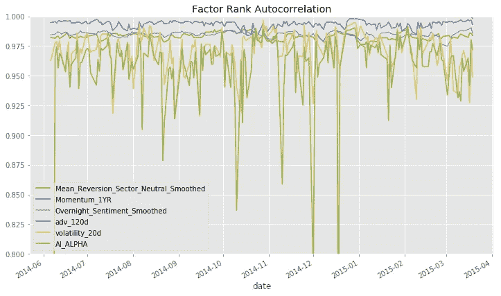

因子等级自相关(由作者创建)

## 非重叠树的系综

重叠样本往往会导致过度拟合，在生产中表现不佳。使用非 IID(即独立和同分布)标签来减轻可能的过度拟合。

## 试验

最后，在所有参数确定后，在未知测试集上测试性能。正如任何机器学习的情况一样，参数不应该基于该测试的性能而改变，以避免泄漏。

首先，将培训前推至生产中的“当天”,以便在培训和验证数据集上重新培训模型。然后，使用`X_test`在测试集上查看性能。

# 结论

这篇文章介绍了一种使用机器学习从多个因子中生成 alpha 向量的基本方法。该模型过于简单且性能不佳，但在真实情况下构建这种模型时，需要考虑许多方面。改进包括但不限于:更复杂的分类器、目标的不同范围和分位数、更多特征和更多输入数据。此外，应该执行回溯测试来验证 alpha，包括交易成本和各种约束，我将在稍后发布另一篇文章。如果你对端到端的 alpha 研究过程感兴趣，请看我之前的帖子:

*   [如何用 Python 建立 Quant 算法交易模型](https://medium.com/swlh/how-to-build-quant-algorithmic-trading-model-in-python-12abab49abe3?sk=56d5b2b038ce6aefa6c2049cff9e89b6)
*   [如何在 Python 中执行回测](https://yuki678.medium.com/how-to-perform-backtesting-in-python-af40a36359c6?sk=660a07d07e36d3934ceb2330328e8ad7)

感谢您的阅读！