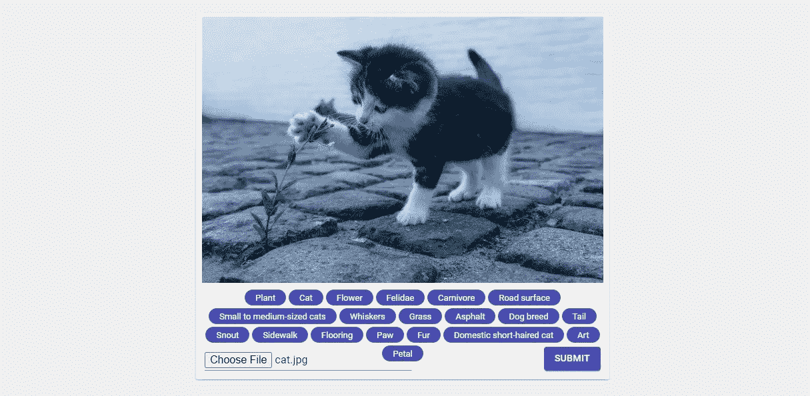
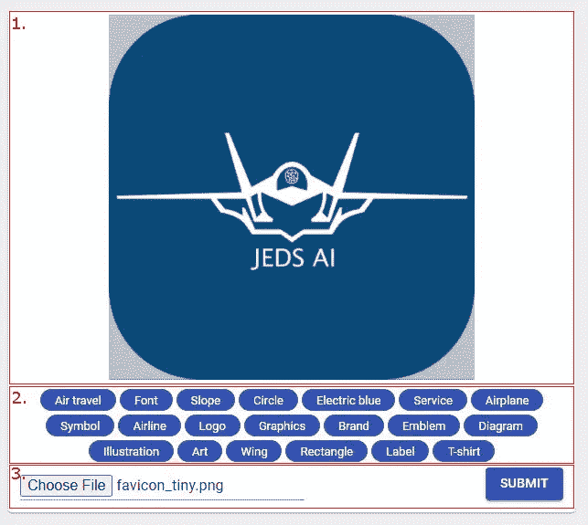
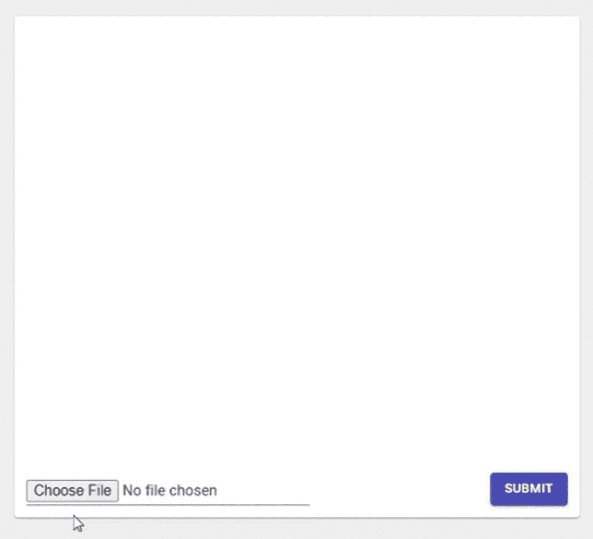

# 如何自动生成图像标签

> 原文：<https://levelup.gitconnected.com/how-to-generate-image-tags-automatically-fbb9f7bc6381>

## 使用人工智能 API 增强图像上传

 [## JEDS 人工智能/带元标签的图片上传

### 这个项目展示了如何使用谷歌人脸识别自动生成图片上传的元标签…

github.com](https://github.com/JEDS-AI/picture-upload-with-meta-tags) 

# 介绍

本文将向您展示如何自动生成图像标签。所谓标签，我指的是描述图像中可见内容的关键词。对于下面的例子图像，我希望像这样的标签:**猫，小猫，花，鹅卵石。**

图片由 [Dim 侯](https://pixabay.com/users/dimhou-5987327/?utm_source=link-attribution&amp;utm_medium=referral&amp;utm_campaign=image&amp;utm_content=2536662)发自 [Pixabay](https://pixabay.com/?utm_source=link-attribution&amp;utm_medium=referral&amp;utm_campaign=image&amp;utm_content=2536662)

# 用例

图像标签生成的可能用例有:

*   将图像标签提供给搜索引擎，如果有大量描述图像的元数据，搜索引擎可以提供更好的结果。
*   限制图片上传。根据具体的使用情况，某些图像内容可能不允许上传。
*   你也可以添加标签来提高搜索引擎优化的排名。

# 方法

为了自动生成标签，需要某种算法。更准确地说，是一种标记算法。算法会用图片上看到的东西来标注图片。

当然，你可以自己实现它。甚至有一些机器学习算法，你可以用来这样做…

但在这种情况下，您必须实现围绕它的所有逻辑，您负责更新它并关注它的可用性和性能。这是你想做就能做的事情，但这样做可能真的很麻烦，很不方便。您还会浪费大量时间，而这些时间本可以用来实际实现您的业务用例。

更方便的方法是使用现有的 API。在这种情况下，您不必处理算法的可伸缩性、性能和可用性。但是你必须支付一定的费用才能使用这些优惠。

例如，我将使用 Google Cloud Vision API 来实现标记/标签的自动生成。出于测试目的，这不会花费任何成本。以后，每 1000 次请求的数量会很少。

我将使用 Google Cloud Vision API 的[标签检测特性](https://cloud.google.com/vision/docs/labels)。这里还有[完整的特性列表](https://cloud.google.com/vision/docs/features-list)供进一步调查。

Gif by [vh1](https://giphy.com/vh1) 来自 [giphy](https://giphy.com/)

要使用 Google Cloud Vision API，您只需创建一个帐户并执行以下任务。我不会详细讨论这些，因为你可以找到大量的教程来设置它。

*   创建新项目。
*   激活谷歌云视觉 API。
*   启用计费。(不用担心，有免费计划)
    但是真的需要启用，不然就不行。
*   设置身份验证(请随意使用 Google 推荐的方式，使用服务帐户并生成私有和公共密钥。对我来说，生成一个 API 键并在我的请求中使用它要容易得多。根据您的用例，这可能就足够了，否则您可以选择更安全的方法。)

# 测试请求

为了成功完成请求，图像应该是 base64 编码的。您可以在下面的请求正文中看到它。还指定了应该启用哪些功能。在这种情况下，它是“LABEL_DETECTION”特性，我将结果数量限制为 10 个结果。对于这个例子来说，这应该足够了。另外，不要忘记在 URL 后面添加 API 键。

为了测试 API，我使用了下面的示例图片。所以，让我们看看我们的 JEDS 人工智能标志包含什么。

在请求结果中，我们得到了图像的标签列表。标签包含一个描述和一个分数(为了方便起见，我删除了一些其他信息)。结果按分数排序。分数越高，算法越确定该物品在图像中。

如你所见，我得到了像飞机、符号、标志或空中旅行这样的描述。这似乎是一个很好的结果，将这些值作为元数据附加到图片上是有意义的。

# 用例的实现

为了实现一个用例，我想创建一个图片上传组件。这个组件应该能够选择一个图像，显示它，并显示生成的标签。

我开始创建一个基本的 react 应用程序，在官方的 [react 文档](https://reactjs.org/docs/create-a-new-react-app.html#create-react-app)中有描述。您可以在提供的 [GitHub 库](https://github.com/JEDS-AI/picture-upload-with-meta-tags)中查看这个例子，并使用您自己的 API 密匙进行试验。

开发的应用程序由三部分组成。

1.  图像预览
2.  图像标签区域
3.  图像选择

图像预览和图像选择部分应该是不言自明的。这些组件用于显示选定的图像，并从本地文件系统中实际选择一个图像。右侧的提交按钮目前仅用于演示目的。

有趣的部分是图像标签区。在这里，API 响应被迭代，所有结果都显示在图像下方的小气泡中。

目前，没有实现额外的逻辑来过滤结果。但是，举例来说，只显示分数很高的结果是有意义的。或者以某种方式限制图像上传。你可以根据自己的需要自由选择。

# 结果呢

在这里，您可以看到实际效果。

带有自动生成的图像标签的图像选择

# 结论

当在这个用例中使用 Google Cloud Vision API 时，我真的很惊讶结果的准确性。就我目前所见，我不怕直接将请求结果作为图像的元数据传递。甚至对于图片搜索引擎的优化，我认为它会表现很好。谈到性能，我没有什么可抱怨的。请求真的很快，到目前为止我没有失败的请求。因此，如果你想实现一些标签检测用例，我可以向你们推荐谷歌云视觉的 API。你对标签检测 API 有其他的建议吗？让我知道。:)