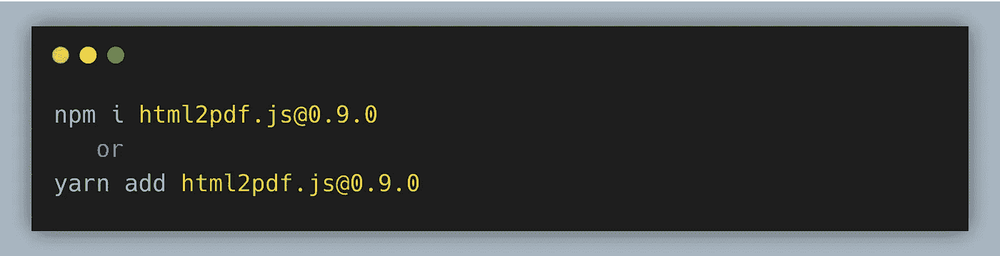
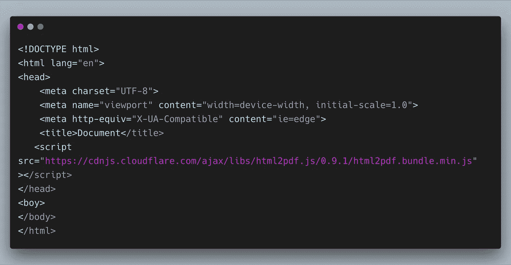
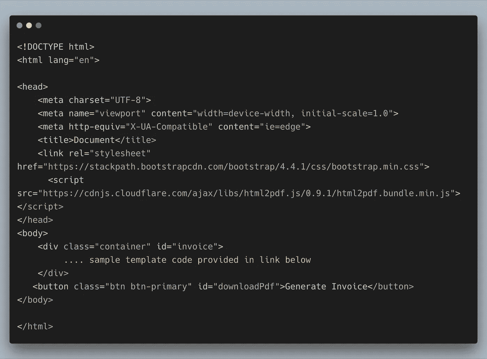
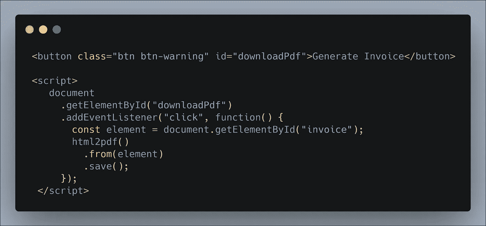

# 如何用 JavaScript 生成 PDF 发票

> 原文：<https://levelup.gitconnected.com/how-to-generate-pdf-invoices-with-javascript-159279f9243e>

蒂姆·阿特伯里在 [Unsplash](https://unsplash.com?utm_source=medium&utm_medium=referral) 上的照片

让你的用户能够从你的网站下载 PDF 格式的数据是一个非常常见的用例。PDF (便携文档格式)文件格式对于下载发票、机票预订、购物车详情等非常有用。

有各种 JavaScript 库可用于从 HTML 生成 pdf。在本教程中，我将使用 [html2pdf](https://www.npmjs.com/package/html2pdf.js/v/0.9.0) 库将 html 转换成 pdf。

html2pdf 通过使用 [html2canvas](https://github.com/niklasvh/html2canvas) 和 [jspdf](https://github.com/MrRio/jsPDF) 将任何网页或元素转换成可打印的 PDF，完全在客户端进行。

## **安装**

如果您使用任何一个软件包管理器，如 npm 或 yarn，您可以安装以下软件:

然而，最简单的使用方法是将 CDN 链接包含在 HTML 文件的 **head** 标签中，如下所示:

现在，在您的 HTML body 标签中，我们可以编写自己的发票模板并创建一个**生成发票**按钮。这里我使用**引导**来设计界面。

我已经创建了一个样本发票模板，并提供了下面的源代码。通过点击按钮，将触发一个事件，下面的脚本将 HTML 转换成 PDF。

从网页下载发票

现在我们可以通过点击**生成发票**按钮来下载发票。为了您的方便，我在这里添加了[源代码](https://github.com/jayanthbabu123/how-to-convert-html-web-pages-to-pdf-in-javascript)。

我希望这些信息能帮助你将 HTML 转换成 PDF，并用 JavaScript 创建 PDF 文件。您可以使用它快速地将“导出到 PDF”功能添加到网页中，而不需要依赖任何服务器端的 API。

谢谢:)