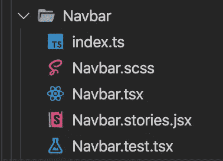

# 如何从终端生成 React 组件

> 原文：<https://levelup.gitconnected.com/how-to-generate-react-components-from-your-terminal-a27741a5b862>

并加快您的工作流程


照片由[伯纳德·赫曼特](https://unsplash.com/@bernardhermant?utm_source=medium&utm_medium=referral)在 [Unsplash](https://unsplash.com?utm_source=medium&utm_medium=referral) 上拍摄

添加一个新的组件可能是一个麻烦的任务，特别是如果你正在编写测试和使用类似 Storybook 的东西。单个组件的文件结构可能如下所示:



您可以通过编写一个节点脚本来获取您需要的任何组件模板并生成这些文件，而不是每次都手动编写，从而节省大量时间。

目前有 npm 包可供您下载和试用，但这种方法的额外好处是您可以调整组件模板，以满足您和您的团队在逐个项目的基础上的需求。

# 你需要什么

1.  文件模板功能
2.  生成和填充文件的节点脚本
3.  逻辑脚本中更新`**components/index.ts**` 文件(可选)
4.  运行节点脚本的 npm 脚本(可选)

让我们首先在项目的根文件夹中创建一个目录来存放模板函数和逻辑。

```
take .generate_component
touch component_templates.js
touch index.js
```

# 组件模板

我的团队使用的一个基本组件的结构示例如下:

components/Navbar/Navbar . tsx

在我们的`**component_templates.js**`文件中，我们可以添加一个函数来生成组件模板，如下所示:

。生成 _ 组件/组件 _ 模板. js

该函数在运行节点脚本时会收到`**name**` 参数。

根据文件夹结构中要包含的文件，可以添加其他组件模板。在我的例子中，我想添加以下模板函数:

*   **组件**
*   **故事**
*   **测试**
*   **木桶**

该文件夹结构的完整文件如下所示:

。生成 _ 组件/组件 _ 模板. js

# 节点脚本

节点脚本的任务将是:

1.  运行脚本时，从终端接受一个参数(组件名)
2.  为新组件创建一个文件夹
3.  将所需文件添加到文件夹中
4.  从`**components/index.ts**` 文件中读取并插入新组件(可选)*

*这是假设您使用一个桶文件来导出 components 文件夹中的所有组件。下面是一个我们用作参考的桶文件示例:

组件/索引. ts

如果您不遵循在`**components/index.ts**`中包含新生成的组件的模式，那么我建议在接下来的例子中删除注释“Optional”后面的代码块。

。生成 _ 组件/索引. js

现在脚本和模板已经运行，您可以通过在终端中输入以下命令来运行脚本:

```
node ./generate_component ComponentName
```

或者，如果您不想直接运行节点脚本，您可以在您的`**package.json**` 文件中编写一个 npm 脚本来运行该命令。

这是一个可能的例子:

```
"scripts": {
  "gc": "node .generate_component $1"
}
```

上面脚本中的`**$1**` 将是运行 npm 脚本时传递给它的任何组件名。

现在您已经编写了 npm 脚本，您可以在终端中运行以下命令:

```
npm run gc ComponentName
```

如果您正确地执行了所有操作，一个新的文件夹应该出现在 components 文件夹中，并且该组件应该包含在您的`**components/index.ts**`文件中。

我希望你能把这种模式结合到你的工作流程中，为自己节省大量的时间！