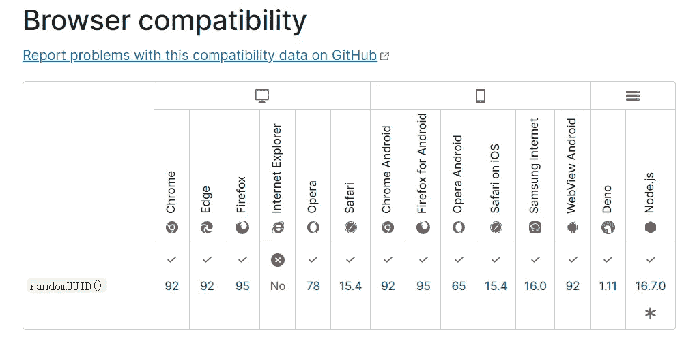

# 如何在 JavaScript 中生成 UUID

> 原文：<https://levelup.gitconnected.com/how-to-generate-uuid-in-javascript-279048d9089f>

## 什么是 UUID


照片由[马库斯·斯皮斯克](https://unsplash.com/@markusspiske?utm_source=medium&utm_medium=referral)在 [Unsplash](https://unsplash.com?utm_source=medium&utm_medium=referral) 拍摄

**通用唯一标识符(UUID)** 是一个 128 位的标签，用于计算机系统中的信息。UUID 是唯一的，根据开放软件基金会(OSF)建立的标准计算，它使用纳秒时间、MAC 地址、随机数等。以生成空间和时间上的所有“唯一”标识符。虽然它的重复概观不为零，但它足够接近，可以忽略不计。这样我们每个人都可以创建不与他人冲突的 UUIDs。这广泛应用于各种场景，如文件系统、数据库等。

那么如何用 JavaScript 生成 UUID 呢？

首先，我们可以用`Math.random`生成一个随机数。它的范围大于或等于 0 但小于 1，它将大致均匀地分布在该范围内。然后可以通过`Number.prototype.toString(radix)`转换成`radix`基地:

```
const random = Math.random();// 0.5924748832860516
console.log('random: ', random);// 0.97ac6f176a3e
console.log(Number(random).toString(16));// 0.ium6u5ra7o
console.log(Number(random).toString(32));
```

但是它不提供密码安全的随机数，不要把它用于任何与安全相关的事情。

那么回到主题，如何生成 UUID 呢？

首先，介绍一个简单的方法，那就是使用 Blob:

看起来不错，但这是一个黑客，不建议生产使用。

如果你对 Blob 感兴趣，欢迎查看这篇文章:

[](/how-to-use-blob-in-browser-to-cache-ee9577b77daa) [## 如何在浏览器中使用 Blob 对象进行缓存

### 缓存可以大大提高应用程序的性能

levelup.gitconnected.com](/how-to-use-blob-in-browser-to-cache-ee9577b77daa) 

那么浏览器和 Node.js 有没有提供生成 UUIDs 的 API 呢？答案是肯定的，我们可以调用`[**crypto.randomUUID()**](https://developer.mozilla.org/en-US/docs/Web/API/Crypto/randomUUID)`生成一个 UUID。其兼容性如下:



图片来自 [MDN](https://developer.mozilla.org/en-US/docs/Web/API/Crypto/randomUUID)

可见其兼容性还是不错的。但该功能仅在[安全环境](https://developer.mozilla.org/en-US/docs/Web/Security/Secure_Contexts) (HTTPS)下可用。但是我们的应用程序没有启用 HTTPS，还是我们坚持要兼容低版本的浏览器？

下面的代码片段可以帮助您:

我们主要使用`[window.crypto.getRandomValues()](https://developer.mozilla.org/en-US/docs/Web/API/Crypto/getRandomValues)`来获得一个加密的强随机值，它是`Crypto`在不安全的上下文中唯一可以使用的接口成员。

在 Node.js 中我们可以用`crypto.randomBytes(1)[0]`代替`crypto.getRandomValues(new Uint8Array(1))[0]`。看起来是这样的:

```
const crypto = require('crypto');const getUUID = () =>
  (String(1e7) + -1e3 + -4e3 + -8e3 + -1e11).replace(/[018]/g, (c) =>
    (Number(c) ^ (crypto.randomBytes(1)[0] & (15 >> (Number(c) / 4)))).toString(16),
  );console.log(getUUID());
```

最后，NPM 还有一个知名的第三方库 [uuid](https://www.npmjs.com/package/uuid) 。引擎盖下也是先用`crypto.randomUUID()`，再用性能优化的算法，可以优先用于生产。

*感谢阅读。如果你喜欢这样的故事，想支持我，请考虑成为* [*中会员*](https://medium.com/@islizeqiang/membership) *。每月 5 美元，你可以无限制地访问媒体内容。如果你通过* [*我的链接*](https://medium.com/@islizeqiang/membership) *报名，我会得到一点佣金。*

*你的支持对我来说非常重要——谢谢你。*

# 分级编码

感谢您成为我们社区的一员！在你离开之前:

*   👏为故事鼓掌，跟着作者走👉
*   📰查看[升级编码出版物](https://levelup.gitconnected.com/?utm_source=pub&utm_medium=post)中的更多内容
*   🔔关注我们:[Twitter](https://twitter.com/gitconnected)|[LinkedIn](https://www.linkedin.com/company/gitconnected)|[时事通讯](https://newsletter.levelup.dev)
*   🚀👉 [**软件工程师的顶级工作**](https://jobs.levelup.dev/jobs?utm_source=pub&utm_medium=post)