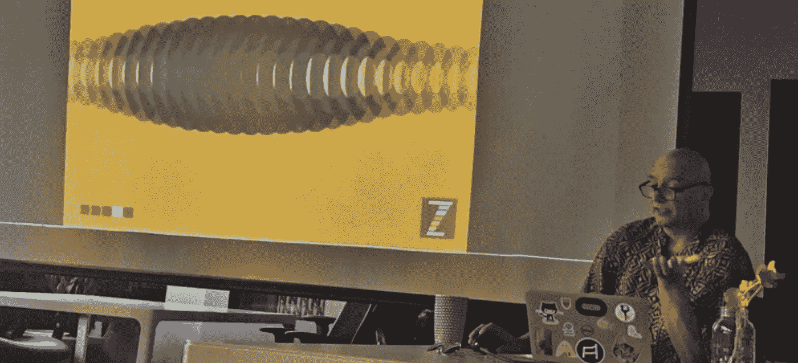
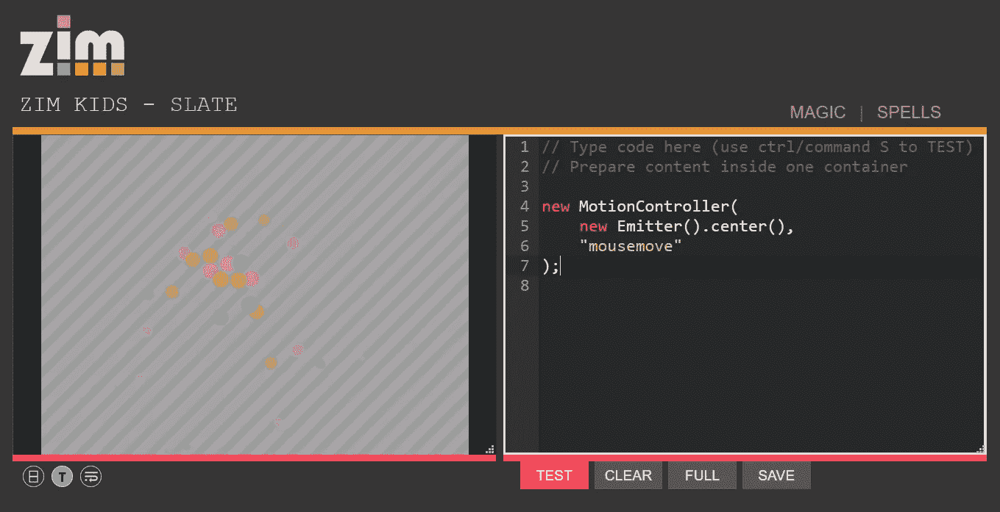
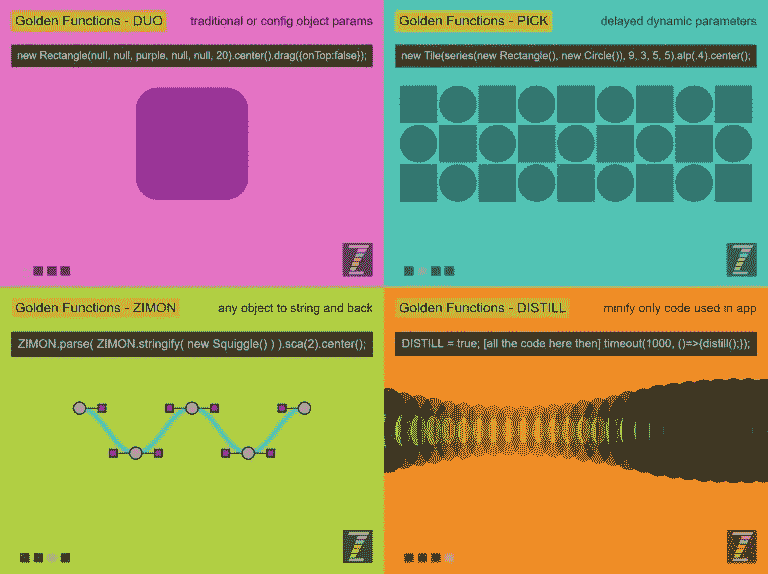
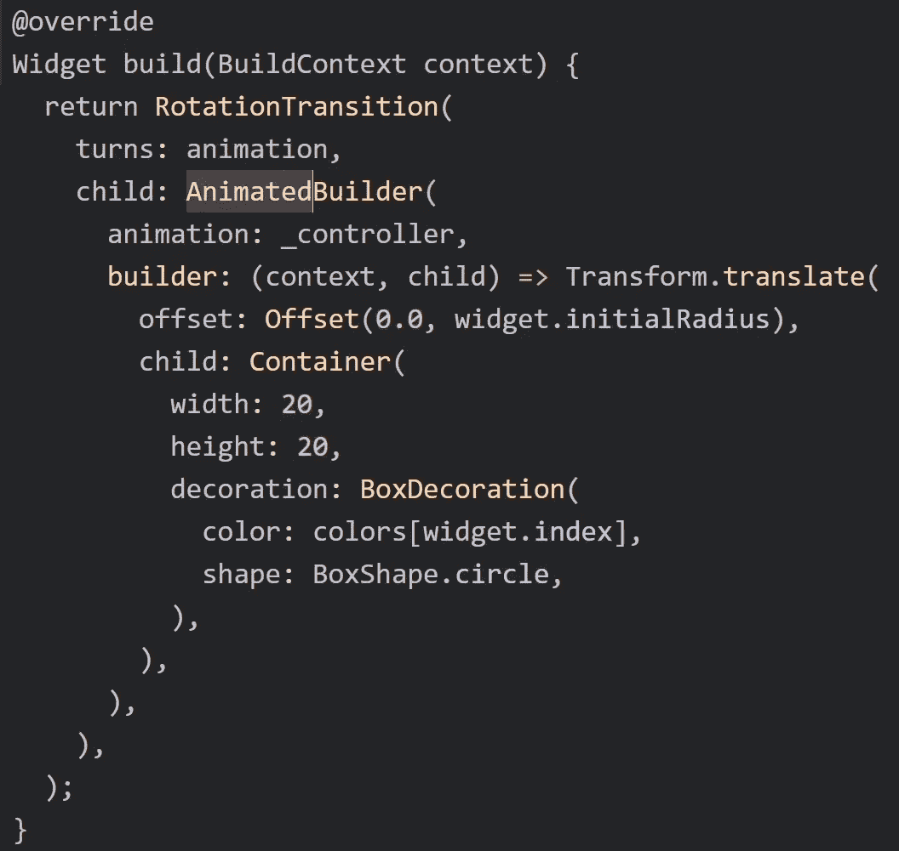
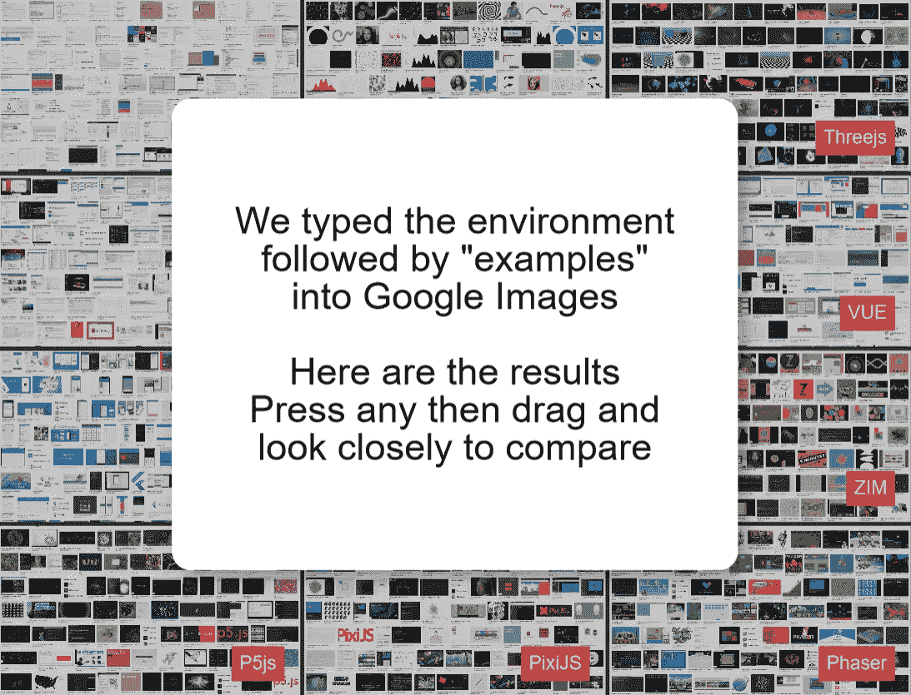
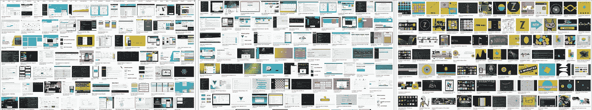
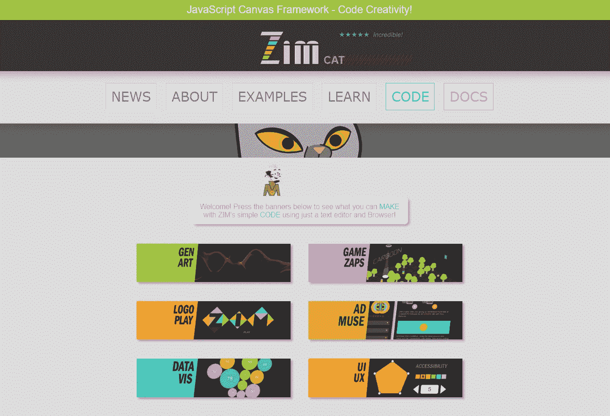
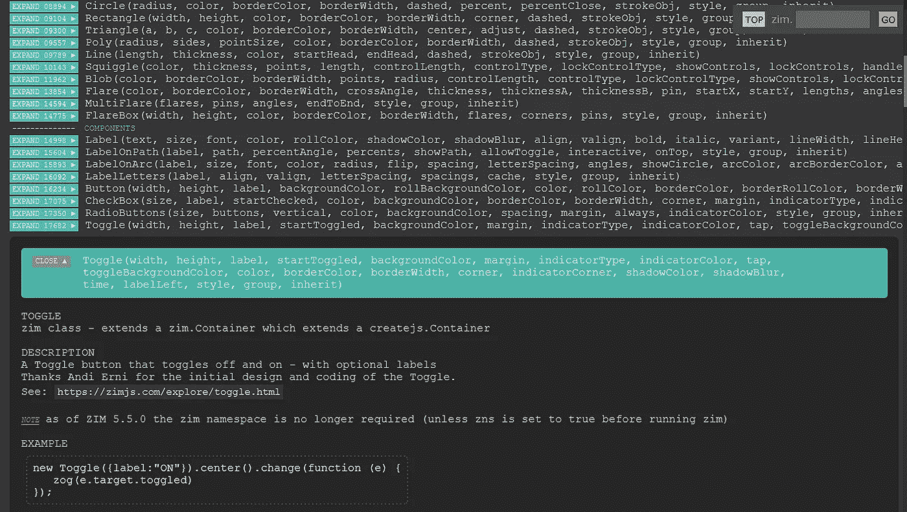

# 如何让开发人员使用画布

> 原文：<https://levelup.gitconnected.com/how-to-get-a-developer-to-use-the-canvas-bcaea56b74d4>

## 显然，答案很简单…



Dr 摘要谈[开发者的四大黄金功能](https://zimjavascript.wordpress.com/2019/06/30/golden-functions-ci-cx-talk-at-hamontjs/)

> 突发新闻！面向开发商推出的 ZIM 网站:【https://dev.zimjs.com 

H 你见过我用几行代码做的色彩和动画在屏幕上飞舞给开发者演讲吗？大概是这样的:

```
new MotionController(new Emitter().center(), "mousemove");
```

一个粒子发射器跟随你的鼠标！用这个[在线编辑器](https://zimjs.org/kids/slate.html)编码。只需点击链接，复制代码并点击测试。



为了这次演讲，我绞尽脑汁，想知道开发者希望看到什么。当然，开发人员都是不同的，但总的来说，我认为我应该展示一些代码，让他们的生活更轻松。

> CI 和 CX 的编码器接口和体验！

但是我不认为他们相信我提出的基于 GitHub stars 的[四大黄金功能](https://zimjavascript.wordpress.com/2019/06/30/golden-functions-ci-cx-talk-at-hamontjs/)。可能是金子太亮看不到星星吧！或者动画太分散注意力。如果你感兴趣，它们就在这里:



**DUO —传统或配置对象参数**
[https://zimjs.com/explore/golden/duo.html](https://zimjs.com/explore/golden/duo.html)
[https://youtu.be/cfWoor1d9WI](https://youtu.be/cfWoor1d9WI)

**选择—延迟动态参数**
【https://zimjs.com/explore/golden/pick.html】T21
https://youtu.be/34MzH0siQeg

**ZIMON——将任何物体串起来再拉回来**
[https://zimjs.com/explore/golden/zimon.html](https://zimjs.com/explore/golden/zimon.html)
[https://youtu.be/vYvarZ6zmD4](https://youtu.be/vYvarZ6zmD4)

**提取—仅缩小应用**
[https://zimjs.com/explore/golden/distill.html](https://zimjs.com/explore/golden/distill.html)
[https://youtu.be/SlU26FrO4Ag](https://youtu.be/SlU26FrO4Ag)中使用的代码

另请参见◎ [在画布上编码时的便利指南](https://medium.com/@zim_67337/conveniences-when-coding-on-the-canvas-f6b0b8dd981d)

G 为 DevTO 举办了一场座无虚席的演出——2018 年的第一场。但我怀疑 ZIM 太容易了？我的意思是……有一个最多三个嵌套括号的*,所以很明显这种类型的代码不适合开发者。*

*你应该看看《画布上的 ZIM》和《飞镖》的对比？哇哦。颤动…那一定是开发者想要的代码类型！看看这个视频，看看为什么！*

**

*Flutter 到处都是开发者的食物！*

*开发者只是希望他们的反应和 VUE。这里是 ZIM 与 ZIM 的比较，的规模是 React 的 40%，而 T10 是 VUE 的 33%，所以谁能责怪开发者没有使用 ZIM 呢！ZIM 使用较少的代码，既然开发者喜欢编码，他们为什么要用 ZIM 呢？*

> *谁能责怪开发者想要更多的代码呢？*

*ZIM 在 40%的反应码*

*ZIM 是 VUE 电码的 1/3*

*可能是画布的配色。这里有一个应用程序，你可以放大在不同代码环境中工作的例子:*

*[编码实例的视觉对比](https://zimjs.com/compare/)*

**

*[编码实例的视觉对比](https://zimjs.com/compare/)*

*下面是 React，VUE 和 ZIM 肩并肩。React 和 VUE 几乎都是文字。ZIM 几乎全是图像、形状和颜色。*

**

*React、VUE 和 ZIM 示例的视觉比较*

# *结论*

*为了让开发人员使用画布，我们必须做的一件事是:*

> *避免动画和艺术*
> 
> *添加更多所需的嵌套*
> 
> *去掉颜色*

*在与我们的开发人员召开的 ZOOM 会议上，出现了一个不同的答案。一个我们正在努力解决的问题。*

> *该网站看起来不像其他开发网站*

*ZIM 网站看起来像是为孩子们准备的。有一点卡通人物和颜色，按钮很大。*

**

*[ZIM 网站](https://zimjs.com)用“卡通”人物和颜色*

*[ZIM 文档](https://zimjs.com/docs.html)——尽管被称为*任何 JavaScript 框架的最佳文档*看起来并不像普通的开发人员文档。*

**

*[ZIM 文件](https://zimjs.com/docs.html)*

*我们希望开发者使用画布吗？如果你是一个开发者，我们将留给你。下面是你在画布上编写创意代码的指南。*

*这本指南里有令人惊奇的东西。它包括其他 12 个指南，深入到画布上的编码奇迹。*

**

*◎ [你在画布上编写创意代码的指南](https://medium.com/@zim_67337/your-guide-to-coding-creativity-on-the-canvas-ada0996298f6)*

*画布适合制作**互动媒体**，这是一个不同于 Web 开发的领域。它们通过编程技能集联系在一起。如果你想了解更多这方面的知识，这里是你何时使用 JavaScript 画布库或框架的指南。*

*万事如意！抽象博士(作为一个小漫画)。*

**

> **在推特上关注我们，点击* [*ZIM 学习*](https://twitter.com/zimlearn) *这里是 YouTube 上的* [*ZIM 学习*](https://www.youtube.com/zimlearn) *！**