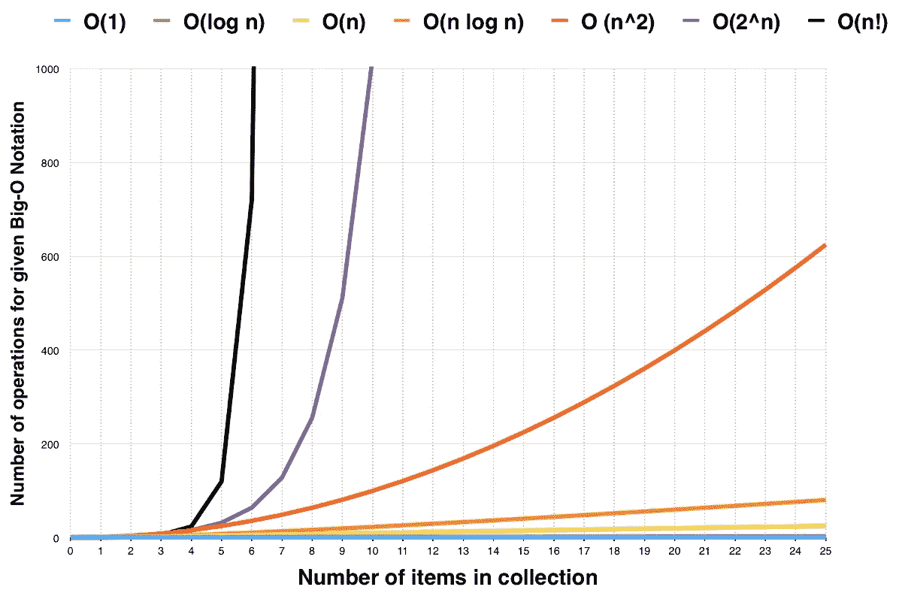

# 如何以自学程序员的身份进入 FAANG

> 原文：<https://levelup.gitconnected.com/how-to-get-a-job-at-faang-as-a-self-taught-programmer-6084f7761df4>

## 这比你想象的要容易得多

Jonny Gios 在 [Unsplash](https://unsplash.com/s/photos/google?utm_source=unsplash&utm_medium=referral&utm_content=creditCopyText) 上的照片

让我先举几个例子。[凯尔斯滕·费伊](https://medium.com/u/2b6e52a77628?source=post_page-----6084f7761df4--------------------------------)是一名自学成才的程序员，目前在 Meta Seattle 工作。

[Megan Chang](https://medium.com/u/7a6e814190e5?source=post_page-----6084f7761df4--------------------------------) ，无 cs 学位。一名自学成才的程序员，目前在谷歌工作。

前谷歌和前脸书软件工程师 Clement Mihailescu 。也是自学的程序员。

大部分人都觉得作为一个自学成才的程序员在 FAANG 找工作太难了。这不是真的。当 Megan Chang 加入谷歌时，她遇到了各种背景的开发人员；电气工程师、律师、动画师等。

学习如何编码主要有三种方法。大学课程、编码训练营或自学。三个都有效。

现在让我们来看看如何在 FAANG 找到一份自学程序员的工作。

# 数据结构和算法

我假设现在你已经知道如何编码，并且想要挑战自己到下一个领域，那就是找一份工作。

[来源](https://medium.com/coderbyte/a-guide-to-becoming-a-full-stack-developer-in-2017-5c3c08a1600c)

进入 FAANG 需要对数据结构和算法有很好的理解。谷歌因问这类问题而臭名昭著。

因此，在去面试之前，你需要稍微温习一下这方面的技能。

好消息是有很多资源可以利用。提高你对这方面的理解应该没那么难。[可以从这里开始](https://medium.com/coderbyte/how-to-get-good-at-algorithms-data-structures-d33d5163353f)。

# 行为和系统设计

照片由 [Med Badr Chemmaoui](https://unsplash.com/@medbadrc?utm_source=unsplash&utm_medium=referral&utm_content=creditCopyText) 拍摄

理解事物如何工作和知道如何编码一样重要。在构建产品时，了解人们在特定场景下的思维和行为是很方便的。

雇主需要你理解事物的流程，或者为什么一个产品被设计成这样。

谷歌也因问这类问题而臭名昭著。为了进入 FAANG，你需要学习行为和系统设计。

这是一个关于行为和系统设计的 YouTube 视频播放列表。凯尔斯滕·费伊用它们来赢得她的元面试。

# LeetCode

[来源](https://leetcode.com/)

Leetcode 是一个建立你的知识并为你的技术面试做准备的平台。

推荐的做法是尝试一下[顶级通用面试题](https://leetcode.com/explore/interview/card/top-interview-questions-easy/)。你应该从简单的问题开始，然后是中等的问题，最后是困难的问题。

如果你用错误的方法来处理，Leetcode 可能会让人不知所措，毫无用处。

你应该以一种可持续的方式一步一步地经历它。不要试图在一天内解决所有的问题。一个可持续的方法将帮助你覆盖更多并保留你所学的大部分知识。

你也应该给自己计时。解决一个问题需要多长时间？应该是 10-15 分钟(简单问题)，15-20 分钟(中等问题)，20-30 分钟(困难问题)。

如果你比规定的时间提前完成，回去检查你的代码。正确性和可能的改进。如果你花的时间超过了规定的时间，那就继续练习。随着时间的推移，你会好起来的。

以下是 Kairsten Fay 在 LeetCode 上尝试解决的问题。你会发现她绝不是天才。

Megan Chang 建议购买高级包来解锁带有图表的解决方案。

高级包还可以帮助您解决公司特有的问题。脸书模块有 50 个问题。这些问题是最新的，由用户投票决定。据她所说，脸书的问题非常准确。

## 算法专家和“破解编码面试”

AlgoExpert 也是你可以同时浏览的另一个好资源。这是一本完美的学习指南。

你可以把它作为面试准备的一部分。对于喜欢读书的人来说，另一个几乎类似的选择是*破解编码面试*。

[图像来源](https://www.crackingthecodinginterview.com/)

强烈建议您理解数据结构和算法。它包含了许多编程中的重要概念。

像[大 O 符号](https://en.wikipedia.org/wiki/Big_O_notation)这样的概念在这本书中有解释，这是面试前的必读之作。这本书也可以作为面试前的学习指南。

## 星法⭐

star 方法是一种你可以用来准备行为面试的技巧。下面是它是如何分解的。

*   T2 局势
*   **T** 问
*   **一个**动作
*   结果，结果

你要准备几个例子，自己练习。你可以利用学习经验或以前的成功。

有许多资源可以用来准备 STAR 格式的回答。你应该排练它们，直到你意识到你发光的地方。

# 最后

我没有提到*建立你的作品集*和*简历*。这些也是增加你被雇佣机会的关键因素。

你的简历可能不是最好的，但是你的作品需要脱颖而出。你应该令人信服地表明你了解这份工作，并且实际上已经建立了真正的项目。

有些人可能会评论说，前面提到的例子有常春藤联盟的特权。这不是真的。主要是投入时间。

凯尔斯滕·费伊的故事特别有趣。她有生物学学士学位。不管怎样，她将职业生涯转向了一名软件工程师，没有任何计算机相关的学位或背景。

她甚至没有参加入学最低要求 10，000 美元的新兵训练营。她利用 Coursera 和其他资源自学。她的学习费用总计 200 美元(T21 ),她成功到达了脸书。

我们现在生活在一个充满可能性的世界里。与普遍看法相反，你可以通过自学成为脸书或谷歌的软件工程师。