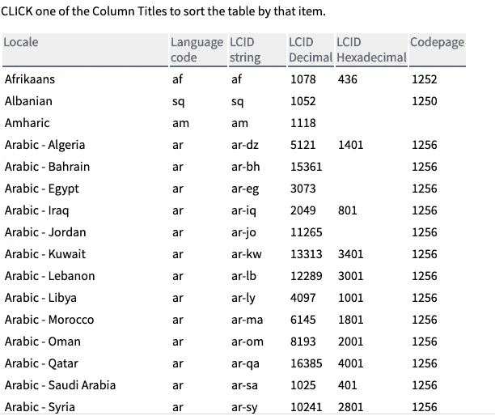
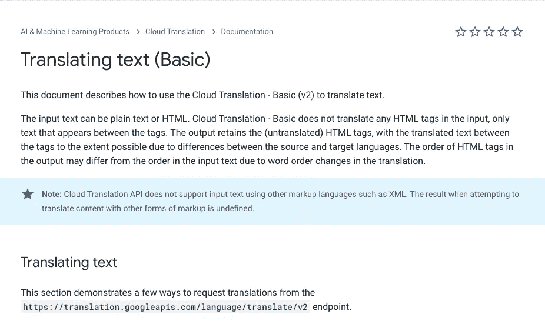
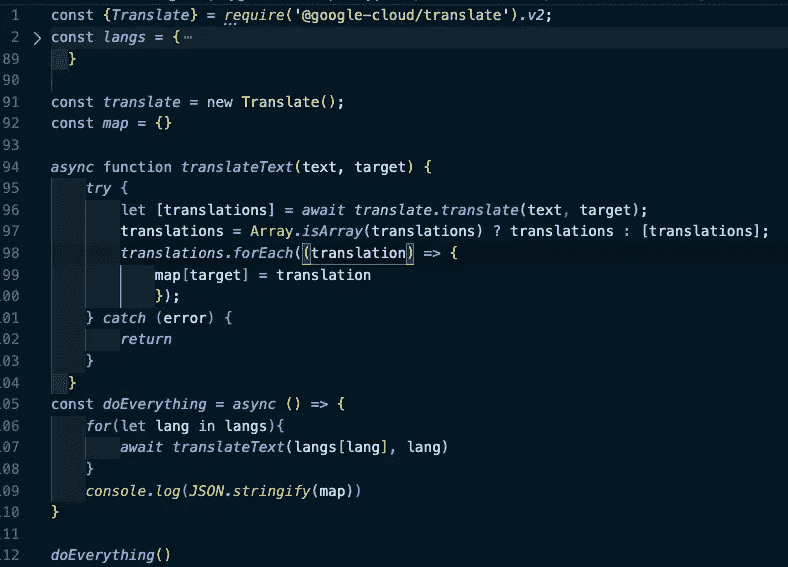

# 如何用 Bash/Linux，Python，Node 和 Google Translate API 获得自己语言的语言列表

> 原文：<https://levelup.gitconnected.com/how-to-get-a-list-of-languages-in-their-own-language-with-bash-linux-python-node-and-google-31324ccb79cd>



如此多的语言，如此多的代码

现在，我坐在目前全球病毒爆发的中心——纽约市，发现自己有很多时间，有很多代码要学，有很多路要走。因为世界的状态不确定(我是一名初级开发人员，人们需要有经验的人来应对世界末日)，我的工作面试和跟进变少了，但幸运的是，这给了我时间从事志愿者编码项目，就像 Kaggle 支持的那些项目一样。

志愿者项目对求职者来说是一种很好的时间利用，因为他们在简历中增加项目的同时也培养了技能，帮助别人的感觉很好。给我的任务听起来简单，但对我来说似乎很难。

给定一个网站上的语言列表及其两位数代码，创建两个 JSON 文件。

1.  使用英语语言名称格式化的文件，如:

```
"languageName-af":"Afrikaans","languageName-am":"Amharic","languageName-ar":"Arabic",
```

格式为“语言名称-{ {语言代码}}”:{ {语言} }

2.一种文件，其格式以语言代码为关键字，其值为其自身语言的语言名称，例如:

```
"el": "Ελληνικά","en": "English","es": "Español",
```

现在，这似乎很容易，在我进入我的解决方案之前，完全有可能(如果漫长而无聊)通过去[谷歌翻译](https://translate.google.com/)，手动输入所有内容，在所有内容周围加上引号和逗号，然后手动输入 JSON 文件来手动完成。

但我是个程序员！我去了[，那是一个一流的训练营](https://www.coursereport.com/schools/flatiron-school)，希望它能在母公司倒闭后继续存在。

现在，我实施的解决方案经过了大量的反复试验，我将只列出一些策略。我确信有人会有比我实现的更好的解决方案，但对我来说，这是一次学习的经历，也是一次使用我不熟悉的技术的机会。

也就是说:

**第一步:处理数据**

快速检查一下站点上的 HTML 显示我正在处理一个 HTML 表。我对 [Python 库 BeautifulSoup](https://www.crummy.com/software/BeautifulSoup/bs4/doc/) (非常棒，非常受欢迎)有一些经验，所以我决定先试试这个。

```
*from* bs4 *import* BeautifulSoup*import* requests*import* json# *getting the site and  making it into an iteral object*source = requests.get("https://www.science.co.il/language/Locale-codes.php").textsoup = BeautifulSoup(source, "lxml")# *creating the list to place the countries in.*countries_list = []# *finding all the Table Data in the html*tds = soup.findAll("td")# *finding the upper case values in the TD and adding them to the list**for* td in tds:*for* char in td.text:*if* char.isupper():countries_list.append(td.text)# *showing my work*print(countries_list)
```

这是一个不错的方式来找到语言的上层名单和国家名单，但我感到困惑如何获得两位数的代码。我想也许我可以检查字符串的长度，但它似乎令人困惑，而且它涉及到解析空白。

在这一点上，我求助于我的朋友和更有经验的程序员 Sean McGrath，他推荐我使用 Bash/Linux 和 Python 的组合来制作这个文件。

第一步只是从表中复制粘贴数据。

我创建了一个名为“数据”的文件，并从网站上复制和粘贴数据，这给了我这样的东西。

```
Catalan ca ca 1027 403 1252Czech cs cs 1029 405 1250Welsh cy cy 1106 452Danish da da 1030 406 1252
```

现在，我只需要这个表中的前两个值(语言名称和代码),我需要操作它。我很害怕！我从未处理过无扩展名的文件。接口会是什么？

幸运的是，我已经开始参加[最近关于 Linux](https://www.lynda.com/Linux-tutorials/Linux-Tips-Weekly/618702-2.html) 的课程，我了解到 Linux 的核心原则之一是不同的命令通过文本进行交流！因此，第一步是从数据中获取文件，并使用以下命令将其转储到控制台:

```
cat data
```

这将所有数据转储到控制台，让我运行一些 Python 脚本。但是坚持住！我已经把东西放到了控制台中，但是 Python 是如何处理的呢？Python 可以进行[系统调用](https://www.geeksforgeeks.org/python-os-system-method/)，在那里它实际上使用 C 程序语言来查看控制台的输出！

```
# "jsonify.py"*import* sys*import* json# *creating a dictionary to store the results*langs = {}# *for each line in the console "stdin"**for* line in sys.stdin:# *creating a list split by tabs*fields = line.split("\t")# *setting the value of the two-digit code with no spaces equalled to the language name*langs[fields[1].rstrip()] = fields[0]# *creating a json file to write to and initializing it to a variable**with* open('languageNames.json','w+') *as* lang_file:# *JSONify-ing the data it into the file*json.dump(langs, lang_file)# *cleaning up*lang_file.close()
```

在 Sean 的帮助下，加上我在 Flask 中创建和写入 JSON 文件的一点经验，这个脚本能够处理数据，但我需要将它们组合起来，这意味着我需要检查一下 [Linux 的管道操作符](https://www.geeksforgeeks.org/piping-in-unix-or-linux/)，它从一个文件中获取数据并将其提供给另一个文件，就像下面这样简单:

```
cat data | python3 jsonify.py
```

它输出了:

```
# "languageNames.json"{ca":"Catalan","cs":"Czech","cy":"Welsh","da":"Danish","de", ...}
```

这是伟大的第一步，但还不是我所需要的！然而，我需要制作的第一个文件可以通过一些修改变得更加容易。

**步骤 2:创建语言名称文件**

这个并不难。我所要做的只是对代码做一些简单的修改:

```
#jsonify.py*import* sys*import* json# *creating a dictionary to store the results*langs = {}# *for each line in the console "stdin"**for* line in sys.stdin:# *creating a list split by tabs*fields = line.split("\t")# *setting the value of the two-digit code with no spaces equalled to the language name*full_field = "languageName-" + fields[1].rstrip()langs[full_field] = fields[0]# *creating a json file to write to and initializing it to a variable**with* open('appendedLanguageNames.json','w+') *as* lang_file:# *JSONify-ing the data it into the file*json.dump(langs, lang_file)# *cleaning up*lang_file.close()
```

只需使用“+”操作符对 JSON 文件的键做一点点修改，我就能够实现我的第一个目标，并输出如下所示的内容:

```
"languageName-cs":"Czech","languageName-cy":"Welsh","languageName-da":"Danish","languageName-de":"German","languageName-el":"Greek",
```

成功！

但是现在真正棘手的部分来了。

**步骤 3:将语言名称翻译成语言**



API 时间！

所以，我现在有了一些非常有用的 JSON 数据，但是我仍然需要做翻译来得到我的最终产品。

实际上，我试图使用谷歌翻译的 API 文档在 Python 和 Ruby 两种语言中实现这一点，但是很难做到！它包括下载一个 JSON 文件，并使用“export”语法创建本地 Bash ENV 变量。

最后我回到了 JavaScript。

现在，我可以做一些更有趣的导入或 Bash 管道，但 JSON 也是有效的 JavaScript，所以我只是将 languageNames 文件作为一个名为“langs”的常量复制并粘贴到 NodeJs 文件中



节点翻译！

在这里，我使用了翻译模块和谷歌的节点示例，以及我创建的“地图”对象，它的目标是两位数代码，文本是语言本身。

请注意，如果你没有它，你必须启用一个谷歌云帐户，虽然它仍然应该在合理的限制内免费，以便这项工作。

我知道这很多，但基本上，它只是迭代一个对象，为该对象中的每个键、值对调用一个函数，然后将结果放入一个新对象中，然后我使用 Promises 和 Async/Await 将该对象转换回 JSON、。

我可能让它听起来很容易，但很难弄清楚，特别是意识到 try/catch 语句是必要的，因为不是所有的语言和代码都受支持，我需要在循环中处理它。

这最终给我留下了一堆来自我的控制台的东西，然后我把它们复制并粘贴到一个 JSON 文件中。

没有那么圆滑，但是一点一点:)

```
// "languageNames.json"{"af": "Afrikaans","am": "አማርኛ","ar": "عربى","az": "Azeri","be": "Беларус","bg": "български",...
```

我知道的太多了！我以为制作一个 JSON 文件会很简单。

但这是一个志愿者项目，允许人们在这场危机中进行国际联系，说实话，作为一名程序员，我觉得使用我的许多工具真的很酷，包括一些我还不完全熟悉的工具，以实现我的目标。

当然，作为回报，这个世界让我看到了温妮。


温妮。

这是戴着手套的小霸王温妮。我骑着电动自行车去唐人街后，在那里见到了她。

她是志愿服务的粉丝，尽管她最喜欢的志愿服务是拍拍她可爱的鼻子。

我愿意为你做志愿者，温妮！

注意安全，保重，做温妮，

网络信息中心(Network Information Center)ˌ网路界面卡(Network Interface Card)ˌ全国工业理事会(National Industrial Council)ˌ航行情报中心(Navigation Information Center)