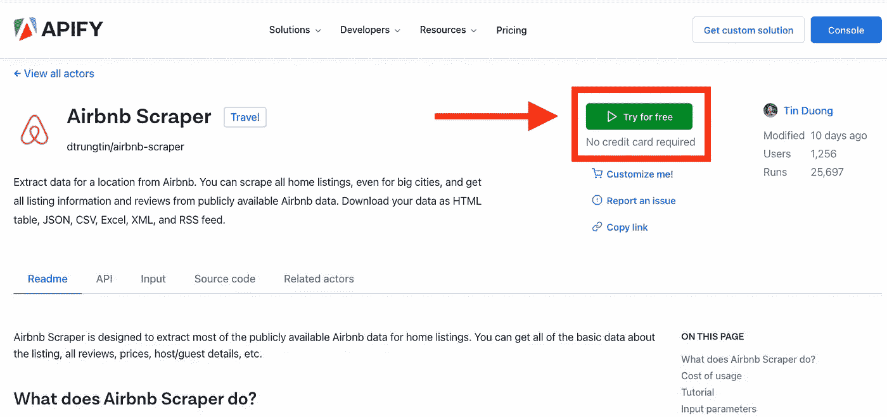
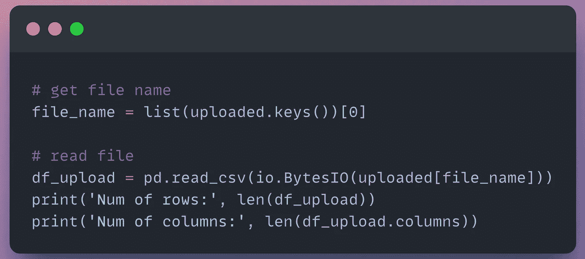

# 如何用 Python 获取和分析 Airbnb 市场的数据

> 原文：<https://levelup.gitconnected.com/how-to-get-and-analyze-data-for-your-airbnb-market-in-python-37ffeb0c2d16>

## Python 教程使用 Apify 从网上抓取活跃的 Airbnb 列表并在 Python 中分析它们

图片来自 [Airbnb](https://www.airbnb.com/rooms/38351053/photos/1356946212?source_impression_id=p3_1654736815_yOn7nV%2BLpalI7k8p)

***短期租赁是赚取额外收入的好方法。***

在 Airbnb 和 VRBO 这样的平台上，短期租赁比以往任何时候都更容易启动。

***短租有需求吗？是啊！***

> 25 %的美国旅游预订是短期租赁，同比增长 15%—[*ipropertymanagement*](https://ipropertymanagement.com/research/vacation-rental-industry-statistics#:~:text=10%25%20of%20U.S.%20travel%20bookings,share%20rose%20to%20over%2025%25.)

短期租赁投资的好处包括:

1.  **收入更高** — [收入比传统租赁物业多 3 倍](https://www.lodgify.com/blog/long-short-term-vacation-rentals/#:~:text=Studies%20have%20shown%20that%20the,year%20with%20the%20same%20property!)
2.  **更好的维护** —一致的清洁和维护回顾
3.  **灵活性** —对日历和客人的控制

这篇文章将讲述如何为 Airbnb 房源收集数据，并通过 Python 可视化分析结果。

# 概观

[概述](#04fe)
∘ [什么是 Airbnb？](#e899)
∘ [什么是 Apify？](#97ea)
∘ [问题陈述](#6dac)
[Airbnb 房源数据(带 Apify Web Scraper)](#c81f)
[市场分析(用 Python)](#7406)
∘ [先决条件](#2d85)
∘ [Python 教程](#37c4)
∘ [一、导入包](#96a8)
∘ [二、本地人&常量](#8587)常量
∘ [III。数据](#ee2c)
∘ [四。变换](#4524)
∘ [五、可视化](#5cc4)
∘ [六。创建地图](#23ae)
∘ [VII。查看单清单](#e583)
[结论](#4ff4)
[克隆笔记本](#61e5)
[来源](#d584)

## Airbnb 是什么？

照片由[卡斯滕·怀恩吉尔特](https://unsplash.com/@karsten116)在 [Unsplash](https://unsplash.com/photos/sStahKEhT9w) 上拍摄

> Airbnb 是一项服务，让业主将他们的空间出租给寻找住宿地方的旅行者。旅行者可以租一个供多人共享的空间，一个有私人房间的共享空间，或者为自己租下整个房产。— [*Q4 推出*](https://q4launch.com/blog/how-airbnb-works-for-hosts/)

## 什么是 Apify？

图片由 [Toptal](https://www.toptal.com/python/web-scraping-with-python) 提供

> A **pify** 是您进行网页抓取、数据提取和 RPA 的一站式商店。将您可以在浏览器中手动完成的事情自动化。— [*Apify*](https://docs.apify.com/about)

***我们将使用 Apify 的*** [***Airbnb 刮刀***](https://apify.com/dtrungtin/airbnb-scraper?fpr=cy7vq) ***对 Airbnb 数据进行 web 刮取。***

你可能在想，为什么我们需要使用 Apify？我们能自己编写一个网页抓取器吗？

虽然我赞赏你的雄心，但我强烈建议使用第三方资源从高流量网站收集数据。

这是由于 ***跟踪持续网站变化的复杂性*** 。

查看我的视频[如何在 2022 年有效地搜索房地产网站](https://youtu.be/VFlHHb2f5u0)了解更多细节。

作者视频( [YouTube](https://youtu.be/VFlHHb2f5u0)

## 问题陈述

我们想分析佛罗里达州西斯塔基的 Airbnb 列表— [美国第二好的海滩](https://www.heraldtribune.com/story/entertainment/2022/02/23/siesta-key-beach-in-sarasota-florida-named-no-2-beach-in-the-u-s-no-14-in-world-tripadvisor/6911065001/)

我们需要一个无代码的解决方案来提取 Airbnb 房源。

列表数据需要包括 ***、每日价格、客人数量、位置(纬度/经度)、评级和 URL 链接*** 。

web 刮刀运行时间应该不到五分钟。数据应以可使用的格式导出，如 excel 或 CSV 文件。

我们的最终目标是 ***通过 Python*** 中的可视化分析我们的 Airbnb 市场。

# Airbnb 列表数据(使用 Apify Web Scraper)

导航到 Apify 上的 [Airbnb Scraper](https://apify.com/dtrungtin/airbnb-scraper?fpr=cy7vq) 页面。

选择 ***免费试用*** 。

[Apify Airbnb](https://apify.com/dtrungtin/airbnb-scraper?fpr=cy7vq) 作者截图

注册一个免费计划。

在免费计划中， ***Apify 每月提供 5 美元的平台使用积分*** 和 7 天的数据保留。

[Apify Airbnb](https://apify.com/dtrungtin/airbnb-scraper?fpr=cy7vq) 作者截图

在您的仪表板中，您可以在左侧面板上找到所有的 ***参与者*** (web scrapers)。

[Apify Airbnb](https://apify.com/dtrungtin/airbnb-scraper?fpr=cy7vq) 作者截图

导航到 ***Airbnb 刮刀*** 演员。

***输入所需参数*** :

*   **位置** —街区或城市(就像你在 airbnb.com 上搜索的那样)
*   **最大列表数** —返回的列表数

对于我的例子，我将默认值更改为 ***Location=Siesta Key，FL*** 和***Max listings = 500***。

如果您需要更多信息，如评论、日历和主持人信息，请查看 [***输入参数的完整列表***](https://apify.com/dtrungtin/airbnb-scraper/input-schema#simple) 。

[Apify Airbnb](https://apify.com/dtrungtin/airbnb-scraper?fpr=cy7vq) 作者截图

在 developers 部分，选择您的 ***代理配置*** 。对于免费版，我将我的设置为 ***住宅*** 。

一旦选择好所有参数，点击 ***开始*** 运行你的演员。

[Apify Airbnb](https://apify.com/dtrungtin/airbnb-scraper?fpr=cy7vq) 作者截图

演员在 ***日志*** 部分记录动作。您可以使用 ***日志*** 来监控演员的表现并解决任何问题。

完成后， ***状态*** 将变为 ***成功*** *。*

是时候在 ***存储*** 部分查看我们的结果了！

[Apify Airbnb](https://apify.com/dtrungtin/airbnb-scraper?fpr=cy7vq) 作者截图

在这里，我们可以用几种不同的格式导出我们的结果。

让我们 ***将我们的数据下载到 CSV 文件*** 中，以便在我们的 Python 笔记本中查看结果。

# 市场分析(Python 语言)

## 先决条件

你自己的 Python 环境或者谷歌账户。

## Python 教程

如果您没有现有的 Python 环境，那么我强烈建议首先**克隆笔记本**(在文章的底部)。

这将允许您在 Google Colab 中运行 Python 代码(免费！).它是一个基于云的环境，让您无需在本地安装 Python 就可以运行代码。

## 一、进口包装

接下来，导入必要的包。

导入的代码片段(作者使用 snappify.io 创建的图片)

## 二。局部变量和常量

注册一个免费的 [Mapbox API](https://studio.mapbox.com/) 密钥。这将允许我们标出每个 Airbnb 列表的位置。

创建一个变量来保存我们的 API 键。

API 键的代码片段(作者使用 snappify.io 创建的图片)

## 三。数据

***上传 Airbnb 刮刀输出(CSV 文件)*** 到你的笔记本。

在这个例子中，我使用 Google Colab 在线上传我的文件。

数据的代码片段(作者使用 snappify.io 创建的图片)

接下来，以 pandas DataFrame(包含行和列的表格)的形式读入文件。

在这里，我动态地从 Google Colab 获取 CSV 文件名，并查看 DataFrame 内容。

数据的代码片段(作者使用 snappify.io 创建的图片)

有 17 列和 500 行。

让我们通过索引 *row = 0* 来查看数据帧中的第一行。

数据的代码片段(作者使用 snappify.io 创建的图片)

代码输出(作者创建的截图)

我们的 Apify 铲运机的基本输出返回功能包括:

*   **地点** —城市，纬度，&经度
*   **定价** —每夜价格
*   **属性** —姓名、客人数量、房间类型、网址
*   **评级** —星级

如果您需要评论、日历和主持人信息等其他信息，请查看 [***输入参数的完整列表***](https://apify.com/dtrungtin/airbnb-scraper/input-schema#simple) *。*

让我们执行一些数据操作来查看清单。

## 四。转换

我们的第一个视图由每个城市的列表数量组成。

转换的代码片段(作者使用 snappify.io 创建的图片)

代码输出(作者创建的截图)

在返回的 500 个列表中，60%位于佛罗里达州的西斯塔岛。其余的在周围地区。

对于我们的用例，我们感兴趣的是步行即可到达午睡海滩的酒店。

让我们只过滤城市是午睡键的列表。

转换的代码片段(作者使用 snappify.io 创建的图片)

以下是我们午睡主要清单的预览:

代码输出(作者创建的截图)

接下来，查看按 ***房间类型*** 分组的可用房源类型。

转换的代码片段(作者使用 snappify.io 创建的图片)

代码输出(作者创建的截图)

超过 95%的房源是 ***全入住*** ，这意味着客人可以单独进入整个酒店。

通过了解市场需求的 ***房型*** ，我们可以确保我们投资的酒店符合客人的需求。

让我们看看 ***日均价格*** 是否根据客人的评分而变化。

转换的代码片段(作者使用 snappify.io 创建的图片)

代码输出(作者创建的截图)

平均而言， ***五星级的物品比星级较低的同类物品多赚 100 多美元。***

让我们通过在 [Plotly Express](https://plotly.com/python/plotly-express/) 中创建图表来更好地了解我们的列表的 ***分布*** 。

## 动词 （verb 的缩写）形象化

[plotly 直方图函数](https://plotly.com/python/histograms/)允许我们传递数据帧，用一行代码创建直方图！

可视化代码片段(作者使用 snappify.io 创建的图片)

代码输出(作者创建的截图)

我们可以看到，大多数列表允许 6 个客人。也有一些 14 人以上的高端酒店。

带*的房源，请看 ***定价/费率/金额*** 分布图。*

**

*可视化代码片段(作者使用 snappify.io 创建的图片)*

**

*代码输出(作者创建的截图)*

*房源的日均价为 437 美元，其中 75%的房源月均价低于 800 美元。*

*刊登物品的每日价格从 68 美元到 4828 美元不等。哇！这个范围很大。*

*让我们通过创建 ***散点图*** 来看看价格和客人数量是否高度相关。*

**

*可视化代码片段(作者使用 snappify.io 创建的图片)*

**

*代码输出(作者创建的截图)*

*在我们的散点图中，Y 轴是客人数量，X 轴是价格。*

*一般来说，我们可以看到价格越高，客人数量越多。*

*这些数据是有意义的，没有明显的异常值需要剔除。*

*是时候创建我们所有列表的地图了！*

## *不及物动词创建地图*

*首先，我们创建一个惟一的字段来标识每个清单— ***清单 id*** 。*

****列表 id*** 在 URL 字段的末尾。*

*让我们获取 URL 字符串的最后一个元素，以获得数据框架中第一个列表的 ***列表 id*** 。*

**

*数据争论的代码片段(作者使用 snappify.io 创建的图片)*

**

*代码输出(作者创建的截图)*

*接下来，为 ***图*** 数据框创建两个特征:*

*   ***列表 id** —每个列表的唯一标识符*
*   ***表头** —列表 id &列表名称*

**

*功能创建的代码片段(作者使用 snappify.io 创建的图片)*

*输出:*

**

*代码输出(作者创建的截图)*

*创建***plottly 散点图*** 的步骤如下:*

1.  *设置地图框键*
2.  *将 *df_plot* 传入散点图*
3.  *更新布局，全面了解您的市场*

**

*地图创建的代码片段(作者使用 snappify.io 创建的图片)*

*输出:*

**

*代码输出(作者创建的截图)*

****现在我们有了一个我们市场内所有 Airbnb 房源的互动图表。****

*   *标记的大小是根据*客人的数量*和**决定的。***
*   *标记的颜色基于*日定价*。*

*我们可以将鼠标悬停在地图上的标记上，以获取清单信息，包括其 ***清单 ID*** 。*

*让我们查看单个列表！*

## *七。查看单一列表*

*我们可以过滤单个列表来查看其内容和列表 URL。*

**

*数据争论的代码片段(作者使用 snappify.io 创建的图片)*

**

*代码输出(作者创建的截图)*

*如果我们导航到列表网址，我们可以看到更多的细节，包括财产照片。*

**

*图片来自 [Airbnb](https://www.airbnb.com/rooms/38351053/photos/1356945323?source_impression_id=p3_1654736815_yOn7nV%2BLpalI7k8p)*

*漂亮！:)*

# *结论*

*利用 Apify 的网络抓取工具是检索房地产、旅游和社交媒体数据的好方法。*

*Airbnb Scraper 是一个无代码解决方案，能够集成多个应用程序。这使你能够分析你所在市场的 Airbnb 房源。*

*查看我的 [YouTube 频道——AnalyticsAriel](https://youtube.com/c/analyticsariel)以获得更多关于房地产数据源和数据分析的见解！*

# *克隆笔记本*

* [## 主 analyticsariel/projects 上的 projects/Airbnb _ listings _ apify . ipynb

### https://analyticsariel.com/.通过在 GitHub 上创建帐户，为 analyticsariel/projects 开发做出贡献。

github.com](https://github.com/analyticsariel/projects/blob/master/short_term_rentals/airbnb_listings_apify.ipynb) 

# 来源

 [## 抓取 Airbnb 数据🏠阿皮亚菲

### 从 Airbnb 提取某个位置的数据。你可以刮所有的家上市，即使是大城市，并得到所有上市…

apify.com](https://apify.com/dtrungtin/airbnb-scraper?fpr=cy7vq)*