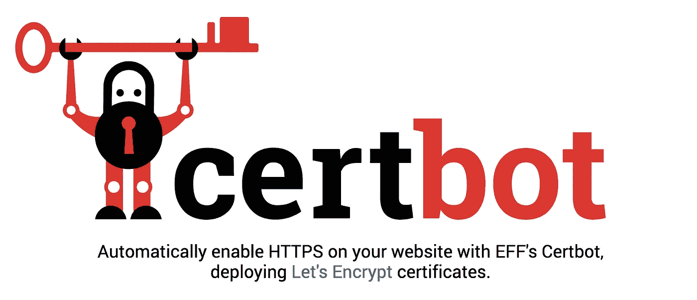
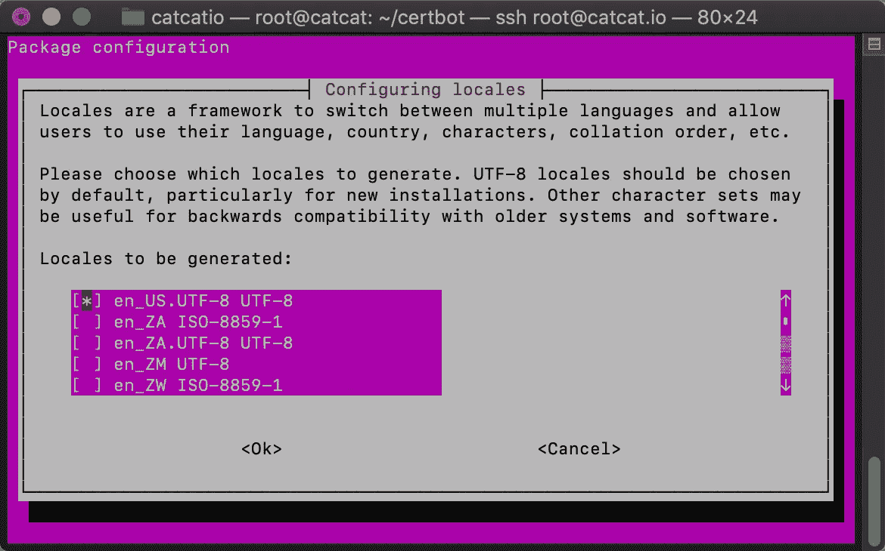
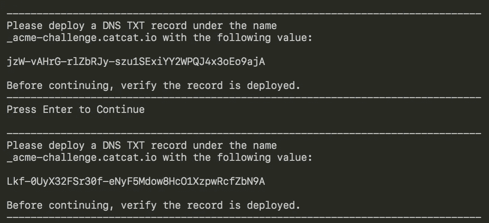
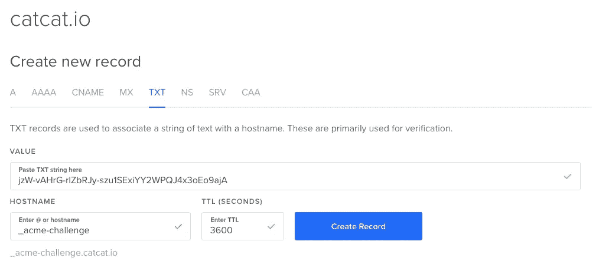

# 🤖如何获取 Certbot 通配符证书

> 原文：<https://levelup.gitconnected.com/how-to-get-certbot-wildcard-certificates-3d25618a81e0>



[https://certbot.eff.org/](https://certbot.eff.org/)

这是如何获得**证书机器人**通配符证书的 3 个步骤。在这个例子中，我使用的是我的域名 **catcat.io** ，但是您可以简单地用您的域名替换这个名称。

1.  **SSH** 进入你的服务器(我使用 [**DigitalOcean**](https://m.do.co/c/6dcfcc2a3392) )并运行这个

```
# To ensure python will not throw error
export LC_ALL="en_US.UTF-8"
export LC_CTYPE="en_US.UTF-8"
sudo dpkg-reconfigure locales
```



```
# Get the source
git clone [https://github.com/certbot/certbot](https://github.com/certbot/certbot)
cd certbot# Run certbot auto
./certbot-auto --os-packages-only# New version doesn't need this, please skip
./tools/venv.sh
source venv/bin/activate# Ask for cert
./certbot-auto -d catcat.io -d *.catcat.io --manual --preferred-challenges dns-01 --server https://acme-v02.api.letsencrypt.org/directory certonly
```

2.您将被要求在您的域名提供商处提交两次 DNS**TXT**TXT**记录**

****

**将来自命令行的值作为 2 个单独的 **TXT** 记录值相加。**

****

**你会在那里看到 2 条 TXT 记录**

****

**3.既然已经部署了 DNS **TXT** 记录，那么返回到命令行并点击 enter。**

```
Press Enter to Continue
Waiting for verification...
Cleaning up challengesIMPORTANT NOTES:
 - Congratulations! Your certificate and chain have been saved at:
   /etc/letsencrypt/live/catcat.io-0001/fullchain.pem
   Your key file has been saved at:
   /etc/letsencrypt/live/catcat.io-0001/privkey.pem
   Your cert will expire on 2018-07-08\. To obtain a new or tweaked
   version of this certificate in the future, simply run certbot
   again. To non-interactively renew *all* of your certificates, run
   "certbot renew"
 - If you like Certbot, please consider supporting our work by:Donating to ISRG / Let's Encrypt:   [https://letsencrypt.org/donate](https://letsencrypt.org/donate)
   Donating to EFF:                    [https://eff.org/donate-le](https://eff.org/donate-le)
```

> **PS:以上是假的**极致挑战**所以不需要审查，只是不要分享你的:)**

## **旧证书的额外步骤**

**您的新证书将在 **catcat.io-0001** 创建一个新文件夹。您可以从两个选项中选择，让您的服务器使用这个新证书。**

1.  **更新您的 **nginx** SSL 配置以指向新的 **catcat.io-0001** 文件夹**
2.  **将任何 **catcat.io-0001** 重命名为 **catcat.io** (备份后)**

```
mv /etc/letsencrypt/live/catcat.io-0001 /etc/letsencrypt/live/catcat.iomv /etc/letsencrypt/renewal/catcat.io-0001.conf /etc/letsencrypt/renewal/catcat.io.conf# use sed or manual replace catcat.io-0001 to catcat.io via nano
nano /etc/letsencrypt/renewal/catcat.io.conf# OR via command line (do backup first)
sed -e "s|catcat.io-0001|catcat.io|g" /etc/letsencrypt/renewal/catcat.io.conf > /etc/letsencrypt/renewal/catcat.io.conf
```

**我选择#2 来保持目录名的整洁。确保 **NGINX** 配置中的任何子域都指向新的 SSL 证书。**

```
nano /etc/nginx/conf.d/default.conf
```

**确保这两个存在并且正确**

```
ssl_certificate /etc/letsencrypt/live/catcat.io/fullchain.pem;
ssl_certificate_key /etc/letsencrypt/live/catcat.io/privkey.pem;
```

**然后重启 **NGINX** ，你应该得到子域 TLS 工作！耶！**

```
service nginx restart
```

**[](https://levelup.gitconnected.com/)**

## **喜欢这个教程吗？下面支持！:D**

```
XLM : GDI6FBVJSHMF5PF6C7DDM57NAGYTYWMQQW2A6BVA6DTS2ZL7ZDRZBI2S
ETH : 0x3E84004C41786CdC409F9355E6eF133f70907Da1
```