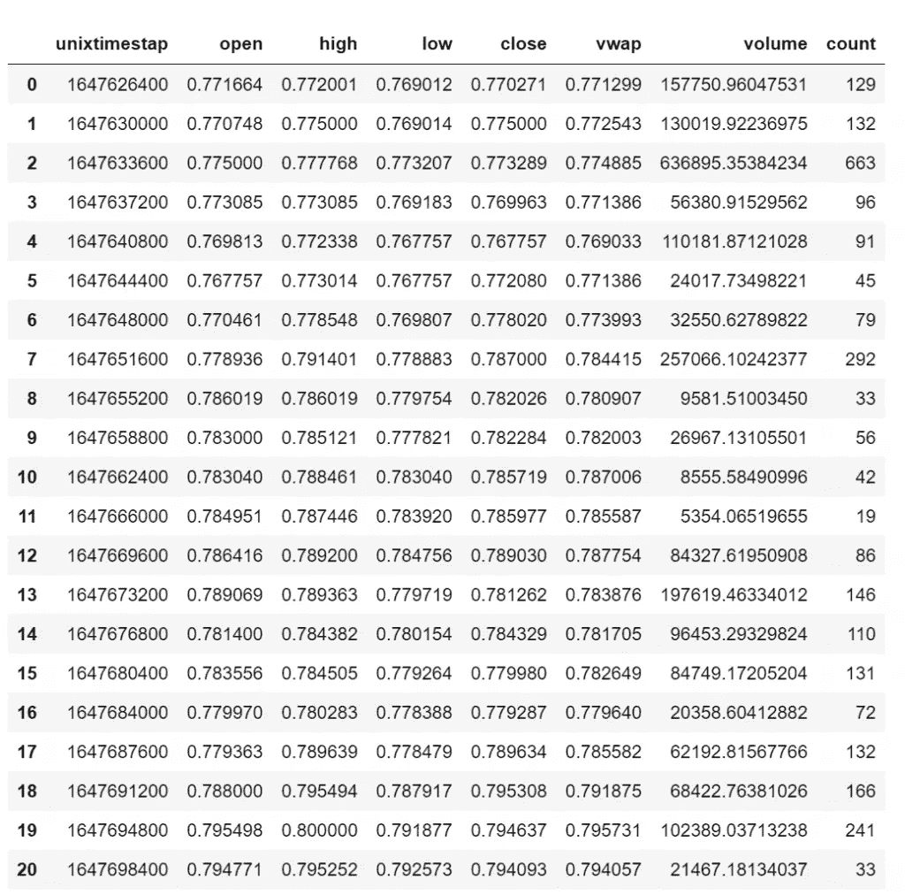
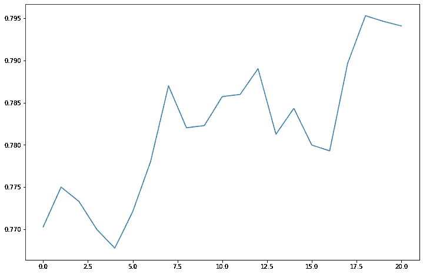
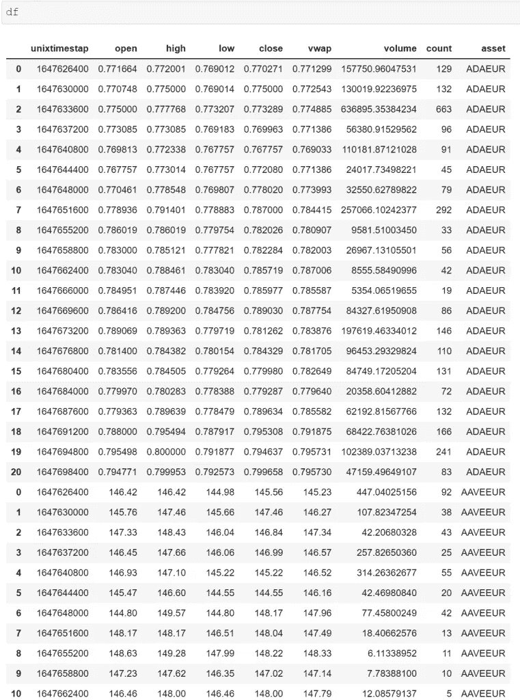

# 如何用 Python 从北海巨妖 API 获取加密货币数据

> 原文：<https://levelup.gitconnected.com/how-to-get-cryptocurrency-data-from-kraken-api-in-python-674200094437>

## 北海巨妖 API 简介


Pierre Borthiry 在 [Unsplash](https://unsplash.com?utm_source=medium&utm_medium=referral) 上拍摄的照片

[](https://jorgepit-14189.medium.com/membership) [## 用我的推荐链接加入媒体-乔治皮皮斯

### 阅读乔治·皮皮斯(以及媒体上成千上万的其他作家)的每一个故事。您的会员费直接支持…

jorgepit-14189.medium.com](https://jorgepit-14189.medium.com/membership) 

数据科学家可以参与“[算法交易](https://en.wikipedia.org/wiki/Algorithmic_trading)项目。目前，由于我们正在进入 [Web3](https://en.wikipedia.org/wiki/Web3) 时代，我们会遇到诸如[区块链](https://en.wikipedia.org/wiki/Blockchain)、[智能合约](https://en.wikipedia.org/wiki/Smart_contract)、 [DeFi](https://en.wikipedia.org/wiki/Decentralized_finance) 、 [DApps](https://en.wikipedia.org/wiki/Decentralized_application) 、 [DAO](https://en.wikipedia.org/wiki/The_DAO_(organization)) 、[Yield farm](https://coinmarketcap.com/alexandria/article/what-is-yield-farming)等术语。我们上面提到的所有这些都是基于区块链技术和加密货币。因此，加密货币似乎不仅仅是作为一种货币转移的媒介，也是一种具有许多应用前景的革命性技术。许多强大的玩家，如微软、IMB 等，已经开始投资 Web3，这种兴趣影响了加密货币市场。更多的投资者和基金进入加密货币市场，对数据科学家运行技术分析、统计分析、时间序列模型、算法交易等有更高的需求。正如我们所知，每个分析都从数据开始，在本教程中，我们将向您展示如何使用 Python 免费从[北海巨妖](https://www.kraken.com/) [API](https://docs.kraken.com/rest/#section/General-Usage) 获取加密货币数据，而无需创建帐户。

# 如何获得交易对

我们需要做的第一件事是获得可用的交易对，然后通过保留我们想要在分析中考虑的交易对来过滤它们。假设我们想考虑欧元上的所有加密货币:

```
import pandas as pd
import requestsresp = requests.get('[https://api.kraken.com/0/public/AssetPairs'](https://api.kraken.com/0/public/AssetPairs'))resp = resp.json()euro_pairs = []
for pair in resp['result']:
    if pair.endswith('EUR'):
        euro_pairs.append(pair)euro_pairs
```

我们得到了 125 个加密报价器:

```
['1INCHEUR',
 'AAVEEUR',
 'ACAEUR',
 'ADAEUR',
 'AIREUR',
 'AKTEUR',
 'ALGOEUR',
 'ALICEEUR',
 'ANKREUR',
 'ANTEUR',
 'APEEUR',
 'ASTREUR',
 'ATLASEUR',
 'ATOMEUR',
 'AUDIOEUR',
 'AVAXEUR',
 ...

 'YFIEUR',
 'YGGEUR',
 'ZRXEUR']
```

我们可以通过在 URL 中输入 pair 变量来获得特定资产对的输出。我们来看看资产对 ADA/EURO。

```
resp = requests.get('[https://api.kraken.com/0/public/AssetPairs?pair=ADAEUR'](https://api.kraken.com/0/public/AssetPairs?pair=ADAEUR'))print(resp.json())
```

输出:

```
{'error': [],
 'result': {'ADAEUR': {'altname': 'ADAEUR',
   'wsname': 'ADA/EUR',
   'aclass_base': 'currency',
   'base': 'ADA',
   'aclass_quote': 'currency',
   'quote': 'ZEUR',
   'lot': 'unit',
   'pair_decimals': 6,
   'lot_decimals': 8,
   'lot_multiplier': 1,
   'leverage_buy': [2, 3],
   'leverage_sell': [2, 3],
   'fees': [[0, 0.26],
    [50000, 0.24],
    [100000, 0.22],
    [250000, 0.2],
    [500000, 0.18],
    [1000000, 0.16],
    [2500000, 0.14],
    [5000000, 0.12],
    [10000000, 0.1]],
   'fees_maker': [[0, 0.16],
    [50000, 0.14],
    [100000, 0.12],
    [250000, 0.1],
    [500000, 0.08],
    [1000000, 0.06],
    [2500000, 0.04],
    [5000000, 0.02],
    [10000000, 0.0]],
   'fee_volume_currency': 'ZUSD',
   'margin_call': 80,
   'margin_stop': 40,
   'ordermin': '2.5'}}}
```

我们可以向同一个调用添加更多对，方法是在 URL 中添加所需的对，用逗号分隔。例如，如果我们想要 ADA/EUR 和 AAVE/EUR:

```
resp = requests.get('[https://api.kraken.com/0/public/AssetPairs?pair=ADAEUR,AAVEEUR'](https://api.kraken.com/0/public/AssetPairs?pair=ADAEUR,AAVEEUR'))print(resp.json())
```

输出:

```
{'error': [], 'result': {'AAVEEUR': {'altname': 'AAVEEUR', 'wsname': 'AAVE/EUR', 'aclass_base': 'currency', 'base': 'AAVE', 'aclass_quote': 'currency', 'quote': 'ZEUR', 'lot': 'unit', 'pair_decimals': 2, 'lot_decimals': 8, 'lot_multiplier': 1, 'leverage_buy': [2, 3], 'leverage_sell': [2, 3], 'fees': [[0, 0.26], [50000, 0.24], [100000, 0.22], [250000, 0.2], [500000, 0.18], [1000000, 0.16], [2500000, 0.14], [5000000, 0.12], [10000000, 0.1]], 'fees_maker': [[0, 0.16], [50000, 0.14], [100000, 0.12], [250000, 0.1], [500000, 0.08], [1000000, 0.06], [2500000, 0.04], [5000000, 0.02], [10000000, 0.0]], 'fee_volume_currency': 'ZUSD', 'margin_call': 80, 'margin_stop': 40, 'ordermin': '0.02'}, 'ADAEUR': {'altname': 'ADAEUR', 'wsname': 'ADA/EUR', 'aclass_base': 'currency', 'base': 'ADA', 'aclass_quote': 'currency', 'quote': 'ZEUR', 'lot': 'unit', 'pair_decimals': 6, 'lot_decimals': 8, 'lot_multiplier': 1, 'leverage_buy': [2, 3], 'leverage_sell': [2, 3], 'fees': [[0, 0.26], [50000, 0.24], [100000, 0.22], [250000, 0.2], [500000, 0.18], [1000000, 0.16], [2500000, 0.14], [5000000, 0.12], [10000000, 0.1]], 'fees_maker': [[0, 0.16], [50000, 0.14], [100000, 0.12], [250000, 0.1], [500000, 0.08], [1000000, 0.06], [2500000, 0.04], [5000000, 0.02], [10000000, 0.0]], 'fee_volume_currency': 'ZUSD', 'margin_call': 80, 'margin_stop': 40, 'ordermin': '2.5'}}}
```

# 如何获得所有资产

我们可以通过运行以下命令获得所有可用资产的列表:

```
resp = requests.get('[https://api.kraken.com/0/public/Assets'](https://api.kraken.com/0/public/Assets'))
resp = resp.json()assets = []
for asset in resp['result']:
    assets.append(asset)assets
```

我们得到 156 项资产:

```
['1INCH',
 'AAVE',
 'ACA',
 'ADA',
 'ADA.S',
 'AIR',
 'AKT',
 'ALGO',
 'ALGO.S',
 'ALICE',
 'ANKR',
 ...
 'ZJPY',
 'ZRX',
 'ZUSD']
```

# 如何获取股票的当前价格

我们可以获得单个货币对的当前市场价格，包括以下所有信息:

*   最近交易价格
*   最近交易量
*   最佳(最高)出价
*   以最佳投标价格出售的数量
*   最佳(最低)要价
*   以最佳要价出售的数量
*   额外的交易信息(当天的最高价/最低价、交易数量、当天的总交易量等)。)

注意:今天的价格从世界协调时午夜开始

让我们获取 ADA/EUR 的当前股票数据

```
resp = requests.get('[https://api.kraken.com/0/public/Ticker?pair=ADAEUR'](https://api.kraken.com/0/public/Ticker?pair=ADAEUR'))resp.json()
```

输出:

```
{'error': [],
 'result': {'ADAEUR': {'a': ['0.794935', '850', '850.000'],
   'b': ['0.794734', '850', '850.000'],
   'c': ['0.794997', '100.00000000'],
   'v': ['1057413.14777778', '2846333.33727160'],
   'p': ['0.785368', '0.776113'],
   't': [1607, 3526],
   'l': ['0.769807', '0.755176'],
   'h': ['0.800000', '0.800000'],
   'o': '0.770461'}}}
```

# 如何获得 OHLC 数据

现在，我们将向您展示如何获取加密货币的 [OHLC](https://en.wikipedia.org/wiki/Open-high-low-close_chart) 数据。在 URL 中，您可以定义以分钟为单位的时间间隔和 Unix 时间戳中的起始时间段。假设我们想获得从**2022–19–03**至今的美元/欧元的小时数据。请注意，API 返回以下统计信息:

*   Unix 时间戳
*   公开价格
*   高价
*   低价
*   收盘价格
*   数量加权平均价格
*   卷
*   交易数量

```
resp = requests.get('[https://api.kraken.com/0/public/OHLC?pair=ADAEUR&since=1647625329&interval=60'](https://api.kraken.com/0/public/OHLC?pair=ADAEUR&since=1647625329&interval=60'))df = pd.DataFrame(resp.json()['result']['ADAEUR'])
df.columns = ['unixtimestap', 'open', 'high', 'low', 'close', 'vwap', 'volume', 'count']df
```



如果我们想得到一个快速的图表:

```
import matplotlib.pyplot as plt
%matplotlib inlinedf.close.astype(float).plot(figsize=(12,8))
```



如果我们想建立一个管道，用 for 循环添加更多的加密货币，我们可以如下工作。为了简单起见，让我们只考虑两种加密货币，ADA 和 AAVEX over Euro。

```
df = pd.DataFrame()
my_pairs = ['ADAEUR','AAVEEUR']for pair in my_pairs:
    tmp_url = f'[https://api.kraken.com/0/public/OHLC?pair={pair}&since=1647625329&interval=60'.format(pair)](https://api.kraken.com/0/public/OHLC?pair={pair}&since=1647625329&interval=60'.format(pair))
    resp = requests.get(tmp_url)
    tmp_df = pd.DataFrame(resp.json()['result'][pair])
    tmp_df['asset'] = pair
    df = pd.concat([df,tmp_df])df.columns = ['unixtimestap', 'open', 'high', 'low', 'close', 'vwap', 'volume', 'count', 'asset']
```



# 最后的想法

作为预测黑客，我们从来没有声称我们可以预测市场，更具体地说是加密货币市场，这是如此不稳定。然而，我们可以评估风险、隐含的波动性、如何[构建优化投资组合的想法](https://predictivehacks.com/portfolio-optimization-in-python/)，如何进行技术分析以及许多其他事情。我们认为，对加密货币分析的需求会很高，这对数据科学家来说是一个好机会，因为会有许多投资者希望应用算法交易、仪表盘、分析、报告等。所以，我不知道你是否可以通过投资加密货币市场赚钱，但我坚信你可以作为数据科学家从加密货币需求中赚钱。敬请关注接下来的教程！

最初由[预测黑客](https://predictivehacks.com/how-to-get-cryptocurrency-data-from-kraken-api-in-python/)发布