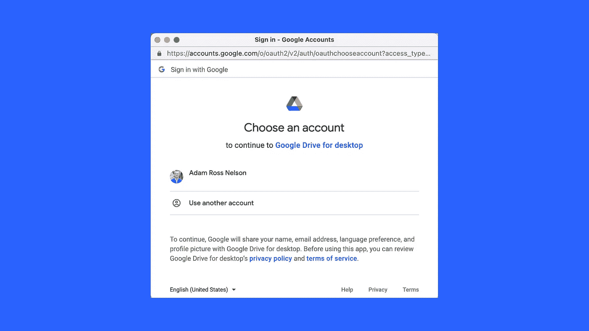

# 如何将数据从 Gdrive 导入 Google Colab

> 原文：<https://levelup.gitconnected.com/how-to-get-data-from-gdrive-into-google-colab-b0a807c01300>

## 本文将向您展示如何使用 Google Colab 访问存储在 Gdrive 上的数据(和其他文件)

# 概述+背景

在 Google Colab 中处理数据时，获取存储在 Google Drive (Gdrive)中的数据通常很方便。本文展示了如何做到这一点。

我倾向于将原始数据保存在这个位置+文件名约定中:

`gdrive/MyDrive/Colab Notebooks/save_data/[project_name]/data_file.csv`

有时我会将数据保存在其他位置。这是我自己司机的一个例子:

`gdrive/MyDrive/Uni_Data/institutional_data.csv`

在这个例子中,`institutional_data.csv`存储了许多学院和大学的相关数据。

# 获取数据

首先 Google 为此提供了一个库。两行代码就可以让您开始工作了。

```
from google.colab import drive
drive.mount('/content/gdrive')
```

请注意，此过程可能需要授权，如下所示。



图片鸣谢:作者截屏。访问此功能需要授权。

## 对于我的原始数据位置

对于我的典型原始数据位置，我发现的最好、最具可读性的方法之一是:

```
# Specify a path variable (project path)
proj_path = '/content/gdrive/MyDrive/Colab Notebooks/save_data/'
```

然后:

```
# Load the data into a DataFrame
df = pd.read_csv(proj_path + 'data_file.csv')
```

## 对于我的其他位置

首先再次指定一个路径变量(项目路径)。

```
# Specify a path variable (project path)
proj_path = '/content/gdrive/MyDrive/Uni_data/'
```

上面的例子引用了一个文件夹，我在其中存储了与学院和大学相关的信息。我经常使用这些机构数据进行研究和分析。

然后:

```
# Load the data into a DataFrame
df = pd.read_csv(proj_path + 'institutional_data.csv')
```

# 添加了 Colab 背景

[](https://medium.datadriveninvestor.com/how-to-use-google-colab-for-senior-organizational-leaders-3f2b10f83d19) [## 高级组织领导如何使用 Google Colab

### 需要了解 Google Colab 的高级组织领导指南

medium.datadriveninvestor.com](https://medium.datadriveninvestor.com/how-to-use-google-colab-for-senior-organizational-leaders-3f2b10f83d19) 

# 结论

下一次，当你在谷歌硬盘上寻找数据加载的快速参考时，这将是你的首选。

# 感谢阅读

你准备好了解更多关于数据科学职业的信息了吗？我进行一对一的职业辅导，并有一份每周电子邮件列表，帮助专业求职者获取数据。联系我了解更多信息。

感谢阅读。把你的想法和主意发给我。你可以写信只是为了说声嗨。如果你需要告诉我是怎么错的，我期待着尽快和你聊天。推特:[@ adamrossnelson](https://twitter.com/adamrossnelson)LinkedIn:[亚当罗斯尼尔森](https://www.linkedin.com/in/arnelson/)。


图片鸣谢:作者截屏+ Canva 的智能样机。