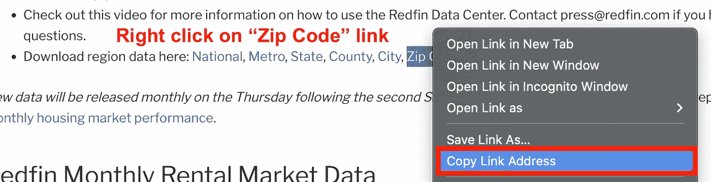

# 如何使用 Python 获取住房市场的数据

> 原文：<https://levelup.gitconnected.com/how-to-get-data-on-the-housing-market-using-python-603317f9291a>

## Python 教程获取 Redfin 住房市场数据并在 Tableau 中可视化

迈克尔·图辛斯基在 [Unsplash](https://unsplash.com/photos/4nuCGapo4Zs) 上的照片

***如何知道现在是买卖房地产的好时机？***

影响房地产市场*健康的因素有很多，包括销售价格中值、售出房屋、新上市房屋、上市天数中值、价格下跌等。*

*住房市场数据存储在 MLS(多重列表服务)中。进入 MLS 需要特定地区的房地产许可证。*

****如果我们不是持牌代理，如何获取每月的房源数据？****

*我们可以使用在线经纪公司，如 Redfin，按月将全国的房地产市场数据整合到邮政编码级别。*

## *Redfin 是什么，为什么使用他们的数据？*

**

*[Redfin 数据中心](https://www.redfin.com/news/data-center/)作者截图*

> *Redfin 是一家房地产经纪公司，这意味着我们可以直接访问来自当地多家上市服务机构(MLS)的数据，以及来自全国各地房地产代理商的见解。这就是为什么我们能够给你关于房地产市场状况的最早最可靠的数据。使用我们的工具，您可以可视化和下载全国大都市地区、城市、社区和邮政编码的住房市场数据。— [Redfin 数据中心](https://www.redfin.com/news/data-center/)*

****这个帖子将使用 Python 获取一个邮政编码列表的住房市场数据。然后数据将在 Tableau 中可视化。****

**

*作者在 [Tableau 仪表板](https://public.tableau.com/app/profile/ariel.herrera5041/viz/MarketAnalysis_16561931911200/MarketAnalysisDashboard)中创建的图像*

# *问题陈述*

*我们需要回答我们的房地产市场是否正在崩溃？*

*我们知道房产市场数据在 ***邮政编码*** 级别最有用，因此我们需要我们所在区县所有邮政编码的最新数据。*

****住房市场数据将包括诸如销售价格、售出房屋、新上市、上市天数和价格下降等特征。****

*数据应每周更新，并在 12 周的时间内进行计算。*

*这将使我们能够判断我们的住房市场是转向买方市场还是卖方市场。*

# *数据源*

*我们将使用 Redfin 数据中心的 ***邮政编码区域数据*** 。*

*Redfin 数据的位置(作者在[织机](https://www.loom.com/share/8c318d069b384b4d8047cc1836c8d44d)上制作的视频)*

# *支持视频*

*跟随我的 Python 教程视频。*

*视频输出(作者在 [AnalyticsAriel YouTube](https://www.youtube.com/c/analyticsariel) 频道上的视频)*

# *Python 教程*

*如果您没有现有的 Python 环境，那么我强烈建议首先用**克隆笔记本**(在文章的底部)。*

*这将允许您在 Google Colab 中运行 Python 代码(免费！).它是一个基于云的环境，让您无需在本地安装 Python 就可以运行代码。*

# *I .导入库*

*首先，导入所需的库。*

**

*导入的代码片段(作者使用 snappify.io 创建的图片)*

# *二。数据*

## *读入住房数据文件*

*Redfin 月度住房数据文件分为七个区域:国家、城市、州、县、市、邮政编码和社区。*

*对于我们的用例，我们将关注于 ***邮政编码*** 数据集。*

*要找到该文件，请导航至 [Redfin 的数据中心](https://www.redfin.com/news/data-center/)。右键“邮政编码”定位 ***链接地址*** 。*

**

*定位数据链(作者在 [Redfin 数据中心](https://www.redfin.com/news/data-center/)截屏)*

## *数据加载*

*在我们的笔记本中，我们将读取内存中的文件*。这允许我们从我们的环境中读取我们的文件，而不必将文件下载到本地。**

*邮政编码数据集是 tsv000.gz 格式的。我们使用 pandas 从我们的 URL 读取文件。*

**

*代码片段(作者使用 snappify.io 创建的图片)*

*加载该文件大约需要 2.3 分钟。内容包括***5ml+行数据和 50+列*** ！*

**

*代码输出(作者创建的截图)*

*以下是我们数据集中要素的完整列表:*

*   *`median_sale_price` **:** 最终房屋销售价格，涵盖在给定时间段内销售日期的所有房屋，其中 50%的销售额高于此价格，50%的销售额低于此价格。*
*   *`median_list_price` **:** 最近的挂牌价格，涵盖在给定时间段内挂牌日期的所有房屋，其中 50%的活跃挂牌高于此价格，50%低于此价格。*
*   *`median_ppsf` **:** 所有在售房源每平方英尺的标价中值。*
*   *`homes_sold` **:** 给定时间段内有销售日期的房屋总数。*
*   *`pending_sales` **:** 这一时期签订合同的房屋总数。不包括上市时间超过 90 天的房屋。*
*   *`new_listings` **:** 给定时间段内添加了房源列表日期的房屋总数。*
*   *`inventory` **:** 给定时间段最后一天的活跃列表总数。*
*   *`months_of_supply` **:** 当数据为月度时，为库存除以房屋销售。这告诉你，如果没有新的房屋上市，需要多长时间才能买光供应。*
*   *`median_dom` **:** 房屋上市销售日期与房屋退市/待售日期之间的天数，涵盖给定时间段内退市日期的所有房屋，其中 50%的退市房屋在市场上停留时间较长，50%的退市时间较短。不包括在市场上待售超过一年的房屋。*
*   *`avg_sale_to_list` **:** 每套房屋销售价格除以其标价的平均比率，涵盖给定时间段内有销售日期的所有房屋。不包括售价为 50%的房产*
*   *`sold_above_list` **:** 在给定的时间段内，销售价格高于其最新标价的房屋销售的百分比，包括销售日期的所有房屋。不包括售价高于标价 50%或低于标价 50%的物业。*
*   *`price_drops` **:** 在给定的时间段内，有多少物品降价。*
*   *`off_market_in_two_weeks` **:** 挂牌后两周内成交的房屋总数。*

***来源** : [Redfin 数据中心指标定义](https://www.redfin.com/news/data-center-metrics-definitions/)*

*让我们根据感兴趣的州来过滤数据集。这里我们选择“FL”代表佛罗里达。*

**

*代码片段(作者使用 snappify.io 创建的图片)*

*这个 ***把我们的数据集减少了~93%*** ！我们的数据集现在更容易处理了。*

**

*代码输出(作者创建的截图)*

## *数据合并*

*对于我们的用例，我们将选择一些邮政编码来回顾。因此，我们从 Github 的 ***地理数据集*** 中读入地图邮政编码、县和州。*

****在对整个数据集应用逻辑之前，数据分析的最佳实践是从样本集开始。****

**

*代码片段(作者使用 snappify.io 创建的图片)*

*我们的数据集中有 ***~33K 的邮政编码*** 。*

**

*代码输出(作者创建的截图)*

*为了我们的分析，让我们想象一下 ***我们的市场是佛罗里达州西海岸的坦帕湾地区*** 。因此，我们只想关注包含和环绕城市的县。*

**

*图片由 FDOT 交通([来源](https://www.fdottampabay.com/assets/images/d7-service-area-map-new.png))*

*在这里，我们过滤地理数据集，只包括感兴趣的五个县的邮政编码。*

**

*代码片段(作者使用 snappify.io 创建的图片)*

*有几个*无效邮政编码*。*

**

*代码输出(作者创建的截图)*

*我们删除了无效的邮政编码，以生成我们感兴趣的县 内的地理数据集。*

**

*代码片段(作者使用 snappify.io 创建的图片)*

*总共有 ***119 个有效邮政编码*** 。*

**

*代码输出(作者创建的截图)*

*接下来，我们从我们的住房数据集中添加一个特性`zipcode`，以便从`region`字段中提取邮政编码。*

*这允许我们将我们的住房数据集与我们关心的邮政编码的地理数据集连接起来。*

**

*代码片段(作者使用 snappify.io 创建的图片)*

*我们的数据帧现在由 ***~56K 行*** 组成。这将使我们更容易创建 Tableau 仪表板，而不是从国家数据开始。*

**

*代码输出(作者创建的截图)*

## *数据清理*

****数据分析的最佳实践是在粒度级别审查和采样数据以确认有效性。****

*在这里，我们根据单个邮政编码和酒店类型进行筛选。*

**

*代码片段(作者使用 snappify.io 创建的图片)*

*我们可以看到`median_dom_mom`值是不正确的。*

*2022 年 3 月声明`median_dom_mom`为 1 或 100%。如果这是真的，`median_dom`将是 12 而不是 7。*

**

*代码输出(作者创建的截图)*

*为了纠正坏数据，让我们测试一个新特性***median _ DOM _ mom _ correction。*** 该字段重新计算 ***median_dom_mom*** 。*

**

*代码片段(作者使用 snappify.io 创建的图片)*

**

*代码输出(作者创建的截图)*

****让我们添加特征来清理和增强我们的数据集。****

# *三。特征*

*我们向数据集添加了三个要素:*

*   *`latest_period`:我们数据集中最新时间段的标志。*
*   *`city`:从数据帧合并中删除重复的列*
*   *`median_dom_mom`:重新计算月平均上市天数，修复不良数据。*

**

*代码片段(作者使用 snappify.io 创建的图片)*

*我们正式拥有了一个经过净化和过滤的数据集，可以通过可视化进行分析了！*

**

*代码输出(作者创建的截图)*

# *四。输出*

*在线下载该文件，开始创建图表，以可视化住房指标随时间变化的趋势。*

**

*代码片段(作者使用 snappify.io 创建的图片)*

# *不及物动词形象化*

*查看我的 ***tableau 公共仪表盘视频*** 上传房市数据文件，查看市场走势。*

*视频输出(作者在 [AnalyticsAriel YouTube](https://www.youtube.com/c/analyticsariel) 频道上的视频)*

# *结论*

*Redfin 的免费住房市场数据集是在邮政编码层面分析数据的一个不可思议的资源。*

*使用住房市场数据集和可视化工具(如 Tableau)可以洞察房地产市场的表现和未来趋势。*

*查看我的 [YouTube 频道——AnalyticsAriel](https://youtube.com/c/analyticsariel),获得更多关于房地产数据来源和数据分析的见解！*

# *克隆笔记本*

* [## projects/redfin _ market _ data _ zip _ code . ipynb at master analytics Ariel/projects

### https://analyticsariel.com/.通过在 GitHub 上创建帐户，为 analyticsariel/projects 开发做出贡献。

github.com](https://github.com/analyticsariel/projects/blob/master/economic_data/redfin_market_data_zip_code.ipynb) 

# 来源

 [## 数据中心

### 从 Redfin 查看和下载最新的房地产市场数据，包括房价、销售、库存、新上市房源…

www.redfin.com](https://www.redfin.com/news/data-center/) 

# 分级编码

感谢您成为我们社区的一员！在你离开之前:

*   👏为故事鼓掌，跟着作者走👉
*   📰查看[升级编码出版物](https://levelup.gitconnected.com/?utm_source=pub&utm_medium=post)中的更多内容
*   🔔关注我们:[Twitter](https://twitter.com/gitconnected)|[LinkedIn](https://www.linkedin.com/company/gitconnected)|[时事通讯](https://newsletter.levelup.dev)

🚀👉 [**软件工程师的顶级工作**](https://jobs.levelup.dev/jobs?utm_source=pub&utm_medium=post)*