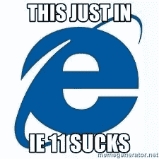
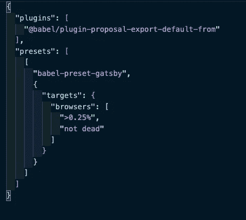

# 如何让盖茨比在 Internet Explorer 11 中工作

> 原文：<https://levelup.gitconnected.com/how-to-get-gatsby-to-work-in-internet-explorer-11-7aecedcb22ba>



这是真的吗

我发现自己正在使用 [Gatsby](http://gatsbyjs.org/) 做一个志愿者项目，这是一个非常棒的包装器，它将 [React.js](https://reactjs.org/) 与[服务器端渲染](https://www.freecodecamp.org/news/what-exactly-is-client-side-rendering-and-hows-it-different-from-server-side-rendering-bd5c786b340d/)和流行的脸书制造的 API [GraphQL](https://graphql.org/) 打包在一起。盖茨比真的很棒，我写了一个完全不同的博客，关于为什么你应该使用它，但是，如果你不想读它，基本上它很快，对那些想要在各种互联网连接上容易加载的网站的人来说真的很好。

然而，使用这种高级前端 JavaScript 框架的代价是，并不是每个用户都使用可以处理代码的浏览器！



Gatsby 的浏览器默认预设。

以上是盖茨比[巴别塔插件](https://babeljs.io/docs/en/plugins/)的预置。巴别塔是另一篇博文的主题，但基本上，它有助于为旧浏览器翻译或“移植”更现代的代码。

简介:作为网络编程语言，JavaScript 处于一个奇怪而独特的位置。因为如此多的网站依赖于它，并且许多网站很少维护，[参见最近围绕 COBOL 的 kerflufffle](https://www.cnn.com/2020/04/08/business/coronavirus-cobol-programmers-new-jersey-trnd/index.html)，对 JavaScript 的任何更改都有可能破坏整个互联网。解决像[“null”是一个对象](https://www.w3schools.com/js/js_datatypes.asp)这样的问题是困难的，对 JS 的大多数改变实际上是“语法糖”，这意味着它们只是做 JS 已经可以用更长的代码做的事情的捷径。但是，即使这些“糖”检修，使目前的代码在一些浏览器中断。

那么上面的代码是什么意思呢？

这意味着，如果巴别塔检测到，只要有超过 1%的客户在使用浏览器，或者浏览器“没有死亡”，巴别塔将什么也不做。但是如果它看到一个旧的浏览器，它会尝试将你的代码转换到一个旧版本的 JS 中，这个版本的 JS 可以在它的浏览器中运行。

然而，即使有了这些预设，我们的网站，一个帮助在家的人找到视频集体疗法的志愿者项目，在 Internet Explorer 11 上出现了错误，这是一个现在大多数人都反对的浏览器(被微软 Edge 所取代)，但从技术上来说，应该得到盖茨比的支持。

那么，发生了什么，我们做了什么？


这篇博客的专栏部分

我和杰出的程序员[马克·绍尔·乌特利](https://medium.com/u/6212b5c2848e?source=post_page-----7aecedcb22ba--------------------------------)一起工作过，所以请雇佣他，尽管他已经有工作了，他是个天才，没有他我永远也不会过去。

首先，我们只是得到一个空白页面，没有加载任何东西。

原来这是因为我们使用了“gatsby develop”而不是“gatsby build ”,这意味着在我们的开发环境中，我们不能用 Babel 正确地传输代码。

幸运的是，通过将我们的代码“构建”到生产环境中，我们能够获得编译过的代码，但是我们仍然需要服务它！

我们最终使用 [NPM 服务包](https://www.npmjs.com/package/serve)和 [NGROK](http://ngrok.io/) 从 mac 上为网站提供服务，并在 PC 上进行测试(这是一种测试 IE11 的简单方法，IE11 在新电脑上默认是隐藏的，因为它很糟糕)。对于 Gatsby 的默认端口，结果是:

```
npx serve -s -p 8000 public
```

这允许我们用指定的端口提供 Gatsby 的静态公共目录。

然而，这导致了另一个错误。

我们得到的错误是:

```
fetch is not defined.
```

我们的网站无法加载。


我认识古怪的盖蒂图片社的人。我们也很沮丧！

原来这是《盖茨比》的一个已知错误，尽管《盖茨比》主要是为了制作类似静态的网站这一想法可以原谅它，但它似乎仍然是一个重大的错误。

马克和我尝试了很多事情，包括

*   盖茨比的 Polyfill-io 插件
*   对“Gatsby-node”文件进行更改，以更改 W [ebpack](https://webpack.js.org/) 配置，使其显式地转换为 ES5 代码。
*   更改“package.json”或中的配置。babelrc”文件手动添加“IE 11”。

诸如此类。

最终，我们所做的工作是马克的聪明才智、我们的同事马克·贝洛良好的代码编写实践的结合。

我们最终使用了 [NPM 同构获取包](https://www.npmjs.com/package/isomorphic-fetch)以及来自 [NPM es6-promise 包](https://www.npmjs.com/package/es6-promise)的“polyfill”函数。

我们用这个替换了原本应该在 IE11 中不工作的[原生浏览器“获取”API](https://developer.mozilla.org/en-US/docs/Web/API/Fetch_API) ，用一个“同构”获取，或者一个无论在哪里被调用都可以工作的获取。这和一个帮助传输[“promises”](https://developer.mozilla.org/en-US/docs/Web/JavaScript/Reference/Global_Objects/Promise)的函数一起，是 JS 后来增加的一个用于获取的功能，使我们的网站最终能够工作。

这听起来很容易，但这可能是一场噩梦！在许多 React 代码库中，fetch 在整个应用程序的不同位置使用，以从 API 端点获取数据！幸运的是，Mark Bello 将所有的获取抽象为一个类！这意味着我们可以简单地转到“apiRequest”类(所有获取都是从该类导入的),并使用以下代码行:

```
*import* fetch *from* 'isomorphic-fetch';*import* { polyfill } *from* "es6-promise";*polyfill*()
```

就这样了！奇迹般地，它现在适用于 IE11！多好的旅程啊！


温斯顿。

另一个旅行者是兔子温斯顿。通常我在这些博客中只关注小狗，但对温斯顿来说，它的每一小步都是一次旅程。

值得为 IE11 调试盖茨比来看看那些失败。

再见了，

网络信息中心(Network Information Center)ˌ网路界面卡(Network Interface Card)ˌ全国工业理事会(National Industrial Council)ˌ航行情报中心(Navigation Information Center)