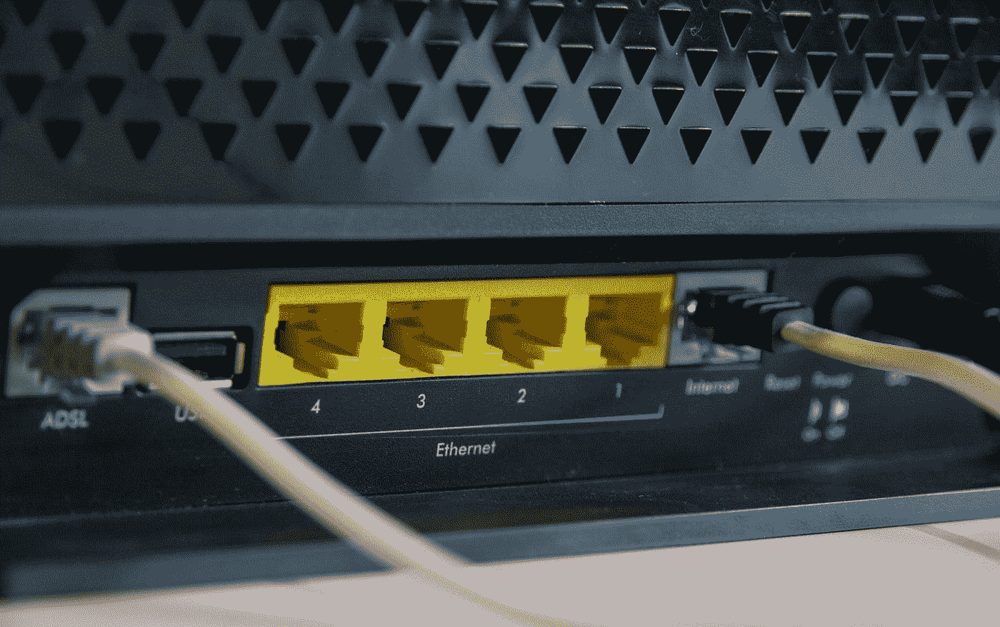

# 如何从华硕路由器中获得最大收益—第 1 部分

> 原文：<https://levelup.gitconnected.com/how-to-get-maximum-from-your-asus-router-part-1-427f991e35c7>

在第 1 部分中，我们将讨论使用定制的 ASUSWRT-MERLIN 固件来刷新您的路由器。

斯蒂芬·菲利普斯-Hostreviews.co.uk 在 [Unsplash](https://unsplash.com?utm_source=medium&utm_medium=referral) 上的照片

# 为什么要更新到定制固件？

将您的路由器升级到定制固件可能会打开一个可能性的世界，将您的路由器变成一个小型家庭服务器，能够做比制造商最初打算做的更多的事情。一些事情可能是广告过滤、文件共享、网络监控等等。

在本指南中，我将展示如何安装和使用 ASUSWRT-MERLIN (Merlin 在后续文本中)固件。Merlin 固件是原始 Asus 固件的扩展，提供额外的功能，同时承诺保留原始制造商的功能。

# 一句警告

虽然这是一件相当直接和容易做到的事情，但本文作者不对遵循本指南给自己和他人造成的任何数据或硬件损害负责。我不熟悉您的设置和环境，无论多么罕见，问题都可能发生。

# 如何升级到 Merlin 固件？

现在免责声明出来了，让我们开始吧。首先，你需要从 https://www.asuswrt-merlin.net[下载适合你的路由器型号的固件。下载后，导航到路由器的主页并登录。接下来，进入管理- >固件升级菜单，上传刚刚下载的固件，刷新路由器。](https://www.asuswrt-merlin.net)

将 Asus 路由器升级到 ASUSWRT-MERLIN 固件

这可能需要几分钟时间，一旦完成，您的路由器将重置。
注意:在此过程中，您可能会丢失部分或全部路由器配置设置，因此请确保保存您的配置。

# 下一步是什么？

现在，您已经在路由器上运行了最新、最好的 Merlin 固件。有了这些基础知识，我们就可以开始第 2 部分的学习了，并建立到路由器的 SSH 连接。

 [## 如何从华硕路由器中获得最大收益—第 2 部分

### 在第 2 部分中，我们将讨论如何设置到路由器的 SSH 连接

astrujic.medium.com](https://astrujic.medium.com/how-to-get-maximum-from-your-asus-router-part-2-a23e0f0aa884)  [## 如何从华硕路由器中获得最大收益—第 3 部分

### 在第 3 部分，我们将看看如何通过安装定制软件来提升我们的路由器

astrujic.medium.com](https://astrujic.medium.com/how-to-get-maximum-from-your-asus-router-part-3-9eb62b16fd0b)