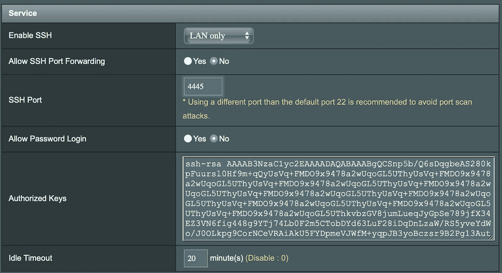
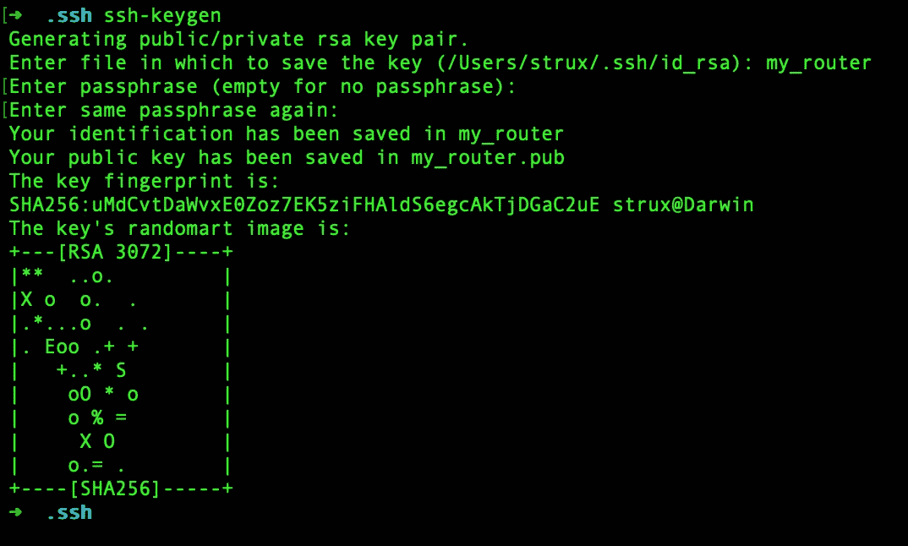

# 如何从华硕路由器中获得最大收益—第 2 部分

> 原文：<https://levelup.gitconnected.com/how-to-get-maximum-from-your-asus-router-part-2-a23e0f0aa884>

在第 2 部分中，我们将讨论如何设置到路由器的 SSH 连接


Joan Gamell 在 [Unsplash](https://unsplash.com?utm_source=medium&utm_medium=referral) 上的照片

在[第 1 部分](https://astrujic.medium.com/how-to-get-maximum-from-your-asus-router-part-1-427f991e35c7)中，我们讨论了使用 ASUSWRT-MERLIN 固件进行刷新，现在让我们看看如何连接到您的路由器。

# 启用 SSH

为了启用 SSH，我们需要导航到管理->系统。



启用 SSH 连接

在“服务”部分，我们将通过将 SSH 设置为“仅 Lan”来启用仅从您的本地网络使用 SSH。出于安全原因，我们将把默认端口从 22 更改为 4445。我们将设置“允许密码登录”为假，而不是使用密码，我们将生成私人/公共密钥对。

# 生成公钥/私钥对

让我们转到本地计算机上的终端并导航到`cd ~/.ssh`
现在让我们通过键入`ssh-keygen`来生成新的公钥/私钥对



SSH 安全性

我们需要指定将要保存密钥对的文件的名称。您可以跳过设置密码短语。现在，我们可以获取我们的公钥 my_router.pub 的内容，并将其添加到授权密钥部分，如前面的屏幕截图所示。

我们可以通过键入:
`ssh [username]@[IP address] -p 4445 -i ~/.ssh/my_router`
来尝试连接到我们的路由器，其中【用户名】是您用来登录路由器 GUI 的用户名，【IP 地址】是它的地址。我们使用-p 4445 参数连接到我们前面定义的自定义端口。

现在让我们通过创建配置文件来简化我们的连接。让我们从输入`nano ~/.ssh/config`开始，在里面输入以下内容:

```
Host router
HostName [IP Address]
User [username]
Port 4445
IdentityFile ~/.ssh/my_router
```

现在我们可以通过简单地输入`ssh router`来连接路由器。

这就是第二部分。在第三部分[中，我们将讨论如何在路由器上安装定制软件。](https://astrujic.medium.com/how-to-get-maximum-from-your-asus-router-part-3-9eb62b16fd0b)

[](https://astrujic.medium.com/how-to-get-maximum-from-your-asus-router-part-3-9eb62b16fd0b) [## 如何从华硕路由器中获得最大收益—第 3 部分

### 在第 3 部分，我们将看看如何通过安装定制软件来提升我们的路由器

astrujic.medium.com](https://astrujic.medium.com/how-to-get-maximum-from-your-asus-router-part-3-9eb62b16fd0b) [](https://astrujic.medium.com/how-to-get-maximum-from-your-asus-router-part-1-427f991e35c7) [## 如何从华硕路由器中获得最大收益—第 1 部分

### 在第 1 部分中，我们将讨论用定制的 ASUSWRT-MERLIN 固件来刷新您的路由器。

astrujic.medium.com](https://astrujic.medium.com/how-to-get-maximum-from-your-asus-router-part-1-427f991e35c7)