# 如何从华硕路由器中获得最大收益—第 3 部分

> 原文：<https://levelup.gitconnected.com/how-to-get-maximum-from-your-asus-router-part-3-9eb62b16fd0b>

在第 3 部分，我们将看看如何通过安装定制软件来提升我们的路由器


照片由[一些故事](https://unsplash.com/@some_tale?utm_source=medium&utm_medium=referral)在 [Unsplash](https://unsplash.com?utm_source=medium&utm_medium=referral)

在本指南的[第 1 部分](https://astrujic.medium.com/how-to-get-maximum-from-your-asus-router-part-1-427f991e35c7)中，我们看到了如何安装 ASUSWRT-MERLIN 固件，在[第 2 部分](https://astrujic.medium.com/how-to-get-maximum-from-your-asus-router-part-2-a23e0f0aa884)中，我们看到了如何通过 ssh 连接到它。现在让我们看看如何使用 **amtm** (ASUSWRT-MERLIN 终端管理器)和 **entware** 软件包管理器为嵌入式设备安装定制软件。

# 设置 amtm 并准备 USB 设备

为了安装定制软件，我们需要先找到合适的存储。任何旧的几 GB 的 USB 闪存驱动器都可以满足这个目的。请注意，你不应该有任何数据，因为你需要格式化它。

让我们用 ssh 登录我们的路由器，并键入 amtm

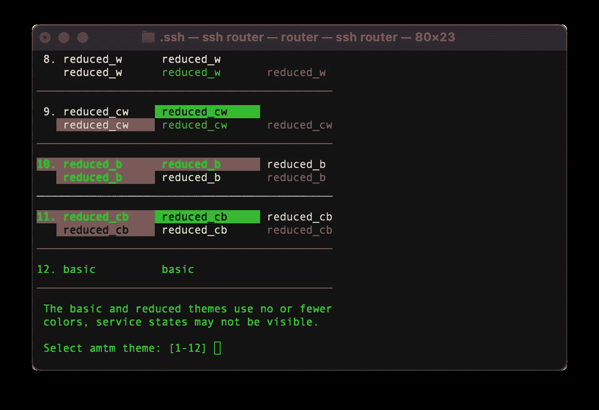

amtm 设置

首先我们需要选择 amtm 风格。你可以根据你的喜好选择一个。我就选 1。

接下来我们需要格式化我们的 USB 驱动器，所以键入`fd`并按回车键。

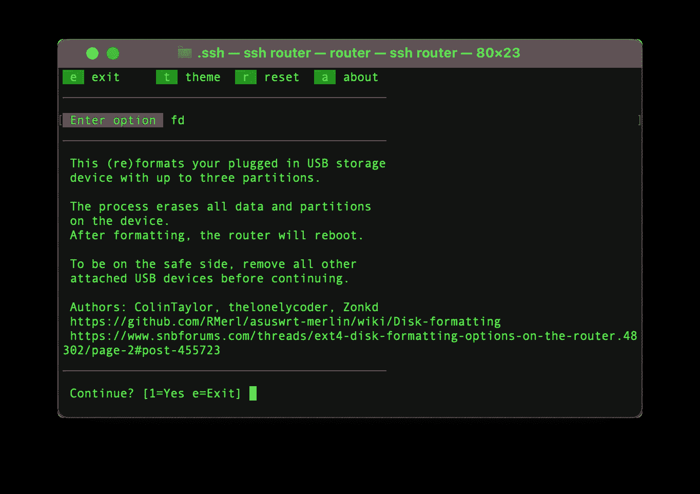

格式化 USB 驱动器

你会得到一个警告，你所有的数据将被删除，为了安全起见，你应该在继续之前拔掉我们所有的其他 USB 驱动器。

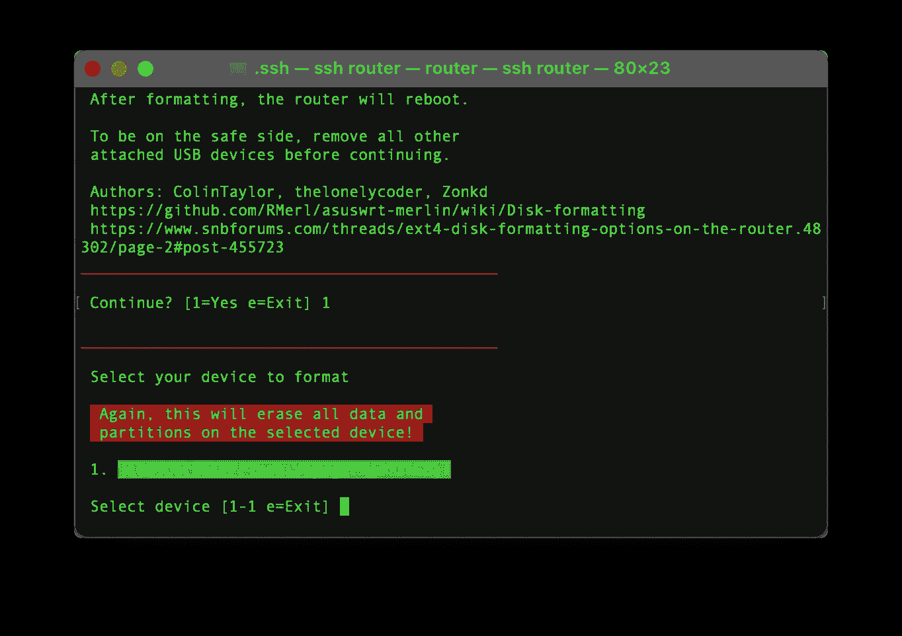

选择要格式化的 USB 驱动器

在下一个屏幕上，我们需要确认我们正在格式化的驱动器选择

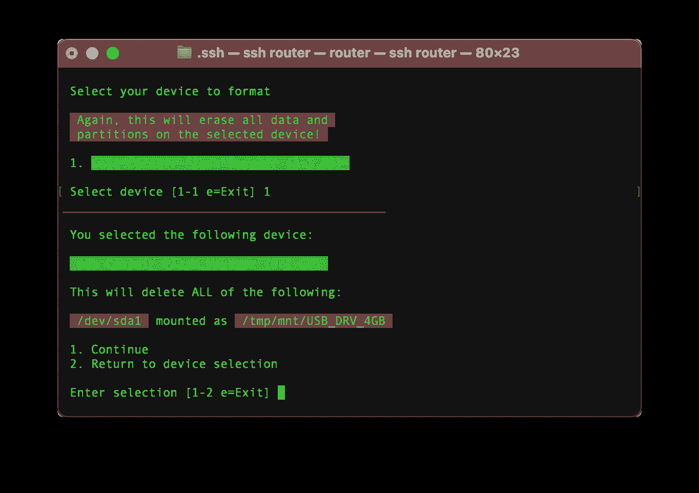

确认 USB 驱动器选择

现在我们需要选择分区的数量，因为我们需要 ext4，我们将选择 1 个分区。

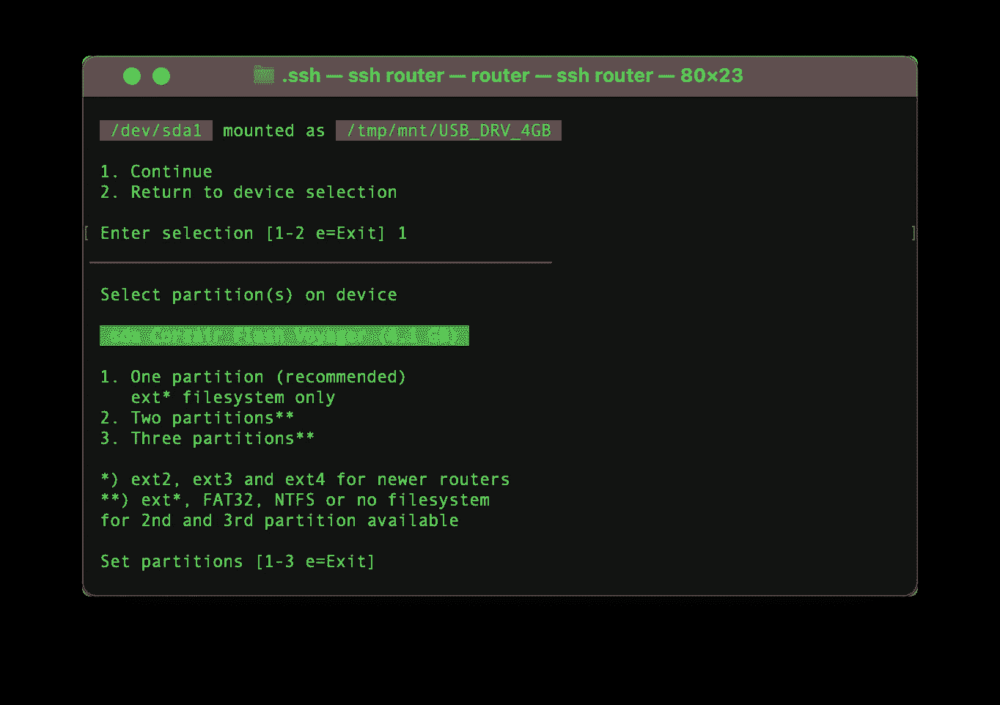

选择分区数量

在下一个磁盘格式屏幕上，我们将选择 ext4。

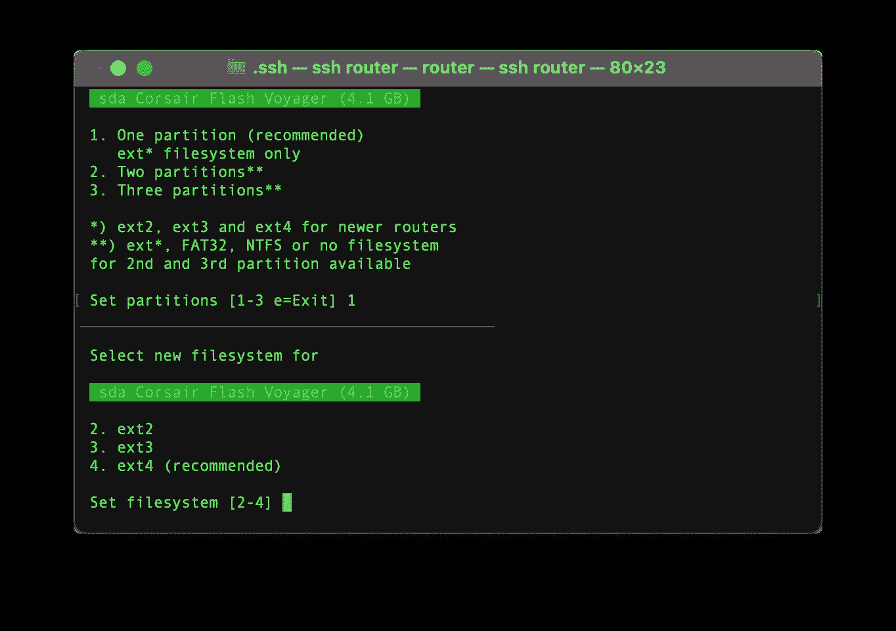

选择磁盘格式

我们将启用日志功能

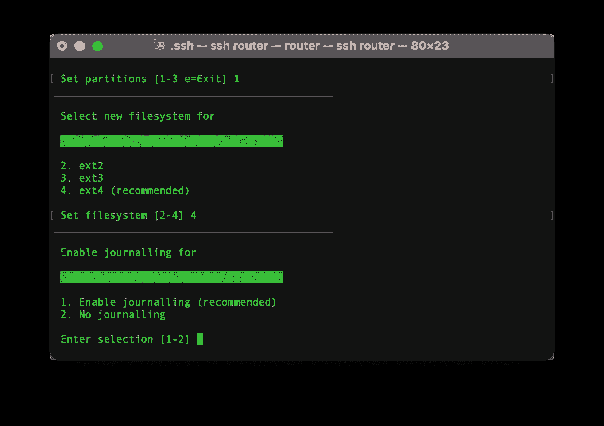

启用日志记录

在下一个屏幕上，我们可以选择为新创建的卷设置名称

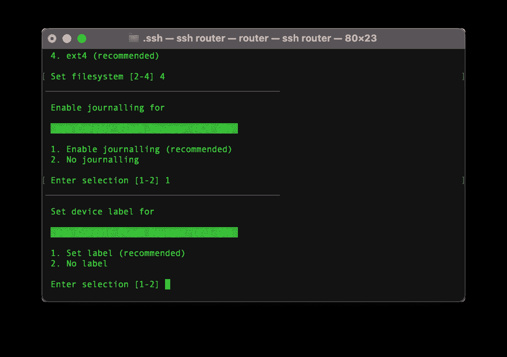

设置卷名

又一个确认屏幕，这次确认卷名输入正确。

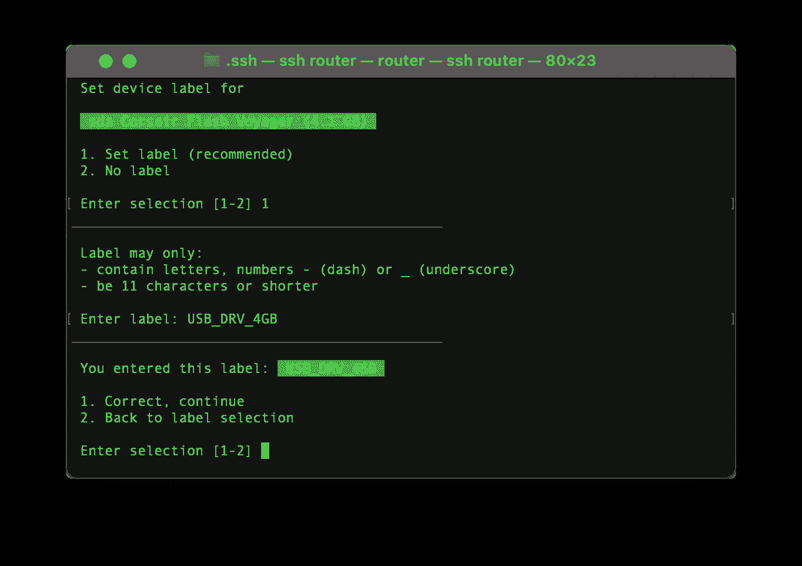

确认卷名

我们现在有一个简短的总结，我们的选择和确认开始格式化设备

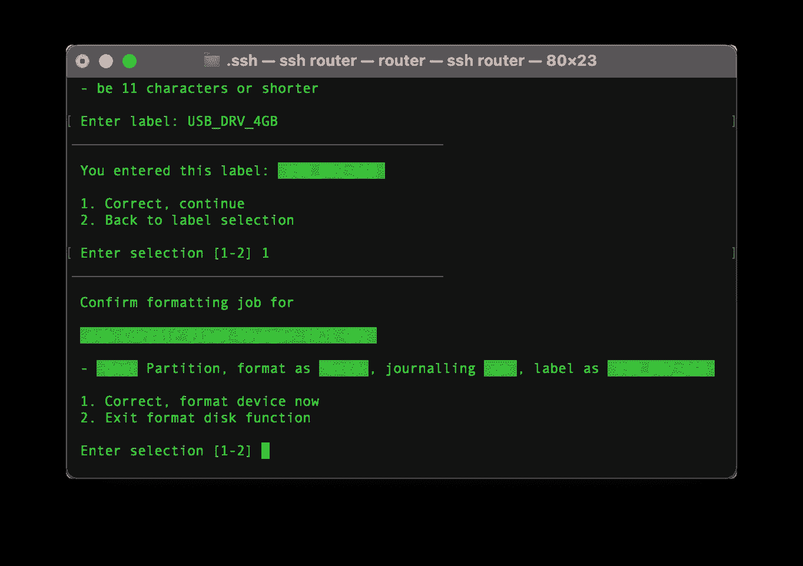

确认设置并开始格式化设备

最后，我们将得到格式化完成的信息，设备需要重新启动

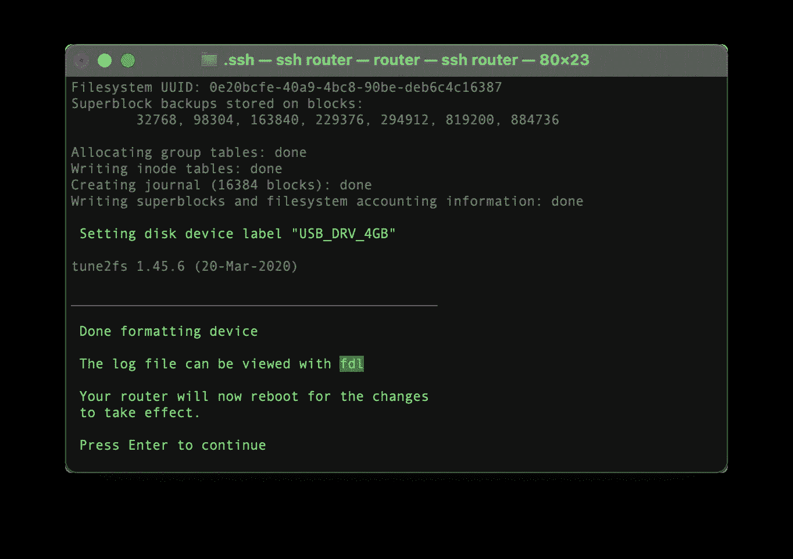

完成和重新启动确认屏幕

现在我们准备安装 entware 软件包管理器。

# 设置 entware

在前面的步骤中重新启动后，我们将需要 ssh 回到我们的路由器并启动 amtm。

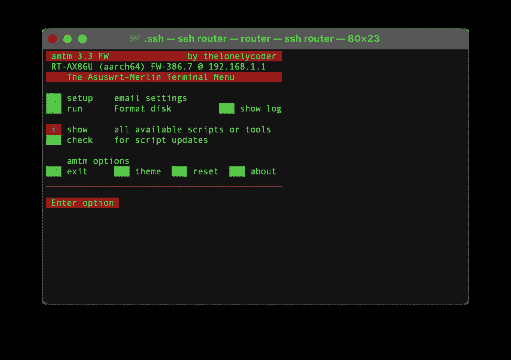

键入 ep 安装 entware，并确认。您需要选择要安装的设备。我们将使用在上一步中准备的驱动器，并选择 64 位版本。

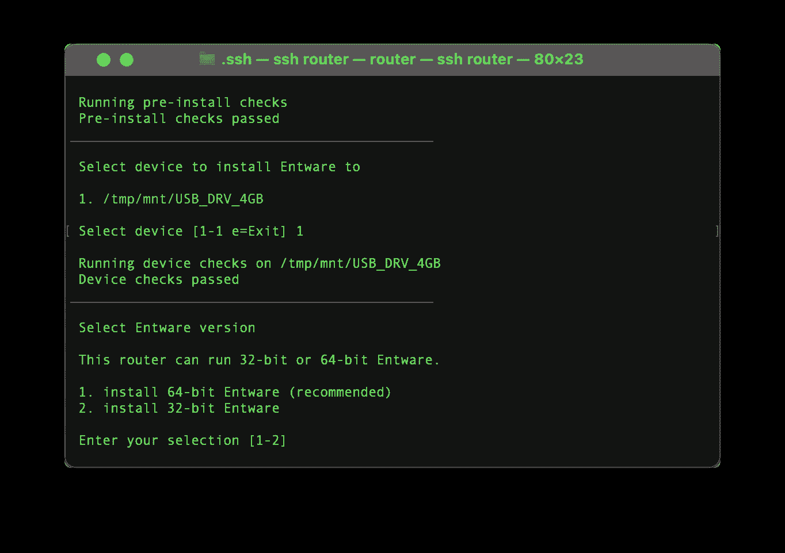

您将被要求进行最后的确认，这样安装就完成了。现在让我们试着安装 htop 并确认一切正常。按 e 键退出 amtm 并键入

```
opkg install htop
htop
```

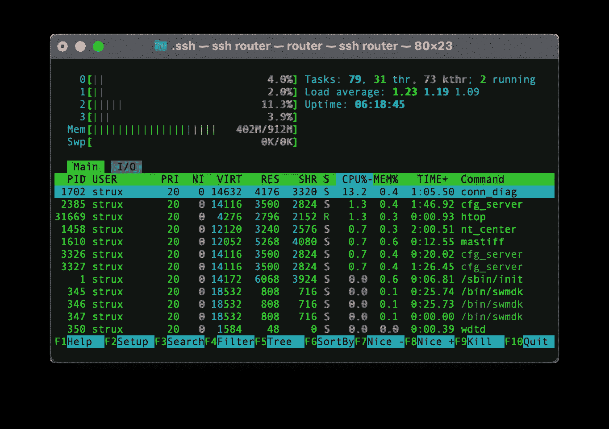

这证实了一切工作正常，htop 工作正常。现在，您可以根据自己的需求定制路由器软件。使用`opkg list`命令可以看到完整的包列表。

本教程第 3 部分到此结束。在另外的文章中，我将讨论安装和配置一些更有趣的包。

[](https://astrujic.medium.com/how-to-get-maximum-from-your-asus-router-part-2-a23e0f0aa884) [## 如何从华硕路由器中获得最大收益—第 2 部分

### 在第 2 部分中，我们将讨论如何设置到路由器的 SSH 连接

astrujic.medium.com](https://astrujic.medium.com/how-to-get-maximum-from-your-asus-router-part-2-a23e0f0aa884) [](https://astrujic.medium.com/how-to-get-maximum-from-your-asus-router-part-1-427f991e35c7) [## 如何从华硕路由器中获得最大收益—第 1 部分

### 在第 1 部分中，我们将讨论用定制的 ASUSWRT-MERLIN 固件来刷新您的路由器。

astrujic.medium.com](https://astrujic.medium.com/how-to-get-maximum-from-your-asus-router-part-1-427f991e35c7)