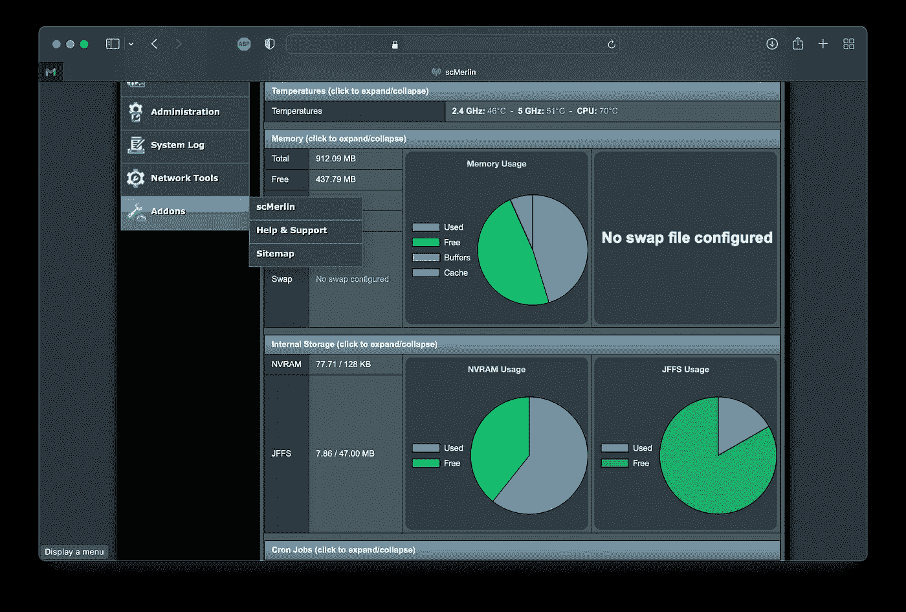
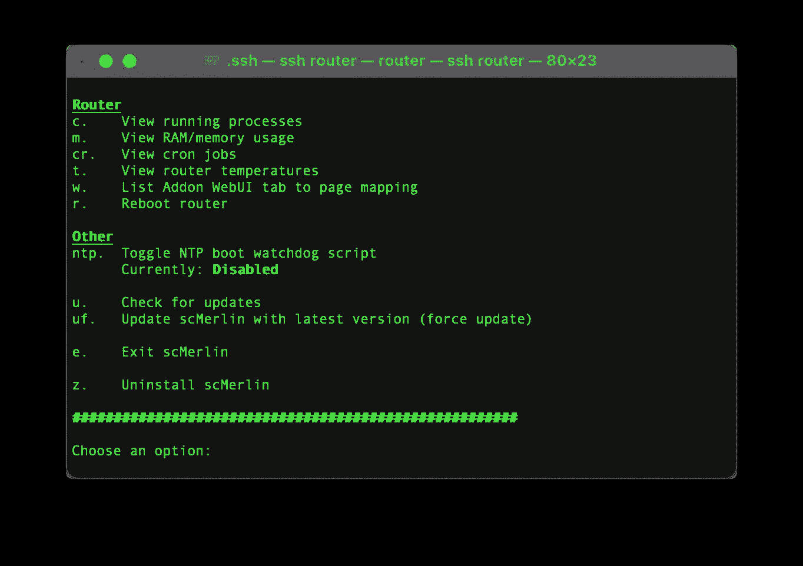
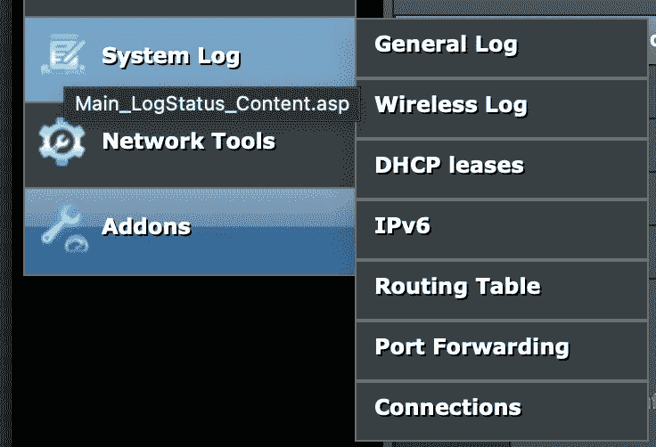
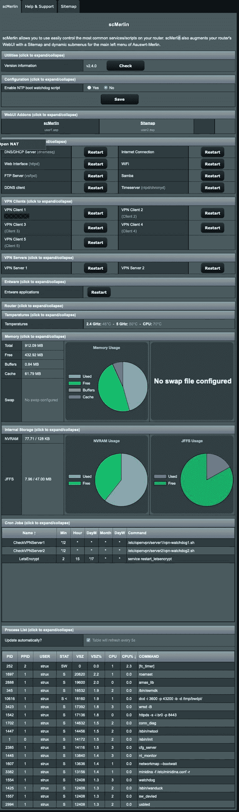

# 如何充分利用您的华硕路由器——sc merlin

> 原文：<https://levelup.gitconnected.com/how-to-get-maximum-from-your-asus-router-scmerlin-c985964f66f0>

让我们看看如何使用 csMerlin 和 ASUSWRT-MERLIN 固件来改进我们的 Asus 路由器 UI

scMerlin

# 介绍

scMerlin 将向您概述路由器上正在运行的进程和资源。它将提供一种简单的方法来重新启动行为不当的服务，而不是重新启动整个路由器，并将在菜单中添加二级导航，从而可以轻松地直接跳转到您需要的配置设置。

为了安装 scMerlin，您需要能够使用 **SSH** 访问您的路由器，并设置和配置 **amtm** 和 **entware** 。如果你没有快速绕道，通读我的 3 部分指南，它将解释你需要一步一步做的事情:

 [## 如何从华硕路由器中获得最大收益—第 1 部分

### 在第 1 部分中，我们将讨论用定制的 ASUSWRT-MERLIN 固件来刷新您的路由器。

astrujic.medium.com](https://astrujic.medium.com/how-to-get-maximum-from-your-asus-router-part-1-427f991e35c7) 

# 装置

为了安装 scMerlin，您需要 ssh 到您的路由器并启动 amtm。一旦出现，按`j3`开始安装。安装完成后，您将能够直接从这里管理您的路由器，但让我们退出`e`，看看我们在 web UI 中得到的更改。

scMerlin 安装完成

# WebUI 的更改

一旦您通过 Web UI 重新登录到路由器，您将会注意到所有导航项目都有二级，使您能够直接跳转到您需要的部分，而不是通过选项卡浏览。

scMerlin 辅助导航

您还会注意到作为最后一个导航项目添加的新菜单项 call Addons，它将包含 scMerlin 子菜单项。

scMerlin 导航

下面的屏幕为您提供了所有可用功能的概述。

scMerlin 用户界面

我希望你喜欢这个简短的指南。如果你有，请随意分享。下次见！

 [## 如何充分利用您的华硕路由器——sc merlin

### 让我们看看如何使用 csMerlin 和 ASUSWRT-MERLIN 固件来改进我们的 Asus 路由器 UI

astrujic.medium.com](https://astrujic.medium.com/how-to-get-maximum-from-your-asus-router-scmerlin-c985964f66f0)  [## 如何从华硕路由器中获得最大收益—第 2 部分

### 在第 2 部分中，我们将讨论如何设置到路由器的 SSH 连接

astrujic.medium.com](https://astrujic.medium.com/how-to-get-maximum-from-your-asus-router-part-2-a23e0f0aa884)