# 如何获得销售中间价

> 原文：<https://levelup.gitconnected.com/how-to-get-median-sale-price-47f93646fcca>

## 使用 Python 获取和可视化住房经济数据的分步教程


Avi Waxman 在 [Unsplash](https://unsplash.com/photos/pJk4RRS7urs) 上拍摄的照片

M edian 销售价格是房地产价值和当地房地产市场的指标。这是识别高增长和高增值领域的一个很好的方法。

包括代理人和投资者在内的房地产专业人士参考销售价格中值，而不是平均价格，因为它较少受到扭曲房地产市场的异常值的影响。

## 如何计算销售中间价

计算中间价很简单。首先，创建一个从最低到最高或从最高到最低的价格列表。然后，找到中间的价格。

> 例如，如果一个社区有五套住宅出售，价格分别为 100，000 美元、150，000 美元、200，000 美元、300，000 美元和 1，000，000 美元，那么中间销售价格为 200，000 美元。相比之下，同一个街区的平均销售价格为 35 万美元，相差 15 万美元。— [的确](https://www.indeed.com/career-advice/career-development/average-sale-vs-median-sale-price#:~:text=Median%20sales%20price%20advantages,being%20skewed%20by%20outlier%20prices.)

## 如何获取中间销售价格背后的数据

销售价格中值可以在许多经济、房地产和邻里相关的网站上免费找到。

潜在的历史数据由主要来源公布，包括美国人口普查局在弗雷德(美联储经济数据)在线数据库和全国房地产经纪人协会。

下面是我们将介绍的检索历史数据的来源:

*   弗雷德:美国人口普查局
*   [快速 API:美国住房市场数据](https://rapidapi.com/arielherrera/api/us-housing-market-data)

***这篇文章将讲述如何使用 Python*** *获得不同地理区域的销售价格中值。*

# 弗雷德:美国全国平均销售价格

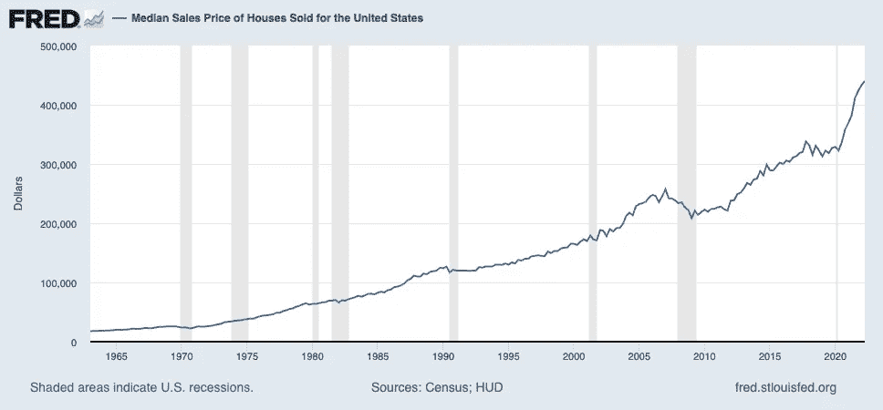

[弗雷德](https://fred.stlouisfed.org/graph/?g=VjOs)图表截图

美国全国销售价格中值可以在 FRED — [这里](https://fred.stlouisfed.org/graph/?g=VjOs)找到。

> FRED 是一个在线数据库，由来自许多国家、国际、公共和私人来源的成千上万的经济数据时间序列组成。— [弗雷德·圣路易斯联邦储备银行](https://fredhelp.stlouisfed.org/fred/about/about-fred/what-is-fred/)

从[直接链接](https://fred.stlouisfed.org/graph/?g=VjOs)你可以下载数据，在社交媒体上分享数据，甚至在你的网站上嵌入互动图表。

交互式图表👇

 [## 弗雷德图

### 编辑描述

fred.stlouisfed.org](https://fred.stlouisfed.org/graph/graph-landing.php?g=T20f&width=670&height=475) 

直接从 FRED 下载数据对于一次性项目非常有用。然而，如果我们想要在多个区域上执行数据分析或者为应用程序提供数据，那么它是不可伸缩的。

每当我们想要分析住房或经济指标时，都必须下载数据，这将是非常乏味的。

***我们能做得更好吗？*** 没错！

***让我们使用 Python 以编程方式检索美国全国平均销售价格，并将其可视化。***

# Python 教程

## 先决条件


帕特里克·托马索在 [Unsplash](https://unsplash.com/photos/a1bicKTYqMo) 上拍摄的照片

## 可选(住房+经济数据)

1.  [注册免费的 RapidAPI 帐户](https://docs.rapidapi.com/docs/consumer-quick-start-guide)以获得 API 密钥([注册 Rapid API 的步骤](https://docs.rapidapi.com/docs/consumer-quick-start-guide))
2.  订阅[美国住房市场数据 API](http://www.bit.ly/3AHH7sY)

## I .导入库

首先，导入所需的库。

```
# fred data request
import pandas_datareader as pdr
import pandas as pd
from datetime import datetime# api request
import requests
import time# visualization
import plotly.express as px
import plotly.graph_objects as go
from plotly.subplots import make_subplots
```

## I .局部变量和常量

其次，为日期字符串对象设置变量。

```
start_date = '1900-01-01'
end_date = datetime.today().strftime('%Y-%m-%d')print('Start date:', start_date)
print('End date:', end_date)
```

我们有两个变量代表我们的日期范围:*开始日期*和*结束日期*。


代码输出的屏幕截图

要从 FRED 检索任何数据点，我们需要检索*系列 ID* 。*系列 ID* 是 FRED 在线数据库中经济数据点的唯一标识符。

观察弗雷德指标时，您可以在标题的右上角找到*系列 ID* 。

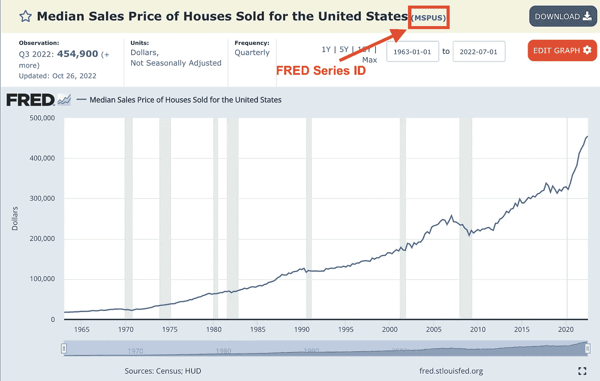

[弗雷德](https://fred.stlouisfed.org/graph/?g=VjOs)图表截图

***对于美国全国中等销售价格，系列 ID 为 MSPUS。***

我们将我们的 *series_code* 变量设置为‘MSPUS’。接下来，我们调用 [Pandas Datareader](https://pandas-datareader.readthedocs.io/en/latest/readers/fred.html) 并传递我们的 *series_code* 和日期范围变量来检索信息。

```
series_code = 'MSPUS' # FRED series iddf = pdr.DataReader(series_code, 'fred', start_date, end_date).reset_index()df.tail(5)
```

我们的输出包括美国全国销售价格中值的季度数据。

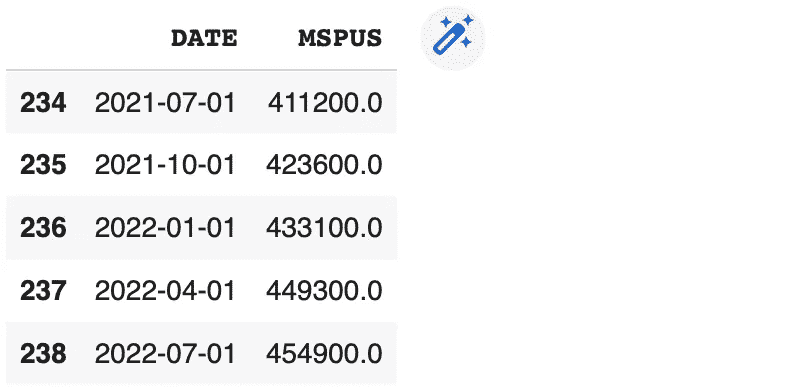

代码输出的屏幕截图

接下来，让我们使用 [Plotly Express](https://plotly.com/python/line-charts/) 在一个只有 ***单行代码的折线图中可视化中间销售价格！***

```
fig = px.line(df, x=['DATE'], y=series_code, title = 'Median Sales Price of Houses Sold')fig.show()
```


代码输出的屏幕截图

很好，现在您已经用几行简单的代码获得了美国全国销售价格中位数的历史数据。

***让我们收集更多的住房和经济特征，以更好地了解住房趋势。***

# 美国住房市场数据


照片由[克里斯·巴尔巴利斯](https://unsplash.com/@cbarbalis)在 [Unsplash](https://unsplash.com/photos/Y6N9K0RbZWM) 上拍摄

美国住房市场数据 API📊是一个数据源，整合了来自 Redfin、FRED 和美国人口普查局的住房和经济指标，从国家一级一直到邮政编码一级。

> API 的目的是提供一种快速的方法来检索已经清理和结构化的住房和经济数据。这可以让你专注于数据分析，而不是数小时的数据准备！

## 一、API 密钥

首先，订阅[美国住房市场数据 API](https://rapidapi.com/arielherrera/api/us-housing-market-data) 。输入您的 rapid API 密钥。这将允许您访问区域数据集。

*详细步骤请参见上述先决条件部分*。

```
rapid_api_key = '<ENTER YOUR API KEY HERE>'
```

## 二。请求

这里，我们向 API 发出请求，以获取 *state_code* FL (Florida)的住房数据。

```
# request state housing data
url = "https://us-housing-market-data.p.rapidapi.com/getState"
querystring = {"state_code":"FL"}headers = {
    "X-RapidAPI-Key": rapid_api_key,
    "X-RapidAPI-Host": "us-housing-market-data.p.rapidapi.com"
}response = requests.request("GET", url, headers=headers, params=querystring)# transform response into a dataframe
df = pd.DataFrame.from_dict(response.json(), orient='index')
df.tail()
```

这为我们提供了房屋统计的详细视图，包括中值销售价格、中值销售价格月环比、中值销售价格年同比以及更多指标。

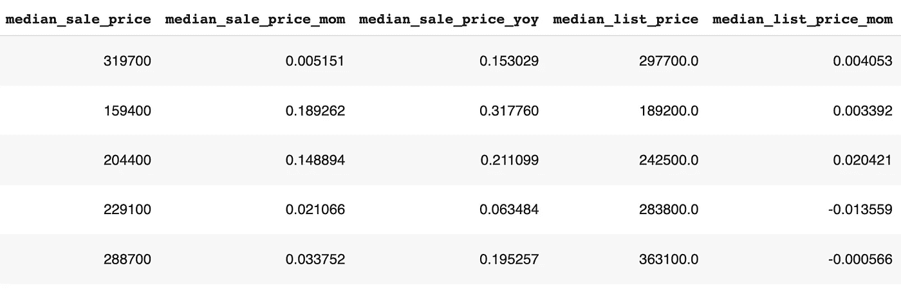

让我们创建一个 DataFrame(包含行和列的表)的副本。这将用于我们的阴谋。

在这里，我们根据*房产类型*进行筛选，以查看*所有住宅*房产类型的数据。您还可以过滤联排别墅、公寓、独栋住宅和多户住宅。

```
# create table to chart, all residential
df_plot = df.copy()
df_plot = df_plot.loc[df_plot['property_type'] == 'All Residential']\
    .sort_values(by='period_end') # sort values by date
```

接下来，我们使用 [Plotly Graphs](https://plotly.com/python/multiple-axes/) 来可视化我们的数据。

我们创建两个 y 轴，在一个图表中查看*中值销售价格*和*中值销售价格同比*。

```
# Create figure with secondary y-axis
fig = make_subplots(specs=[[{"secondary_y": True}]])
x_val = 'period_end'
y_val = 'median_sale_price'# Add traces
fig.add_trace(
    go.Scatter(x=df_plot[x_val].tolist(),
    y=df_plot[y_val].tolist(),
    name="{}".format(y_val.replace("_", " "))),
    secondary_y=False,
)fig.add_trace(
    go.Scatter(x=df_plot[x_val].tolist(),
    y=df_plot['{}_yoy'.format(y_val)].tolist(),
    name="{}".format(y_val.replace("_", " ") + " yoy")),
    secondary_y=True,
)# Add figure title
fig.update_layout(
    title_text=' '.join([x.capitalize() for x in y_val.split("_")])
)# Set x-axis title
fig.update_xaxes(title_text="date")# Set y-axes titles
fig.update_yaxes(title_text=y_val.replace("_", " "), secondary_y=False)
fig.update_yaxes(title_text=y_val.replace("_", " ") + " yoy", secondary_y=True)fig.show()
```

从我们的红色线图(*中值销售价格同比*)中，我们可以看到，2020 年 3 月之后，与去年同期相比，销售价格出现了历史性的高增长。

***佛罗里达州的销售价格中值达到 25%以上，销售价格同比增长。***

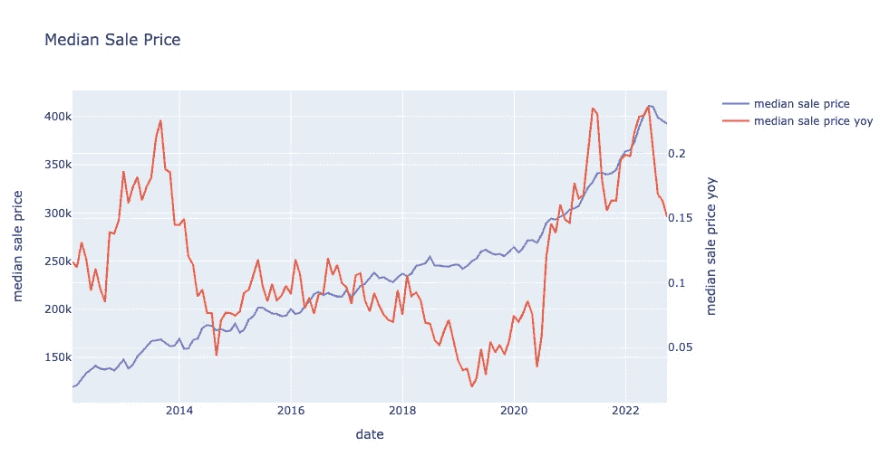

代码输出的屏幕截图

# 多重状态

我们可以使用[美国住房市场数据 API](https://rapidapi.com/arielherrera/api/us-housing-market-data) 来收集多个州的数据。

***查看多个地区的数据有助于进行地区比较，以确定相对于类似市场的市场增长或下降。***

## I .获取地区 id

首先，我们查询 *getRegionId* 端点来查看所有可查询的状态。

```
url = "https://us-housing-market-data.p.rapidapi.com/getRegionId"
querystring = {"region_type":"state"}headers = {
    "X-RapidAPI-Key": rapid_api_key,
    "X-RapidAPI-Host": "us-housing-market-data.p.rapidapi.com"
}response = requests.request("GET", url, headers=headers, params=querystring)df_states_ids = pd.DataFrame.from_dict(response.json(), orient='index')
df_states_ids.head()
```

对于每个州，我们都有一个 *region_id* 。我们将把这个值传递到我们的请求中。

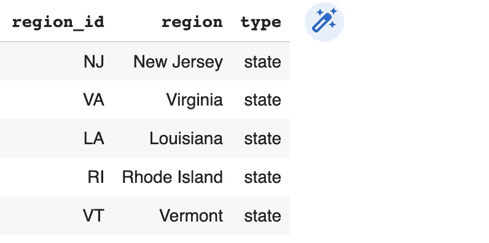

代码输出的屏幕截图

## 二。遍历状态列表

请求 ids 列表中每个州的住房数据。

使用 [Pandas Concat](https://pandas.pydata.org/pandas-docs/stable/reference/api/pandas.concat.html) 将所有状态组合成一个数据帧。

```
df_states_list = []
url = "https://us-housing-market-data.p.rapidapi.com/getState"for s in df_states_ids['region_id'].tolist():
    querystring = {"state_code":s}
    headers = {
        "X-RapidAPI-Key": rapid_api_key,
        "X-RapidAPI-Host": "us-housing-market-data.p.rapidapi.com"
    } response = requests.request("GET", url, headers=headers, params=querystring) _df_states = pd.DataFrame.from_dict(response.json(), orient='index')
    df_states_list.append(_df_states) time.sleep(0.5) # two requests per second for free accounts# join all states as one table
df_states = pd.concat(df_states_list)
df_states.head()
```

在这里，我们可以观察到一个单一的数据框架，其中包含所有可用州的住房信息。

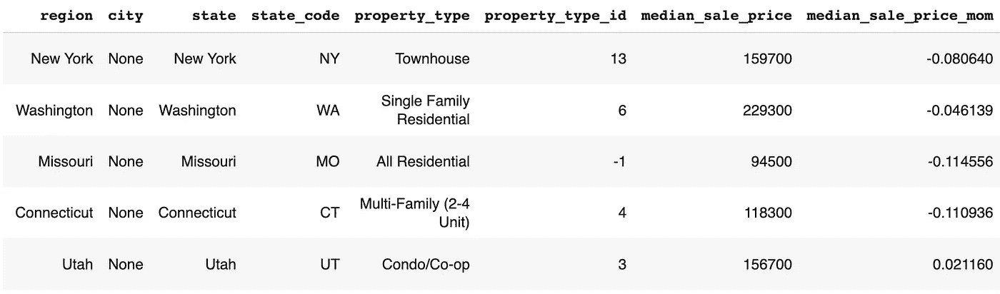

代码输出的屏幕截图

接下来，我们创建一个要绘制的数据帧的副本。

我们对所有住宅物业的数据框架进行过滤，以创建两个独立的数据框架。

我们将使用这些子表来比较从 2012 年到本博客当前年份 2022 年的中间销售价格。

```
df_states_plot = df_states.copy()
earliest_date = df_states['period_end'].min()
latest_date = df_states['period_end'].max()
print('Earliest date:', earliest_date)
print('Latest date:', latest_date)df_states_plot_earliest = df_states_plot.loc[
    (df_states_plot['property_type'] == 'All Residential') & (df_states_plot['period_end'] == earliest_date)]df_states_plot_latest = df_states_plot.loc[
    (df_states_plot['property_type'] == 'All Residential') & (df_states_plot['period_end'] == latest_date)]df_states_plot_latest.tail()
```

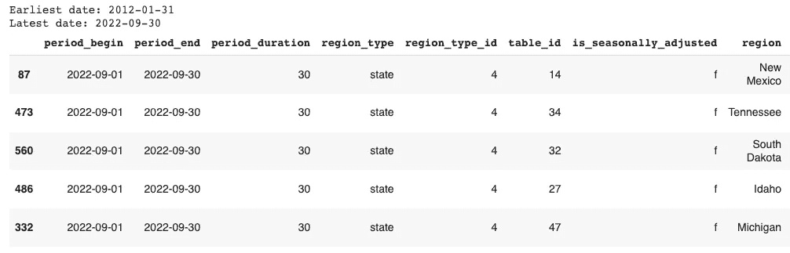

代码输出的屏幕截图

有了 [Plotly Express Choropleth 图表](https://plotly.com/python/choropleth-maps/)，我们可以快速可视化美国各地理区域的特征，包括各州。

```
fig = px.choropleth(df_states_plot_earliest,
    locations="state_code",
    locationmode="USA-states",
    color="median_sale_price",
    title="USA Median Sale Price: {}".format(earliest_date),
    width=800, height=400)fig.show()
```

2012 年，西海岸和东北海岸的销售价格中值最高(橙色/黄色)。

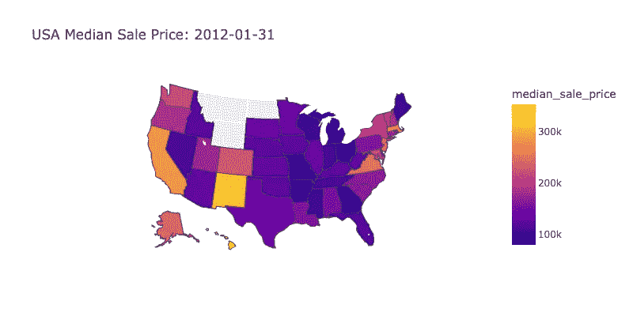

让我们绘制最新的信息日期。

```
fig = px.choropleth(df_states_plot_latest,
    locations="state_code",
    locationmode="USA-states",
    color="median_sale_price",
    title="USA Median Sale Price: {}".format(latest_date),
    width=800, height=400)fig.show()
```

2022 年，右手边的色阶扩大。最高销售价格中位数为 70 万美元以上。总体而言，我们看到美国各州的销售价格中位数在 10 年时间跨度内有所上升。

此外，以前被认为是“低成本”(深紫色)的市场现在正在转变为中等到昂贵的市场。这包括东南部地区和中西部各州。

与其他州相比，这些州的销售价格中值的增长可能是由于 2020-2022 年间的移民趋势。

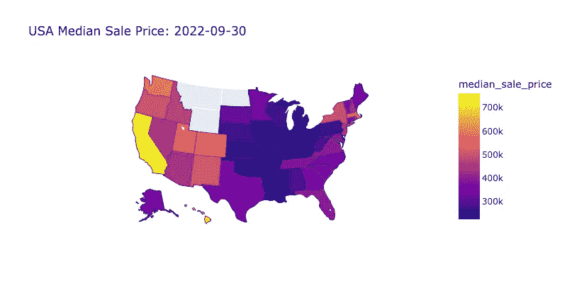

# Tableau 仪表板

想要观察美国各地的多项经济和住房指标吗？

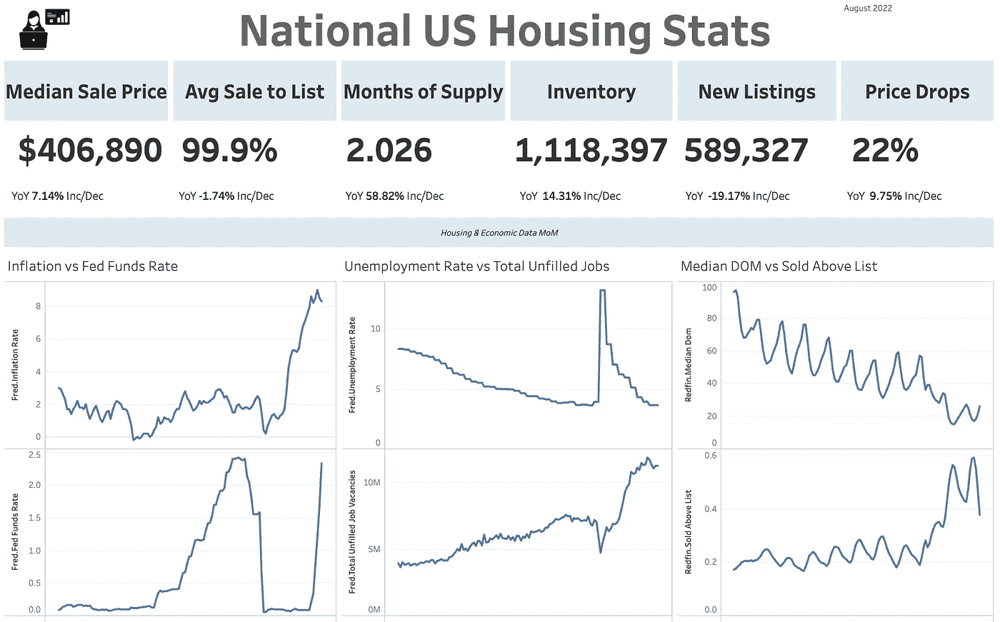

AnalyticsAriel Tableau: [美国全国住房统计数据](https://public.tableau.com/app/profile/ariel.herrera5041/viz/USHousingMarketStatsNational/NationalDashboard)

查看我的课程🚨房地产数据分析简介🚨

[](https://analyticsariel.teachable.com/p/real-estate-data-analytics) [## 房地产数据分析

### 嘿！我叫阿里尔·埃雷拉，我是 AnalyticsAriel.com 的创始人。我对数据分析的热情📊而且真实…

analyticsariel.teachable.com](https://analyticsariel.teachable.com/p/real-estate-data-analytics) 

# 来源

[](https://fred.stlouisfed.org/graph/?g=T20f) [## 美国房屋销售价格中位数|弗雷德|圣路易斯联邦储备银行

### 资料来源:美国人口普查局资料来源:美国住房和城市发展部发布:新住宅销售…

fred.stlouisfed.org](https://fred.stlouisfed.org/graph/?g=T20f) [](https://www.redfin.com/news/data-center/) [## 数据中心

### 从 Redfin 查看和下载最新的房地产市场数据，包括房价、销售、库存、新上市房源…

www.redfin.com](https://www.redfin.com/news/data-center/) 

# 引用

美国人口普查局和美国住房和城市发展部，美国房屋销售价格中值[MSPUS]，从圣路易斯美联储银行检索；[https://fred.stlouisfed.org/series/MSPUS,](https://fred.stlouisfed.org/series/MSPUS,)2022 年 10 月 31 日