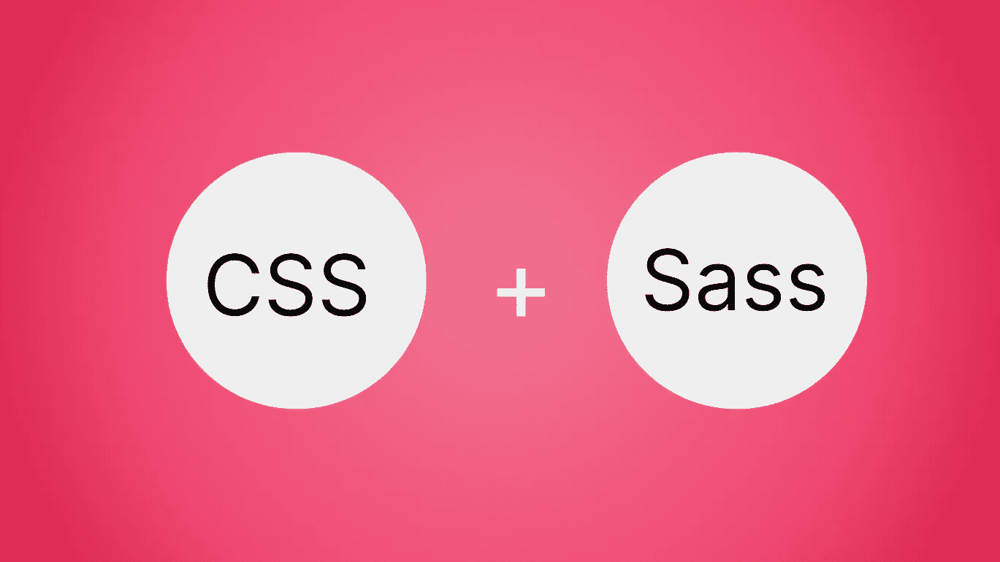

# 如何通过 Sass 从 CSS 中获得更多

> 原文：<https://levelup.gitconnected.com/how-to-get-more-from-css-with-sass-cfdfb1e4275c>



Sass 在战术上代表**S**y**A**we some**S**style**S**sheet。它是一种编译成 CSS 的预处理脚本语言。编写 Sass 与编写 CSS 非常相似，因为它仍然使用相同类型的选择器，并且依赖于将 CSS 属性与值配对。不同之处在于，Sass 扩展了 CSS 提供的功能，允许开发人员使用变量、嵌套、导入、混合和继承。Sass 加快了开发过程，并允许以更有组织和更有效的方式编写 CSS，使样式更容易改变。

# 变量

变量是 web 开发的一个简单而基本的部分。与任何其他编程语言一样，在 Sass 中，变量是一段有名称和值的信息。在 Sass 中，使用以下格式声明变量。需要注意的是，和 CSS 一样，每个表达式都必须以分号结束。

```
$variableName: value;
```

然后只需将变量赋给 CSS 属性就可以使用它们了。

```
$pSize: 12pt; p {
  font-size: $pSize;
}
```

# 嵌套

嵌套允许代码按层组织，因此对象可以包含更小、更详细和更具体的对象。例如，如果您创建了一个由列表、列表元素和链接组成的导航栏，而不是为每种类型的元素创建一个单独的 CSS 声明，则可以创建一个单独的声明块，并将每种类型的元素的样式嵌套在其中。

```
**//CSS**nav {
  font-size: 12pt;
}nav > ul {
  margin: 0;
  padding: 0;
  list-style: none;
}nav > li {
  display: inline-block;
}nav > a {
  display: block;
  padding: 6px 12px;
}**//Sass**nav {
  font-size: 12pt;
  ul {
    margin: 0;
    padding: 0;
    list-style: none;
  }
  li {
    display: inline-block;
  }
  a {
    display: block;
    padding: 6px 12px;
  }
}
```

# 进口

Sass 使得在不同的样式文件之间共享样式信息变得很容易。这使得样式代码可以很容易地分成不同的文件。如果您有一个根 Sass 文件和一个单独的图像 Sass 文件，您可以使用下面的 import 语句将所有图像 Sass 代码导入到根 Sass 文件中。

```
@import “path_to_image_sass_file”;
```

来自图像文件的所有样式代码，包括变量和混合，都可以在根文件中使用。

# 混合蛋白

mixin 是一个可重用的自包含 Sass 代码块。它是用下面的格式写的。

```
@mixin mixinName {
  property: value;
}
```

要使用 mixin，只需将下面的代码添加到 Sass 声明中。

```
@include nameOfMixin();
```

这将使 mixin 的所有属性和值在 Sass 声明中可用。include 语句必须使用括号来调用 mixin，类似于在其他编程语言中使用括号来调用函数。混合也类似于函数，因为它们允许使用变量。

下面的例子显示了一个小图像和一个大图像的 Sass 声明。大图和小图的高度、宽度和边距的比例应该相同，但小图应该是大图的一半。

为了有效地设置这些大小和比例，两个声明都从 imgSizing mixin 中获取所有信息。这个 mixin 接受一个变量 imgHeight，并基于该变量为两个图像类设置所有这些尺寸。通过更改传递给 mixin 的$height 参数，在类中为小图像设置了不同的高度。这不仅是使用一个测量值设置所有这些信息的快速有效的方法，它还通过使尺寸依赖于一个变量而使更新代码变得容易。

```
$imgHeight: 45vh;@mixin imgSizing($height) {
  height: $height;
  min-width: $height * 1.5;
  max-width: $height * 1.75;
  margin: $height/15;
}.bigImg{
  @include imgSizing($imgHeight)
}.smallImg{
  @include imgSizing($imgHeight/2)
}
```

# 延长

Sass 中的扩展类似于面向对象编程中的继承。它允许将一个选择器的属性扩展到其他选择器。使用@extend 标签来实现扩展，如下所示。标题选择器继承了 p 选择器的所有样式信息，就好像 p 选择器的所有信息都写在标题选择器中一样。

```
p {
  font-size: 18pt;
  margin: 2%;
  text-align: center;
}.title {
  @extend p;
  color: green;
  font-size: 22pt;
}
```

与其他编程语言一样，可以添加或覆盖继承的属性。标题选择器与 p 选择器具有相同的属性，只是它通过添加颜色属性扩展了这些属性，并且字体大小属性的值已被覆盖，因此标题选择器具有与下面的选择器等效的信息。

```
.title {
  margin: 2%;
  text-align: center;
  color: green;
  font-size: 22pt;
}
```